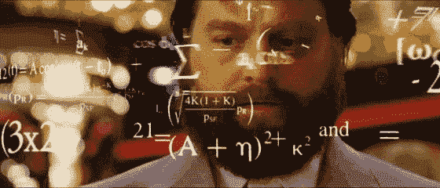
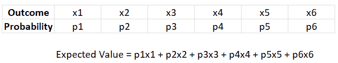
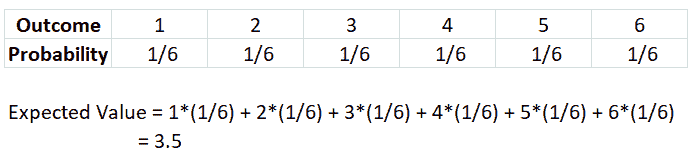
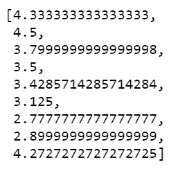

# 如何用 Python 可视化中心极限定理

> 原文：<https://www.freecodecamp.org/news/how-to-visualize-the-central-limit-theorem-in-python-b619f5b00168/>

作者罗汉·约瑟夫

# 如何用 Python 可视化中心极限定理

中心极限定理指出，随着样本量的增加，样本均值的抽样分布接近正态分布。

不管总体形状如何，样本均值都将收敛于正态分布。也就是说，总体可能正偏或负偏，正常或非正常。

中心极限定理与大数定律密切相关，大数定律指出:

> ***随着样本量的增长，样本均值越来越接近总体均值。***

那么，这两者是如何关联的呢？

CLT 指出，随着样本量趋于无穷大，分布的形状类似于钟形(正态分布)。样本平均值的分布中心变得非常接近总体平均值，这基本上是大数定律。

让我们用 Python 中的经典掷骰子来说明这一点。在我们进行模拟之前，让我们先计算掷骰子的期望值。

> *期望值是一个实验经过大量试验后的平均结果。*

这是计算实验期望值的通用公式(有 6 个结果和 6 个相关概率)。

现在，我们来计算掷骰子的期望值。

尽管不可能在单个模头辊上得到 3.5，但是随着模头辊数量的增加，模头辊的平均值将接近 3.5。

1.  为了用 Python 可视化，首先导入必要的库:numpy、matplotlib 和 [wand](http://docs.wand-py.org/en/0.4.1/guide/install.html) 。确保你安装了 [ImageMagick](https://www.imagemagick.org/script/install-source.php) 来保存图片为 gif 格式。

2.现在，创建 1000 个 10 次掷骰子的模拟，在每个模拟中，找出骰子结果的平均值。

掷骰子的前 10 个期望值如下所示:

3.编写一个函数来绘制上述生成值的直方图。此外，使用动画功能，我们可以看到直方图如何缓慢地类似于正态分布。

**输出:**

4.您可以使用下面这段代码将动画保存为 gif。

从这个实验中，我们可以观察到:

1.  在样本数量较少的情况下，直方图是分散的，没有明确的模式。
2.  然而，通过增加样本量，抽样分布开始类似于正态分布。这就是**中心极限定理。**
3.  此外，随着样本量的增加，“掷骰平均值= 3.5”的频率最高，这是掷骰的期望值。这证明了大数定律。

那么，中心极限定理是怎么用的呢？

> 它使我们能够检验我们的样本是否代表一个不同于已知总体的总体的假设。我们可以从样本中取一个平均值，并将其与抽样分布进行比较，以估计样本是否来自已知总体的概率。

在 LinkedIn 上连接，并查看 Github(如下)以获得完整的笔记本。

[**rohanjoseph 93/中心极限定理**](https://github.com/rohanjoseph93/Central-Limit-Theorem/blob/master/Central%20Limit%20Theorem.ipynb)
[*用 Python 可视化 CLT。创建一个关于…*github.com](https://github.com/rohanjoseph93/Central-Limit-Theorem/blob/master/Central%20Limit%20Theorem.ipynb)的帐户，为 rohanjoseph 93/中心极限定理的发展做出贡献