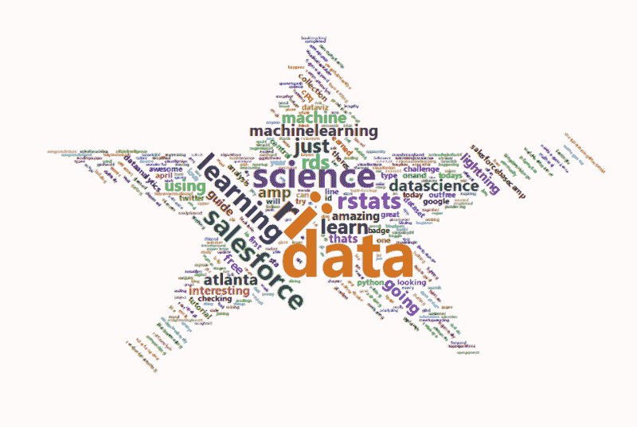
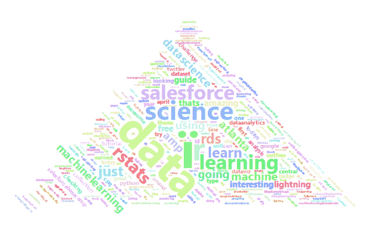

# 如何可视化你在推特上发布的内容

> 原文：<https://www.freecodecamp.org/news/how-to-visualize-what-you-have-been-tweeting-81c75f00546d/>

迪帕尔·德西尔瓦

# 如何可视化你在推特上发布的内容

#### R 中的一个 wordcloud 实验



你有没有想过你在推特上聊得最多的是什么？或者你正在参加你最喜欢的会议，你想知道它周围的嗡嗡声是什么？或者你可能想知道人们对最新上映的电影有什么看法？

好吧，你应该看看单词云。它们易于设置，提供令人惊叹的可视化效果，并且易于定制。

### **等等！但是首先，什么是词云？**

它是由在特定文本或主题中使用的单词组成的图像，其中每个单词的大小表明其频率或重要性。

现在你知道了基础知识，让我们从 r 开始。

#### **加载所需的库**

```
library(twitteR)library(ROAuth)library(stringr)library(tm)library(wordcloud2)library(tidytext)
```

#### **Twitter 应用设置**

我们将使用 Twitter 数据来构建我们的 wordcloud，所以如果你还没有 Twitter 账户，就去申请一个吧。我会等…

接下来，我们需要一个 Twitter 应用程序。这是一次性设置。

你需要在 Twitter 上验证自己的身份，这样你就可以发送推文请求，Twitter 也会将请求发送给你。

具体步骤我就不赘述了。可以用[这个教程](https://iag.me/socialmedia/how-to-create-a-twitter-app-in-8-easy-steps/)来设置。

接下来，我们将令牌传递给 setup_twitter_oauth 函数来验证我们自己。

```
consumer_key <- "xxxx"      #Your Consumer Key (API Key)consumer_secret <- "xxxx"   #Your Consumer Secret (API Secret)access_token <- "xxxx"      #Your Access Tokenaccess_secret <- "xxxx"     #Your Access Token Secretsetup_twitter_oauth(consumer_key, consumer_secret, access_token, access_secret)
```

#### **提取推特数据**

你可以根据用户的个人资料或者任何关键词/标签来提取推文。这是两个例子。

```
#Query a hashtagtweets <- searchTwitter("#rstats",n=3000,lang="en", resultType = "popular")
```

```
#OR
```

```
#Query a user you follow or yourselftweets <- userTimeline("dsilvadeepal",n=3200,includeRts = FALSE)
```

#### **文本挖掘你的推文**

我们现在需要将推文中的文本提取到一个向量中。

我们首先要删除图形参数。这将删除可见字符(除空格和控制字符之外的任何字符)以避免输入错误。

```
tweets.txt <- sapply(tweets, function(t)t$getText())tweets.txt <- str_replace_all(tweets.txt,"[^[:graph:]]", " ")
```

现在让我们创建一个函数来清理推文。这里我们将删除数字、标点、空格、HTTP 链接和转发(RTs)。您可以根据正在处理的数据自定义该函数。

```
clean.text = function(x){    x = tolower(x)                   # tolower  x = gsub("rt", "", x)            # remove rt  x = gsub("@\\w+", "", x)         # remove at  x = gsub("[[:punct:]]", "", x)   # remove punctuation  x = gsub("[[:digit:]]", "", x)   # remove numbers  x = gsub("http\\w+", "", x)      # remove links http  x = gsub("[ |\t]{2,}", "", x)    # remove tabs  x = gsub("^ ", "", x)            # remove leading blank spaces   x = gsub(" $", "", x)            # remove trailing blank spaces    return(x)}
```

```
clean_tweet <- clean.text(tweets.txt)
```

接下来，我们建立一个语料库。语料库是文本文档的集合，VectorSource 指向存储推文的向量。

我们还将创建一个向量来删除英语停用词和任何其他不相关的词(我们将在后面的步骤中识别这些词)。一些常见的英语停用词有“the”、“I”和“he”

```
tweets <- Corpus(VectorSource(clean_tweet))wordsToRemove <- c(stopwords('en'), 'tco', 'https')clean_tweet <- tm_map(tweets, removeWords, wordsToRemove)
```

我们现在创建一个术语文档矩阵(TDM ),它告诉我们每个单词在语料库中被找到的次数。

```
dtm <- TermDocumentMatrix(clean_tweet, control = list(wordLengths = c(1, Inf)))m <- as.matrix(dtm)v <- sort(rowSums(m),decreasing=TRUE)d <- data.frame(word = names(v),freq=v)head(d, 10)   #inspect our word list and remove any irrelevant words  in the stop words step above
```

最后是有趣的部分！

#### **创建我们的词云**

这里我们将使用 WordCloud2 包，这是一个比 WordCloud 包更新的包，提供了更多的定制。

```
wordcloud2(d, shape = "triangle", color="random-light", backgroundColor = "white", minRotation = -pi/4, maxRotation = -pi/4, size = 0.5)
```



现在你知道了！这里有一个 Github 中[代码](https://github.com/dsilvadeepal/Data-Science/blob/master/Projects/Wordclouds/Twitter%20Wordcloud.Rmd)的链接。

感谢阅读！

*注意:Twitter API 将用户从特定时间线获取的 tweets 数量限制为 3200 条。*