# 如何在 JavaScript 中可视化地设计状态

> 原文：<https://www.freecodecamp.org/news/how-to-visually-design-state-in-javascript-3a6a1aadab2b/>

肖恩·麦凯

# 如何在 JavaScript 中可视化地设计状态

#### 使用状态机开发应用程序的路线图&状态图

Photo by [rawpixel](https://unsplash.com/photos/lRssALOk1fU?utm_source=unsplash&utm_medium=referral&utm_content=creditCopyText) on [Unsplash](https://unsplash.com/search/photos/map?utm_source=unsplash&utm_medium=referral&utm_content=creditCopyText)

为什么 JavaScript 中的状态管理看起来特别棘手？是现代应用固有的复杂性，还是仅仅是工具？其他工程领域是如何开发出可靠且可预测的系统的？有没有可能画出一个系统然后转换成代码，反之亦然？

让我们探索状态管理的一个范式转变，用**状态机** & **状态图**来可视化设计系统。

### 概念>库

我一直在想国家管理。我尝试过各种状态管理库:Flux、Reflux、Redux、Dva、Vuex、Mobx，还有我自己的。

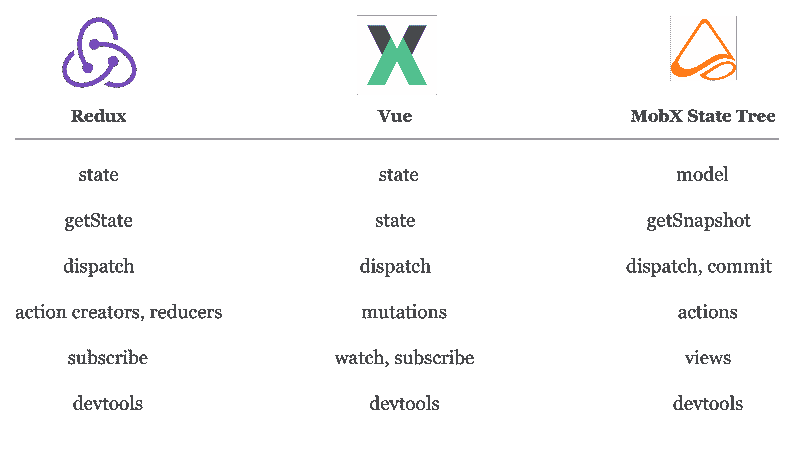

争论哪个是 10 倍解决方案是没有意义的。州库是不同的口味，相同的成分。它们是拼图的一部分——它们使同步和连接数据变得更容易。

接下来需要我们关注的解决方案关系到全局:

我们需要在**计划&设计系统**方面做得更好。

### 打碎所有的东西

想一个你会认为**优雅的**用户界面。这是一种能够承受大量随机用户交互的东西——你知道，当用户按下按钮的次数超过预期时，就会出现这种不可预测性，以意想不到的顺序与输入进行交互，或者以其他方式让你质疑对人类的信心。现实生活对系统来说很难。

我来预测你想到的项目。

嗯……你可能不会想到为网络而建的东西，那里的哲学似乎是“快速移动，打破常规”。

从更新的频率来看，你可能也不会想到手机。

你可能甚至没有想到最近建造的东西。我们似乎不一定在构建可靠的产品方面做得更好。

我想我知道你在想什么…

我说的对吗？….没有吗？

你可能甚至认不出这是 20 世纪 80 年代的索尼随身听。

当我还是个孩子的时候，我从一个升级为便携式 CD 播放器的朋友那里收到了一个像这样的卡带播放器。我理解一些年轻的读者可能会觉得提到这两种设备很陌生——把随身听想象成 iPhone，但有更大的按钮和更大的破坏力。我的主要任务是:打破它。

我会尝试所有的按钮组合，看看会发生什么:

*   尝试在磁带快进时弹出
*   同时按住快进和倒回

尽管我尽了最大努力，索尼随身听还是比今天的大多数网站表现得更好。

### 工程接口

像 Walkman 这样的电子产品经受住了用户测试的考验，没有任何隐藏或禁用用户界面元素的能力。任何时候任何按钮都可能被按下，任何事情都可能发生。然而它似乎是牢不可破的。

这让我想知道:

也许电子学为我们如何在网络上构建界面提供了一个更好的范例。

我们能从**古代** 的电子设计过程中学到什么？我们怎样才能更好的**工程师**应用？马蒂，我们需要回到未来！

### 电子和网络

电子学能教会我们在浏览器中创建应用程序的更好方法吗？

考虑一下**组件**在过去五年中产生了 web 开发中最重要的转变之一。也许我们可以从电子工程中借用其他概念？

作为网页开发者，我们过得很好。比如。非常好。发现了窃听器？一小时内将更新部署到您的服务器。

工程的其他领域就不那么宽容了。硬件问题通常会导致设备被扔进垃圾箱。嵌入式开发人员必须小心确保固件更新不会耗尽电池或使所有现有设备崩溃。

网络开发者可以肆无忌惮。

更不用说，应用程序开发人员很少面临与电子设备创作者相同的资源限制。你上一次关注性能和内存使用是什么时候，而不是仅仅让这该死的东西工作？每秒 60 帧的阈值很低。但随着我们开始构建越来越复杂的应用程序，以便在功能较弱的移动和物联网设备上运行，这个门槛正在上升。我们正濒临一个低级工程师经历了几十年的工程问题。

**约束孕育创意**。限制导致更好的设计。

为了了解接受限制如何能带来更好的设计，我们需要回到基本的状态管理基础上。

### 叶新旧国家管理基础

网络社区的对话方向倾向于 NPM 软件包，而不是基本的计算机科学原理。

工程师不是在问“哪个库更好？就像他们在问“我们如何设计一个更好的系统”？

我们可以从优秀设计的一些基本原则开始:

*   区分不确定的**数据**和有限的**状态**
*   限制从一种状态到另一种状态的可能转换
*   视觉设计

我将沿着我自己的路线和接下来的 8 个体会来完成这些。

### 1.状态！==数据

在编程系统中，**状态**和**数据**之间的区别是模糊的。他们都生活在记忆中，所以被同等对待。

在 React 中，**状态**和**数据**共享相同的名称和机制:

*   获取:`this.state`
*   存储:`this.state = {}`
*   更新:`this.setState(nextState)`

在电子学中，对于状态(T1)和数据(T3)之间的区别没有那么混乱。

**状态**表示系统可以处于的有限数量的模式，通常由电路本身定义。对于我们的随身听，想想“播放”、“停止”、“弹出”。像“模式”或“配置”一样，状态是可数的。

**数据，**另一方面，存储在内存中的可能设置几乎是无限的。对于我们的随身听，想想正在播放的曲目，“歌曲 2”。数据和音乐一样，可能有无限的可能性。

无论下面的这个`DataLoader`组件做什么，状态只能生成一组有限的视图:“正在加载”、“已加载”或“错误”。

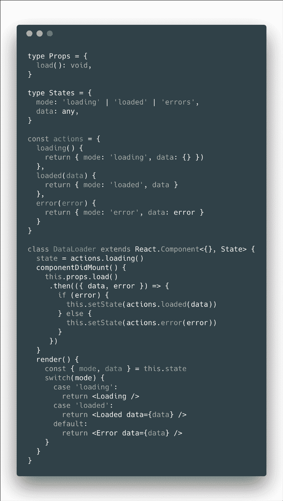

分离状态和数据可以减少混淆，并允许我们基于有限状态机构建应用程序。

### 2.状态是有限的

电子开发人员很早就知道，可预测的界面是一种状态数量有限且可控的界面。如果没有受控数量的状态，系统将很难调试，也不可能彻底测试。

在有限状态机中，状态是显式定义的。**转换**是一组可能的**事件**，您可以通过触发这些事件在状态之间移动。

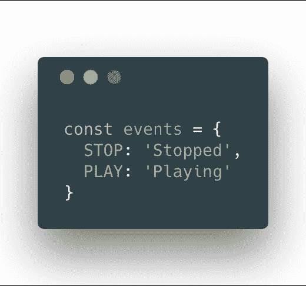

例如，用事件“停止”触发转换会将状态移动到“停止”。

在 React 中，我们可以定义一个基本的随身听至少有两种状态:“停止”或“播放”。

看看这个 [CodeSandbox](https://codesandbox.io/s/2v55q3j5q0) 。

在有限状态机中，系统总是处于可能的配置之一。该视图除了“播放”或“停止”之外没有任何可能性。测试这两者可以给我们信心，让我们相信系统按照它应该的方式工作。

### 3.管理状态机中的复杂性

让我们看看当我们开始向状态机示例添加两个新状态时会发生什么:“倒带”和“快进”。

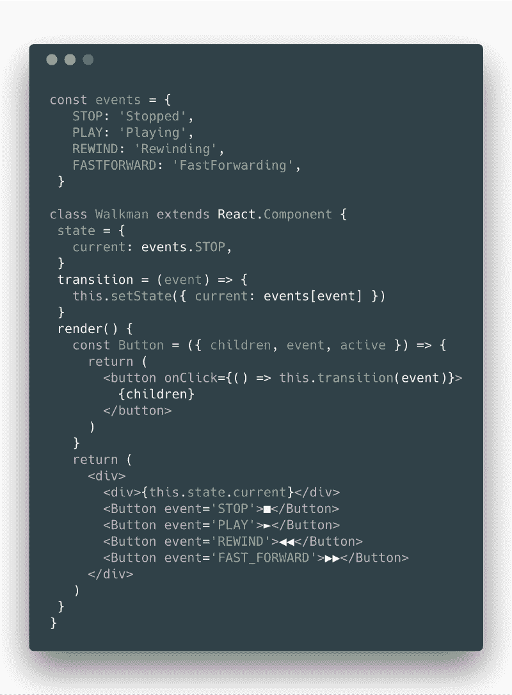

当状态等价时，它们看起来很容易添加。每个状态就像它的模块一样，可以单独开发和测试。但是要小心，状态转换不应该总是可能的。

我们应该担心状态之间不受控制的转变。

也许你发现了。上面我们介绍了一个 bug。花一分钟时间，看看你是否能发现哪里出了问题。

### 4.保护转换

看起来卡带都缠在一起了，因为我们允许用户在`rewinding`和`fastForwarding`之间跳跃，而不在中间停下来。

作为解决方案，我们可以在状态转换中添加**守卫**。防护是发生转换必须满足的条件。例如，我们可以确保事件`FASTFORWARD`、`REWIND`、&、`PLAY`只能在状态为“停止”时触发。

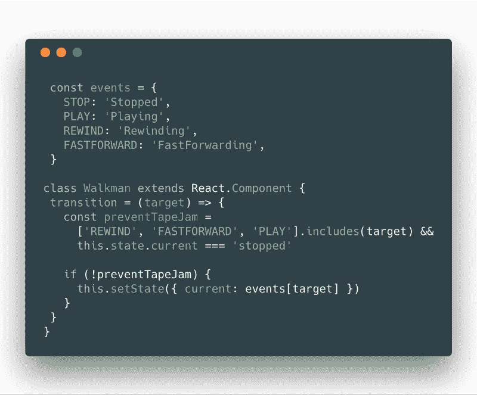

除非我们重新思考我们计划和设计状态管理的方式，否则意外的状态转换肯定会发生。

当我们添加像`ejected`这样的额外状态时，我们必须考虑哪些状态转换是允许的，在哪些条件下是允许的。使用随身听，当磁带处于停止模式时，您可以按 stop 弹出磁带。为了增加这种功能，我们必须增加更多的防护，并确定哪些转换是可能的。

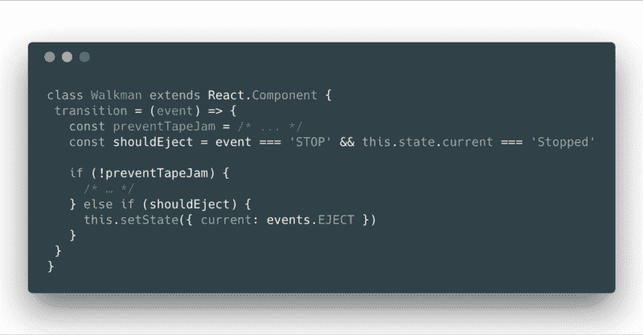

随着附加状态的增加，**未处理状态组合**的可能性增加。这不是一个可扩展的解决方案。每个额外的状态都会导致对所有转换保护装置的检查。

感觉越来越像是国家在管理你。

管理守卫的问题源于状态被表示的方式:“停止”、“播放”、“倒带”。

状态的理想数据结构不是字符串或对象。

但那是什么呢？

### 5.状态是一张图表

表示状态的理想数据结构通常是图。**状态图，**通常被称为**状态图**，提供了一种直观的方式来设计、可视化和控制每个节点的状态转换。

这不是什么新消息——电子工程师几十年来一直使用状态图来描述复杂系统。

让我们看一个网上的例子。AWS 步骤函数提供了一个可视化界面，用于绘制应用程序的工作流。每个节点控制一个 lambda——云中调用的远程函数——每个函数的输出触发下一个函数的输入。

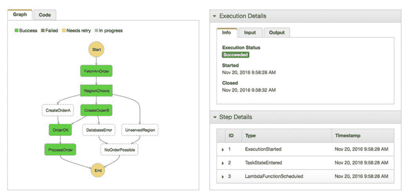

AWS Step Functions

在上面的例子中，可以清楚地看到用户的动作是如何通过每个步骤的，包括可能的错误以及如何处理它们。增加额外的步骤不会导致复杂性的指数级增长。

工程师可能会评论步进功能与 **PLC(程序逻辑控制器)框图**有多少共同之处。设计师可能会评论它们与**工作流程图**有多少共同之处。我们设计状态的方式不应该和我们设计应用程序的方式有更多的共同点吗？

### 6.状态图上的支架

状态图成为应用程序的脚手架。

作为一个例子，我们的随身听的状态图可以产生一个视觉上更容易理解和接近的表示。

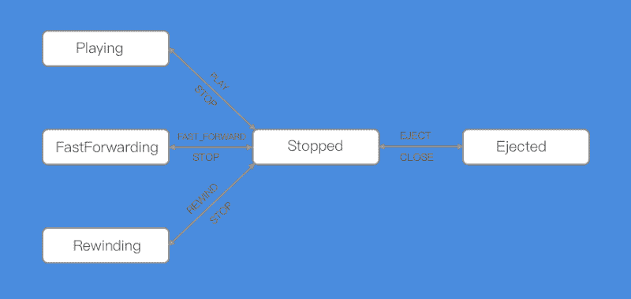

Walkman State Graph

不用深入研究关于守卫的代码，我们可以说除了“停止”之外，不可能从“倒带”跳到任何其他状态。你没有列出所有你的界面不应该做的转换，而是列出它能做什么。开发从防御性的**自底向上的**编码方法转变为**自顶向下的** 设计方法。光这一移就是 10 倍。

状态图更直观，更易于调试，更能吸收需求的变化。除了状态机之外，每个状态中的变化都可以与它们的相邻状态隔离开来。更不用说许多复杂的转换“保护”逻辑可以包含在直观易懂的格式中。

不幸的是，状态图可能是一颗定时炸弹。

密集连通图不可伸缩。考虑一下，如果我们在上面的图表中再添加 4 个状态会发生什么。可读性降低，重复性增加，缠绕的箭头指向各个方向争夺空间。状态图的这种**分割**被称为**状态爆炸**。

幸运的是，有一种方法可以使用形式化的系统描述方式来降低设计复杂状态图的视觉复杂性:让我们探索一下**状态图**。

### 7.主状态图

我第一次了解状态图是在温哥华 React 会议上，Luca Matteis 关于如何使用状态图建模 Redux 应用程序行为的演讲中。第二天上班时，我提出了这种国家管理的“新”范式，却发现我的许多工程同事已经熟悉了这个概念。我在 IOT 的一家[公司](http://semios.com)和许多硬件和嵌入式开发人员一起工作。我们在招人。)

状态图的概念可以追溯到 1987 年，当时数学家 David Harel 发表了一篇关于可视化描述复杂系统的论文，比如下面的石英表的例子。

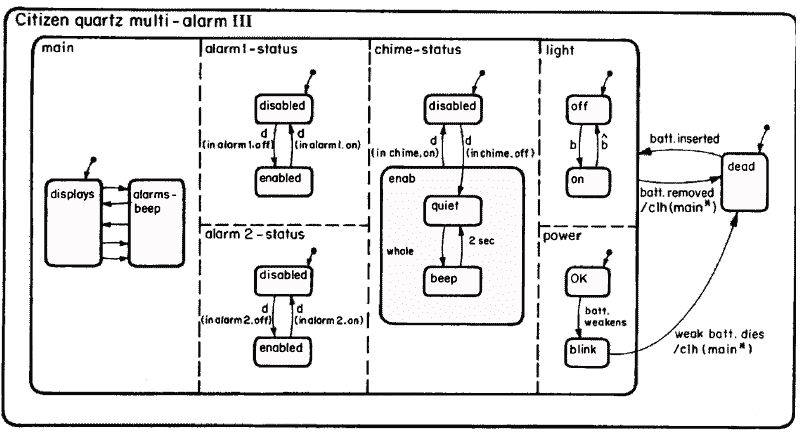

一旦你理解了这种语言，状态图既直观又容易掌握。

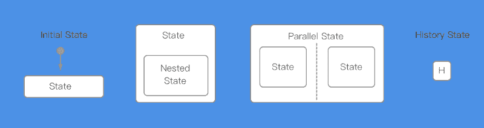

状态图引入了各种新的状态类型:

*   **初始状态** —用带箭头的点标记的开始状态。
*   **嵌套状态** —可以访问其父状态转换的状态。
*   **平行状态** —虚线表示的两种非接触状态。
*   **历史状态**—**记忆**并能返回到之前值的状态。

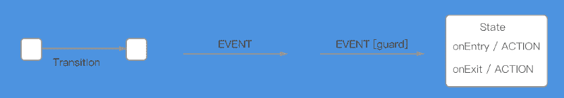

此外，状态图可以包含如何以及何时触发**转换** & **动作**:

*   **转换** —基于一个命名的**事件**触发状态变化的功能。“停止”→过渡(‘播放’)→“播放”
*   **保护** —发生转换时必须满足的条件。例如，如果没有磁带，或者磁带已经结束，则不能触发“播放”。“停止”→过渡('播放')**【hasTape】**→“播放”。给定一个顺序，多次转换是可能的。
*   **动作** —基于状态变化发生的触发器。比如当状态进入“正在播放”时触发一盘磁带开始播放。操作可能发生在“onEntry”和/或“one exit”中。

将 Walkman 示例重写为状态图会删除状态图中的冗余。请注意，不再需要重复“停止”事件。状态图是可扩展的——添加额外的并行状态(如“记录”和“音量”)并不难。

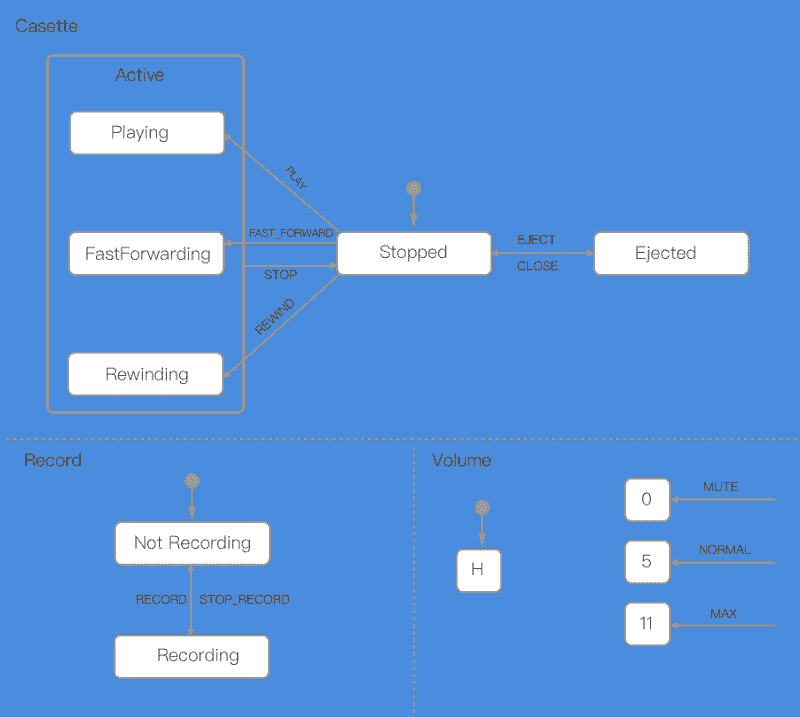

状态图不仅仅是一个视觉描述应用程序的概念。

状态图可以生成作为应用基础的状态机。

你可以把图像转换成代码，反之亦然。以图表形式查看您的应用程序逻辑，或者绘制它。

### 8.状态图工具

状态图为真正设计系统提供了一个充满希望的未来——而不仅仅是纸上谈兵。虽然其他编程语言已经有了工具，但是 JavaScript 才刚刚开始在状态图工具中显示出繁荣。

C & Java 开发人员有工具可以使用状态图进行编码。例如， [Yakindu Statechart Tools](https://www.itemis.com/en/yakindu/state-machine/) 将视觉设计和代码的世界结合在一起。我最近了解到 Yakindu 还包括了一个[打字稿代码生成器](https://blogs.itemis.com/en/typescript-code-generation-with-yakindu-statechart-tools)。

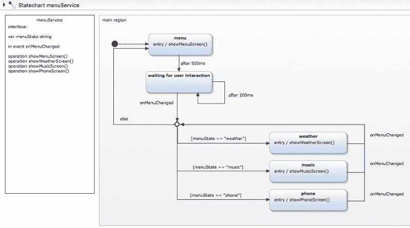

同样的工具最终也适用于 JavaScript。

[Sketch Systems](http://sketch.systems/) 提供了一种在 markdown 中设计系统的方法，然后可以用 JavaScript 来构建原型。虽然 Sketch Systems 还不支持**动作**或**守卫**，但我发现它对原型制作和测试状态图非常有用。

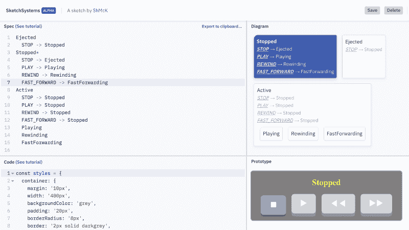

[https://bit.ly/2lZhqOB](https://bit.ly/2lZhqOB)

Sketch Systems 允许您将图表导出到 [XState](https://github.com/davidkpiano/xstate) ，这是一个基于 statechart 的 JavaScript 库，具有可视化和可点击的状态原型工具。

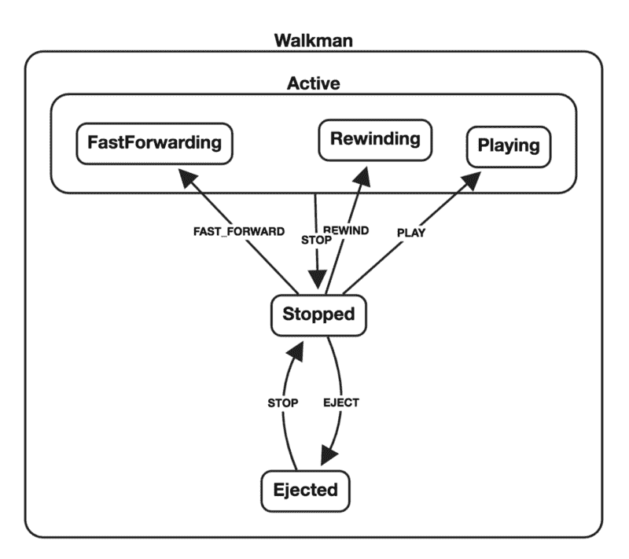

[https://bit.ly/2uJydt9](https://bit.ly/2uJydt9)

想象一下编辑器中更高级的工具。想象一下您在可视化设计和手动编码应用程序逻辑之间切换时的工作流。作为一个社区，我们有必要投入更多的工作来改进工具、库和编辑器插件，以更好地支持状态图。

### 结论

在 JavaScript 社区中，复杂性悄悄向我们袭来。我不认为我们已经准备好了。我承认我花了很长时间才擅长**规划**应用程序。我会画出一个组件树和一些状态图形。手表原型迭代进入生产。但是，如果没有一种形式化的可视化语言来设计状态图，我怎么可能擅长规划应用程序呢？

很长一段时间以来，我不得不承认，我对待国家管理更像是一门神秘的艺术。我没有意识到，在构建和管理复杂系统的漫长历史中，可以从计算机科学的其他领域学到很多东西。我逐渐明白，回顾过去以及从侧面审视我们周围的工程领域是有价值的。

我们可以向工程师学习，他们已经开发了几十年的解决方案来创建复杂但可预测的系统。我们可以在工具和库的基础上构建一个生态系统来支持应用程序逻辑的可视化设计。我们会这样做，因为 JavaScript 需要所有这些。

用 JavaScript 设计应用程序的前景比以往任何时候都更加光明。这篇文章水平很高，留下的问题可能比答案多。在 [**第二部分**](https://medium.freecodecamp.org/patterns-for-using-react-with-statechart-based-state-machines-33e6ab754605) 中，我想更深入地看看使用组件状态图的模式。