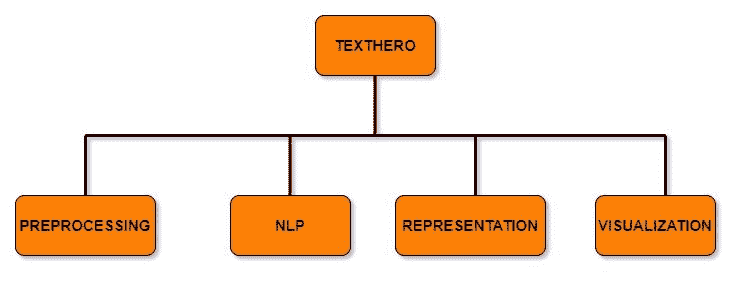
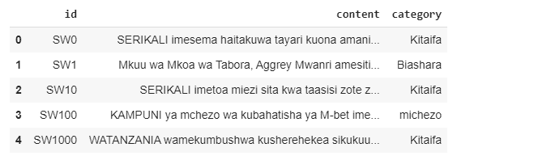
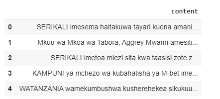
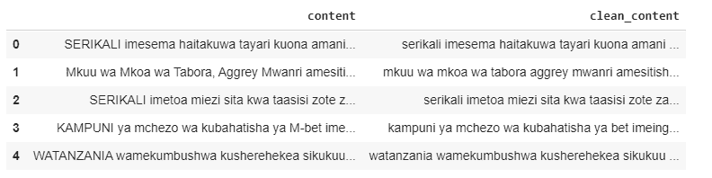
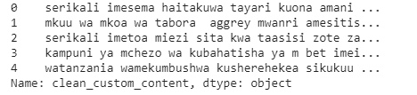
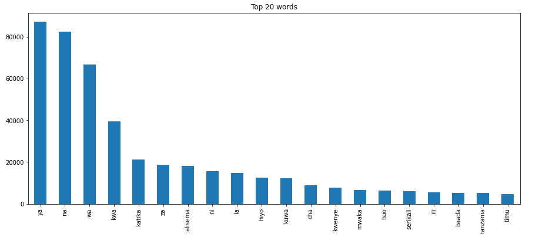
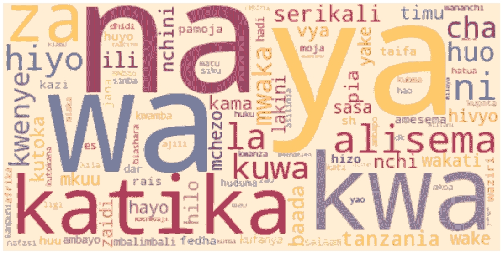
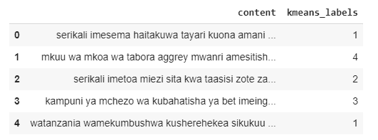
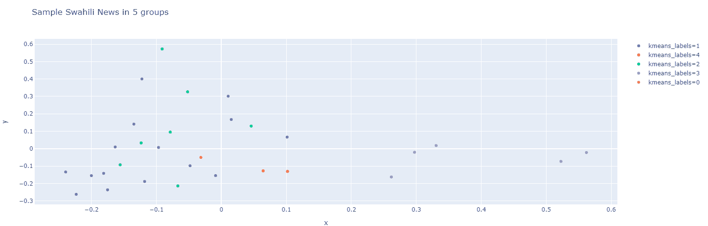

# 如何使用 Texthero 为您的 NLP 项目准备基于文本的数据集

> 原文：<https://www.freecodecamp.org/news/how-to-work-and-understand-text-based-dataset-with-texthero/>

自然语言处理是当今世界最重要的学习和研究领域之一。它在商业领域有许多应用，例如聊天机器人、情感分析和文档分类。预处理和表示文本是 NLP 项目中最棘手和最烦人的部分之一。基于文本的数据集非常棘手，难以预处理。但幸运的是，名为 Texthero 的最新 Python 包可以帮助您解决这些挑战。

## 什么是 Texthero？

Texthero 是一个简单的 Python 工具包，可帮助您处理基于文本的数据集。它提供了快速而简单的功能，让你只需几行代码就可以对文本数据进行预处理、表示、映射成矢量、T2 可视化。


Texthero Logo

Texthero 设计用于 pandas 之上，因此它可以更容易地预处理和分析基于文本的 Pandas 系列或数据帧。

如果你正在进行一个 NLP 项目，Texthero 可以帮助你比以前更快地完成任务，让你有更多的时间专注于重要的任务。

**注意:**text hero 库还在测试版。你可能会面临一些错误，管道可能会改变。一个更快更好的版本将会发布，它会带来一些重大的变化。

## Texthero 概述



Texthero Modules

Texthero 有四个有用的模块，可以处理您可以在基于文本的数据集中应用的不同功能。

1.  [**预处理**](https://texthero.org/docs/api-preprocessing)
    该模块允许对基于文本的熊猫系列或数据帧进行有效的预处理。它有不同的方法来清理你的文本数据集，如 lowercase()、remove_html_tags()和 remove_urls()。
2.  [](https://texthero.org/docs/api-nlp) **这个模块有一些自然语言处理的任务，比如命名实体、名词组块等等。**
3.  **[**表示**](https://texthero.org/docs/api-representation)
    这个模块有不同的算法将单词映射成 TF-IDF、GloVe、主成分分析(PCA)、term_frequency 等向量。**
4.  **[**可视化**](https://texthero.org/docs/api-visualization)
    最后一个模块有三种不同的方法来可视化基于文本的熊猫数据框架的洞察和统计。它可以绘制散点图和文字云。**

## **安装 Texthero**

**Texthero 是免费的、开源的，并且有很好的文档记录。要安装它，请打开终端并执行以下命令:**

```
`pip install texthero`
```

**这个包在后端使用了很多其他的库，比如 Gensim、SpaCy、scikit-learn 和 NLTK。你不需要单独安装它们，pip 会处理的。**

### **如何使用 Texthero**

**在本文中，我将使用一个新闻数据集向您展示如何在自己的 NLP 项目中使用 texthero 模块提供的不同方法。**

**我们将从导入将要使用的重要 Python 包开始。**

```
`#import important packages

import texthero as hero
import pandas as pd`
```

**然后，我们将从数据目录中加载一个数据集。本文的数据集聚焦于斯瓦希里语的新闻。**

```
`#load dataset 

data = pd.read_csv("data/swahili_news_dataset.csv")`
```

**让我们看看数据集的前 5 行:**

```
`# show top 5 rows 

data.head()`
```

**

Top 5 rows** 

**如您所见，在我们的数据集中有三列(id、内容和类别)。对于本文，我们将重点关注内容特性。**

```
`# select news content only and show top 5 rows

news_content = data[["content"]]
news_content.head()`
```

**我们已经创建了一个只关注内容的新数据框架，然后我们将显示前 5 行。**

**

Top 5 rows** 

### **用 Texthero 预处理。**

**我们可以使用 **clean()。**对基于文本的熊猫系列进行预处理的方法。**

```
`# clean the news content by using clean method from hero package

news_content['clean_content'] = hero.clean(news_content['content'])`
```

**当您传递一个 pandas 系列时， **clean()** 方法运行七个函数。这七个功能是:**

*   **小写:小写所有文本。**
*   **remove_diacritics():删除字符串中的所有重音符号。**
*   **remove_stopwords():删除所有停用词。**
*   **remove_digits():删除所有数字块。**
*   **remove_punctuation():删除所有字符串。"#$%&'()*+,-./:;<=>？@[]^_`{|}~).**
*   **fillna(s):用空格替换未赋值的值。**
*   **remove_whitespace():删除单词之间的所有空格**

**现在我们可以看到清理后的新闻内容。**

```
`#show unclean and clean news content

news_content.head()`
```

**

content vs clean_content** 

### **定制清洗**

**如果来自 **clean()** 方法的默认管道不符合您的需要，您可以创建一个自定义管道，其中包含您想要在数据集中应用的函数列表。**

**作为一个例子，我创建了一个只有 5 个函数的定制管道来清理我的数据集。**

```
`#create custom pipeline
from texthero import preprocessing

custom_pipeline = [preprocessing.fillna,
                   preprocessing.lowercase,
                   preprocessing.remove_whitespace,
                   preprocessing.remove_punctuation,
                   preprocessing.remove_urls,
                   ]`
```

**现在，我可以使用 custome_pipeline 来清理我的数据集。**

```
`#altearnative for custom pipeline

news_content['clean_custom_content'] = news_content['content'].pipe(hero.clean, custom_pipeline)`
```

**您可以看到我们通过使用自定义管道创建的干净数据集。**

```
`# show output of custome pipeline

news_content.clean_custom_content.head()` 
```

**

result of custom clean pipeline** 

## **有用的预处理方法**

**以下是预处理模块中其他一些有用的函数，您可以尝试清理基于文本的数据集。**

### **删除数字**

**您可以使用 **remove_digits()** 函数移除基于文本的数据集中的数字。**

```
`text = pd.Series("Hi my phone number is +255 711 111 111 call me at 09:00 am")
clean_text = hero.preprocessing.remove_digits(text)

print(clean_text)`
```

**输出:嗨，我的电话号码是+打电话给我:am
dtype: object**

### **删除停用词**

**您可以使用 **remove_stopwords()** 函数移除基于文本的数据集中的停用词。**

```
`text = pd.Series("you need to know NLP to develop the chatbot that you desire")
clean_text = hero.remove_stopwords(text)

print(clean_text)` 
```

**输出:需要了解 NLP 开发聊天机器人欲望
dtype: object**

### **删除 URL**

**您可以使用 **remove_urls()** 函数移除基于文本的数据集中的链接。**

```
`text = pd.Series("Go to https://www.freecodecamp.org/news/ to read more articles you like")
clean_text = hero.remove_urls(text)

print(clean_text)`
```

**输出:前往阅读更多你喜欢的文章
dtype: object**

### **标记化**

**使用 **tokenize()** 方法对给定熊猫系列的每一行进行标记化，并返回一个熊猫系列，其中每一行包含一个标记列表。**

```
`text = pd.Series(["You can think of Texthero as a tool to help you understand and work with text-based dataset. "])
clean_text = hero.tokenize(text)

print(clean_text)`
```

**output: [You，can，think，of，Texthero，as，a，tool，to，help，You，understand，and，work，with，text，based，dataset]
dtype: object**

### **删除 HTML 标签**

**您可以使用 **remove_html_tags()** 方法从给定的 Pandas 系列中删除 html 标签。**

```
`text = pd.Series("<html><body><h2>hello world</h2></body></html>")
clean_text = hero.remove_html_tags(text)

print(clean_text)`
```

**输出:hello world
dtype: object**

## **有用的可视化方法**

**Texthero 包含不同的方法来可视化基于文本的 Pandas 数据框架的见解和统计数据。**

### **热门词汇**

**如果想知道基于文本的数据集中的前几个单词，可以使用可视化模块中的 **top_words()** 方法。如果您想查看可以添加到停用字词列表中的附加字词，此方法很有用。**

**这个方法不返回条形图，所以我将使用 **matplotlib** 来可视化条形图中的顶部单词。**

```
`import matplotlib.pyplot as plt

NUM_TOP_WORDS = 20

top_20 = hero.visualization.top_words(news_content['clean_content']).head(NUM_TOP_WORDS)

# Draw the bar chart

top_20.plot.bar(rot=90, title="Top 20 words");

plt.show(block=True);`
```

****

**在上图中，我们可以看到新闻数据集中的前 20 个单词。**

### **变成云**

**可视化模块中的 **wordcloud()** 方法使用 word_cloud 包中的 wordcloud 绘制图像。**

```
`#Plot wordcloud image using WordCloud method
hero.wordcloud(news_content.clean_content, max_words=100,)`
```

**我们在 **wordcloud()** 方法中传递了 dataframe 系列和最大单词数(在本例中为 100 个单词)。**

**

wordclouds** 

## **有用的表示方法**

**Texthero 包含来自表示模块的不同方法，帮助您使用不同的算法(如 TF-IDF、word2vec 或 GloVe)将单词映射到矢量。在这一节中，我将向您展示如何使用这些方法。**

### **TF-IDF**

**您可以使用 TF-IDF 来表示基于文本的熊猫系列。我用两条新闻内容创建了一个新的 pandas 系列，并通过使用 **tfidf()** 方法在 TF_IDF 特性中表示它们。**

```
`# Create a new text-based Pandas Series.

news = pd.Series(["mkuu wa mkoa wa tabora aggrey mwanri amesitisha likizo za viongozi wote mkoani humo kutekeleza maazimio ya jukwaa la fursa za biashara la mkoa huo", "serikali imetoa miezi sita kwa taasisi zote za umma ambazo hazitumii mfumo wa gepg katika ukusanyaji wa fedha kufanya hivyo na baada ya hapo itafanya ukaguzi na kuwawajibisha"])

#convert into tfidf features 
hero.tfidf(news)`
```

**输出:[0.187132760851739，0.0，0.187132760851739，0....[0.0，0.18557550845969953，0.0，0.185755586...
数据类型:对象**

****注:** TF-IDF 代表*词频-逆文档频率。***

### **检索词频率**

**您可以使用 **term_frequency()** 方法来表示基于文本的熊猫系列。术语频率(TF)用于显示表达式(术语或单词)在文档或文本内容中出现的频率。**

```
 `news = pd.Series(["mkuu wa mkoa wa tabora aggrey mwanri amesitisha likizo za viongozi wote mkoani humo kutekeleza maazimio ya jukwaa la fursa za biashara la mkoa huo", "serikali imetoa miezi sita kwa taasisi zote za umma ambazo hazitumii mfumo wa gepg katika ukusanyaji wa fedha kufanya hivyo na baada ya hapo itafanya ukaguzi na kuwawajibisha"])

# Represent a text-based Pandas Series using term_frequency.
hero.term_frequency(news)`
```

**输出:[1，0，1，0，1，0，0，1，0，0，0，0，0，1，1，0，0，...
【0，1，0，1，0，1，0，1，0，1，1，1，0，0，1，1，...
数据类型:对象**

### **k 均值**

**Texthero 可以通过使用 **kmeans()** 方法来执行 K-means 聚类算法。如果您有一个未标记的基于文本的数据集，您可以使用此方法根据相似性对内容进行分组。**

**在这个例子中，我将创建一个名为 **news** 的新的 pandas dataframe，它包含以下列*内容、tfidf 和 kmeans_labels。***

```
`column_names = ["content","tfidf", "kmeans_labels"]

news = pd.DataFrame(columns = column_names)` 
```

**我们将只使用来自我们的 *news_content 数据帧*的前 30 条清理内容，并通过使用 **kmeans()** 方法将它们分组。**

```
`# collect 30 clean content.
news["content"] = news_content.clean_content[:30]

# convert them into tf-idf features.
news['tfidf'] = (
    news['content']
    .pipe(hero.tfidf)
)

# perform clustering algorithm by using kmeans() 
news['kmeans_labels'] = (
    news['tfidf']
    .pipe(hero.kmeans, n_clusters=5)
    .astype(str)
)`
```

**在上面的源代码中，在 k-means 方法的流水线中，我们传递的聚类数是 5。这意味着我们将把这些内容分成 5 组。**

**现在选定的新闻内容已经被标记为五组。**

```
`# show content and their labels
news[["content","kmeans_labels"]].head()`
```

**

news content with labels** 

### **污染控制局(Pollution Control Agency)**

**还可以使用 **pca()** 方法对给定的熊猫序列进行主成分分析。**主成分分析** ( **PCA** )是一种降低数据集维度的技术。这增加了可解释性，但同时最大限度地减少了信息损失。**

**在本例中，我们使用新闻数据帧中的 tfidf 特征，并通过使用 **pca()** 方法将它们表示为两个组件。最后，我们将使用**散点图()**方法显示一个散点图。**

```
`#perform pca
news['pca'] = news['tfidf'].pipe(hero.pca)

#show scatterplot
hero.scatterplot(news, 'pca', color='kmeans_labels', title="news")`
```

**

Scatter Plot** 

## ****总结****

**在本文中，您已经学习了如何在 NLP 项目中使用 Texthero toolkit Python 包的基础知识。您可以在[文档](https://texthero.org/docs/api-preprocessing)中了解更多可用的方法。**

**你可以在这里下载本文用到的数据集和笔记本:[https://github.com/Davisy/Texthero-Python-Toolkit](https://github.com/Davisy/Texthero-Python-Toolkit)。**

**如果你学到了新的东西或者喜欢阅读这篇文章，请分享给其他人看。在那之前，下期帖子再见！也可以通过 Twitter [@Davis_McDavid](https://twitter.com/Davis_McDavid) 找到我**