# 如何在 R 中处理数据框和 CSV 文件—详细介绍并附有示例

> 原文：<https://www.freecodecamp.org/news/how-to-work-with-data-frames-and-csv-files-in-r/>

欢迎光临！如果你想开始钻研数据科学和统计学，那么数据框、CSV 文件和 R 将是你必不可少的工具。让我们看看你如何使用他们惊人的能力。

**在这篇文章中，你将学到:**

*   什么是 CSV 文件，它们的用途是什么。
*   如何使用 Google Sheets 创建 CSV 文件？
*   如何在 r 中读取 CSV 文件？
*   什么是数据框以及它们的用途。
*   如何访问数据框的元素？
*   如何修改数据框。
*   如何添加和删除行和列。

我们将使用 RStudio，一个开源 IDE(集成开发环境)来运行这些示例。

让我们开始吧！✨

## 🔹CSV 文件简介

CSV(逗号分隔值)文件可以被视为数据分析的构建块之一，因为它们用于存储以表格形式表示的数据。

在此文件中，值由逗号分隔，以表示表中的不同列，如下例所示:

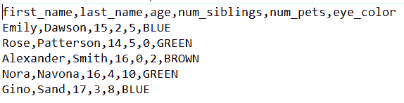

CSV File

我们将使用 Google Sheets 生成该文件。

## 🔸如何使用 Google Sheets 创建 CSV 文件

让我们使用 Google Sheets 创建您的第一个 CSV 文件。

**第一步:**进入 [Google Sheets 网站](https://www.google.com/sheets/about/)，点击“转到 Google Sheets”:

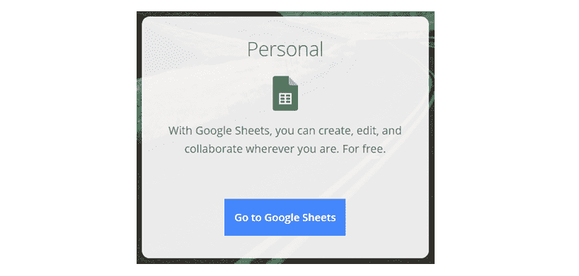

**💡提示:**你可以点击谷歌主页右上角的按钮进入谷歌表单:


如果我们放大，我们会看到“工作表”按钮:


💡**提示:**要使用 Google Sheets，你需要有一个 Gmail 账户。或者，您可以使用 MS Excel 或其他电子表格编辑器创建 CSV 文件。

您将看到此面板:

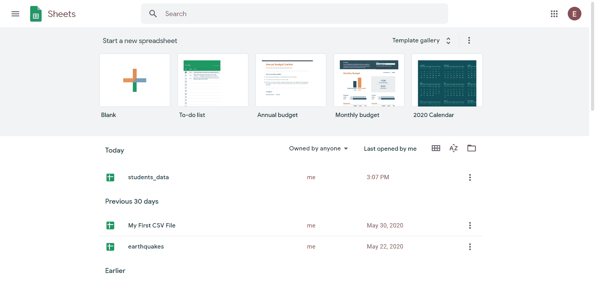

**步骤 2:** 点击“+”按钮创建一个空白电子表格。

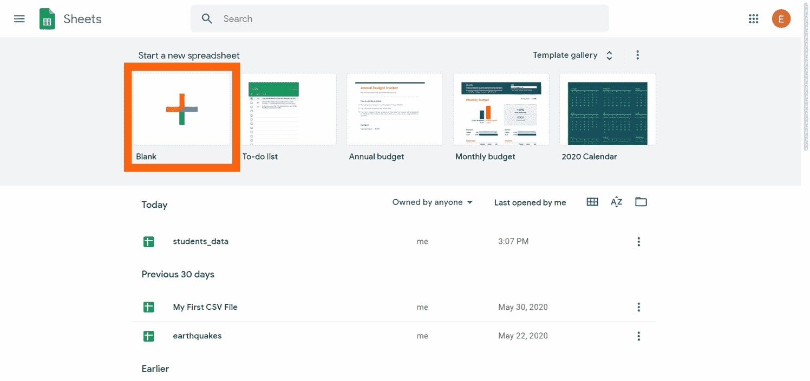

现在您有了一个新的空电子表格:

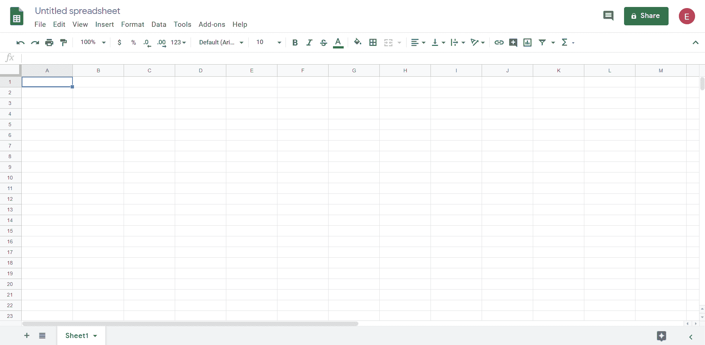

第三步:将电子表格的名称改为`students_data`。我们需要使用文件名来处理数据框。写入新名称，然后单击 enter 确认更改。

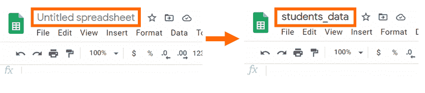

第四步:在电子表格的第一行，写下各列的标题。

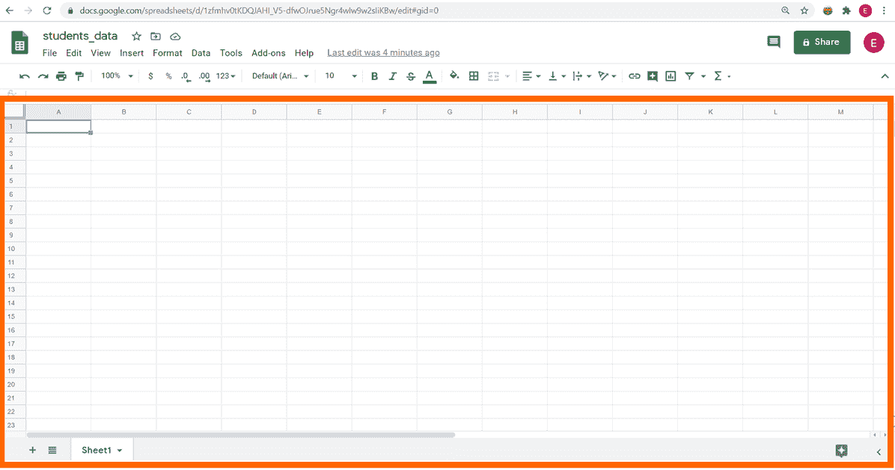

当您在 R 中导入一个 CSV 文件时，列的标题被称为**变量**。我们将定义六个变量:`first_name`、`last_name`、`age`、`num_siblings`、`num_pets`和`eye_color`，如下图所示:

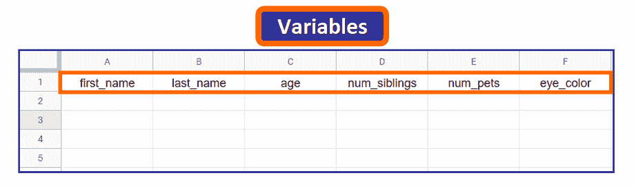

💡**提示:**注意，名字都是小写的，单词之间用下划线隔开。这不是强制性的，但是因为您需要在 R 中访问这些名称，所以使用这种格式是很常见的。

**步骤 5:** 输入每一列的数据。

当您在 R 中读取文件时，每一行都被称为一个**观察值**，它对应于从我们收集数据的个体、动物、物体或实体中获取的数据。

在这种情况下，每行对应一个学生的数据:

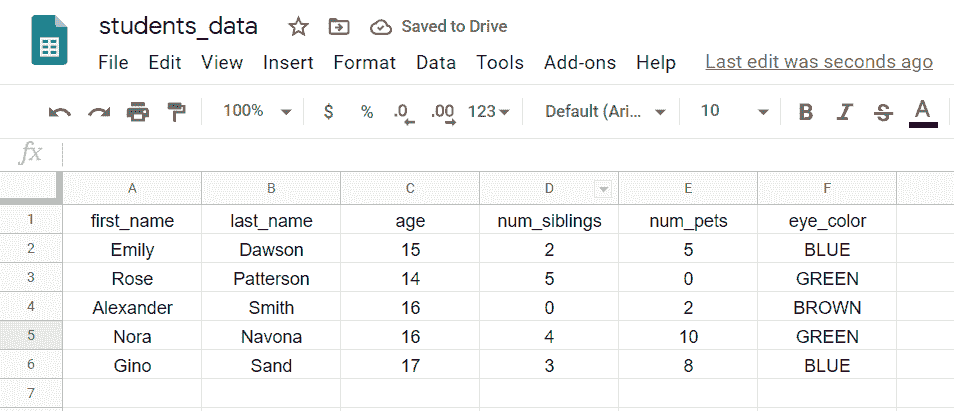

**第六步:**点击`File -> Download -> Comma-separated values`下载 CSV 文件，如下图所示:

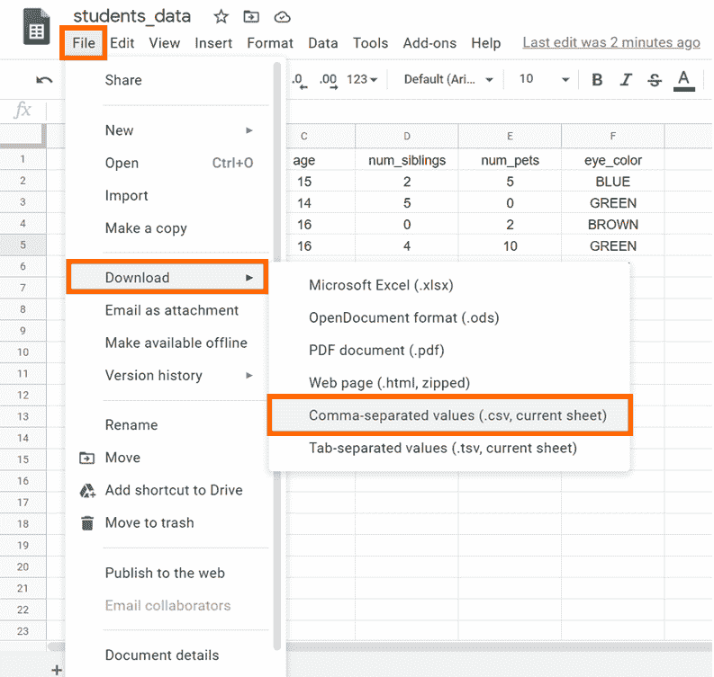

**第七步:**将文件重命名为 CSV 文件。您需要从默认名称中删除“Sheet1 ”,因为 Google Sheet 会自动将它添加到文件名中。

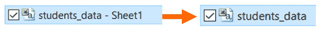

干得好！现在您有了自己的 CSV 文件，是时候开始在 r 中使用它了。

## 🔹如何在 R 中读取 CSV 文件

在 RStudio 中，读取 CSV 文件的第一步是确保当前工作目录是 CSV 文件所在的目录。

💡**提示:**如果不是这样，您将需要使用文件的完整路径。

### 更改当前工作目录

您可以在此面板中更改当前工作目录:

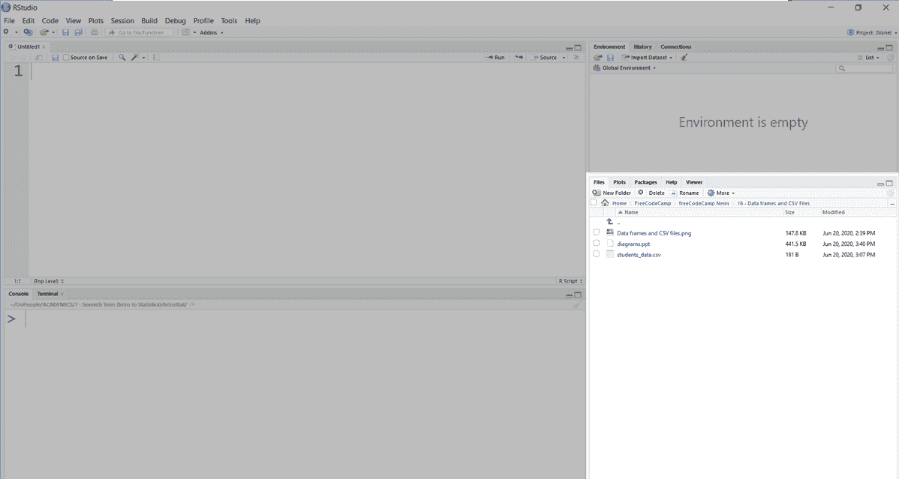

如果我们放大，您可以看到当前路径(1)，并通过单击右侧的省略号(`...`)按钮选择新路径(2):

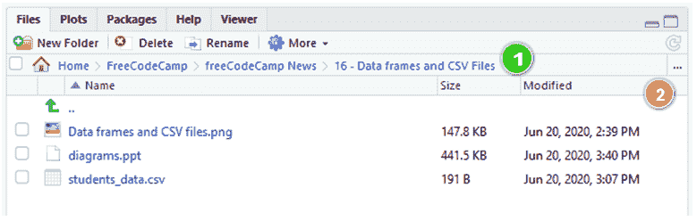

💡**提示:**你也可以在交互控制台中用`getwd()`查看你当前的工作目录。

然后，点击“更多”和“设置为工作目录”。

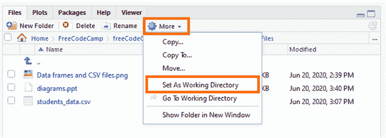

### 阅读 CSV 文件

设置好当前工作目录后，您可以使用以下命令读取 CSV 文件:

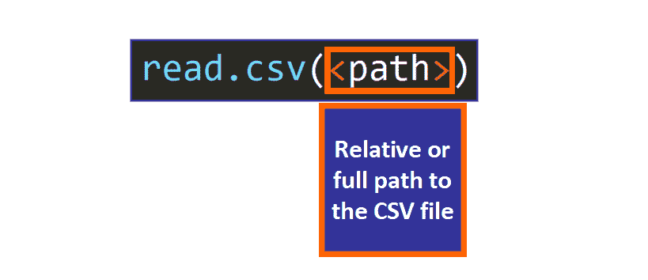

在 R 代码中，我们有这个:

```
> students_data <- read.csv("students_data.csv")
```

💡**提示:**我们把它赋给变量`students_data`，用这个变量访问 CSV 文件的数据。在 R 中，我们可以用点`.`、下划线`_`、`UpperCamelCase`或`lowerCamelCase`来分隔单词。

运行此命令后，您将在右上面板中看到以下内容:


现在您已经在环境中定义了一个变量！我们来看看什么是数据帧，它们与 CSV 文件有着怎样的紧密联系。

## 🔸数据框简介

数据框是用于以表格形式存储统计数据的标准数字格式。**当您读取 R 中的 CSV 文件时，会生成一个数据帧**。

我们可以通过使用`class`函数检查变量的类型来确认这一点:

```
> class(students_data)
[1] "data.frame"
```

有道理，对吧？CSV 文件包含以表格形式表示的数据，而数据框在您的代码中表示表格数据，因此它们是紧密相连的。

如果在交互式控制台中输入此变量，您将看到 CSV 文件的内容:

```
> students_data
  first_name last_name age num_siblings num_pets eye_color
1      Emily    Dawson  15            2        5      BLUE
2       Rose Patterson  14            5        0     GREEN
3  Alexander     Smith  16            0        2     BROWN
4       Nora    Navona  16            4       10     GREEN
5       Gino      Sand  17            3        8      BLUE
```

### 有关数据框的详细信息

您有几种不同的方法来查看数据框的变量和观测值的数量:

*   您的第一个选择是查看右上方的面板，该面板显示了当前在环境中定义的变量。该数据框有 5 个观察值(行)和 6 个变量(列):

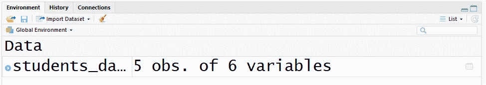

*   另一种选择是在交互控制台或您的程序中使用函数`nrow`和`ncol`，将数据帧作为参数传递。我们得到相同的结果:5 行 6 列。

```
> nrow(students_data)
[1] 5
> ncol(students_data)
[1] 6
```

*   您还可以使用`str`功能查看有关数据框的更多信息:

```
> str(students_data)
'data.frame':	5 obs. of  6 variables:
 $ first_name  : Factor w/ 5 levels "Alexander","Emily",..: 2 5 1 4 3
 $ last_name   : Factor w/ 5 levels "Dawson","Navona",..: 1 3 5 2 4
 $ age         : int  15 14 16 16 17
 $ num_siblings: int  2 5 0 4 3
 $ num_pets    : int  5 0 2 10 8
 $ eye_color   : Factor w/ 3 levels "BLUE","BROWN",..: 1 3 2 3 1
```

该函数(应用于数据框)告诉您:

*   观察值的数量(行)。
*   变量(列)的数量。
*   变量的名称。
*   变量的数据类型。
*   关于变量的更多信息。

当你想知道更多关于你正在处理的数据时，你会发现这个函数真的很棒。

💡**提示:**在 R 中，一个“因子”是一个定性变量，是一个值代表类别的变量。例如，`eye_color`有值`"BLUE"`、`"BROWN"`、`"GREEN"`，这些都是类别，所以你可以在上面`str`的输出中看到，当 CSV 文件在 r 中被读取时，这个变量被自动定义为一个“因子”

## 🔹数据框:关键操作和功能

现在您知道了如何查看有关数据框的更多信息。但是数据框的魅力在于它们所提供的惊人能力和功能，所以让我们更详细地了解一下。

### 如何访问数据框的值

数据框类似于矩阵，因此您可以使用两个索引来访问单个值，这两个索引由方括号包围，并用逗号分隔，以指示您希望在结果中包括哪些行和哪些列，如下所示:

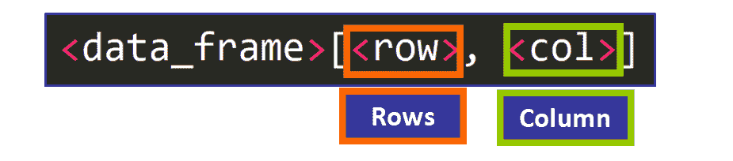

例如，如果我们想访问数据(第 4 行)中第四个学生的值`eye_color`(第 6 列):

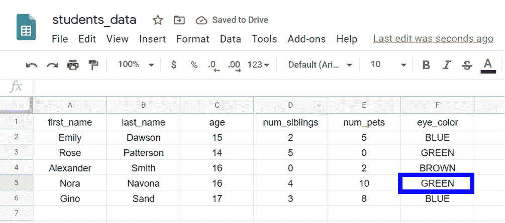

我们需要使用这个命令:

```
> students_data[4, 6]
```

💡**提示:**在 R 中，索引从`1`开始，第一行的变量名不计算在内。

这是输出:

```
[1] GREEN
Levels: BLUE BROWN GREEN
```

可以看到值是`"GREEN"`。“因子”类型的变量有“级别”,代表它们可以取的不同类别或值。这个输出告诉我们变量`eye_color`的级别。

### 如何访问数据框的行和列

我们也可以使用这个语法来访问一系列的行和列，以获得原始矩阵的一部分，如下所示:

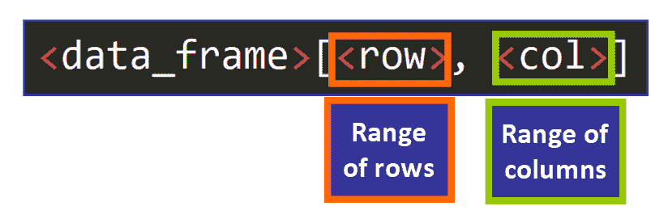

例如，如果我们想获得列表中第三、第四和第五个学生的年龄和兄弟姐妹数量，我们可以使用:

```
> students_data[3:5, 3:4]

  age num_siblings
3  16            0
4  16            4
5  17            3
```

**💡提示:**在 R 中定义区间的基本语法是`<start>:<end>`。注意，这些索引是包含性的，所以当我们写`3:5`时，第三和第五个元素被包括在上面的例子中。

如果我们想得到所有的行或列，我们只需省略间隔并包含逗号，就像这样:

```
> students_data[3:5,]

  first_name last_name age num_siblings num_pets eye_color
3  Alexander     Smith  16            0        2     BROWN
4       Nora    Navona  16            4       10     GREEN
5       Gino      Sand  17            3        8      BLUE
```

我们没有在`students_data[3:5,]`中的逗号后面包含列的间隔，所以我们得到了我们指定的三行的数据帧的所有列。

类似地，如果我们省略行，我们可以获得特定范围的列的所有行:

```
> students_data[, 1:3]

  first_name last_name age
1      Emily    Dawson  15
2       Rose Patterson  14
3  Alexander     Smith  16
4       Nora    Navona  16
5       Gino      Sand  17
```

**💡提示:**注意，在这两种情况下仍然需要包含逗号。

### 如何访问列

有三种方法可以访问整个列:

*   **选项#1:** 要访问一列并将其作为数据帧返回，可以使用以下语法:

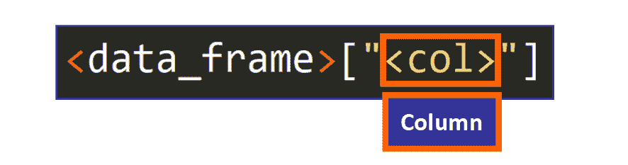

例如:

```
> students_data["first_name"]

  first_name
1      Emily
2       Rose
3  Alexander
4       Nora
5       Gino
```

*   **选项#2:** 要获得一个列作为向量(序列)，可以使用以下语法:


**💡提示:**注意`$`符号的使用。

例如:

```
> students_data$first_name

[1] Emily     Rose      Alexander Nora      Gino     
Levels: Alexander Emily Gino Nora Rose
```

*   **选项#3:** 你也可以使用这个语法来获得向量形式的列(见下文)。这相当于前面的语法:

```
> students_data[["first_name"]]

[1] Emily     Rose      Alexander Nora      Gino     
Levels: Alexander Emily Gino Nora Rose
```

### 如何过滤数据框的行

您可以过滤数据框的行以获得满足特定条件的矩阵部分。

为此，我们使用以下语法，将条件作为方括号内的第一个元素，然后是逗号，最后将第二个元素留空。

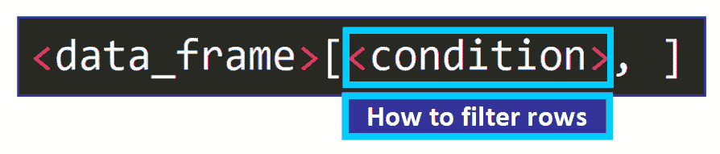

例如，要获得`students_data$age > 16`的所有行，我们可以使用:

```
> students_data[students_data$age > 16,]

  first_name last_name age num_siblings num_pets eye_color
5       Gino      Sand  17            3        8      BLUE
```

我们得到一个数据帧，其中的行满足这个条件。

### 筛选行并选择列

您可以将此条件与一系列列结合使用:

```
> students_data[students_data$age > 16, 3:6]

  age num_siblings num_pets eye_color
5  17            3        8      BLUE
```

我们得到满足条件的行和范围`3:6`中的列。

## 🔸如何修改数据框

您可以修改数据框的单个值、添加列、添加行以及移除它们。让我们看看你如何做到这一点！

### 如何更改值

要更改数据框的单个值，需要使用以下语法:

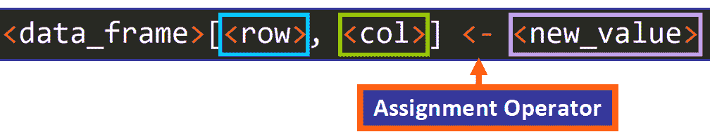

例如，如果我们想要更改当前位于第 4 行第 6 列的值，在这里用蓝色表示:


我们需要使用这行代码:

```
students_data[4, 6] <- "BROWN"
```

**💡提示:**你也可以使用`=`作为赋值操作符。

这是输出。该值已成功更改。

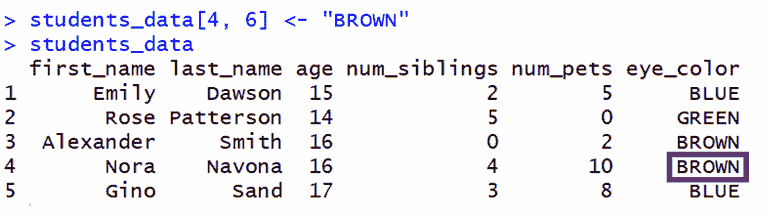

**💡提示:**记住 CSV 文件的第一行不算第一行，因为它有变量的名称。

### 如何向数据框添加行

要向数据框添加一行，您需要使用`rbind`函数:

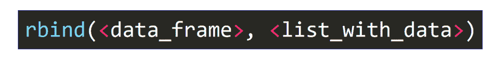

该函数有两个参数:

*   要修改的数据框。
*   包含新行数据的列表。要创建列表，可以使用`list()`函数，每个值用逗号分隔。

这是一个例子:

```
> rbind(students_data, list("William", "Smith", 14, 7, 3, "BROWN"))
```

输出是:

```
 first_name last_name age num_siblings num_pets eye_color
1      Emily    Dawson  15            2        5      BLUE
2       Rose Patterson  14            5        0     GREEN
3  Alexander     Smith  16            0        2     BROWN
4       Nora    Navona  16            4       10     BROWN
5       Gino      Sand  17            3        8      BLUE
6       <NA>     Smith  14            7        3     BROWN
```

但是等等！显示一条警告消息:

```
Warning message:
In `[<-.factor`(`*tmp*`, ri, value = "William") :
  invalid factor level, NA generated
```

注意第六行的第一个值，它是`<NA>`:

```
6       <NA>     Smith  14            7        3     BROWN
```

这是因为当我们读取 CSV 文件时，变量`first_name`被自动定义为一个因子，而因子有固定的“类别”(级别)。

除非您读取参数`stringsAsFactors`的值为`FALSE`的 CSV 文件，否则您无法向该变量添加新级别(值- `"William"`),如下所示:

```
> students_data <- read.csv("students_data.csv", stringsAsFactors = FALSE)
```


现在，如果我们尝试添加这一行，数据框将被成功修改。

```
> students_data <- rbind(students_data, list("William", "Smith", 14, 7, 3, "BROWN"))
> students_data

  first_name last_name age num_siblings num_pets eye_color
1      Emily    Dawson  15            2        5      BLUE
2       Rose Patterson  14            5        0     GREEN
3  Alexander     Smith  16            0        2     BROWN
4       Nora    Navona  16            4       10     GREEN
5       Gino      Sand  17            3        8      BLUE
6    William     Smith  14            7        3     BROWN
```

**💡提示:**注意，如果再次读取 CSV 文件并将其赋给同一个变量，之前所做的所有更改都将被删除，您将看到原始数据框。您需要将此参数添加到读取 CSV 文件的第一行代码中，然后对其进行更改。

### 如何向数据框添加列

向数据框添加列要简单得多。您需要使用以下语法:


例如:

```
> students_data$GPA <- c(4.0, 3.5, 3.2, 3.15, 2.9, 3.0)
```

**💡提示:**元素的数量必须等于数据帧的行数。

输出显示了带有新 GPA 列的数据框:

```
> students_data

  first_name last_name age num_siblings num_pets eye_color  GPA
1      Emily    Dawson  15            2        5      BLUE 4.00
2       Rose Patterson  14            5        0     GREEN 3.50
3  Alexander     Smith  16            0        2     BROWN 3.20
4       Nora    Navona  16            4       10     GREEN 3.15
5       Gino      Sand  17            3        8      BLUE 2.90
6    William     Smith  14            7        3     BROWN 3.00
```

### 如何删除列

要从数据框中移除列，需要使用以下语法:


将值 Null 分配给列时，该列将自动从数据框中移除。

例如，要删除`age`列，我们使用:

```
> students_data$age <- NULL
```

输出是:

```
> students_data

  first_name last_name num_siblings num_pets eye_color  GPA
1      Emily    Dawson            2        5      BLUE 4.00
2       Rose Patterson            5        0     GREEN 3.50
3  Alexander     Smith            0        2     BROWN 3.20
4       Nora    Navona            4       10     GREEN 3.15
5       Gino      Sand            3        8      BLUE 2.90
6    William     Smith            7        3     BROWN 3.00
```

### 如何删除行

要从数据框中移除行，可以使用索引和范围。例如，要删除数据框的第一行:

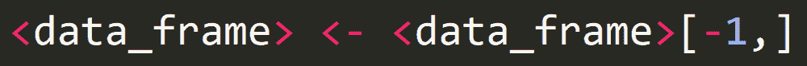

`[-1,]`获取不包括第一行的数据帧的一部分。然后，将这部分赋给同一个变量。

如果我们有这个数据框，并且我们想要删除第一行:

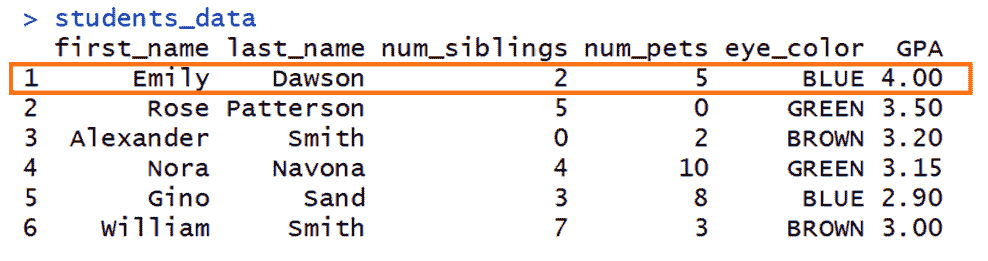

输出是不包含第一行的数据框:

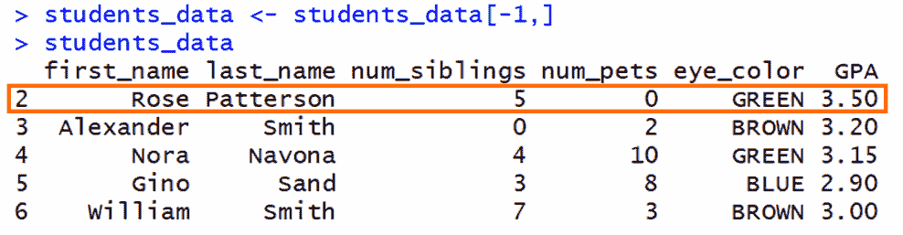

一般来说，要删除特定的行，需要使用以下语法，其中`<row_num>`是要删除的行:

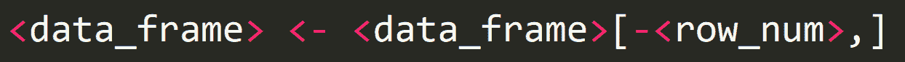

**💡提示:**注意行号前的`-`号。

例如，如果我们想从该数据框中移除第 4 行:

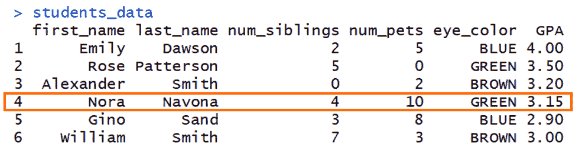

输出是:

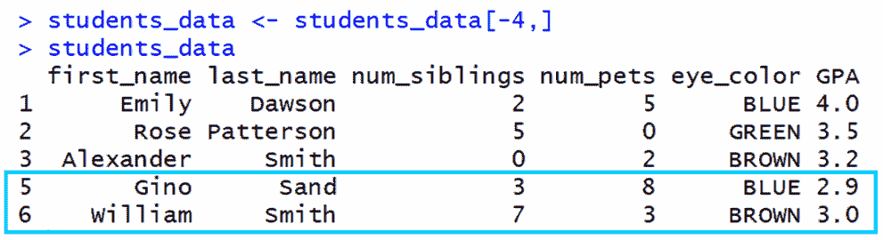

如您所见，第 4 行被成功删除。

## 🔹概括起来

*   CSV 文件是逗号分隔值文件，用于以表格形式表示数据。可以使用 R 和 RStudio 读取这些文件。
*   R 中使用数据框来表示表格数据。读取 CSV 文件时，会创建一个数据框来存储数据。
*   您可以访问和修改数据框的值、行和列。

我真的希望你喜欢我的文章，并发现它很有帮助。现在可以在 r 中处理数据帧和 CSV 文件了。

**如果你喜欢这篇文章，可以考虑** [**参加我的新在线课程****“R-A 实用方法中的统计学入门**](https://www.udemy.com/course/descriptive-statistics-using-r-a-practical-introduction/?referralCode=F5AC93170862ED00BF67)