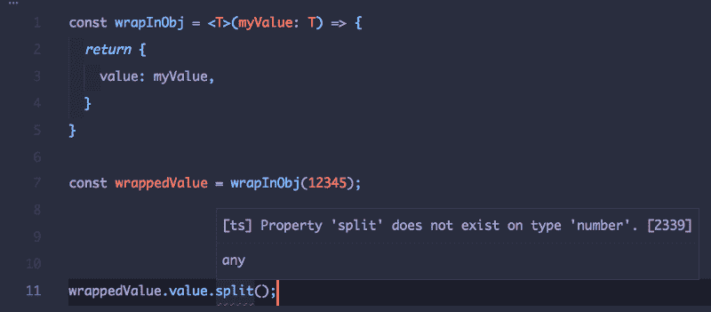
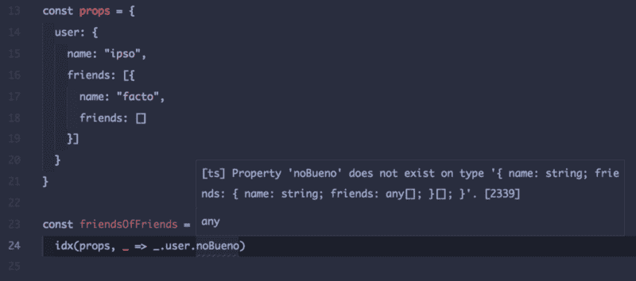
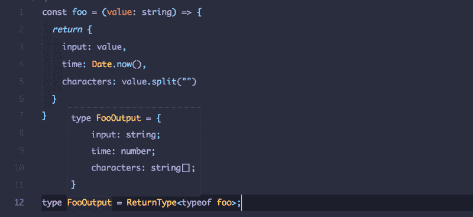

# 如何理解 Typescript 泛型

> 原文：<https://www.freecodecamp.org/news/how-to-wrap-your-head-around-typescript-generics-8d243f7de78/>

作者 Nadeesha Cabral

# 如何理解 Typescript 泛型

Photo by [Hannah Wei](https://unsplash.com/photos/aso6SYJZGps?utm_source=unsplash&utm_medium=referral&utm_content=creditCopyText) on [Unsplash](https://unsplash.com/search/photos/study?utm_source=unsplash&utm_medium=referral&utm_content=creditCopyText)

当“流 vs .类型脚本”的争论激烈的时候，我不得不选择一方。我选了打字稿。幸运的是，这是我做的最好的决定之一。当我不得不做出这个决定时，最终说服我的是 [Typescript 对调用时泛型的支持](https://medium.com/@nadeesha/why-i-choose-typescript-specifying-generic-parameters-during-call-time-706003f55675)。

今天，让我试着向你介绍一下泛型实现了什么，以及它如何帮助我们编写更安全、更干净和更易维护的代码。

### 示例 1:断言简单类型

假设我们需要一个函数，它可以接受任何值，并将其放入一个对象中。这在 Typescript 中的一个简单实现看起来和运行起来如下:

类型安全到此为止。

没错，`myValue`可以是任何类型。但我们需要告诉控制器的是，函数的输出，虽然不能预见为开发者写代码，但可以通过输入类型的类型“推断”出来。换句话说，我们可以对输出有一个“通用定义”。

上述函数的一般实现如下所示:

我们简单地说，`myValue`可以有一个类型`T`。可以是“任何类型”，但不能是`any`类型。换句话说，它有一个我们关心的类型。

如果您尝试用 Typescript 编写早期的执行，您将无法运行它，因为编译器会给出一个有用的警告:

### 示例 2:用泛型编写 idx

`idx`是一个“用于访问 JavaScript 对象上任意嵌套的、可能为空的属性的库”。当您处理复杂的 Javascript 对象时，如 REST API 响应可能有可为空的字段时，这尤其有用。

如果你不介意我过于简化，它基本上是通过用`props`对作为第二个参数的函数进行`try`运算来实现的。如果失败，它`catch` es 并安全返回一个`undefined`值，而不抛出。

同样，一个简单的实现应该是:

但是，如果我们在泛型方面有点聪明，我们可以让 Typescript 来帮助我们。

我们在这里介绍了两种泛型。

对于输入类型，我们通过说`T extends {}`来“暗示”它是一个对象。`U`为输出型。有了这些，我们可以表达出`selector`函数是接受`T`并返回未定义的`U`的函数。

现在，如果您试图用这个`idx`的定义编写和以前一样的代码，您将会得到一个编译错误:

### 示例 3:使用类型推断和泛型来获取函数的返回类型

假设我有一个函数，我需要向消费者提供输出的类型。如果我把这种类型叫做`FooOutput`，我会写成这样:

但是通过使用泛型和类型推断，我可以编写一个`ReturnType`泛型类型，它可以“推断”函数的返回类型:

我们在这里和任何人玩。这仅仅意味着 th `a` t T 是一个通用的函数类型，它接受任意数量`of` 的任意参数并产生一个值。然后我们用它`to in`提供另一个类型`p` e R，并返回它。

使用这个，我避免了在上面的例子中手工编写返回类型的需要。因为`foo`是一个函数，我需要那个函数的类型来使用`ReturnType`，所以我必须通过使用`typeof`来获得`foo`的类型。

### 我工具箱里有用的工具？

我在日常编程中使用了很多这样的工具。大多数的实用泛型都是在[之上的`lib.es5.d.ts`这里的](https://github.com/Microsoft/TypeScript/blob/master/lib/lib.es5.d.ts#L1411)中定义的。我最常用的一些包括:

希望这能帮助您更好地掌握 Typescript 泛型。如果你有问题，不要犹豫，在下面留下问题。