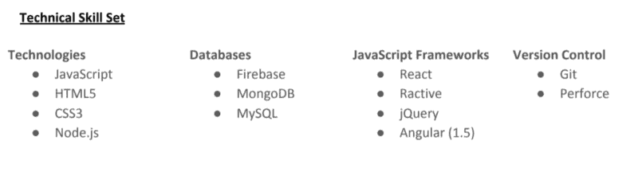

# 如何写一份更好的简历——网络开发者版

> 原文：<https://www.freecodecamp.org/news/how-to-write-a-better-cv-the-web-developer-edition-6d27f37d4e67/>

尼尔·乔·马希尔

# 如何写一份更好的简历——网络开发者版

这些年来，我遇到过很多非常有才华的工程师，他们因为一份不专业、草率或不专注的简历而很难被直接叫去面试。我知道当我开始申请工作时，这是我一直在挣扎的事情。所以我希望现在我已经经历了面试过程的方方面面，我可以帮助其他工程师克服第一个障碍。

*跳到最后获得免费简历模板！*

A job-hungry engineer

我们先来一段一段的分解一下。

#### 页眉

标题应该包括你的名字、联系方式和你的 GitHub 的链接——如果你有个人网站的话。它还应该包括一个与你申请的职位相匹配的头衔。我也喜欢包括一些为这个角色量身定制的技能要点。例如，如果你申请一个前端角色，你应该有这样的东西:

约翰·法克森

*前端开发者*

*Github —网站*

*电子邮件*

*电话*

*敏捷开发实践 JavaScript 开发 html 5 CSS3 跨浏览器兼容性*

#### 介绍

介绍应该简短而专业。它不应该是一个介绍，而应该是一个标题，一个让读者觉得值得一读的引子。在这里，你最好说一句重点突出的话，而不是漫无边际地谈论你有多“热情”。

拥有 6 年以上软件开发经验的高级工程师。在领导团队、指导工程师和软件架构方面经验丰富。

#### 技术

再次坚持与角色相关的主题，增加一部分关于你所有与角色相关的技能。因此，对于前端角色，这可能是合适的:

#### 经验/工作经历

如果你只是在找你的第一份工作，这一部分总是最可怕的，因为你可能会觉得你没有什么值得一提的。John Sonmez 有一个很棒的视频可以帮助你从“没有经验”开始，或者你应该如何建立你的经验部分。

但是对于你们其他人来说…

这应该是简短的，重点突出，并包括相关的要点。它应该遵循以下结构:公司名称、你的职位、你开始/结束的日期，然后是角色总结，最后是你在该角色中使用的技能要点。

***职业经历***

*假冒公司 1 2012 年至今*

*。NET 开发者*

我的职责是开发假公司 1 的在线系统。这包括管理公司的云解决方案，并参与其产品的整个开发生命周期。等等…

*   我的职责是管理公司 It 系统各方面的设计和开发。这包括管理 IT 系统和软件的整体运行。
*   *团队规模*
*   *项目*
*   *使用的技术*
*   就这样继续下去。

对你的每个相关角色都这样做，对读者来说，这是一种容易理解的格式。

#### 教育和培训

对于很多公司来说，教育或者至少一些技术课程对于显示你是一个有能力的学习者是很重要的。虽然一个职位并不总是需要学位，但你绝对应该至少包括一些你已经完成的在线课程和教程。

***学历:***

*2004–2005 假爱尔兰大学:计算机科学学位*

2001-2004 年假爱尔兰大学:计算机科学硕士

***完成的技术课程:***

*2002–2003 Udemy 课程 Java 课程 1*

*2000–2001 年 Java 学院 Java 课程 2*

*1999 年至 2000 年代码学院 Java 课程 3*

#### 其他的

大多数公司也希望看到你不仅仅是一个一维编码机器人，因为它也可以帮助你在面试中挑起话题。你也可以多透露一点你是如何跟上时代的。例如，我总是包括一个我参加的聚会，一个运动爱好和一个书呆子爱好。在这里要有创意，你可以用一个古怪的爱好来吸引某人的注意力。

***其他***

*   *爱尔兰代码成员*
*   *健身爱好者:定期去健身房*
*   *电脑游戏*

#### 参考

我通常不会在简历末尾附上参考资料，但会附上“可索取的参考资料”。如果你有工作证明(不是你现在的职位),把它们放在这里会很有帮助，因为这可能会加快招聘过程。通常，在候选人通过面试的所有阶段后，会用到推荐信。

### 更多提示…

#### 简明扼要

你简历的每一部分都应该保持相关，尽可能简短，以展示你是如何增加价值的。你不需要有华丽的语言技巧，你想尽可能清楚地展示你的技术和人际交往能力。

#### 保持更新

我喜欢回到我的简历，每隔几个月就更新一次。有时候，一个意想不到的机会可能会来敲门，做好准备是有好处的。这也是一种很好的方式来记录你的经历，这样你就知道你总是在建设性地充实你的简历。

#### 使用模板

像 Monster 这样的求职网站提供了一些很棒的简历模板，我认为你应该使用一些模板来帮助你，这样你就不会在毫无意义的格式化上浪费时间。它们也是很好的指导方针，告诉你应该包括什么，让你保持在正确的轨道上。你选择的字体和布局是确保未来雇主继续阅读你简历的关键。简单的格式效果最好。我在这里附上了自己的模板供你使用和滥用[。](https://docs.google.com/document/d/1X-Vhjga7a5NLLbhJ5rdBIaNkygpIX2-9hJx9U6h9wys/edit?usp=sharing)

#### 检查再检查

不惜一切代价避免错误。你可能认为你没有犯错误，但你可能在某个地方犯了错误。检查日期冲突，确保您的电子邮件、电话号码和链接都有效且正确。当你认为你的简历已经完成时，请朋友帮你校对一下。你也应该使用像 [Grammarly](https://app.grammarly.com/) 这样的工具，让你的生活变得更简单。

不用说，但是…使用你的拼写检查。

现在去参加那些工作面试吧！

点击获取免费简历模板[。](https://docs.google.com/document/d/1X-Vhjga7a5NLLbhJ5rdBIaNkygpIX2-9hJx9U6h9wys/edit?usp=sharing)

如果这有所帮助或者你有任何改进，请在❤️下面添加一些评论