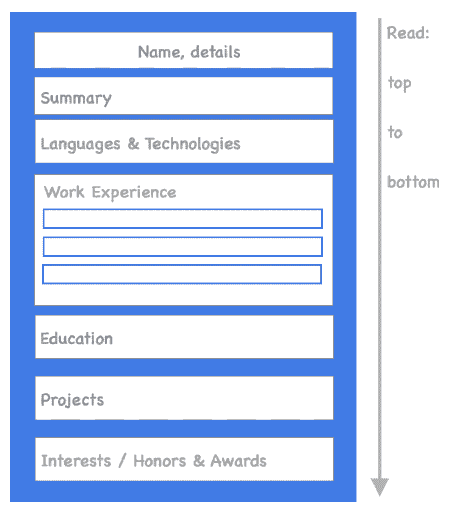

# 如何写一份招聘人员会看的开发人员简历

> 原文：<https://www.freecodecamp.org/news/how-to-write-a-developer-resume-recruiters-will-read/>

作为一名招聘经理，我看过数百份软件开发人员的简历。

在写科技简历的过程中，我还就同样的话题与数十名在脸书、谷歌、Spotify、亚马逊和其他科技公司工作的招聘人员和招聘经理进行了交谈和采访。

你可能听说过一个统计数据，招聘人员平均花 6 秒钟浏览一份简历。我的经验也证实了这一点。

但是你可以做很多事情，让招聘人员和招聘经理在第一次扫描简历时就阅读你希望他们阅读的内容。

## 我们退一步说:谁会看你的简历？

在对你的简历格式和内容给出建议之前，我们需要暂停一下。你知道公司里谁会看你的简历吗？你需要抓住谁的注意力？

这些人会或者可能会阅读你的简历。

People in the hiring process who could read your resume

让我们更详细地看一下他们各自的角色。

### 招聘经理会如何阅读你的简历

招聘经理是打开职位的人——内部称之为人数统计。

他们定义需求，并经常撰写工作描述。他们制定招聘流程，定义技术面试官是谁，以及他们应该关注哪些领域。

在小公司，他们可能会筛选所有收到的简历。但是随着公司的成长，他们就没有时间做这些了。

### 人力资源专员如何阅读你的简历

人力资源专员可能会在成长中的公司做简历筛选，这些公司还没有专门的招聘人员。

这些人从招聘经理那里得到指导，然后试着看看你的简历、工作描述和招聘经理的要求之间是否有重叠。

### 招聘人员会如何阅读你的简历

招聘人员通常会在中型公司进行大部分简历筛选。

有些招聘人员更亲力亲为，更懂专业术语。有些人在他们的技术领域知识上更接近于人力资源通才。

招聘人员会根据你的简历来判断你是否适合这个职位。

### 入境者将如何阅读你的简历

内向源是大型科技公司中的一个专门角色，他们获得大量的应用程序。他们是专注于整理直接申请的招聘人员，在任何给定的时间为多个职位做这件事。

内向采购者倾向于严格遵循招聘人员和招聘经理的工作要求和指导。在这里讨论的所有角色中，他们通常是每天看到简历最多的人。

### 面试小组将如何阅读你的简历

面试小组是一组将面试你的人，假设你通过了简历筛选(可能还有招聘人员的电话)。

他们会把你的简历转发出去，并在面试前快速浏览一遍。

没有必要给这群人留下深刻印象:他们可能会关注你的“兴趣”部分，以此来开启对话。

几乎每个浏览你简历的人都会在意简历是否显示你非常适合你申请的工作。

人力资源专员、招聘人员和内部资源人员都关注职位描述要求和招聘经理的期望。

唯一能更灵活地“解读”你的简历的人将是招聘经理和与他们的招聘经理关系良好的有经验的招聘人员。

**这很重要**。为你申请的职位量身定制你的简历是吸引招聘人员注意的最重要的事情。一旦你引起了他们的注意，他们就会更详细地阅读你的简历。

## 根据职位定制你的简历

当你申请一份工作时，你可能会觉得自己有足够的资格申请这份工作。你知道自己的优势，你快速学习的能力，以及一些你在不同环境下可能做过的类似工作的例子。

然而，阅读你简历的人对你一无所知。所以你可以选择如何进行。

你对你过去的成就做了全面的概述吗？或者你会专注于一个简短的概述，突出显示为什么你会非常适合 T2 这个角色？

### 写一份简历，展示你为什么适合那个职位。

拿一份“主”版本的简历，然后去掉与职位不太相关的部分。

改变要点或技术技能的顺序，从职位更强调的开始。添加反映对工作期望或加分的例子或经历。

我注意到开发人员经常会紧张地从他们过去的经历中删除要点。你不应该这样。

你的简历是你获得面试的工具。一旦你参加了面试，你将有机会谈论简历上没有的各种事情。

无情地去除那些无助于表达你为什么适合那个职位的东西。

## 谈谈你的影响和具体成就

当列举你的工作和项目经历时，把重点放在你取得了什么而不是你做了什么。

对于成就，尝试用影响和(业务)结果来量化它们。您可以使用的框架是“通过{number}做{specific contribution}完成{impact}”。这类似于谷歌鼓励的简历结构。

你不需要用同样的措辞。但是，一定要把影响说清楚，你的贡献是什么，并尽可能地补充细节。

### 在简历中使用数字

用数字来表达你的工作或项目的影响。数字会吸引招聘经理的注意，同时也表明你能够量化工作成果，并能具体说明。

例如，不要说*，“构建一个开源的 JavaScript 项目来显示日期。”*，说*构建了一个用于日期显示的开源 JavaScript 组件。该项目有 5 个贡献者，120 个明星和 4 个已知的生产用例。”*

### 在简历中使用积极的语言

积极的语言显示你做了什么，以及你是如何积极主动的。

使用主动动词，如“领导”、“管理”、“驱动”、“改善”、“推出”，而不是被动动词，如“改善”或“推出”。

### 在简历中提及具体的语言和技术

在描述的最后，列出你用过的技能和工具。影响力和你的贡献比你所知道的技术更重要。

然而，指出您使用了什么工具是值得的。在这种情况下提及技术对那些详细阅读你简历的招聘经理和面试官来说更有说服力。

下面是几个[如何在简历](https://thetechresume.com/samples/resume-structure.html#languages)中提到这些编程语言的例子。

### 尽可能量化你的影响

这一点很重要，所以我再强调一遍:大部分简历不包含数字。所以如果你加上这些细节，你就会脱颖而出。

例如，不要说“*构建了一个被公司*广泛采用的工具”，而要说“*带领一个由 3 名开发人员组成的团队构建了一个依赖注入框架，该框架被公司*的 15 个团队和所有 50 多名开发人员采用”。

数字可以是几样东西:团队中的人数、代码行数、之前和之后的代码覆盖率百分比、SLA 变更、项目产生的收入等等。

它们还可以是用户数量、安装数量、五星评级数量、您主动解决的客户支持问题数量以及许多其他指标。

## 为你的简历选择一个清晰的、自上而下的模板

做软件开发人员的好处是，简历的格式不重要，只要清晰就好。重要的是内容。

有很多简历模板。然而，大多数都是为那些想看漂亮简历的人设计的。

你想要的是一份易于阅读的简历。最好的模板非常简单，布局如下:

The logical structure of an easy-to-read resume template: top to bottom, relevant parts for the position first

当你写内容的时候，保持简历易于阅读。你希望通过空白或粗体突出招聘人员和招聘经理关心的关键细节:

*   **你的名字**
*   **地点** /住所
*   日期告诉你大概有多少年的工作经验
*   你精通的语言&技术
*   **头衔&公司名称**你过去的经历
*   **突出的**信息

不要突出关键信息以外的任何东西。过度突出或加粗会破坏这个工具的目的。

看一看我创建的这个开发人员简历模板，它给你一种易于阅读的简历的感觉。

## 在简历中使用链接时要小心

不要让读者挖掘你简历上的细节。许多简历都有项目、技术博客或 GitHub 简介的链接。专业的招聘经理和招聘人员经常会点击这些链接。

然而，许多开发人员错过了在简历中给出背景，为什么某个项目是有趣的，或者突出他们希望招聘人员查看的博客帖子的机会。

对于你在简历中链接的项目，提及一些有趣的事情。建造它有多复杂？你以什么为荣？你在你的方法中使用了什么实践？

以同一个项目的这两个描述为例:

*   *barePHP* :我用这个项目学习了使用 PHP 编程语言的软件架构和设计。
*   barePHP :一个最小的渐进式 PHP 框架，用于构建高效且可伸缩的服务器端应用程序。设计时考虑了坚实的原则、可测试性和可扩展性。

第二个描述围绕项目提供了更多的上下文，招聘经理更有可能检查链接的代码。

确保您链接的项目有一个清晰的自述文件，并考虑创建您个人的 GitHub 自述文件。你可以在这里看到我的一个例子[。](https://github.com/gergelyorosz)

对于你写过的技术博客，在简历中添加一到两篇与你最相关的技术文章的链接(而不仅仅是链接到你的博客)。这种方法可以让你更好地控制你想展示的东西。

你也可以更好地引导你的读者，如果他们点击进入，他们会从阅读你最好的或最相关的内容开始。

## 你简历的目标

如果你遵循上面的建议，它应该有助于引导招聘人员和招聘经理在第一次浏览时就注意到简历的重要部分。这也有助于确保他们回到整件事，如果你看起来是一个很好的匹配。

让我们回顾一下这个建议:

*   发送定制的简历到发布
*   用细节强调影响
*   选择易读的格式
*   给出链接的上下文

你的简历应该达到的一个目标是传达你已经获得了这个职位所需要的经验。

要获得更多简历反馈，你可以将你的匿名简历提交到 Reddit 上的[常规简历反馈线程](https://www.reddit.com/r/cscareerquestions/search?q=author%3ACSCQMods+Resume+Advice+Thread&restrict_sr=on&sort=new&t=all)中，并阅读过去会议的反馈。

我已经写了一本书[《技术简历:一份好的开发人员简历是什么样子的》](https://thetechresume.com/)，这本书对任何目前没有工作的开发人员都是免费的。

如果你正在找工作:我希望以上建议有所帮助，并祝你好运！