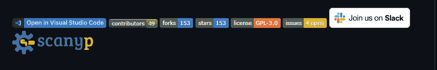

# 如何为你的 GitHub 项目写一个好的自述文件

> 原文：<https://www.freecodecamp.org/news/how-to-write-a-good-readme-file/>

当我第一次接触 GitHub 时，我不知道它是什么，也不知道它能做什么。在你我之间，我创建了这个帐户，因为我被告知每个开发人员都应该有一个用来发布代码的帐户。

作为一个初学者，我在很长一段时间里没有用我的账户做任何事情。但是后来，由于我对技术的热情，我开始跟踪其他开发者，查看他们在 GitHub 上的工作。我注意到他们有一些共同点:他们都有很酷的项目，都为开源做贡献，但是他们的项目也有详细的自述文件。

所以我对自述文件的兴趣越来越大，我决定尝试在我的项目中也添加一个。我不会说谎——我是在不知道该如何做的情况下匆忙做的。老实说，一点也不好。点击查看[。](https://github.com/larymak/ToDo-list-App/tree/v1.0)

这种情况持续了一段时间。但是通过实践和不断的学习，我能够修改一些更好的文档，比如 [THIS](https://github.com/larymak/Python-project-Scripts) ，这提高了项目的参与度，并帮助其他开发人员参与进来。

同样重要的是要注意，一个好的 README 将帮助你在一大群把工作放在 GitHub 上的开发者中脱颖而出。

在本文中，我们将了解更多关于什么是自述文件以及如何编写自述文件。首先让我们了解一下自述文件的含义。

## 什么是自述文件？

简而言之，我们可以将自述文件描述为一个指南，为用户提供您所从事项目的详细描述。

它也可以被描述为指导如何使用项目的文档。通常它会有关于如何安装和运行项目的说明。

作为开发人员，了解如何通过编写自述文件来记录项目是非常重要的，因为:

*   这是人们在遇到你的项目时看到的第一个文件，所以它应该相当简短但详细。
*   这会让你的项目从众多项目中脱颖而出。也要确保你的项目是好的。
*   它将帮助你关注你的项目需要交付什么以及如何交付。
*   它会提高你的写作技巧，正如弗里德里希·尼采所说:

> 一个好作家不仅拥有自己的精神，也拥有朋友的精神。

在进行项目时，请记住，您需要其他开发人员来理解您的代码及其功能。所以给它配上一本额外的指南会很有帮助。

例如，我之前分享的我的第一个项目没有一个好的自述文件。尽管这个项目很神奇，但对于初学者来说，很难理解他们克隆我的回购协议时到底期望什么。谁知道这可能是一种编码病毒。

在 GitHub 上有这样一个项目，无论它有多神奇，如果没有一个好的自述文件，其他开发人员都不会急于完成它并试图弄清楚它。

现在，看看这个[项目](https://github.com/larymak/Html-Css-Recap)。在这里，你能够了解项目做什么，它需要什么，以及如果你需要使用或想要为项目做贡献，如何开始。

你看，这就是一个写得很好的自述文件的强大之处，以及它如何改变你的项目。

那么，让我们也开始为你写一个吧。

## 如何写好自述文件——一步一步的指南

需要注意的一件非常重要的事情是，没有一种正确的方法来构建一个好的自述文件。但是有一个非常错误的方法，那就是根本不包含自述文件。

通过研究和学习各种自述文件，我发现了一些最佳实践。这就是我将要分享的。正如我经常告诉自己的:

> 每天都是学习的一天。

因此，随着你在职业生涯中的进步和发展，你会形成自己的想法，知道什么是好的自述文件，以及如何改进它。也许你甚至会想出自己独特的指南。

在我们开始之前，同样重要的是要注意，当你在写项目的自述文件时，它应该能够回答项目的**什么**、**为什么**以及**如何**。

这里有一些指导性的问题可以帮助你:

*   你的动机是什么？
*   你为什么要建这个项目？
*   它解决什么问题？
*   你学到了什么？
*   是什么让你的项目脱颖而出？如果你的项目有很多特性，考虑添加一个“特性”部分，并在这里列出它们。

## 自述文件中应包含哪些内容

### 1.项目标题

这是项目的名称。它用一句话描述了整个项目，帮助人们理解项目的主要目标和目的是什么。

### 2.项目描述

这是项目的一个重要组成部分，许多新开发人员经常会忽略这一点。

你的描述是你的项目的一个极其重要的方面。一个精心制作的描述可以让你向其他开发者和潜在雇主炫耀你的工作。

自述文件描述的质量通常可以区分好项目和坏项目。好的人会利用机会解释和展示:

*   你的应用程序做什么，
*   为什么你使用你所使用的技术，
*   您面临的一些挑战以及您希望在未来实现的功能。

### 3.目录(可选)

如果您的自述文件很长，您可能需要添加一个目录，以便用户能够轻松导航到不同的部分。这将使读者更容易轻松地在项目中四处走动。

### 4.如何安装和运行项目

如果你正在做一个项目，用户需要在一个像 POS 这样的机器上本地安装或运行，你应该包括安装你的项目所需要的步骤，如果有的话，还应该包括需要的依赖项。

提供如何设置和运行开发环境的分步描述。

### 5.如何使用项目

提供说明和示例，以便用户/贡献者可以使用该项目。这将使他们在遇到问题时变得容易——他们总是有一个地方可以参考预期的内容。

你也可以利用视觉辅助，包括截图等材料来展示运行项目的例子，以及项目中使用的结构和设计原则。

此外，如果您的项目需要密码或用户名等身份验证，这是一个包含凭据的好部分。

### 6.包括学分

如果你以团队或组织的形式参与项目，列出你的合作者/团队成员。你还应该包括他们的 GitHub 个人资料和社交媒体的链接。

此外，如果您学习了教程或参考了某些可能有助于用户构建特定项目的资料，也可以在这里包含这些内容的链接。

这只是一种表达你的欣赏的方式，同时也帮助其他人得到项目的第一手拷贝。

### 7.添加许可证

对于大多数自述文件，这通常被认为是最后一部分。它让其他开发人员知道他们能做什么，不能做什么。

我们有不同类型的许可证，这取决于你所从事的项目类型。取决于你将选择哪一个，它将决定你的项目得到的贡献。

最常见的是 GPL 许可，它允许其他人修改你的代码并将其用于商业目的。如果你需要选择许可证的帮助，请点击此链接:[https://choosealicense.com/](https://choosealicense.com/)

到目前为止，我们已经介绍了一个好的自述文件的最低要求。但是你也可以考虑增加下面的部分，让它更吸引眼球，更有互动性。

## 其他自述部分

### 8.徽章

徽章不是必须的，但是使用它们是让其他开发者知道你知道你在做什么的一种简单方式。

拥有这个部分也有助于链接到重要的工具，还可以显示一些关于你的项目的简单统计数据，如分叉、贡献者、开放问题等的数量...

下面是我的一个项目的截图，展示了如何使用徽章:

这个部分的好处是它可以自动更新。

不知道从哪里得到它们？查看由 [shields.io](https://shields.io/) 主办的徽章。他们有大量的徽章来帮助你开始。你现在可能不明白它们代表了什么，但你迟早会明白的。

### 9.如何为项目做贡献

如果您正在开发一个需要其他开发人员参与的开源项目，这将非常有用。你需要添加一些指导方针，让他们知道如何为你的项目做出贡献。

同样重要的是，要确保你为开源项目选择的许可证是正确的，以避免未来的冲突。而添加投稿指南会起到很大的作用。

一些最常见的指南包括[贡献者契约](https://www.contributor-covenant.org/)和[贡献者指南](https://docs.github.com/en/communities/setting-up-your-project-for-healthy-contributions/setting-guidelines-for-repository-contributors)。当你为你的项目设定规则时，Thes 文档会给你所需要的帮助。

### 10.包括测试

多做一点，为你的应用程序编写测试。然后提供代码示例以及如何运行它们。

这将有助于表明你确信并且有信心你的项目将会顺利进行，这也会给其他人带来信心

### 额外加分

当你写自述文件时，有几点需要特别注意:

*   保持最新——确保你的文件总是最新的是一个很好的练习。如果有变化，请确保在必要的地方更新文件。
*   选择一种语言——我们都来自不同的地区，说着不同的语言。但是这并不意味着你需要把你的代码翻译成方言。用英语写自述文件是可行的，因为英语是一种全球通用的语言。如果您的目标受众不熟悉英语，您可能需要使用翻译工具。

## 包裹

现在，您已经拥有了改进自述文件所需的一切，甚至可以开始编写第一个自述文件了。

在这一点上，我相信你可以为你的下一个项目，甚至是现有的项目添加一个互动的信息指南，让你的项目脱颖而出。

有许多工具也可以用来为您的项目自动生成一个自述文件，但是在转向自动化之前自己尝试一下总是一个好的做法。如果你想看看，它们包括:

*   [做一个自述](https://www.makeareadme.com/)
*   [自述文件生成器](https://rahuldkjain.github.io/gh-profile-readme-generator/)
*   [自述](https://github.com/kefranabg/readme-md-generator)

如果你已经读到这里，我真的很感激。如果您喜欢这篇文章，并认为它很有帮助，请分享它，这样您就可以帮助其他开发人员改进他们的项目。

我很想看看你新制作的自述文件。请务必通过以下任何链接与我分享链接:

在[Twitter](https://twitter.com/larymak1)|[YouTube](https://www.youtube.com/channel/UCrT1ARRZfLOuf6nc_97eXEg)|[LinkedIn](https://www.linkedin.com/in/hillary-nyakundi-3a64b11ab/)|[GitHub](https://github.com/larymak)与我联系

请分享您的宝贵意见，感谢您的真诚反馈！

享受编码❤