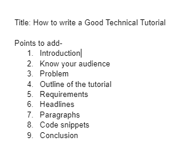

# 如何写好技术教程

> 原文：<https://www.freecodecamp.org/news/how-to-write-a-good-technical-tutorial/>

如果你是一名软件开发人员，那么你应该知道当你编码时，你搜索谷歌来帮助你解决具体问题的频率。

每个开发人员都会查看在线教程来解决他们遇到的问题。为了帮助你解决问题，这些教程应该有一些对你和其他读者更有价值的东西。

在撰写一篇好的技术教程时，你需要记住以下几点。

## 了解你的受众

理解你为哪些读者写作是很重要的。你需要决定在文章中包括什么和省略什么。

你不想让读者中途离开你的教程。有时你需要包括必要的信息，而不是写下所有的信息。

看看这篇关于[如何在 HTML](https://www.freecodecamp.org/news/html-background-color-change-bg-color-tutorial/) 中改变背景色的文章，读者想知道在 HTML 中改变背景色的方法有哪些。

作者直接包括了不同的方法，而不是从“什么是 HTML 和 CSS”开始。

也要记住你是为初学者还是更高级的学习者写作——并努力弄清楚这一点(无论是在先决条件部分还是仅仅说明你为谁写了教程)。这将有助于确定你如何解释事情，你假设多少背景知识，等等。

## 做一个提纲

在开始写教程之前，先勾勒出你要写的东西。

以我现在写的这篇文章为例。作为开始，我写下了不同的步骤来解释如何写一篇好的教程。

这个过程可以帮助你给文章一个有意义的结构，你将能够解释具体的步骤，而不仅仅是写下你想到的任何事情。

看看我写这篇文章的提纲:



Outline that I've made for this article

一旦你知道你要写什么，它会让你更容易坚持下去，涵盖所有必要的要点。

## 陈述你正在解决的问题

读者在教程中寻找的第一件事是教程将为他们解决或回答什么。这有助于他们确定是否在看正确的文章。

为了确保你的读者会进一步阅读，告诉他们你正在解决什么问题，描述教程的目的，它提供了什么价值，以及它将如何使他们受益。

你可以在简介中直接告诉你的读者，教程实际上是做什么的，或者讲些什么。

看看这篇文章的介绍:当我说，“在编写一个好的技术教程时，有几件事你需要记住”，我是在给你一个我们将讨论什么和你将学到什么的想法。

## 包括读者需要遵循教程的先决条件

您应该告诉读者您将在本教程中使用哪些工具、服务和资源。

你不希望你的读者没有完成教程就离开。如果他们在教程中得知您正在使用其他工具或他们不熟悉的东西，他们会感到沮丧。

只要列出你要用的东西，以及它是免费的还是付费的。这将帮助你的读者在开始阅读教程之前做好准备。

## 使用标题和小段落

使用标题将文章的不同部分按主题分开。这样，每次读者看到一个新的标题，他们就会对接下来的内容有更好的了解。

如果你正在浏览一份清单，那么试着用一个标题或副标题来呈现清单中的每一个元素，然后用小段落来简要解释。

使用标题也将有助于你的搜索引擎优化，并且教程看起来更像样，更容易理解。

## 提供代码片段

在技术教程中提供代码片段总是很有帮助的。

这将让你的读者知道你在做什么，你想用这段代码实现什么。

此外，将代码分解成更小的部分，这样更容易解释(而不是一次解释所有代码)。

使用注释来描述为什么在那里使用了特定的代码。此外，适当地格式化代码会使它更容易理解。

这里有一个例子:

```
# The comment below describes what the program does.
# This program prints Hello, world!

print('Hello, world!') 
```

Use Code Snippets like this.

## 包扎

我希望这些信息能帮助你写出清晰而有帮助的技术教程。遵循这些步骤，你将能够为你的读者提供更多的价值。

感谢您的阅读！