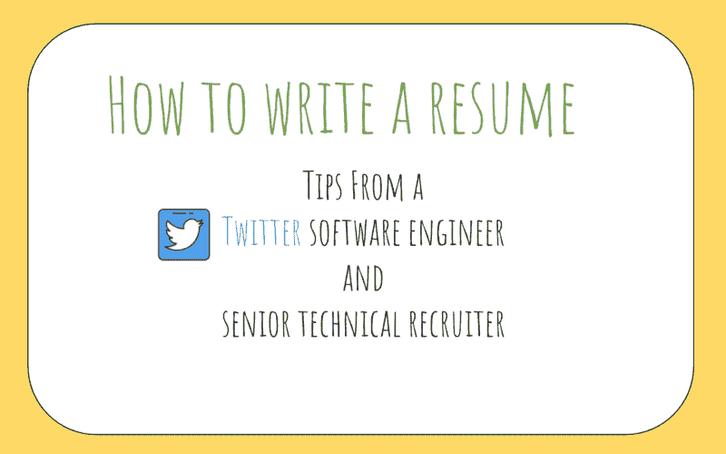
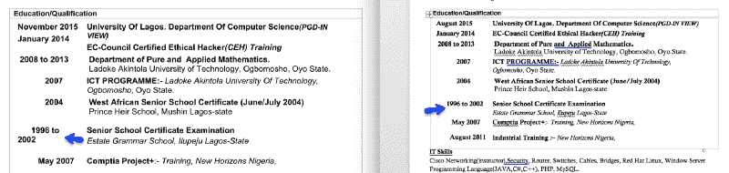

# 如何为软件工程师写一份出色的简历

> 原文：<https://www.freecodecamp.org/news/how-to-write-a-great-resume-for-software-engineers-75d514dd8322/>

作者:阿智·华创

# 如何写一份优秀的开发人员简历并展示你的软件工程技能

对于那些刚开始找工作的人来说，如果你对如何准备一份出色的简历有疑问，那么这篇文章就是为你准备的。

我最近写了一篇文章,讲述了我是如何准备工作面试并最终在 Twitter 上找到我梦想中的工作的。许多人(超过 400 人)想了解更多信息，其中大多数人想知道如何写一份出色的简历。

这篇文章是我和 Twitter 的高级技术招聘人员克里斯汀·西蒙斯一起收集的建议和技巧。在我的招聘过程中，我和她一起工作过，她是一个绝对的合作伙伴。

这篇文章的内容是:

*   简历中的待办事项
*   简历中的禁忌
*   额外提示
*   给新毕业生的建议
*   我推荐的工具/资源

**10/19/2018** :在这里阅读更多关于我的[课程](http://bit.ly/interviewcourses)了解我是如何准备的。
**2018 年 8 月 25 日**:阅读[这里](https://medium.freecodecamp.org/what-ive-learned-in-1-year-at-twitter-65150f5d4af2)是我在 Twitter 一年后的经历和学习。

### 这是怎么回事

我清楚地记得我必须写简历的那一天，我完全忘记了。我不知道从哪里开始。我不确定爱好是否应该包括在内，或者我作为零售助理的经历是否相关。换句话说，**我在写简历的时候迷失了。**

事实证明，简历写作既是一门艺术，也是一门科学，写一份简历可能会令人望而生畏。

需要说明的是，我不是一个有经验的招聘人员——我不知道招聘人员在筛选简历时会寻找什么。

我想分享一下我是如何学会准备自己的简历的，然后我向克里斯汀寻求帮助，她可以帮我填补我无法填补的空白。

以下是我们集体智慧的浓缩形式。

### 简历中的待办事项

简历应该简短明了，易于阅读。

这意味着:

*   **保持一致。**使用一致的字体(Arial/Times New Roman 也可以),为了可读性，不要超过**三种字体大小**
*   使用部分(使用四个主要部分:工作经历、教育、技能、项目)
*   在简历中使用关键词，并且要准确。招聘人员确实会在简历中寻找关键词(例如 *Java、Python、Hadoop、real-time* 都是关键词的例子)**。**
*   如果相关，可以列出社交媒体账户。 [GitHub](https://github.com/) 是流行的托管软件，所以可以列出来。Snapchat 就没那么多了。
*   解释你为什么适合这个职位。你可以写一封附加的求职信，或者在简历顶部做一个简短的总结。这些给招聘人员一个更强的信号，告诉他们你是谁，为什么你想申请。
*   **使用数字。**如果你帮助了一个网站，不要逐字逐句地写下来——在里面放一个**指标**。“我帮助网站从 10K 浏览量/天扩大到 10 万次/天。”
*   使用主动语态。使用动词，如“设计”、“实施”、“执行”、“驱动”和“计划”
*   **使用 PDF。**任何其他文件格式，如。docx，可能会导致您的简历呈现不同。
*   挑选两到三个你非常了解的项目。这些你应该从上到下，从前到后都知道。真正了解两到三个项目显示了奉献精神和推动事情的能力，这是任何公司都需要的两个理想品质。

考虑以下简历:

这份简历是用. docx 格式写的，很难保证格式正确。你只能听天由命，希望招聘人员不知何故安装了微软 Word 应用程序，并且能够正确阅读。

存成 PDF 就行了。这会省去你很多麻烦。

一份简短的简历大有帮助。原因在于，招聘人员，尤其是顶级公司的招聘人员，每天都会收到数百份(如果不是数千份的话)简历。想象一下，如果他们每天花 1 分钟在简历上，他们一天要看 300 份简历。也就是说，每天工作 300 分钟，即 5 个小时，每周工作 25 小时。

有一份简短的简历，这符合简历应该放在一页纸内的格言。这是一个**准则，而不是规则**T2。如果你是一名大学毕业生，没有太多的工作经验，那么就坚持这条经验法则。

### 简历中的禁忌

不要认为你的简历是你过去所做一切的倒序账簿。换句话说，用批判的眼光审视你的简历。

这意味着:

*   不要列出你高中以来的所有职位。一家科技公司不会对你在高中暑期从事的零售工作感兴趣。
*   不要量化你的技能水平。把你用过的技术放进去，不要给它们贴上“好”、“专家”等标签。
*   不要列出你听说过的每一个流行语。一些例子包括“大数据”、“实时”、“机器学习”、“docker”和“批处理流”。小心使用它们。你可能会被要求在面试中展示你对这些技术的了解。
*   在没有解释它的相关性之前，不要深入。大多数候选人都做过一些很酷的事情，但是他们没能让招聘人员明白这些事情是如何相关的。
*   **不要列举不相关的技能。**微软 Excel、Word 等是大多数人都知道的基本电脑技能，可以省去那些。

### 额外提示

这一部分将集中在一些我个人认为了解一下会有帮助的小事上。它帮助我在写简历的时候设定了正确的基调和心态。

#### 编造一个故事

简历是一个故事——你的故事。想象一下，你正带着一个人踏上讲故事的旅程，而这个故事是关于你自己的。

招聘人员/人事经理想知道你在你所在的领域是否聪明，你是否有发展潜力。简历中任何表明你聪明的东西都应该放在那里。

用一份简历作为画布，展示你最好的一面。在你的职业生涯中，有哪些亮点、挑战和障碍，这些如何让你成为一个好的候选人？简历应该尝试回答这些问题。

同样，与该职位相关的专利、出版物或发明也是简历中的重要内容。

在大多数情况下，如果你能证明为什么一项专利与你的申请相关，那就把它写进你的简历吧。把它想象成课外活动——它展示了你日常工作领域之外的激情、勇气和奉献精神。

#### 可读性优化

我认为理解这一点至关重要。一份简历不是对你所做工作的总结，而是一份深思熟虑、精心策划的旅程清单。

对你选择包括什么和不包括什么要有高度的选择性。每个要点都应该向招聘人员提供一个暗示或信号，告诉他们你是谁，以及为什么你非常适合。

我做过的一个很好的心理练习是，**如果我只有 60 秒的时间向某人推销他们为什么应该雇用我**，这个推销会是什么样的？

然后，我从那里开始向后工作，扩展我所做的事情，以便把我的推销带回家。

一个例子是:

“我是一名后端软件工程师，非常精通 RESTful 架构。我构建了高度可扩展的 web 应用，可扩展到超过数百万用户，并推动了公司的产品愿景。”

我想在这里强调的要点是:

*   后端工程师
*   宁静的建筑
*   可攀登的
*   产品愿景

然后，我会围绕这四大支柱整理我的简历。我过去做过的哪些事情显示了我对产品的热情、我作为后端工程师的技能、我围绕 RESTful 架构的设计经验，以及我可以展示哪些指标来证明产品是可伸缩的？

### 给新毕业生的建议

对于应届毕业生和从非科技职业转行的人来说，这是你应该关注的板块。

品牌重要吗？**是的，的确是**。你去的学校和你实习的公司是重要的因素。

一些公司倾向于从某些学校大量招聘人才——通常的嫌疑人，如斯坦福大学、麻省理工学院和华盛顿大学，在这里浮现出来——如果你去了这些顶尖的计算机科学学校之一，那么你已经比其他申请人占了上风。

然而，即使你没有上名校，也没有失去所有的希望。一个好的品牌是一个信号，但还有其他各种信号也很重要。

首先，如果你没有上过斯坦福大学，也没有在科技公司工作的经历，克里斯汀建议你提供一些细节，说明你目前的经历如何转化为与你申请的科技公司的契合度。

她经常看到求职者详细描述他们如何在夏季的零售岗位上努力工作，以及他们通过工作带来的价值。然而，候选人没有告诉招聘人员任何关于他们在科技公司发展的能力。

科技公司与零售职位有很大不同——这个话题我改天再说。招聘人员和招聘经理希望你说服他们为什么你会适合，为什么他们应该雇用你。

一个好的候选人会详细描述他们的零售经历，并且**也会将这些与他们申请的职位相关的** 联系起来。

如果你认为你没有机会，因为你从来没有与技术合作过，不要绝望。你的经验不是决定你是否合格的唯一因素。你的爱好或兴趣也可能是有用的信号。

如果你喜欢摆弄电子产品，喜欢焊接东西，或者在本质上表现出处理复杂技术的熟练程度，那么尽一切办法把它们写进你的简历。

在一天结束的时候，招聘人员想看看你的背景和这个职位有什么关系。每个人都截然不同，每个人都有不同的技能。

向招聘人员展示你的能力。适当地利用这 60 秒，给他们一个思考的理由，“嘿，这个人可能很合适。”

一旦你迈出了第一步，利用这个机会获得你梦想中的工作。为了阅读更多关于如何准备面试的信息，我写了一篇关于我如何准备工作面试并最终在 Twitter 上找到我梦想的工作的文章。

### 我推荐的工具

*   [破解编码面试](http://amzn.to/2Hj91OH)——这是一本很棒的关于一般编码的入门书，里面有一些简历写作技巧。我用它来准备我的简历初稿。
*   谷歌简历(Google resume )( T1)——非常棒的入门书籍，尤其是对刚毕业的学生来说。谈论选择专业/辅修专业，如何写简历，以及获得理想工作的逐步指南。
*   [编程面试的要素](http://amzn.to/2Dcs6Qd):非常适合更难的编码问题
*   OneNote :我用它来存储所有代码片段
*   Evernote :其他的
*   由一群前谷歌员工运营。这里的模拟面试质量如何？。面试官都是前谷歌员工。我强烈建议尝试一下。
*   CodePath:一个帮助人们为科技职业做准备的非营利组织。内森和蒂姆都是很棒的人，我从他们身上学到了很多。社区非常乐于助人，每个人都愿意伸出援手。
*   精细标记:把这些带到你的面试中。我强烈推荐他们！
*   点击此处订阅一份出色的简历样本和更多求职技巧。

**2018 年 7 月 15 日更新:**

我被所有为这篇文章向我致谢的人的爱和支持所感动。谢谢你，这对我意义重大，因为它激励我创造更多的内容，分享我作为软件工程师的想法和旅程。

许多人要求私人教练来帮助他们寻找职业——我已经决定推出我的 [**在线辅导课程**](https://docs.google.com/document/d/1ppHix7p9knzaal-Edn3GHQMcx1MM_USY6zPcsbBpR3U) 来帮助学生**准备和获得顶级科技公司的工作，准备让招聘人员惊叹的简历，面试中的软技能等等。**

如果你有兴趣加入，请在这里填写这张报名表。这是一门付费课程，每节课只有 5 名学生。