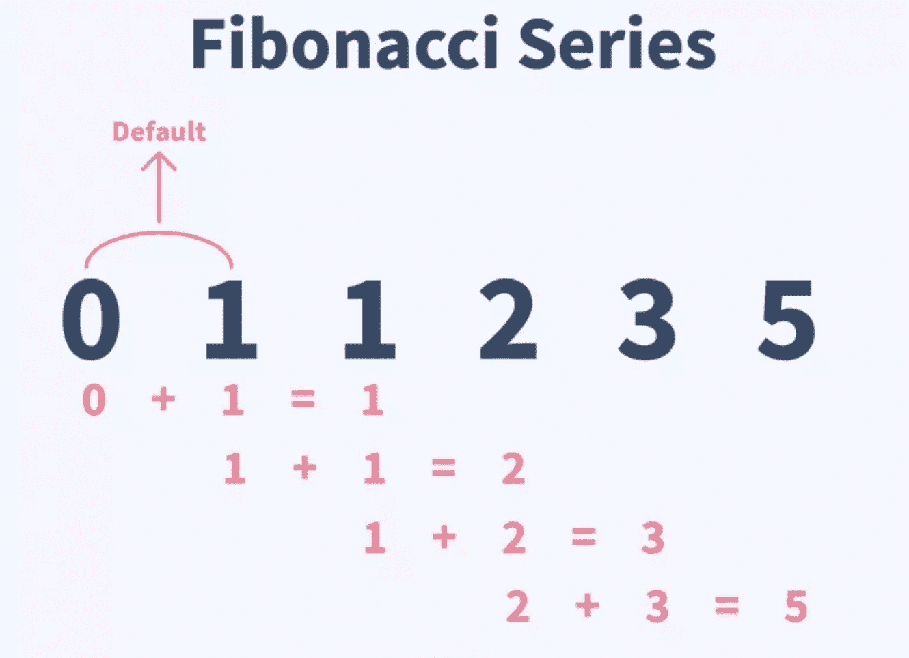
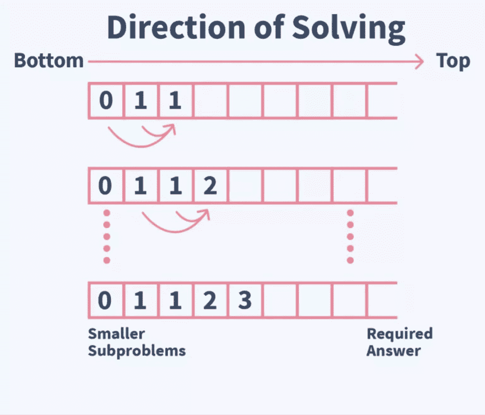

# 如何写一个 Java 程序得到斐波那契数列

> 原文：<https://www.freecodecamp.org/news/how-to-write-a-java-program-to-find-the-fibonacci-series/>

斐波那契数列是一种特殊的序列，以`0`和`1`开始，这两个数字之后的每个数字都是前面两个数字的和。

斐波那契数列是这样的:`0, 1, 1, 2, 3, 5, 8, 13, 21, …`以此类推。它首先在印度数学中被描述。



Source: [Scaler Topics](https://www.scaler.com/topics/fibonacci-series-in-java/)

斐波那契数列被用于许多领域，如金融和科技。你也可以在很多自然过程中看到。

Guy Murchie 的名言很好地解释了斐波那契数列在自然界中的重要性

> 斐波纳契数列被证明是理解自然如何设计的关键...并且是...这是无处不在的球体音乐的一部分，它将和谐融入原子、分子、晶体、外壳、太阳和星系，让宇宙歌唱。”― **盖·穆奇，生命的七大奥秘:科学与哲学的探索**

### 你知道这些事实吗？

*   斐波纳契数列中任意两个连续数字的比值约为 **1.6** 。例如: **21 / 13 = 1.61 和 55 / 34 = 1.61**
*   11 月 **23** 是斐波那契日，因为这一天的日期类似于 **mm / dd** 格式的斐波那契数列，因为它是 **(11/23)** 。

## 如何使用自上而下的方法计算斐波那契数列

在这种自顶向下的方法中，我们将所需索引的值计算为前两个索引的值之和。

如果前两个值不可用，我们也对它们重复相同的过程。

如果它们的值对我们来说也是不可用的，我们就重复同样的过程，直到我们得不到这两个值。这是一种理论驱动的方法。

我们在这里使用树类型的方法——我们只寻找前两个值，如果这些值对我们来说不可用，我们重复这个过程，直到我们得不到这两个值。

我们将复杂的算法分解成可以称为模块的小片段。我们可以将这些模块进一步分解成更小的片段，直到它们不能再被分割。


Source: [Scaler Topics](https://www.scaler.com/topics/fibonacci-series-in-java/)

### 自顶向下方法的算法

首先，您接受输入“n”来获得斐波纳契数列中相应的数字。

然后，将所需索引的值计算为前两个索引的值之和(即将`n-1`索引和`n-2`索引的值相加)。如果没有找到前两个索引的值，您将执行相同的操作来查找该索引的值。

无论何时获得前两个连续索引的值，都要将它们相加，并将结果作为下一个索引的值返回。

然后将`“n - 1”`索引和`”n - 2 ”`索引的值相加，并返回所需的值。

### 自顶向下方法的优势

*   调试项目变得更加高效。
*   实现代码变得更加容易。
*   这使得代码易于解决和管理。
*   由于独立的模块，测试过程变得更加容易。

### 自上而下方法的缺点

*   对其他模块的依赖性很高。一个模块的变化会影响所有其他模块。
*   由于递归的原因，与动态编程中自底向上的方法相比，这是一种较慢的方法。

## 如何使用自下而上的方法计算斐波那契数列

在这种自底向上的方法中，我们创建一个数组，并将前两个索引的值分别填充为`0`和`1`。

之后，我们使用这两个值计算所有索引的值，并将它们存储在一个数组中。

我们可以从任何索引中获取值，以获得斐波纳契数列中相应的数字。

**例如:**如果`fibNum`是一个[数组](https://www.freecodecamp.org/news/java-array-how-to-declare-and-initialize-an-array-in-java-example/#:~:text=What%20is%20an%20array%3F,your%20array%20should%20be%20strings.)存储斐波那契数列，那么我们插入:

```
fibNum[0]  = 0 ;  fibNum[1] = 1 ;
```

然后在一个带有指针变量 **i** 的迭代循环中，我们写道:

```
fibNum[i] = fibNum[ i - 1 ] + fibNum[ i - 2 ] ;
```



Source: [Scaler Topics](https://www.scaler.com/topics/)

### 自底向上方法的算法

首先，您接受输入`‘n’`来获得斐波那契数列中相应的数字。

然后您需要存储斐波那契数列的值，所以您为它声明了一个大小为`‘n’`的数组。

接下来，将前两个索引的值分别插入为`0`和`1`。

如上所述，对第三个和其他剩余的索引使用迭代循环。

最后，返回数组最后一个索引的值。

### 自下而上方法的优势

*   创建测试用例更容易。
*   你的代码是可重用的
*   由于数据封装和数据隐藏，冗余减少了。

### 自下而上方法的缺点

*   它有时会消耗额外的空间和时间。
*   有时候，很难理解在初级阶段工作。

## 如何编码斐波那契数列

在 Java 中，有多种方法可以编写程序来寻找斐波那契数列。

### 1.如何使用简单的迭代循环编码斐波那契数列

下面是如何使用 for 循环在 Java 中获得第 n 个斐波那契数代码:

```
import java.util.*;
public class fibonacci{
    public static void main(String args[]){
        int n,k;
        Scanner snr= new Scanner(System.in);
        n=snr.nextInt();
        snr.close();
        int array[]=new int[n];
        // The space used here is O(N)
        array[0]=0;
        array[1]=1;
        for(k=2;k<n;k++)array[k]=array[k-1]+array[k-2];
        // The array is traversed only once so time complexity is O(N)
        System.out.println("Nth number in Fibonacci series is "+array[n-1]);
    }
}
```

下面是如何使用 while 循环在 Java 中获得第 n 个斐波那契数代码:

```
import java.util.*;
public class fibonacci{
    public static void main(String args[]){
        int n,k;
        Scanner snr= new Scanner(System.in);
        n=snr.nextInt();
        snr.close();
        int array[]=new int[n];
        // The space used here is O(N)
        array[0]=0;
        array[1]=1;
        k=2;
        while(k<n)
            array[k]=array[k-1]+array[k-2];
            k++;
        System.out.println("Nth number in Fibonacci series is "+array[n-1]);
    }
    // The array is traversed only once so the time complexity is O(N)
}
```

#### 时间复杂度:

这种方法的时间复杂度是`O(N)`，这是线性时间复杂度，因为我们只遍历了一次数组。

#### 空间复杂性:

这种方法的空间复杂度是`O(N)`，这是线性空间复杂度，因为我们将子问题的答案存储在一个数组中。

### 2.如何使用递归编码斐波那契数列

现在我们将使用 Java 中的递归来完成斐波那契数列的算法。

在递归中，我们使用一个定义好的函数(假设在这段代码中是`fib`)来寻找斐波那契数。

在`main()`函数中，我们调用函数`fib()`来表示斐波那契数列中的第 n 个数字。

我们定义了这个递归调用的基本情况——即它分别为第 0 个和第 1 个斐波那契数列返回`0`和`1`。

我们将像`fib( x ) = fib( x-1 ) + fib( x-2)`一样调用函数本身，直到它遇到基本情况，然后我们将从那里获得值。

### 如何用递归在 Java 中得到第 n 个斐波那契数代码

```
import java.util.*;
public class fibonacci{
    public static void main(String args[]){
        int n;
        Scanner snr= new Scanner(System.in);
        n=snr.nextInt();
        snr.close();
        System.out.println(fib(n)); 
//Printing number in Fibonacci series
    }
    public static int fib(int n){
        if(n==0){
            return 0;
        }
        // Base cases return itself 0 and 1
        else if(n==1){
            return 1;
        }
        else{
            return fib(n-1)+fib(n-2);
            // Recursive calls
        }
    }
}
```

#### 时间复杂度:

这种方法的时间复杂度是`O( 2 ^ N )` ，这是指数时间复杂度，其中 n 是第 n 个斐波那契数的指数。

为了得到每个值，我们需要找到前两个值。为此，我们为每个值调用函数两次，树最多可以有`n`层。

这使得树中围绕着`2 ^ n`节点。

#### 空间复杂性:

使用[递归](https://www.freecodecamp.org/news/understanding-recursion-in-programming/)的方法的空间复杂度是`O( 2 ^ N )`，这是指数空间复杂度，其中 n 是第**个**斐波那契数的指数。

因为我们需要存储每个节点的值，并且我们有`2 ^ N`个节点，所以我们需要的总空间是`2 ^ N`。

### 3.如何使用递归和记忆来编码斐波那契数列

记忆化意味着我们不断存储子问题的所有解，这样我们就可以在程序中任何需要的地方直接检索和使用这些值。这可以为我们节省时间和空间。

### Java 递归实现斐波那契数列的算法

这里我们定义一个函数(我们使用的是`fib()`)并用它来寻找我们想要的斐波那契数。

我们声明一个足够长的全局数组来存储所有计算过的斐波纳契数。

在`main()`函数中，我们为第 n 个数调用函数`fib()`。然后，我们为递归调用设置基本情况，并分别为第 0 个和第 1 个索引返回`0`和`1`。

我们称所有的`x > 2`为`fib(x) = fib( x-1 ) + fib( x-2 )`。对于计算出的每个值，我们都将其存储在全局数组中。

每个斐波纳契数的值存储在全局索引的相应索引中。然后我们可以检索它们并用于以后的目的。这大大提高了时间复杂度。

### 如何用递归和记忆的方法在 Java 中得到第 n 个斐波那契数

```
import java.util.*;
public class fibonacci{
    public static int fib(int n){
        if(n==1){
            return array[0];
        }
        // base cases
        if(n==2){
            return array[1];
        }
        else{
            array[n-1] = fib(n-1) + fib(n-2);
            return (array [n-1]);
        }
    }
    public static void main(String args[]){
        int n;
        Scanner snr= new Scanner(System.in);
        n=snr.nextInt();
        snr.close();
        array[0]=0;
        array[1]=1;
        System.out.println(fib(n));
        // printing number in fibonacci series
    }
    static int array[]=new int[1000];
    // Declaring global array large enough
 }
```

#### 时间复杂度:

这种方法的时间复杂度是线性时间复杂度`O(  N )`，其中`n`是第**个**斐波纳契数的索引。

我们需要找到前两个值来获取每个值——但是这里我们已经将它们存储在一个数组中，所以我们只需要对所有元素调用一次函数。

#### 空间复杂性:

这种方法的空间复杂度是线性空间复杂度`O( N )`，其中`n`是第**个**斐波纳契数的索引。

我们只需要存储每个节点的值，我们只有 **N** 个节点。

## 结论

在本文中，我们学习了如何用四种不同的方法在 Java 中寻找斐波那契数列，自底向上和自顶向下各两种方法。

我们还了解到，记忆化递归是获得斐波那契数的最省时、省空间的方法。

在本文中，我们讨论了每种方法的空间和时间复杂性，以及它们的算法、优点和缺点。

快乐学习编码！