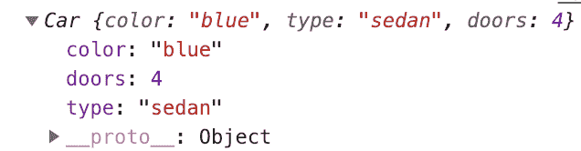
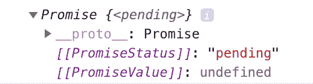
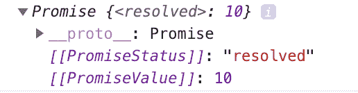
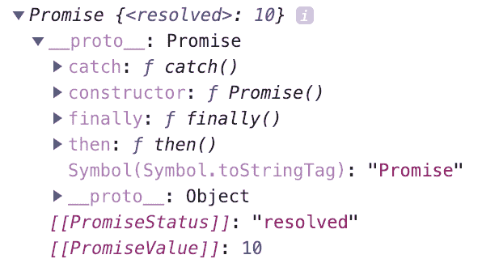
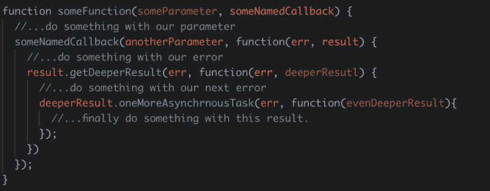
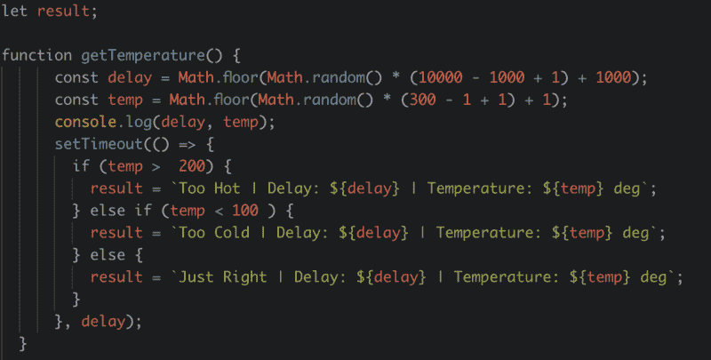

# 如何写一个 JavaScript 承诺

> 原文：<https://www.freecodecamp.org/news/how-to-write-a-javascript-promise-4ed8d44292b8/>

### 什么是承诺？

JavaScript promise 是表示异步任务的完成或失败及其结果值的对象。

结束了。

我当然是在开玩笑。那么，这个定义到底意味着什么呢？

首先，JavaScript 里很多东西都是对象。可以用几种不同的方法创建对象。最常见的方法是使用对象文字语法:

```
const myCar = {
   color: 'blue',
   type: 'sedan',
   doors: '4',
};
```

您还可以创建一个`class`并用`new`关键字实例化它。

```
class Car {
   constructor(color, type, doors) {
      this.color = color;
      this.type = type;
      this.doors = doors
   }
}

const myCar = new Car('blue', 'sedan', '4');
```

`console.log(myCar);`



承诺只是我们创造的一个对象，就像后面的例子一样。我们用关键字`new`实例化它。我们没有传入制作汽车的三个参数(颜色、类型和门)，而是传入一个带有两个参数的函数:`resolve`和`reject`。

最终，承诺告诉我们一些关于我们返回的异步函数的完成情况——不管它是否成功。我们说函数成功是因为承诺*解决了*，不成功是因为承诺*被拒绝。*

```
const myPromise = new Promise(function(resolve, reject) {});
```

`console.log(myPromise);`



Notice the promise is “pending.”

```
const myPromise = new Promise(function(resolve, reject) {
   resolve(10);
});
```



Notice we resolved the promise with the value 10.

看，不太可怕——只是我们创造的一个物体。如果我们把它展开一点:



Notice we have some methods we have access to namely “then” and “catch”

此外，我们可以传递任何我们想要解决和拒绝的问题。例如，我们可以传递一个对象而不是一个字符串:

```
return new Promise((resolve, reject) => {
   if(somethingSuccesfulHappened) {
      const successObject = {
         msg: 'Success',
         data,//...some data we got back
      }
      resolve(successObject); 
   } else {
      const errorObject = {
         msg: 'An error occured',
         error, //...some error we got back
      }
      reject(errorObject);
   }
});
```

或者，正如我们前面看到的，我们不必传递任何东西:

```
return new Promise((resolve, reject) => {
   if(somethingSuccesfulHappend) {
      resolve()
   } else {
      reject();
   }
});
```

#### 定义中的“异步”部分呢？

JavaScript 是单线程的。这意味着它一次只能运行一件事。如果你能想象一条道路，你可以把 JavaScript 想象成一条单车道高速公路。某些代码(异步代码)可以滑到肩部，让其他代码通过。当异步编码完成时，它返回到道路。

> 顺便提一下，我们可以从任何一个函数返回一个承诺。不一定是异步的。也就是说，承诺通常在返回的函数是异步的情况下返回。例如，一个具有将数据保存到服务器的方法的 API 将是一个很好的返回承诺的候选者！

**外卖:**

承诺为我们提供了一种方法来等待异步代码完成，从中获取一些值，并将这些值传递给程序的其他部分。

我这里有一篇文章深入探讨了这些概念:[抛出一个循环:理解 JavaScript 中的循环和超时。](https://www.freecodecamp.org/news/thrown-for-a-loop-understanding-for-loops-and-timeouts-in-javascript-558d8255d8a4/)

### 我们如何使用承诺？

使用承诺也被称为*消费*承诺。在上面的例子中，我们的函数返回一个 promise 对象。这允许我们在函数中使用方法链接。

下面是一个方法链接的例子，我敢打赌你已经见过了:

```
const a = 'Some awesome string';
const b = a.toUpperCase().replace('ST', '').toLowerCase();

console.log(b); // some awesome ring
```

现在，回忆我们(假装)的承诺:

```
const somethingWasSuccesful = true;

function someAsynFunction() {
   return new Promise((resolve, reject){
      if (somethingWasSuccesful) {
         resolve();     
      } else {
         reject()
      }
   });
}
```

并且，通过使用方法链接来消费我们的承诺:

```
someAsyncFunction
   .then(runAFunctionIfItResolved(withTheResolvedValue))
   .catch(orARunAfunctionIfItRejected(withTheRejectedValue));
```

### (更)真实的例子。

假设您有一个从数据库获取用户的函数。我在 Codepen 上编写了一个示例函数，模拟您可能会使用的 API。它提供了两个访问结果的选项。一，你可以提供一个回调函数，在那里你可以访问用户或任何错误。第二，函数返回一个承诺作为访问用户或错误的方式。

[https://codepen.io/brandonwoz/embed/preview/NoNMgJ?height=300&slug-hash=NoNMgJ&default-tabs=js,result&host=https://codepen.io](https://codepen.io/brandonwoz/embed/preview/NoNMgJ?height=300&slug-hash=NoNMgJ&default-tabs=js,result&host=https://codepen.io)

传统上，我们会通过使用回调来访问异步代码的结果。

```
rr someDatabaseThing(maybeAnID, function(err, result)) {
   //...Once we get back the thing from the database...
   if(err) {
      doSomethingWithTheError(error)
   }   else {
      doSomethingWithResults(results);
   }
}
```

回调的使用是 *ok* 的，直到它们变得过度嵌套。换句话说，对于每个新的结果，您必须运行更多的异步代码。回调中的这种回调模式会导致所谓的“回调地狱”



The beginnings of callback hell

承诺为我们提供了一种更优雅、可读性更强的方式来查看我们程序的流程。

```
doSomething()
   .then(doSomethingElse) // and if you wouldn't mind
   .catch(anyErrorsPlease);
```

### 书写我们自己的承诺:金发姑娘、三只熊和一台超级计算机

想象你发现了一碗汤。你想在喝汤之前知道汤的温度。你没有温度计了，但幸运的是，你可以使用一台超级计算机来告诉你这碗汤的温度。不幸的是，这台超级计算机可能需要 10 秒钟才能得到结果。



这里有一些需要注意的事情。

1.  我们初始化一个名为`result`的全局变量。
2.  我们用`Math.random()`和`setTimeout()`来模拟网络延迟的持续时间。
3.  我们用`Math.random()`模拟一个温度。
4.  我们通过添加一些额外的“数学”将延迟和温度值限制在一个范围内。`temp`的范围是 1 到 300，`delay`的范围是 1000 毫秒到 10000 毫秒(1 秒到 10 秒)。
5.  我们记录了延迟和温度，这样我们就可以知道这个函数需要多长时间，以及完成后我们期望看到的结果。

运行函数并记录结果。

```
getTemperature(); 
console.log(results); // undefined
```

#### 温度不确定。发生了什么事？

运行该功能需要一定的时间。延迟结束后才设置变量。所以当我们运行这个函数时，`setTimeout`是异步的。`setTimeout`中的代码部分移出主线程，进入等待区。

*我这里有一篇文章深入探讨了这个过程:[抛出一个循环:理解 JavaScript 中的循环和超时。](https://www.freecodecamp.org/news/thrown-for-a-loop-understanding-for-loops-and-timeouts-in-javascript-558d8255d8a4/)*

因为我们的函数中设置变量`result`的部分移动到一个保持区，直到它完成，我们的解析器可以自由地移动到下一行。在我们的例子中，它是我们的`console.log()`。在这一点上，`result`仍然是不确定的，因为我们的`setTimeout`还没有结束。

那么我们还能尝试什么呢？我们可以运行`getTemperature()`然后等待 11 秒(因为我们的最大延迟是 10 秒),然后*然后*控制台记录结果。

```
getTemperature();
   setTimeout(() => {
      console.log(result); 
   }, 11000);

// Too Hot | Delay: 3323 | Temperature: 209 deg
```

这是可行的，但这种技术的问题是，尽管在我们的例子中我们知道最大网络延迟，但在现实生活中，它可能偶尔会超过 10 秒。而且，即使我们能保证十秒钟的最大延迟，如果结果准备得更早，我们就是在浪费时间。

### 对救援的承诺

我们将重构我们的`getTemperature()`函数来返回一个承诺。我们不会设定结果，而是拒绝承诺，除非结果“刚刚好”，在这种情况下，我们会解决承诺。在这两种情况下，我们都将传递一些值给 resolve 和 reject。


我们现在可以使用我们正在返回的承诺的结果(也称为*消费*承诺)。

```
getTemperature()
   .then(result => console.log(result))
   .catch(error => console.log(error));

// Reject: Too Cold | Delay: 7880 | Temperature: 43 deg
```

`.then`将在我们的承诺兑现时被调用，并将返回我们传递给`resolve`的任何信息。

当我们的承诺被拒绝时，`.catch`将被调用，并将返回我们传递给`reject`的任何信息。

最有可能的是，你消耗的承诺比创造的多。无论哪种情况，它们都有助于使我们的代码更加优雅、易读和高效。

### 摘要

1.  承诺是包含一些异步代码的完成信息和我们想要传入的任何结果值的对象。
2.  为了回报承诺，我们用`return new Promise((resolve, reject)=> {})`
3.  为了消费一个承诺，我们使用`.then`从一个已经解决的承诺中获取信息，使用`.catch`从一个已经拒绝的承诺中获取信息。
4.  你可能用(消费)的承诺比你写的要多。

#### 参考

1.)[*https://developer . Mozilla . org/en-US/docs/Web/JavaScript/Reference/Global _ Objects/Promise*](https://developer.mozilla.org/en-US/docs/Web/JavaScript/Reference/Global_Objects/Promise)