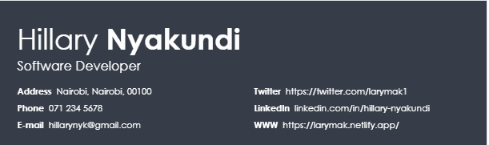
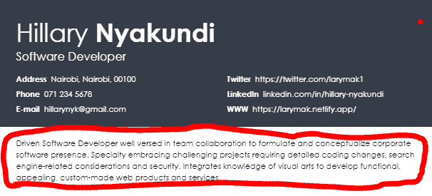
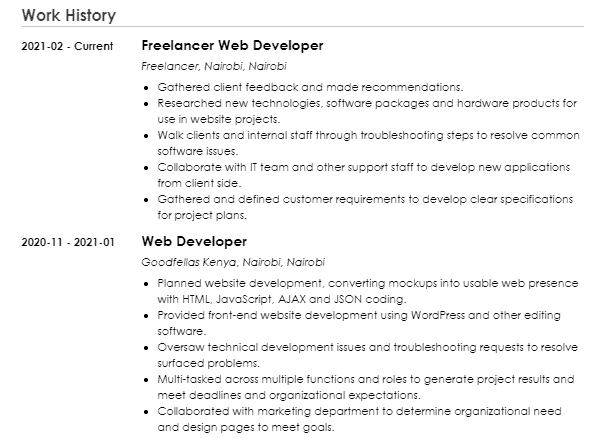
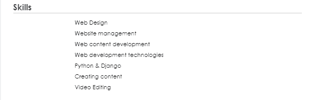
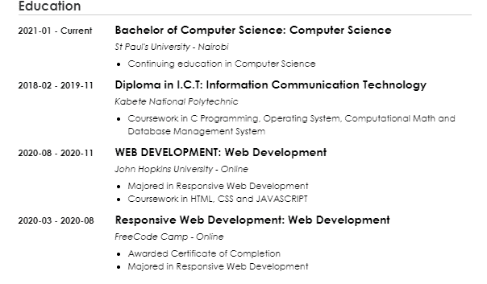

# 如何写简历——实用指南和简历示例

> 原文：<https://www.freecodecamp.org/news/how-to-write-a-resume-with-example/>

写简历可能有点吓人。让它变得真正好并填充每个细节的压力会令人厌倦和害怕。如果你是第一次做这件事，这一点尤其正确，因为你可能不知道该添加什么或遗漏什么。

在我们进入更多细节之前，让我分享一下我的经历。我申请了很多需要专业简历的工作。但一开始，我不知道如何写一个。

所以我会打开浏览器，在网上搜索简历制作人。提供这些服务的网站列表会显示出来，但是因为我只是一个人，所以我总是会选择标有免费的网站。我是说，谁不喜欢免费服务呢——因为我喜欢。

> 正如路德·范德鲁斯所说:“人生最美好的东西都是免费的。”

然后我会在网站上制作我的简历，使用令人惊叹的模板总是一种很好的体验——直到我到达下载点。然后他们总是要现金，尽管广告上说是免费的。

但是不要担心——写一份好的专业简历没必要这么难。事实上，这应该是容易和有趣的，因为你把你的成就写在纸上。

让简历写得流畅的最好方法是获得一些指导，告诉你应该包括什么，应该省略什么。这就是我们将在本文中讨论的内容。

我们将详细介绍撰写专业简历的步骤，这样当我们完成时，你就可以向全世界展示你新制作的简历了。你也会准备好申请你一直想要的理想工作。

我们开始吧

## 什么是简历？

简历是一份概述你的教育、工作经历、资历、成就和技能的文件。

你的简历可能是潜在雇主在考虑聘用你时要求和审查的第一份文件，随后是求职信。

在我们继续之前，先简单提醒一下，简历不同于履历。

### 简历的类型

大多数专业简历作者认为有三种不同类型的简历:功能型、时间型和组合型

*   功能性简历——这种类型的简历侧重于你做过什么，以及你从多个项目中获得的经验。

*   按时间顺序排列的简历——这是最常用的简历类型，它更侧重于你的工作经历。在这份简历中，你按时间倒序列出工作，从你最近的工作开始，回到最早的。

*   组合简历——顾名思义，这是功能型和时间型简历的组合。

## 如何写简历

你的简历不应该和别人的一样，因为我们都有不同的技能和经历。但是不管你选择使用什么样的模板，你的简历仍然应该包含以下几个部分和信息:

### 标题部分

在这一部分，您应该包括:

*   你的名字
*   电话号码
*   电子邮件地址
*   社交链接(社交媒体和个人网站/作品集/GitHub)
*   说明你是候选人的标题

所有这些信息让招聘人员很容易知道简历属于谁，以及他们如何联系到你。

### 职业摘要部分

这是简历开头的一小段，描述你是谁，你做什么，以及为什么你非常适合这份工作。

这一部分并不全是关于你想要什么，而是你的潜在雇主能从你身上得到什么。它可以创造或破坏你与招聘者的机会。

这里有一个例子，这样你就可以知道摘要可能是什么样子了:

### 工作经历部分

这是你简历中最重要的部分，在这里你可以详细描述你的工作经历。

这一部分应该包括你工作过的公司，你的雇佣期，你的职位和头衔，以及你取得的成就。你一定会想让这部分脱颖而出。

首先，你需要从最近(顶部)到最早(底部)列出你的经历。如果您目前在某家公司工作，请附上“[起始月份和年份-当前]”

在这一部分，我强烈建议用项目符号列出你在过去和现在公司的角色/职责。我认为 3-5 个要点是最理想的。

用动作动词来描述你的任务和成就，也要记得用过去式来写。

> 当列出你的职责时，包括每个角色可衡量的成就。这会让招聘人员对你的能力有信心。

#### 技能部分

随着招聘人员寻找具有专业背景的候选人，这一部分对他们来说变得越来越重要。

当列出你拥有的技能时，确保包括硬技能和软技能。

我说的硬技能是指与你的学习领域相关的技能，是你通过工作和学习获得的技能。软技能更加个人化，与你的性格相关，比如团队合作精神、正直、擅长团队合作、专注能力等等。

你需要平衡这两种技能，而不是只依赖其中一种。还记得在这里使用关键字，因为公司使用应用跟踪系统(ATS)来扫描你的简历，寻找理想的候选人。

Taleo 是招聘人员常用的自动测试系统，关于简历中的关键词，请查看[这个资源](https://www.jobscan.co/blog/top-resume-keywords-boost-resume/)

### 教育科

许多工作需要一定的教育水平。所以，如果你有一个学位，或者完成了一个训练营或者其他证书，把它写进你的简历是很重要的。

如果你刚刚毕业，那么你的学历部分应该在你的工作经验之上。你还应该包括相关的课程作业和其他志愿工作或项目，以支持你的申请。

但是你可能想知道——如果你没有接受过正规的高等教育会怎么样？在这种情况下，你应该包括什么？

你可以突出你在该领域学习和成长的不同方式，而不是列出一个学位。比如高中学历，你参加过的训练营，你完成/参与过的项目，甚至实习。如果你没有正式的学位，在这里列出它们。

### 奖项、认证和荣誉部分

如果你愿意，你可以把这一部分作为成就包括在你的工作经历中。但是我觉得在它自己的版块里突出它比较好。

这一部分会增加你的可信度，假设你有东西要列出来。您可以包括的一些认证如下:

*   营销认证
*   教育、编码训练营和 freeCodeCamp 认证
*   在线课程证书
*   您获得的奖励或资助

## 简历格式技巧

现在你已经完成了建立简历的第一步，你应该确保它的格式是正确的。

仔细检查以确保你没有遗漏任何东西。一份精心制作的简历会让招聘人员很容易浏览并获得他们需要的信息。

### 如何写简历

✔要诚实
✔使用易读的字体
✔使用简单的单词和动作动词
✔包括展示你技能的无薪实习机会
✔把你的简历限制在两页以内(如果你职业生涯刚开始，最多一页
✔根据你申请的职位写简历
✔校对你的简历
✔完成起草，然后开始编辑

### 如何不写简历

✔不要写你离开前一份工作的原因
✔不要写介绍信，而是说如果需要的话会提供介绍信
✔避免使用过多的要点
✔不要将你的简历保存为 PDF 格式，除非有人要求
✔不要使用不合适的电子邮件地址
✔避免写不必要的信息，比如你的年龄、体重等等。✔避免在简历中放入你的照片——让招聘者关注你的技能。

既然我们已经介绍了写一份专业简历需要做的事情，你可能真的想做一份了。

如果你仍然觉得自己制作简历很困难，不要担心——你并不孤单。

有一些简单的方法可以让你的简历看起来更好。您可以查看以下网站，但请记住，您需要付费:

### 简历生成器网站

下面列出的网站提供了不同格式的简历模板。如果你去看看他们，他们会提供如何轻松写简历的指导。

我不建议复制你在那里看到的一切，但你可以遵循他们的模板指南，并尝试创建自己的简历来匹配这些模板。

在决定使用哪种模板和设计制作简历时，请随意查看和尝试不同的模板和设计:

*   [Zetty 简历生成器](https://zety.com/)
*   摘要
*   [VisualCV](https://www.visualcv.com/)
*   [结果](https://resumup.com/)
*   [天才简历](https://resumegenius.com/)
*   摘要生成器
*   [简历烘焙](http://www.resumebaker.com/)
*   [增强](https://enhancv.com/)
*   [坎瓦](http://canva.com/)

## 结论

如果你真的想增加获得某份工作的机会，确保你写的简历适合每一份工作申请。

如果你有一份写得很好的简历，符合职位要求，并且包含了职位描述中的相关关键词，这将有助于你在招聘人员面前脱颖而出。

这篇文章很长，所以如果你已经读到这里，谢谢你！

在[Twitter](https://twitter.com/larymak1)|[Insta](https://www.instagram.com/nextgencoders/)|[YouTube](https://www.youtube.com/channel/UCrT1ARRZfLOuf6nc_97eXEg)|[LinkedIn](https://www.linkedin.com/in/hillary-nyakundi-3a64b11ab/)|[GitHub](https://github.com/larymak)与我联系

请分享您的宝贵意见，感谢您的真诚反馈！

享受编码❤