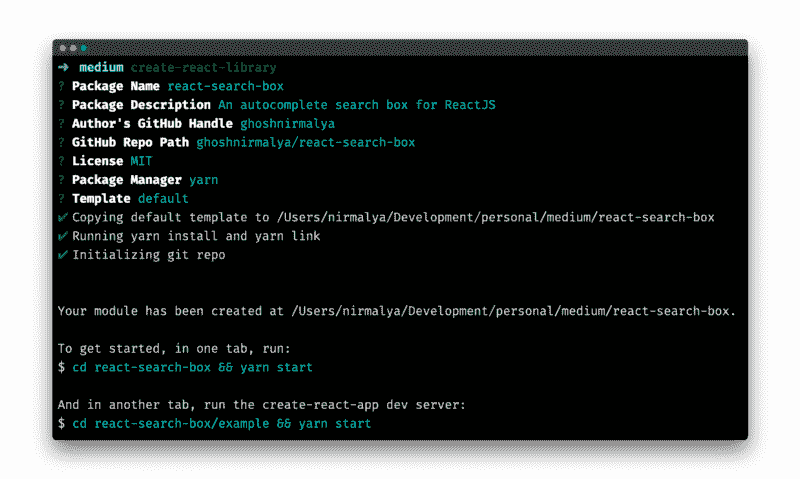
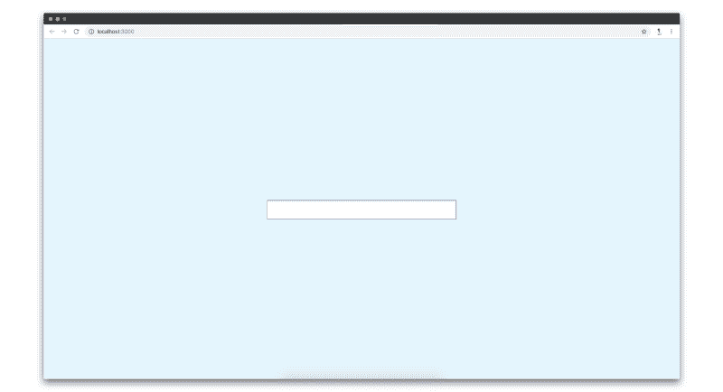
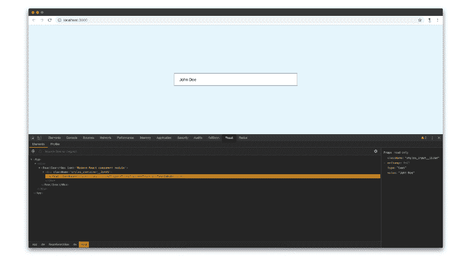
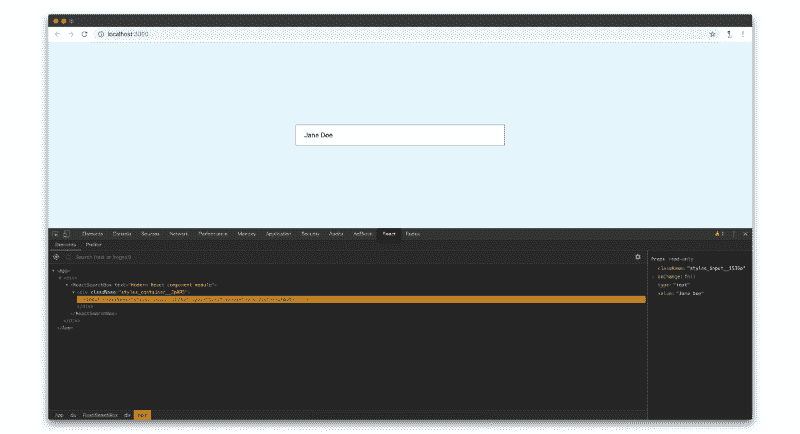
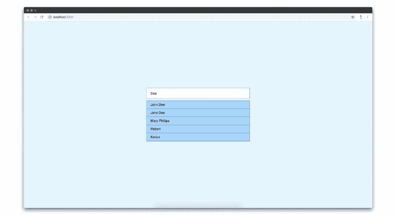
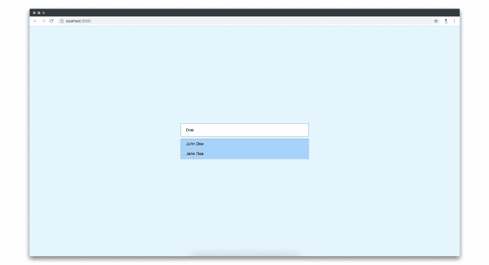
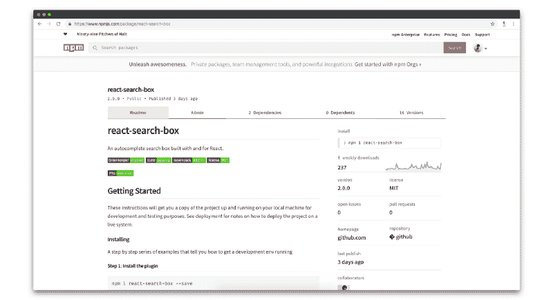
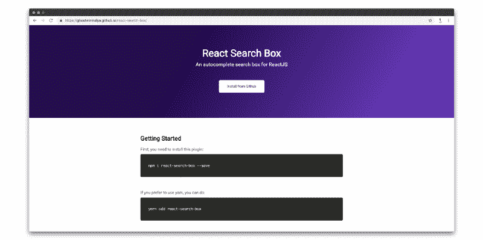

# 如何编写一个简单的 React 搜索插件，发布到 npm，部署到 Github 页面

> 原文：<https://www.freecodecamp.org/news/how-to-write-a-simple-react-search-plugin-publish-it-to-npm-and-deploy-it-to-github-pages-d8876dff7780/>

作者 Nirmalya Ghosh

在本文中，我们将在 [React](https://reactjs.org/) 中编写一个简单的搜索插件。通过这篇文章，我希望帮助开发人员理解如何使用 React 编写插件，将它们发布到 [npm](https://www.npmjs.com/) 并在 Github 页面上部署一个演示。

插件的源代码可以在 [Github](https://github.com/ghoshnirmalya/react-search-box) 上找到。

## 入门指南

我们将使用 [create-react-library](https://github.com/transitive-bullshit/create-react-library/) 引导我们的插件，这是一个用于轻松创建可重用 react 库的 CLI。这个 CLI 有一堆[特性](https://github.com/transitive-bullshit/create-react-library/#features)，将帮助我们为插件生成样板文件。

要使用 create-react-library，我们需要全局安装它:

```
npm install -g create-react-library
```

上面的命令将全局安装 create-react-library，我们可以从任何目录生成一个新模块。要生成新目录，请在要引导插件的目录中键入以下命令:

```
create-react-library
```

上面的命令会询问一些关于你的模块的基本提示，一旦你回答了它们，插件的样板文件就会生成。



Bootstrapping the project with [create-react-library](https://github.com/transitive-bullshit/create-react-library/)

现在，您需要运行插件(用于观察您对它所做的任何更改)和示例。在一个选项卡中，您可以运行:

```
cd react-search-box && yarn start
```

在另一个选项卡中，您需要运行示例应用程序:

```
cd react-search-box/example && yarn start
```

最后一个命令将运行一个 [create-react-app](https://facebook.github.io/create-react-app/) 项目，该项目导入您的插件。如果你对你的插件做了任何改变，这将会反映在示例应用中。你可以通过访问 [http://localhost:3000](http://localhost:3000/) 来查看你的插件的当前状态。


Initial state of the plugin after bootstrapping with [create-react-library](https://github.com/transitive-bullshit/create-react-library/)

## 设计输入框

让我们添加第一个基本功能:一个允许用户输入的输入框。

```
import React, { Component } from 'react'import PropTypes from 'prop-types'
```

```
import styles from './styles.css'
```

```
export default class ReactSearchBox extends Component {  static propTypes = {    /**     * value: The default value for the input box.     * placeholder: The placeholder text for the input box.     */    value: PropTypes.string,    placeholder: PropTypes.string  }
```

```
 state = {    value: ''  }
```

```
 componentDidMount() {    const { value } = this.props
```

```
 this.setState({      value: value    })  }
```

```
 handleInputChange = e => {    const { value } = e.target
```

```
 this.setState({      value: value    })  }
```

```
 inputNode = () => {    /**     * This function is responsible for rendering the input box.     * The input box acts as a source of entry for the data from the user.     */    const { placeholder } = this.props    const { value } = this.state
```

```
 return (      <input        className={styles.input}        type='text'        placeholder={placeholder}        value={value}        onChange={this.handleInputChange}      />    )  }
```

```
 render() {    return <div className={styles.container}>{this.inputNode()}</div>  }}
```

在上面的代码中，我们创建了一个输入元素，它有一个`className`属性、一个`type`属性、一个`placeholder`属性、一个`value`属性和一个`onChange`处理程序。这些大多是很基础的道具。唯一有趣的道具是`onChange`道具，每当用户在输入框中输入内容时就会被触发。

每当输入框中有变化时，我们就调用`handleInputChange`函数。`handleInputChange`函数获取事件作为参数。我们在这里使用了一个 [ES6 箭头函数](https://developer.mozilla.org/en-US/docs/Web/JavaScript/Reference/Functions/Arrow_functions)。所以，我们不需要将`this`与`handleInputChange`函数显式绑定。你可以阅读[我什么时候应该使用箭头功能与反应](https://frontarm.com/articles/when-to-use-arrow-functions/)由[詹姆斯 K 尼尔森](https://twitter.com/james_k_nelson)。

因为我们有一个作为属性传递给输入框的`value`状态，所以只要输入框中有变化，我们就通过`handleInputChange`函数更新这个`value`状态。

```
handleInputChange = e => {  const { value } = e.target
```

```
 this.setState({    value  })}
```

如果你访问 http://localhost:3000 ，你会在屏幕上看到一个输入框。您可以在输入框中输入，值将会更新。



Initial state of the input box

如果你检查 [React 开发者工具](https://chrome.google.com/webstore/detail/react-developer-tools/fmkadmapgofadopljbjfkapdkoienihi?hl=en)，你会看到输入框的值正在更新。



这就是我们需要的输入框的所有功能。接下来，我们将设计一个下拉菜单，当用户在输入框中输入的字符串与通过`data` prop 提供给我们插件的任何记录匹配时，这个下拉菜单就会出现。

## 设计下拉菜单

在本节中，我们将实现一个下拉菜单，它将显示一个记录数组，该数组与用户在输入框中键入的字符串相匹配。记录的初始数组将使用我们将首先实现的`data` prop 来提供。

```
import React, { Component } from "react";import ReactSearchBox from "react-search-box";
```

```
export default class App extends Component {  data = [    {      key: "john",      value: "John Doe"    },    {      key: "jane",      value: "Jane Doe"    },    {      key: "mary",      value: "Mary Phillips"    },    {      key: "robert",      value: "Robert"    },    {      key: "karius",      value: "Karius"    }  ];
```

```
 render() {    return (      <div className="container">        <ReactSearchBox          placeholder="Placeholder"          value="Doe"          data={this.data}        />      </div>    );  }}
```

我们的插件应该像上面的代码块一样被导入和定义。您导入`ReactSearchBox`，然后将一个对象数组(本例中为`data`数组)传递给`ReactSearchBox`。

现在，如果一个`value`道具被传递给我们的插件，我们将呈现下拉菜单。稍后，如果来自`data`属性的任何记录与提供的`value`属性匹配，我们将重构我们的组件来显示下拉列表。

我们的插件现在看起来如下所示:

```
import React, { Component } from 'react'import PropTypes from 'prop-types'
```

```
import styles from './styles.css'
```

```
export default class ReactSearchBox extends Component {  static propTypes = {    /**     * value: The default value for the input box.     * placeholder: The placeholder text for the input box.     * data: An array of objects which acts as the source of data for the dropdown.     */    value: PropTypes.string,    placeholder: PropTypes.string,    data: PropTypes.array.isRequired  }
```

```
 static defaultProps = {    /**     * Set data prop as an empty array in case it's not passed.     */    data: []  }
```

```
 state = {    value: ''  }
```

```
 componentDidMount() {    /**     * This function is the same as before     */    }
```

```
 handleInputChange = e => {    /**     * This function is the same as before     */    }
```

```
 inputNode = () => {    /**     * This function is the same as before     */  }
```

```
 dropdownNode = () => {    /**     * This function is responsible for rendering the dropdown.     */    const { data } = this.props
```

```
 return (      <div className={`react-search-box-dropdown ${styles.dropdown}`}>        <ul className={styles.dropdownList}>          {data.map(record => {            return (              <li                key={record.key}                className={`react-search-box-dropdown-list-item ${                  styles.dropdownListItem                }`}              >                {record.value}              </li>            )          })}        </ul>      </div>    )  }
```

```
render() {    return (      <div className={styles.container}>        {this.inputNode()}        {this.dropdownNode()}      </div>    )  }}
```

下拉菜单的代码存在于`dropdownNode`函数中。基于提供给我们插件的`data`道具，我们正在创建一个`li`项目列表，并在下拉列表中呈现。

如果我们访问 [http://localhost:3000/](http://localhost:3000/) ，我们会看到一个下拉菜单和一个输入框。



这就是我们下拉菜单需要的所有功能。接下来，我们将重构我们的插件，仅当任何记录与用户将在输入框中键入的查询匹配时，才呈现下拉列表。

## 重构我们的插件，仅当任何记录与查询匹配时才呈现下拉列表

这是我们开发过程的最后一步。

首先，我们需要添加一个名为 [fuse.js](http://fusejs.io/) 的包，这是一个轻量级模糊搜索库。这将帮助我们检查用户在输入框中输入的查询是否与提供给我们插件的`data` prop 中的任何记录相匹配。

让我们使用下面的命令将它添加到依赖项列表中:

```
yarn add fuse.js
```

现在，我们将重构插件，检查查询是否与任何记录匹配。

```
import React, { Component } from 'react'import PropTypes from 'prop-types'import Fuse from 'fuse.js'
```

```
import styles from './styles.css'
```

```
export default class ReactSearchBox extends Component {  static propTypes = {    /**     * This is same as before     */  }
```

```
 static defaultProps = {    /**     * This is same as before     */  }
```

```
 state = {    /**     * 'matchedRecords' stores the items when the input box's value     * matches with any item from the 'data' prop.     */    value: '',    matchedRecords: []  }
```

```
 constructor(props) {    super(props)
```

```
 const { data } = props
```

```
 /**     * These options are from Fuse plugin. Check out http://fusejs.io/     * for more details.     */    const options = {      /**       * At what point does the match algorithm give up. A threshold of 0.0       * requires a perfect match (of both letters and location), a threshold       * of 1.0 would match anything.       */      threshold: 0.05,      /**       * Determines approximately where in the text is the pattern expected to be found.       */      location: 0,      /**       * Determines how close the match must be to the fuzzy location       * (specified by location). An exact letter match which is distance       * characters away from the fuzzy location would score as a complete       * mismatch. A distance of 0 requires the match be at the exact       * location specified, a distance of 1000 would require a perfect       * match to be within 800 characters of the location to be found       * using a threshold of 0.8\.       */      distance: 100,      /**       * When set to include matches, only the matches whose length exceeds this       * value will be returned. (For instance, if you want to ignore single       * character index returns, set to 2).       */      minMatchCharLength: 1,      /**       * List of properties that will be searched. This supports nested properties,       * weighted search, searching in arrays of strings and objects.       */      keys: ['value']    }
```

```
 this.fuse = new Fuse(data, options)  }
```

```
 componentDidMount() {    const { value } = this.props
```

```
 /**     * If any 'value' is passed as prop, find if it matches with any item     * from teh 'data' prop. If there is any record, which matches with     * the query, update 'matchedRecord' state with the matched object(s).     *     * Also, update the 'value' state with the 'value' prop.     */    const matchedRecords = this.fuse.search(value)
```

```
 this.setState({      value: value.trim(),      matchedRecords,      /**       * Control the showing and hiding of the dropdown when there is any value       * in the input box. But, close the dropdown once any dropdown item is       * clicked.       */      showDropdown: !!value.trim()    })  }
```

```
 handleInputChange = e => {    /**     * This function is responsible for checking if any items from the input     * box's value matches with any item form the 'data' prop. If any item matches,     * then that matched object is pushed into the 'matchedRecords' state. That     * state is responsible for populating the dropdown.     */
```

```
 const { value } = e.target
```

```
/**     * Check all the values from 'data' array whose 'value' matches with     * 'value' using Fuse plugin.     */    const matchedRecords = this.fuse.search(value)
```

```
/**     * Update 'value' state with the value from the input box     * Update 'matchedRecords' state with the matched records from the data array.     */    this.setState({      value: value.trim(),      matchedRecords,      /**       * Show the dropdown onChange of the input       */      showDropdown: true    })  }
```

```
 inputNode = () => {    /**     * This function is the same as before     */  }
```

```
 handleDropdownItemClick = record => {    /**     * This function is responsible for updating the value inside the     * input box when any dropdown item is clicked.     *     * The 'value' state is updated with the clicked record's value.     */
```

```
 const { value } = record
```

```
 this.setState({      value,      /**       * Hide the dropdown once any dropdown item is clicked       */      showDropdown: false    })  }
```

```
 dropdownNode = () => {    /**     * This function is responsible for rendering the dropdown.     * When any value from the input box matches with any value from the     * 'data' prop, that matched object from the 'data' array shows up     * in the dropdown's li. The matched values are stored in the     * 'matchedRecords' state.     */    const { matchedRecords, showDropdown } = this.state
```

```
/**     * If there is no value present in the input box, then the dropdown     * shouldn't appear.     */    if (!showDropdown) return false
```

```
 return (      <div className={`react-search-box-dropdown ${styles.dropdown}`}>        <ul className={styles.dropdownList}>          {matchedRecords.map(record => {            return (              <li                key={record.key}                className={`react-search-box-dropdown-list-item ${                  styles.dropdownListItem                }`}                onClick={() => this.handleDropdownItemClick(record)}              >                {record.value}              </li>            )          })}        </ul>      </div>    )  }
```

```
 render() {    /**     * This function is the same as before     */  }}
```

我在每个函数中添加了注释，说明这个函数的作用。我们从上述代码中获得的基本功能如下:

1.  用户在输入框中输入内容(我们称用户输入的文本为`query`)。
2.  插件将检查输入框的当前值是否与通过`data` prop 提供给插件的任何记录相匹配。
3.  如果有任何记录与查询匹配，我们将呈现一个下拉列表，其中包含匹配记录的列表。
4.  如果没有与查询匹配的记录，我们将不会呈现下拉列表。

如果您访问 [http://localhost:3000](http://localhost:3000/) ，您可以看到下拉列表显示了匹配记录的列表。如果输入框为空，下拉菜单将隐藏。



The matched records will now appear in the dropdown

这就是我们需要的所有代码。接下来，我们将把我们的更改推送到一个 [Github](https://github.com) 存储库中。

## 将我们的代码推送到 Github

在本节中，我们将创建一个 Github 存储库，并将我们的代码推送到 Github。

如果你是 Github 的新手，你可以跟随这篇[文章](https://help.github.com/articles/create-a-repo/)了解如何创建一个资源库。一旦你创建了一个新的库，你需要[添加远程到你的插件](https://help.github.com/articles/adding-a-remote/)。

```
git remote add origin https://github.com/ghoshnirmalya/react-search-box
```

在我的例子中，我添加了`[https://github.com/ghoshnirmalya/react-search-box](https://github.com/ghoshnirmalya/react-search-box)`,因为我希望我的代码更改在那个存储库上可用。对于您的情况，这将是一个不同的网址。

完成后，您可以将您的更改推送到 Github 存储库:

```
git push origin master
```


Github repository ([https://github.com/ghoshnirmalya/react-search-box](https://github.com/ghoshnirmalya/react-search-box))

您的代码现在可以在您的 Github 存储库中获得。

## 向 npm 发布我们的插件

在本节中，我们将向 [npm](https://www.npmjs.com/) 发布我们的代码。npm 是 JavaScript 的包管理器。

create-react-library 已经有了一个[特性](https://github.com/transitive-bullshit/create-react-library/#publishing-to-npm)，通过它我们可以将我们的插件发布到 npm 注册表。您只需要运行以下命令:

```
yarn publish
```



[https://www.npmjs.com/package/react-search-box](https://www.npmjs.com/package/react-search-box)

## 将示例应用程序部署到 Github 页面

在本节中，我们将部署一个示例应用程序，它将使用我们的插件来访问 Github 页面。

[create-react-library](https://github.com/transitive-bullshit/create-react-library/) 已经有了一个[特性](https://github.com/transitive-bullshit/create-react-library/#deploying-to-github-pages)，通过它我们可以将[示例文件夹](https://github.com/ghoshnirmalya/react-search-box/tree/master/example)部署到 Github 页面。您只需要运行以下命令:

```
yarn deploy
```

现在，您可以在`https://your-username.github.io/your-repository-name/`查看您的应用程序。对我来说，它是[https://ghoshnirmalya.github.io/react-search-box](https://ghoshnirmalya.github.io/react-search-box/)，因为我的存储库的 url 是[https://github.com/ghoshnirmalya/react-search-box](https://github.com/ghoshnirmalya/react-search-box)。



Demo application on [https://ghoshnirmalya.github.io/react-search-box](https://ghoshnirmalya.github.io/react-search-box/)

## 结束语

你应该记住的最后一件事是，除了我在这里提到的改动之外，我还对 [React 搜索框](https://github.com/ghoshnirmalya/react-search-box)做了很多改动。我只是想创建一个简单的自动完成 React 插件，并认为我的学习将有助于其他想为 React 做贡献但不知道如何开始的人。

希望这篇文章对别人有所帮助。我很想知道在这篇文章的帮助下，你们构建了哪些伟大的插件。请在下面的评论中告诉我。