# 如何撰写软件工程简历:权威指南(2019 年更新)

> 原文：<https://www.freecodecamp.org/news/how-to-write-a-software-engineering-resume-cv-the-definitive-guide-updated-for-2019-2821d42b2fce/>

发病时

# 如何撰写软件工程简历:权威指南(2019 年更新)

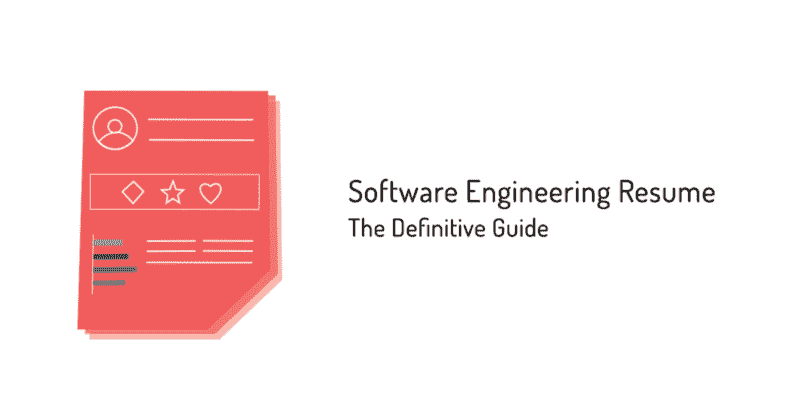

Originally published on [theonset.com.au](https://theonset.com.au/insights/software-engineer-resume?utm_source=medium)

虽然关于“简历”的长期前景的争论仍在继续，但如果你想获得下一次重要的工作面试，它仍然是最重要的文件之一。

问题是，创建完美的简历可能是一个耗时且令人沮丧的过程。

这就是为什么我们根据对谷歌和 Airtasker 等公司招聘经理的采访以及 Onset 软件工程招聘团队的专家建议，编写了这本直观的指南。

在我们开始之前，如果你正在寻找建立或重建你的简历，看看 Canva 上的这个[专业软件工程师模板](https://www.canva.com/templates/resumes/MAB5aGP_kYA-professional-software-engineer-resume/)。

阅读这篇文章大约需要 18-20 分钟，如果你想马上把它应用到你的简历中，时间会更长。

如果你没有足够的时间，你可以在这里下载这篇文章[的 pdf 版本。](https://traktion.typeform.com/to/gBBEWl?utm_source=medium)

这里是你需要知道的快速创建一份优秀软件工程师简历的所有事情。

让我们开始吧。

### 第一章:吸引你的观众

**Approximately reading time:** 5–7 minutes

**您将从本部分获得什么**

本节将教你了解**不同的简历风格，给你一些成功简历格式的例子，教你如何避免经典简历错误。**

#### 选择“正确”的风格

你如何组织你的简历将取决于你工作经历的深度。

这里有几种不同的风格可以考虑:

**按时间顺序:**按时间倒序列出工作经历，对于那些希望强调相关工作稳定历史的长期员工来说，会很有帮助。(它也更容易阅读！)

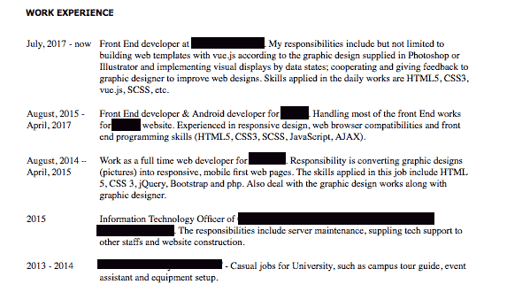

> 开始提示:如果你的简历在角色之间有空白，请解释清楚。例如，产假/陪产假、旅行、学习等。这有助于读者对你的历史有一个清晰的了解。

功能性:一份功能性简历会通过突出关键技能和成就来组织你的工作经历。它非常适合没有丰富工作经历的申请人，那些只有入门级职位的人，或者希望进入软件工程行业的应届毕业生。

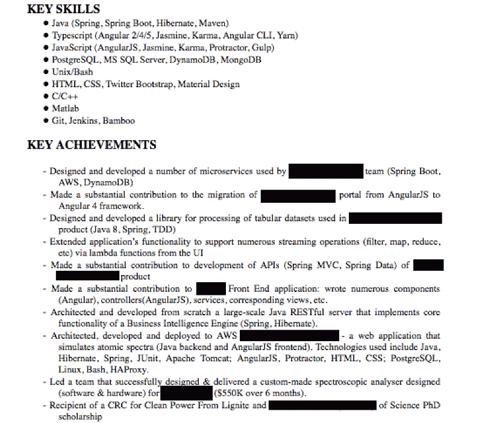

混合型:混合型简历结合了时间型和功能型简历风格。对于需要结合工作经历、特定技能和成就的中层职位来说，这很有帮助。

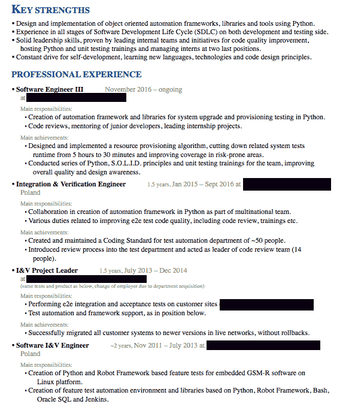

不管你选择哪种风格，你的简历都应该包括你的教育背景、工作经历、相关技能、过去的项目，如果真的有趣的话，还有一些爱好。

这个视频详细展示了一个成功的软件工程师从谷歌获得的简历。

你也可以在这里下载他的简历[。](https://www.csdojo.io/resume)

#### 如何保持简洁和干净

如果你从这个指南中学到了什么，请记住这一点:保持你的简历简明扼要。

> “最好的代码简洁明了，简历也是如此——最好的代码易读、易维护、易展示。可以肯定地说，最优秀的软件工程师会有最干净的简历可供阅读。”— **Sean McCartan(软件工程实践负责人)，发病**

软件工程师的工作可能会收到数百份简历，我们一开始看到的最大错误是，申请人的相关经验被周围的一堆信息冲淡了。

一份 10 页长的简历，详细描述过去 20 年中每一个小规模的工作或每一项技术，可能会让读者厌烦，削弱你的基本优势。

了解你申请的职位的性质和公司的类型也很重要，并且尽可能简洁。

坚持关于你的技能的确凿事实，避免没有直接证据支持的多余陈述，如“*我在个人和团队中都工作得很好”*。

此外，不要列出基本技能，比如“我会使用 Excel 电子表格”

> 招聘经理提示:避免令人分心的设计或图像，确保你的简历可读性强，字体和大小一致，易于跨浏览器兼容(最安全的选择是 Arial 或 Times New Roman)。

#### 基础知识

在简历的开头，不要忘记在简历的顶部标题清楚地写明你的全名和联系方式(电子邮件，手机号码)。

不需要你的完整地址，但是郊区有助于确定你在某些地方工作的可行性。

通过包含一个到你的在线投资组合、LinkedIn 账户或 GitHub 账户的可见链接来帮助读者。在任何情况下，确保网址的工作！

稍后我们会告诉你在简历中展示 GitHub 的最佳方式。

当列出以前的工作场所时，采用一致的结构，帮助读者跟上进度。

记住，如果你使用一种格式，最好在整个简历中坚持使用。

对于每个雇主，包括日期(月/日 YY 开始-月/日 YY 结束)，头衔和公司。

包含一个公司的 URL 或一行文字描述会有所帮助，尤其是对于不太知名的企业。看看下面这个例子(不要复制“关于我们”的页面，在你的简历上一口气背下来——是的，这种情况仍然会发生):

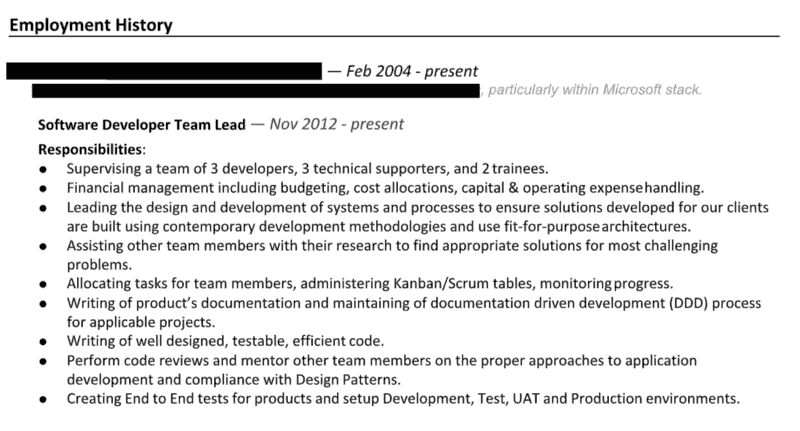

这段视频就如何重新格式化你的简历，让它读起来轻松愉快给出了实用的建议。

#### 需要总结吗？

让我们保持这个简单；不，不尽然，尤其是如果你打算做的只是告诉每个人你有多棒——这就是面试的目的。

如果你觉得有必要在一个简短的总结中突出你的职业生涯，那就让它相关，尽量不要使用一堆过于描述性的动词。

将你的简历与你的 LinkedIn 个人资料相匹配也有助于保持一致性，因为几乎每个人都会查看你的在线个人资料，以确保它与你的简历相符。

这里有一个简洁有效的职业总结的例子:

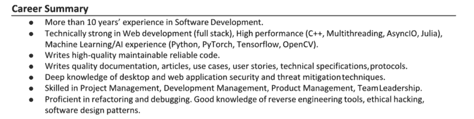

### 第二章:展示你最适合这份工作

**Approximately reading time:** 5–7 minutes

#### 你会从这部分得到什么

如何**阅读职位描述**和**根据职位定制你的简历**，这样招聘经理会立刻知道你是最合适的人选。

你将学到如何突出相关编程语言以及特定工具和框架的技巧。

我们走吧。

不要给每个雇主都投一样的简历。

这是你的名片，你必须根据你申请的工作的具体要求来制作。

如果你清楚地知道雇主想从招聘启事中得到什么，并在简历中展示你的技能如何符合他们的要求，你将会领先一步。

对你的经历要诚实、理智和有创造性，但绝不撒谎。

#### 熟悉广告上的工作

仔细阅读招聘广告，找出对该职位最重要的关键词或技能。

在你的简历中加入公司想要的关键词和技能，将有助于你从数百名求职者中脱颖而出。

例如，这是一家澳大利亚航空公司最近发布的软件工程师招聘广告:

**您将拥有:**

*   *开发后端服务的丰富经验(最好是微服务架构)*
*   *使用现代 JavaScript 框架开发 web 应用程序的经验(React 优先)*
*   *云计算的一些经验(最好是 AWS)*
*   *理解简单的价值，知道如何编写可维护的、干净的符合标准的代码*
*   *在敏捷环境中工作的理解/知识*
*   *理想情况下，理解以下任意两种语言:Java、React、Golang、Python、Angular 或 Node*
*   拥有相关学位/资格或 4 年以上的工作经验。

通过仔细分析职位描述，很明显，这家航空公司的招聘人员会寻找关键短语和词汇，如“微服务架构”、“云计算”、“反应”和“网络应用”。

如果你申请的是前端职位，招聘经理会自动寻找关键技能，如“Angular”、“React”、“Vue”，而不是全栈或后端职位，后者可能会提到 C#或 Java 等语言。

#### 有意为之

你包含的词汇、技术和编程语言应该有助于读者增强他或她对你专业领域的信心。

在撰写简历的每一行时，不要忘记雇主不仅仅是在寻找关键技能，比如写代码或设计网页界面，他们更希望找到线索，表明你对代码和系统如何工作的理解，以及你使用不熟悉的代码并迅速调试系统的能力。

例如，如果你把 Java 作为一项关键技能，在相关的地方，通过列出你使用过的 Java 相关技术和框架来强调这一点，比如 **Spring、Spring Boot 和 Hibernate** 。

因为 Java 是一种健壮、高性能的语言，所以具体说明你工作过的环境类型(可伸缩/并发或单片/多线程)将有助于展示你技能的广度和深度。

把每一个工具都看作是阐述你的技能的机会。如果你曾经在**数据密集型环境**中工作过，列举你使用面向对象编程语言的经验来补充你的技能，比如 **Python 和 Scala。**

下面的简历展示了如何将多种技能组合组织成一份有凝聚力的简历:

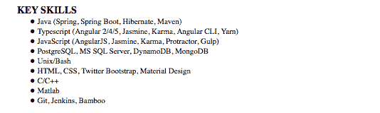

#### 不要忽视明显的事实

当非专业的招聘经理负责寻找软件工程师时，他们可能会寻找更通用的技能来确定一个胜出的候选人。

这里有一份通用技能清单，可以放进你的简历里(当然，如果你有的话！):

*   精通计算机科学、计算机编程、数据结构或算法。
*   了解**软件设计最佳实践。**
*   快速学习和逆向工程代码的能力(软件工程师应该能够处理其他开发人员编写的程序或代码，并且需要能够创建、读取、更新和销毁 web 应用程序)。
*   写算法的自信。
*   类似学科的能力(相关的，包括**数据库管理、UX/用户界面设计或搜索引擎优化的知识)。**
*   扎实的基础知识——函数编程、数据结构和算法编程

> 招聘经理提示:正如前谷歌技术主管弗朗索瓦指出的，优秀的软件工程师都很好奇。通过强调 UX/用户界面设计或搜索引擎优化等辅助技能来展示你是一个有好奇心的人，这将有助于你的简历脱颖而出。

对于所有优秀的工程师来说，理解你的用户以及你的工作如何影响最终用户已经成为一个非常重要的特质。

#### 使其相关

对于人们来说，对整个系统如何工作有一个整体的了解变得越来越重要。

软件工程师不再仅仅知道如何编写应用程序。

现在，证明您知道特定的应用程序或代码将如何在特定的环境和基础设施中交互是至关重要的。

根据经验，每当你列出主要技术技能时，也要参考相关的外围技术技能。

列出相关技术通常可以表明对特定工具/语言的浓厚兴趣或精通程度。

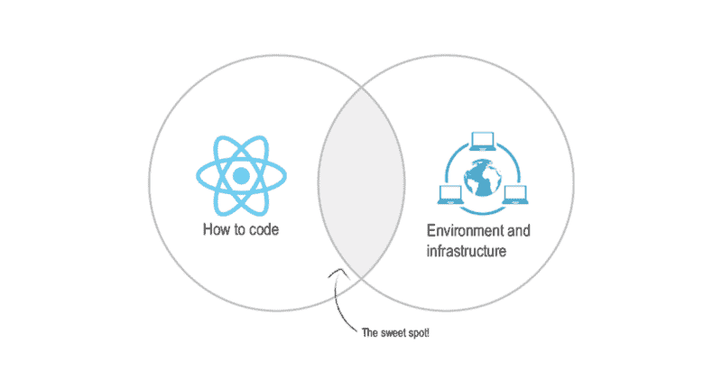

例如，React 有一个庞大的工具和组件库生态系统，参考一些最好的工具和资源可以立即了解你的技能。

在简历中列举 Python 的时候，考虑一下如何通过提及 web 或者大数据框架来展示概念性知识，比如 **(Django、Flask、Spark、Tensor flow、Hadoop、Pandas 等)。**

看看这份简历如何根据关键语言有效地组织技术能力。

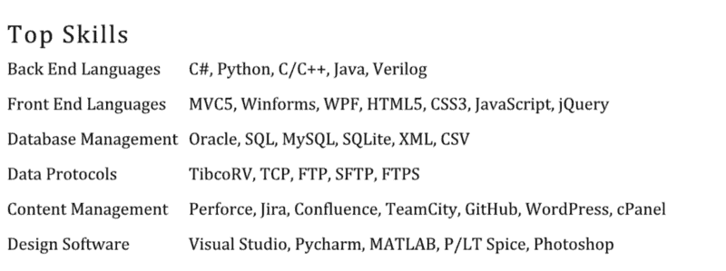

> 招聘经理提示:当你提到你的技能时，避免使用“熟练”、“专家”或“新手”这样的评价。除非你使用的是通用的评分系统，否则不要对你自己在不同技能和技术方面的能力进行排名。一句话:秀不要说。

### 第三章:留下持久的第一印象

**Approximately reading time:** 2–3 minutes

#### 你会从这部分得到什么

如何巧妙的在你的简历中增加个性，这将在招聘经理的脑海中留下一个清晰的印象，告诉他你是什么样的人，什么样的员工。

把你的简历想象成一个你希望留在读者脑海中的故事。

在你的简历中，你是主角，所以考虑突出你职业生涯中有趣的部分。

这里有一些你可以了解的故事:

*   领导:如果你一直在较小的团队中工作，这可能表明你做出了较大的贡献。可能的话，突出你在一个项目中的**领导和责任**的水平，并吸引人们对团队规模的注意。
*   **创新者:**如果你过去的项目涉及人工智能或区块链等新技术，在你的简历中强调**一个创新和前瞻性的叙述**。
*   **执行者:**作为一名短期合同工，你可以通过说明你的角色因**的高绩效而被延长来展示一致性。**
*   学习者:担心简历上的工作太多？
    强调在每次退出前完成项目，并将每次跳槽描述为学习新技能和完成新挑战的愿望

最终，不同类型的企业会产生不同的故事，所以决定你如何讲述你的职业故事，以最适合你独特的观众:雇主/招聘经理。

例如，数字机构要求员工快速行动，将项目推出去。

因此，中介机构可能会浏览简历，寻找那些擅长取悦客户、赶在截止日期前完成工作的人。

你可以扮演“表演者”的角色，以便在数字广告公司帮你一把。

像 Ebay、Canva 或 Carsguide.com.au 这样的产品/平台企业更有可能寻找以质量为导向、致力于高标准的软件工程师。

“领导者”或“创新者”可能是平台企业有帮助的职业故事。

> 附注:我们随时准备为您提供帮助——如果您在简历方面需要指导，您可以在 [**与我们的顾问预约 20 分钟的时间，在**](https://traktion.typeform.com/to/pH8TLH) 这里获得一些反馈。(不附带任何条件)

### 第四章:让你的简历更出彩的技巧

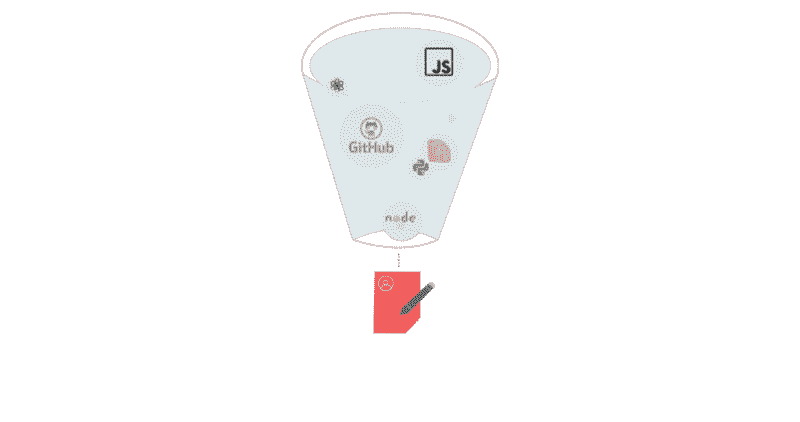

**Approximately reading time:** 4–5 minutes

#### 你会从这部分得到什么

如何**使用具体的衡量标准和成就**来创建一份黄金简历，激情项目的**好处**，以及如何将你的 **GitHub** 恰当地融入你的简历。

概述你的工作经历很简单，但确保它是相关的，并以最好的方式呈现，这是一份普通简历和一份出色简历的区别。

最好的软件工程师简历将有助于雇主了解一个 T2 以前的项目或工作场所如何与他们正在招聘的职位相联系。

不管你的经历有多深，确保你的工作经历中有一些要点或句子是关于关键技能和成就的，而不仅仅是展示该职位的职责。

你的就业部分的主要目标应该是展示你在以前工作场所的时间的影响和价值。

以下是一些建议:

#### 结果

添加成就驱动的**陈述、指标和数字**来帮助表明你过去角色的成功和价值。

考虑你的行为如何推动了企业的关键成就。

如果你能具体展示你为前任雇主带来了销售额、参与度或用户保留率的提升，这将极大地帮助你的申请。

你可以这样做:

*   不要泛泛而谈或简单地陈述你参与了一个新的移动应用程序的发布，而是要解释你参与的结果——它是否将客户保持率提高了 10 倍？
*   吸引了多少新的下载量？
*   它是否提高了您企业的成本效率？
*   将成就具体化。

例如，一份高级软件工程简历的顶层简历陈述了以下成就:

*“通过预加载客户资料和预获取登录页面上的静态资源以及优化 web 和应用程序层 C#代码，渲染{company name}主页的时间缩短了 20%。*

*通过用 Ajax 请求替换传统的阻塞请求，将请求重新定位到不同的虚拟目录，并将多个后端请求合并为一个请求，将事务历史页面的呈现时间减少了 50%*

*通过使用 Splunk 主动监控/分析{company name}日志，两次发布后生产异常减少了 40%*

*每两周向{company name}产品负责人和平台管理团队做一次关于性能和弹性问题的演示。"*

*   将这些信息融入简历的一个方法是在“主要成就”部分列出这些结果:

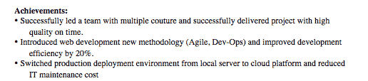

#### 项目

对于工作经历的每一行，最成功的简历都包括一个概念证明(POC ),提到实际的成就或项目的所有权。

每个招聘经理心中的一个主要问题是“这个应聘者做了什么？”

这使得强调两到三个你可以自信地解释的项目变得非常重要。

POC 不仅仅是所使用的书面代码或编程语言。它展示了用于实现关键结果的流程和最佳实践。

通过帮助雇主了解你的具体职责来深入了解一个项目。下面是一个例子:

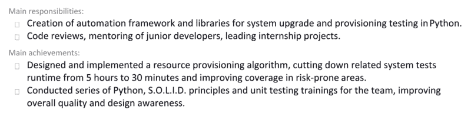

对于资历职位，提及你已经完成或参与的项目的实际所有权会有所帮助。

详细说明你做了什么和团队做了什么。

招聘经理正在寻找你已经开始并完成的项目的证据。

自始至终拥有一个项目表明你(可能)获得了 PDLC 或 SDLC 的所有元素，并且使用过不同的功能。

#### 激情项目

> “个人项目和自由职业反映了一个人的热情。这不是雇佣那些只会粗制滥造代码的人，而是找到那些能够交付高质量、写得好、测试好且可维护的代码的人。”- **Sean McCartan(软件工程实践负责人)，发病**

一个雄心勃勃的个人项目可以向你未来的雇主展示你学习和构建软件解决方案的主动性、奉献精神和热情。

如果你的简历上没有任何个人项目也没关系，但是如果你有，它会让你与众不同。

无论您的个人项目是 Python 脚本、移动应用程序还是 Java 地图，它都是在非工作环境中展示真实技能的有益方式。

这也显示了雇主重视的普遍热情和好奇心。

你可以展示这些过去的项目或通过在线作品集工作。

#### 展示您的 GitHub

展示你的项目的一种方式是通过 GitHub。但是不要只是发送你的主 GitHub 账号，而是要包含 GitHub 上具体项目的 URL。前谷歌技术主管弗朗索瓦说，有趣的项目是他在简历中寻找的东西之一。

GitHub 上的项目真的可以展示激情，在很多情况下，还可以展示与其他工程师的协作。

确保您的项目结构整洁，并包含一个自述文件。

这个文件应该描述项目，如何使用它，最好包括项目的照片/视频。

一个易于使用、记录良好的项目将比几个难以导航或只完成一半的项目更有效。

这个视频更详细地介绍了如何最好地格式化你的 GitHub 项目。

### 第五章:炫耀你的教育、专业和软技能

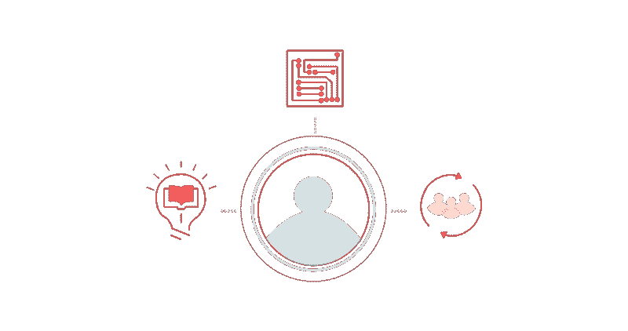

**Approximately reading time:** 5–10minutes

#### 你会从这部分得到什么

如何**利用你的教育**来展示你是最好的候选人，学习专业化的**的重要性，招聘经理正在寻找的**软技能**，以及如何突出你的**工作方法。****

#### 如何灵活运用你的教育

如果你有学历(如果没有也没关系)，在任何软件工程师的简历中列出相关学历都是至关重要的，因为软件工程职业通常至少需要学士学位或相关的供应商认证。

通常情况下，软件工程师会有计算机编程或计算机科学的教育背景，专业为软件工程。

软件工程有大量的分支，可以导致不同的学术轨迹和专业——课程可以专注于各种类型的编程语言，或者进入项目管理、web 安全或编码等主题。

如果你没有相关的学位，不要苦恼。

自学和持续学习的例子通常可以取代传统的学士学位。

这方面的例子可以是类似于[树屋](https://teamtreehouse.com/)、[大会](https://generalassemb.ly/)、[代码学校](https://www.pluralsight.com/codeschool)或 [Udacity](https://www.udacity.com/) 的在线课程。

> “我不在乎学位是什么——有人去大学学习一些有趣的东西是一个很好的指标，但这就是我所能做的。接受教育是有价值的，但这也可以是自我教育的形式。”- **弗朗索瓦(谷歌前技术主管)**

只要记得在简历上清楚地突出持续学习就行了。(要有选择性，不要列出你参加过的所有课程、训练营或聚会。)

展示你在软件工程方面的能力，让你在任何特别的或自学的学习中脱颖而出。

例如，如果你已经完成了 Java、PHP 或 C#等技术技能的**训练营或课程，请将此添加到你的资格证书中。**

#### 专注于你的专业

随着虚拟现实、人工智能和大数据等技术领域的不断发展，这有助于在简历中区分专业领域。

**如果你有专长，就投身其中。**

这可以帮助雇主对你技能的特定部分充满信心，并更加确定你是合适的人选。

下面是软件工程专业领域的一些例子:

1.  **游戏和娱乐系统:**设计可以在游戏中使用的应用程序或软件
2.  数字或嵌入式系统:软件工程师可以专攻在大型机械或电气系统中具有专用功能的计算机系统
3.  建模和模拟:设计或维护模拟特定过程的应用程序，以减少对昂贵测试的需求
4.  **网络和分布式系统:**涉及网络架构、应用层和网络安全专业知识的技能
5.  **产品和/或项目管理:**负责团队成员的管理，确保产品或项目充分完成/构建/原型化。

随着专业化，不要犹豫，包括其他相关的经验。

软件工程与软件程序员、软件开发员、软件设计师、PHP 开发员等职位紧密相关。

只要你能够在技能组合中找出相关性，并证明这种工作类型的相关性，突出你从事过的其他相关工作会很有帮助。

#### 不要忘记软技能

“软技能”指的是有助于你人际交往的性格特征、社交技能或个性特征。软技能可能不像“硬技能”(经验年限、学位名称)那样容易量化，但它们对雇主来说往往同样重要。

为了帮助他们的日常工作，软件工程师需要软硬技能的平衡，比如积极主动和展现出 T2 的弹性。

尽管存在普遍的误解，软件工程是高度创造性的——它包括设计和构建以前从未存在过的功能和系统。

这种创造力通常与协作密切相关，软件工程师能与他人合作得很好是很重要的。沟通、协作和创造力越来越成为软件工程师的制胜特质，所以这些品质应该放在你简历的前面和中心。

弗朗索瓦已经看到了大量的软件工程师简历，这些简历涵盖了广泛的技术技能，但据这位前谷歌技术主管称，同情心是招聘经理寻找的一项关键技能。

> “一个好的软件工程师不仅要有技术技能，而且要理解他人的观点，在与他人互动时要有建设性和帮助性。在软件工程中会有很多意见和冲突，所以你需要有建设性地去理解他们的顾虑。这是一项重要的技能。”— **弗朗索瓦(谷歌前技术主管)**

以下是一些你可以写进简历的其他软技能:

*   **持续学习的态度:**例如，这可以通过 GitHub 账户、领导力、参与聚会或参与 C#社区来体现。
*   创新和前瞻性思维方式:这可能很难在简历中表达出来，但如果你在工作中没有接触过新兴技术，那就在工作之外参与的项目中展示这一点，或者提及参与新技术，如**区块链或人工智能。**
*   **展示能力或影响技巧:**这可以通过带领其他团队成员定期站立、展示过去的工作或组织会议来表现。

这个视频分解了软件工程师应该具备的一些最重要的软技能。

#### 如何突出你的工作方法

提及你感到舒适或熟悉的具体工作方式会给你的简历增色不少。

特别是,“敏捷”方法对于依赖快速迭代和可持续发展的技术型公司来说可能很有吸引力。

想要在基于技术的环境中工作的软件工程师需要证明他们有能力与在敏捷框架中运作的产品团队和开发人员无缝合作。

如果你精通“敏捷”开发，一定要在简历中提到这一点。

(看板、测试驱动开发等也是如此。)

> **记住**:对于高级职位，招聘经理会寻找在更复杂、更具挑战性的环境中工作过的人——如果你一直在相同的环境中使用相同的技术，那么是时候寻找更具挑战性的工作了，把你的主要技能扩展到其他发展领域。

如果你对前端感兴趣，获得更多的 UI 经验并使用 JavaScript，或者如果你对架构感兴趣，参与基础设施繁重的项目。

我们希望这份指南能回答你的问题，并帮助你制作一份新的、成功的简历。

如果你想让我们看一下你的简历并给你一些反馈，你可以 [**与我们的顾问之一预约**](https://traktion.typeform.com/to/pH8TLH) 的时间。

我们错过了什么吗？你还有问题吗？

下面留言评论！