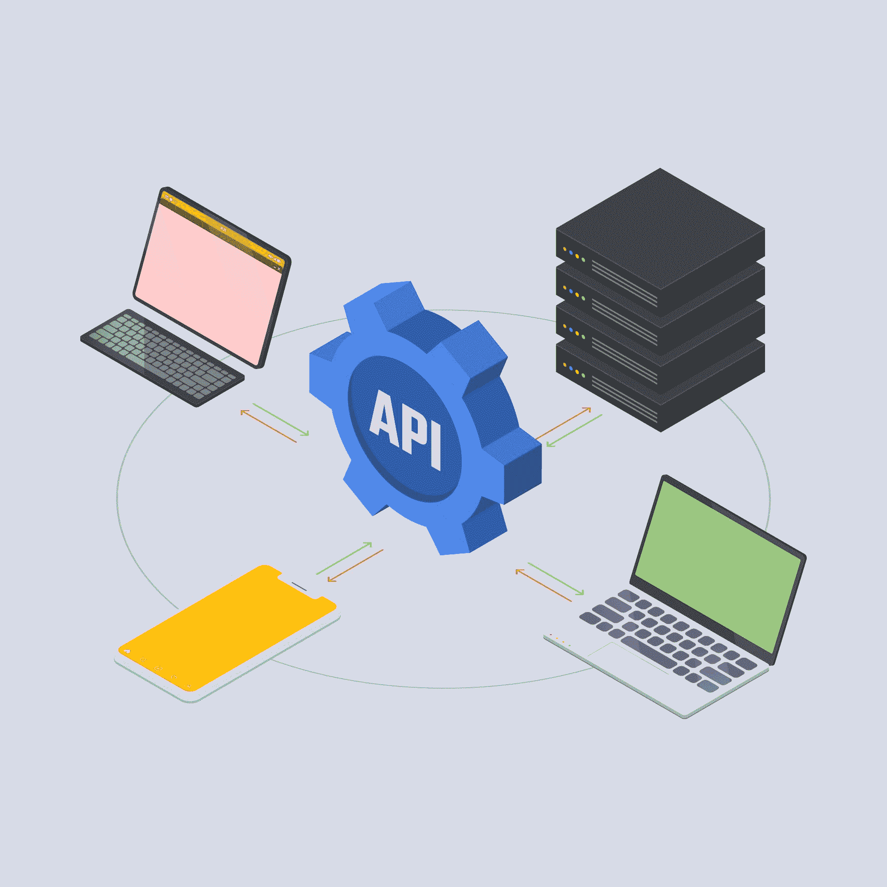

# 如何编写好的 API 文档

> 原文：<https://www.freecodecamp.org/news/how-to-write-api-documentation-like-a-pro/>

想象一下，你刚买了一个新的家庭影院系统，你去设置它。你首先做什么？

谢天谢地，你有一个方便的设备手册来帮助你。你只需要按照手册中详细说明的步骤去做，瞧！您的家庭影院系统已经准备好播放您最喜爱的歌曲。

就像设备手册指导您完成设置和安装一样，API 文档也可以帮助您完成 API 的配置。

## 什么是 API 文档？

在深入 API 文档之前，让我简单解释一下什么是 API 及其基本功能。

API 是应用编程接口的缩写。

Connection of devices to databases via API

无论您是初级程序员还是高级开发人员，在您的软件开发旅程中都会经常遇到这个术语。它是你的电脑、手机或者应用程序与外部资源之间的桥梁。

换句话说，API 赋予你的软件与其他软件程序、数据库或资源交互的能力。您可以使用类似特性的现成 API，而不是为应用程序的特定特性编写程序。

许多 API 是公共的(免费的),而其他的是私有的，需要付费才能获得私有密钥来访问 API。有不同类型的 API，如 REST(表述性状态转移)、SOAP(简单对象访问协议)等。

继续——那么什么是 API 文档呢？嗯，这是一个书面指南，说明了 API 的功能，如何将其集成到您的程序中，API 的用例，以及示例。

请记住，API 文档是技术内容。这意味着它将包含一些技术术语，但仍然应该是可读和易于理解的。

## 谁应该编写 API 文档？

API 是由软件开发人员构建的。由于软件开发人员直接参与构建和使用 API，他们创建文档就更容易了。

软件开发人员编写 API 文档的缺点是，他们从非常技术性的角度来编写，这会使文档很难理解。另一个问题是，在开发 API 的同时，API 开发人员需要花费更多的时间来创建文档。

因此，一个好的替代方法是将 API 文档的任务分配给技术作者。技术写作者是将内容写作的专业知识和技术知识结合起来，产生不仅是技术性的，而且是信息性的和可理解的文档的人。

技术作者从 API 开发人员那里了解 API，然后创建教程、示例和其他用于文档目的的内容。

同时，API 开发人员监督技术编写人员，以确保编写的文档是准确的，并且他们可以在必要时向编写人员提供更多的信息。

我们的目标是让每个人一起工作，产生充分解释 API 的文档，并在没有混淆的情况下指导用户。

如果您对编写 API 文档感兴趣，但不知道从哪里或如何开始，本文将帮助您入门。

我在这里就能感受到你的兴奋，所以我们开始吧！

## 如何开始编写 API 文档

在编写 API 文档时，首先要创建几个大纲。这将使你对你打算写的东西有一个大致的了解。

接下来的事情是为您创建的每个大纲收集信息。这可以通过从 API 开发人员那里获得 API 描述、使用的语言、其他参考资料和示例案例来实现。您还可以观看 API 的现场演示，以便获得关于它如何工作的第一手经验。

最后，把你收集的细节结合起来，按照逻辑顺序排列。

在公开之前，记得校对你的文档，并与 API 开发者分享任何更正或添加。

现在你知道从哪里开始，你如何把这些碎片组合在一起，使它们成为一个有意义的整体？

## API 文档中包括什么

### 1.概述

这类似于项目报告的摘要页。

概述应该包含 API 和它所解决的问题的摘要。它还可能包括使用这种特定 API 优于其他类似 API 的好处。

### 2.教程

这是文档的主要部分。

它应该包括您用来向用户解释 API 概念的不同内容格式。它还可以包括参考链接以及集成和使用 API 的分步指南，以便它能够正常工作。

### 3.例子

一旦你解释了 API 如何工作和/或提供了详细的步骤，展示调用、响应、错误处理和其他与开发人员如何与 API 交互有关的操作的例子是一个好主意。

### 4.词汇表

尽管这是可选的，但我建议为您的 API 文档添加一个术语表页面。

为了避免让用户厌烦冗长的文本块，您在整个文档中使用的各种术语、模式、图像等的解释都可以推送到术语表中。然后，您可以在文档中引用这些内容，并链接到术语表。

## 如何编写有用的 API 文档

### 了解 API

正如我们刚刚讨论的，您应该对您正在记录的 API 有第一手的知识。请记住，您的目标是引导可能对 API 一无所知的潜在用户。你不想把他们搞混，对吧？

如果你对产品的架构、功能和其他重要信息有很好的理解，你将能够有效地编写 API 的产品描述部分，而不用做任何猜测。

如果你对你所写的 API 不是很了解或者完全信服，花些时间做些研究，尽可能多地收集信息。自己使用 API，这样您就可以深入了解它是如何工作的。

### 使用相关内容

API 文档不仅限于书面指南。您可以使用短视频或 PowerPoint 幻灯片来说明 API 的集成。

编写文档时陈述不同的用例。这将有助于读者认识到哪一个与他们的相似，或者找到一个他们能容易联系起来的。

此外，在你认为必要的地方和时间加入一些代码片段。这将使读者在阅读文档时能够跟上。就像流行的说法，“告诉我，我会忘记。教我，我会记住的。让我参与进来，我会学习的。”

### 要清楚，即使你需要技术

API 是软件或硬件的指南，所以在写文档时你需要使用一些技术术语。如果你想成为一名技术作家，抵制住含糊不清的诱惑。

一份好的文档不是一份有复杂语法结构的文档，而是一份相关的、直截了当的、清晰的文档。只有当它用简单易懂的语言写出来时，它才能引起共鸣。

你的 API 文档应该尽可能的简单，但是不应该遗漏任何重要的细节。此外，确保在第一次使用首字母缩写词和技术术语时进行解释，或者将它们放在文档末尾的术语表中。

### 列举指南

如果内容是逐项列出的，文档就更容易理解。这是写得简洁的一个主要原因。

按步骤对指南进行编号或逐项列出，有助于用户在每个时间点弄清楚该做什么。类似于从 A 到 z 读字母表。

有了清晰的步骤，如果遇到错误，用户可以很容易地返回。

### 检查错误

每当你阅读一个文档，总会有一些东西需要修改、更新，甚至删除。这是典型的作家经历，不应该让你不安。

黄金在提炼之前要经过几道熔炉。这么说吧，你的文档应该经历一个相似的过程(而不是一个炽热的熔炉)，这样它就会成为一个准备充分的文档。

彻底的审查过程可以帮助您最大限度地减少任何错误，并生成清晰的文档。

## API 文档的最佳工具

编写 API 文档可能非常耗时，并且难以维护。但是一个好的文档工具可以减轻大部分(如果不是全部)这些问题。

有许多工具可以让您的 API 文档之旅变得更加容易。使用工具的好处是这些工具提供的协作特性和标准模板，而不是从头开始。

下面是一些流行工具及其优点的列表。

### 邮递员

Postman 是一个构建和维护 API 的平台，具有创建 API 文档的特性。

Postman 使用其机器可读的文档工具来使 API 文档过程变得更加容易和快速。你可以免费注册 Postman 并安装在你的电脑上。

虽然 Postman 提供了对它自动生成的所有 API 文档的更新，但它的 UI 一开始可能很难理解。

### DapperDox

DapperDox 是一个开源的 API 文档工具，它提供了创建文档的各种主题。这个工具结合了图表、规范和其他内容类型，为您提供更好的文档。

它的优点是允许作者用 GitHub 风格的 markdown 进行写作，但是这个工具的更新是不定期的。

### SwaggerHub

对于许多技术作者来说，SwaggerHub 是一个流行的 API 文档工具，因为它是交互式的并且易于使用。

虽然它对初学者很友好，但除了个人使用之外，任何东西都需要付费。因此，如果你是一个组织的成员，并且想使用 SwaggerHub，你的组织将不得不为此付费。

无论您是选择此处列出的工具还是替代工具，您都应该考虑以下几点:

*   您将在什么环境下使用该工具？是供个人使用还是作为组织的一部分？
*   你有多专业？你是初学者还是专家？
*   用户界面和用户体验如何？

## API 文档的一些很棒的例子

下面是一些 API 文档，它们会启发你开始编写优秀的 API 文档。这些文档都用简单的步骤和易懂的术语向开发人员详细介绍了产品 API 的用法。

### GitHub API 文档

GitHub 提供了非常有用的文档——这并不奇怪。点击这里查看他们的 API 文档:

[Getting started with the REST API - GitHub DocsLearn the foundations for using the REST API, starting with authentication and some endpoint examples.GitHub Docs](https://docs.github.com/en/rest/guides/getting-started-with-the-rest-api)

REST API 是开发人员用来从 web 或数据库访问数据的流行 API。Github 的这份文档包括概述、指南，甚至是关于如何在程序中使用 REST API 的代码。

这些文档的有趣之处在于，不管你的技能水平如何，你都可以很容易地理解它。

### 工资单 API 文档

[HomeBuild amazing payment experiences with the Paystack APIdocs](https://paystack.com/docs/)

你在构建一个需要付费的应用吗？Paystack 是一种金融科技支付解决方案。他们的团队为开发人员提供了如何在您的程序中使用 Paystack API 的详细信息。它更像是提供了一本使用 API 的手册，以避免在程序中使用 API 时产生混淆。

### Twitter API 文档

[Twitter API DocumentationProgrammatically analyze, learn from, and engage with the conversation on Twitter. Explore Twitter API documentation now.Twitter API The Twitter API enables programmatic access to Twitter in unique and advanced ways. Tap into core elements of Twitter like: Tweets, Direct Messages, Spaces, Lists, users, and more. Sign up API access levels and versions Try a live request Twitter API v2 Twitter API v2 is ready for prime time! We recommend that the majority of developers start to think about migrating to v2 of the API, and for any new users to get started with v2\. Why migrate? New and more detailed data objects New parameters to request objects and fields Advanced metrics Receive and filter data with contextual Tweet annotations Filter on and identify which Tweets belong to a reply thread Advanced access level for Academic Researchers And much more... V2 Access Levels Essential With Essential access, you can now get access to Twitter API v2 quickly and for free! Retrieve 500,000 Tweets per month1 Project per account1 App environment per ProjectNo access to standard v1.1, premium v1.1, or enterprise Elevated With Elevated access, you can get free, additional access to endpoints and data, as well as additional App environments. Retrieve 2 million Tweets per month1 Project per account3 App environments per ProjectAccess to standard v1.1, premium v1.1, and enterprise Academic Research If you qualify for our Academic Research access level, you can get access to even more data and advanced search endpoints. Retrieve 10 million Tweets per monthAccess to full-archive search and full-archive Tweet countsAccess to advanced search operators More on v2 access levels Migrate to Twitter API v2 Interested in migrating your current integration to Twitter API v2? Check out our migration hub for resources that will help you understand what is different between v2 and previous versions, including the data formats. You can also access migration guides for each endpoint listed in the new v2 endpoint sections. Learn more Twitter API endpoint map What to build With the volume of different endpoints and features available on the Twitter API, it’s not always easy to know what to use it for. We’ve made it easy for you. Check out our 'what to build" page to learn more. Moderate conversations for health and safetyEnable creation and personal expressionMeasure and analyze “what’s happening”Improve community experiencesCurate and recommend contentImpact the greater good What to build Tools to get you started Go from zero to "Hello World" with the help of these resources, tools, and libraries. Client libraries Check out our curated selection of Twitter-built and community-supported client libraries. Browse libraries v2 Postman collection We have built out a Postman collection for our v2 endpoints to help you explore the API using their visual client! Get started with Postman Sample code Looking to get started building with the Twitter API. We have sample code, clients, and other example apps available. Check out the @TwitterDev GitHub! Get started with our sample code Need help? Visit our support section, where you can find troubleshooting tips, frequently asked questions, live API status monitor, and other helpful information that can help you understand how to overcome any obstacle. Get support Join the community The Twitter Developer Community is where our global community of developers meet, discuss, build and innovate on the Twitter Developer Platform. Learn more about the community How can we improve upon the Twitter API? Give us your product feedback > Other Twitter API offerings Enterprise: Gnip 2.0 Our enterprise APIs offer the highest level of access and reliability to those who depend on Twitter data. Learn more Premium v1.1 The premium v1.1 endpoints offer scalable access to Twitter data for those looking to grow, experiment, and innovate by using historical search and subscribing to user activities. Learn more Standard v1.1 The standard v1.1 endpoints were launched in 2012 and enables you to post, interact, and retrieve data for resources such as Tweets, Users, Direct Messages, Lists, Trends, Media, and Places. Learn more Developer policy and terms Follow @twitterdev Subscribe to developer news Twitter platform Twitter.com Status Card validator Embed a Tweet Privacy Center Transparency Center Twitter, Inc. About the company Twitter for Good Company news Brand toolkit Jobs and internships Investors Help Help Center Using Twitter Twitter Media Ads Help Center Managing your account Email Preference Center Rules and policies Contact us Developer resources Developer home Documentation Forums Communities Developer blog Engineering blog Developer terms Business resources Advertise Twitter for business Resources and guides Twitter for marketers Marketing insights Brand inspiration Twitter Flight School © 2022 Twitter, Inc. Cookies Privacy Terms and conditions By using Twitter’s services you agree to our Cookies Use. We use cookies for purposes including analytics, personalisation, and ads. OK This page and certain other Twitter sites place and read third party cookies on your browser that are used for non-essential purposes including targeting of ads. Through these cookies, Google, LinkedIn and Demandbase collect personal data about you for their own purposes. Learn more. Accept Decline](https://developer.twitter.com/en/docs/twitter-api)

Twitter API 文档解释了开发人员如何与应用程序交互。文档清楚地描述了不同的部分(用户、推文、直接消息等等)和它们的操作。

尽管更多信息需要权限访问，但只需点击链接即可访问基本信息。

## 结论

文档展示了工具是如何工作的，以便其他人可以正确使用它。API 文档并不总是容易创建的，但是创建有用的文档并不像您想象的那样困难。

只要记住:从写初稿开始，每天改进，遇到困难时向导师或资深同事寻求帮助。

现在继续编写将随下一个世界级产品一起发布 API 文档。