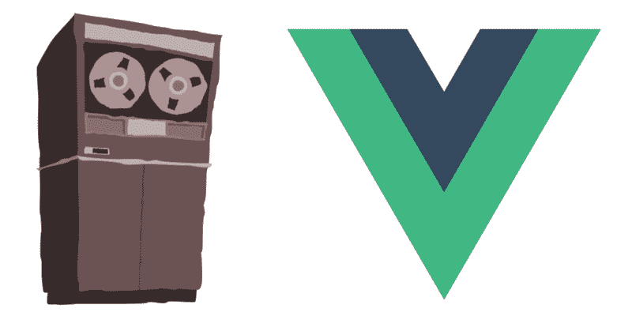

# 用磁带和 Vue 测试工具编写极快的 Vue 单元测试

> 原文：<https://www.freecodecamp.org/news/how-to-write-blazing-fast-vue-unit-tests-with-tape-and-vue-test-utils-be069ccd4acf/>

作者:艾德·耶伯格

# 用磁带和 Vue 测试工具编写极快的 Vue 单元测试



Tape and Vue — a match made in heaven

磁带是[单元测试](https://github.com/eddyerburgh/vue-unit-test-perf-comparison) Vue 组件的最快框架。

在本文中，我们将看到如何用磁带和 Vue 测试工具编写 Vue 单元测试。

本教程面向熟悉单元测试的用户。如果你是单元测试的新手，为初学者检查一下[单元测试 Vue 组件](https://eddyerburgh.me/unit-test-vue-components-beginners)。

### 什么是磁带？

Tape 是一个基本的单元测试框架，它以[TAP](https://testanything.org/)(Test Anything Protocol)格式输出测试报告。

它有一个简单的 API 来断言您的 JavaScript 和 Vue 组件行为正确。

### 为什么是磁带？

几周前，我在不同的测试框架上运行了一些性能测试。我想找出测试 Vue SFCs(单文件组件)最快的框架。

出于完整性考虑，我添加了磁带，并震惊地发现它是执行速度最快的框架。

要在磁带中运行测试，我们需要做一些设置。让我们开始吧。

### 引导项目

我已经做了一个简单的启动项目。Git 将项目克隆到一个目录中:

```
git clone https://github.com/eddyerburgh/jest-vue-starter.git
```

`cd`进入并安装依赖项:

```
cd jest-vue-starter && npm install
```

以`npm run dev` 的身份运行开发服务器来检查应用程序。

这很简单。本教程的重点是看如何设置 Tape 和 Vue，而不是编写复杂的测试。

### 设置磁带和 Vue 测试工具

首先要做的是安装磁带和 Vue 测试工具:

```
npm install --save-dev tape @vue/test-utils
```

Vue Test Utils 处于测试阶段，因此我们需要明确请求版本

Vue 测试工具需要一个浏览器环境来运行。这并不意味着我们需要在浏览器中运行测试(非常感谢！).

我们可以使用 jsdom 在 Node 中建立一个浏览器环境。它向节点添加了像`document`和`window`这样的全局变量。

jsdom 的设置有点麻烦。幸运的是，一些有进取心的节点开发者制作了一个名为`browser-env`的包装器库。

```
npm install --save-dev browser-env
```

我们需要在测试前运行`browser-env`。Tape 让我们定义测试前要运行的文件，我们马上就来。

Vue SFCs 需要在测试之前进行编译。当节点中需要文件时，我们可以使用`**require-hooks**` 在文件上运行 WebPack。这是个简单的设置。

首先，安装`require-extension-hooks`及其变体:

```
npm install --save-dev require-extension-hooks require-extension-hooks-babel require-extension-hooks-vue
```

让我们创建我之前提到的安装文件。创建一个`test`目录，并添加一个`setup.js`文件。最终的道路将是`test/setup.js`。

我们快到了。疯狂的事情。

让我们用磁带写一个冒烟测试。在测试目录中创建一个名为`List.spec.js`的新文件。完整路径`test/List.spec.js`。将下面的测试复制到文件中:

那里发生了什么事？我们定义了一个`test`，并在回调中得到一个`t`对象。`t`对象包含断言方法。它还有一个`plan`方法。我们需要告诉磁带它应该进行多少次测试。

现在我们需要一个脚本来运行测试。打开`package.json`并添加这个脚本:

```
"unit": "tape ./test/specs/*.spec.js -r ./test/setup.js"
```

这告诉磁带运行`test/specs`中的所有`.spec`文件。在运行我们的测试之前，`-r`告诉磁带`require`或者运行`test/setup`。

运行`unit`测试:

```
npm run unit
```

耶，我们通过测试了。但是，好家伙——这是一些丑陋的测试输出☹️

记得我之前提到过 TAP 吗？这是赤裸裸的荣耀。很丑吧？别担心，我们可以美化它。

安装`tap-spec`:

```
npm install --save-dev tap-spec
```

我们可以用管道从磁带输出我们的抽头。编辑`unit`脚本，将输出传输到`tap-spec`:

```
"unit": "tape ./test/specs/*.spec.js -r ./test/setup.js | tap-spec"
```

并再次运行测试:

```
npm run unit
```

好多了？

### 使用磁带和 Vue 测试工具编写测试

让我们写一些测试。因为我们使用的是 Vue 测试工具，所以测试可读性很好。

在`List.spec.js`中，我们将编写一个`test`，它将一个`items`数组传递给`List`。我们将使用 Vue 测试工具中的`[shallow](https://github.com/vuejs/vue-test-utils/blob/dev/docs/en/api/shallow.md)`方法来浅层安装组件。`shallow`返回一个包含已安装组件的`wrapper`。我们可以使用`[findAll](https://github.com/vuejs/vue-test-utils/blob/dev/docs/en/api/wrapper/findAll.md)`在渲染树中搜索`<` li >标签，并检查有多少个。

将下面的测试复制到`test/specs/List.spec.js`中。

用`npm run unit`观看测试通过。请注意，我们为 out `t.equals`断言定制了一个错误消息。默认消息可读性不强，所以最好添加我们自己的消息。

现在添加一个新文件`test/specs/MessageToggle.spec.js`。在这里，我们将编写一个测试，你猜对了，`MessageToggle.vue`。

我们现在要写两个测试。一会检查`<`；p >标签呈现默认消息。我们将再次空出一个包含已安装组件的包装器，并使用文本方法返回标签内的文本。

第二个测试类似。我们将断言当按下`toggle-message`按钮时消息发生了变化。为此，我们可以使用`[trigger](https://github.com/vuejs/vue-test-utils/blob/dev/docs/en/api/wrapper/trigger.md)`方法。

将下面的代码复制到`test/specs/MessageToggle.spec.js`:

用`npm run unit`再次运行测试。绿色测试？

### 磁带的利与弊

现在我们已经添加了一些测试，让我们看看使用磁带的利弊。

#### 赞成的意见

*   **真快**
    好像真的很快？
*   **很简单**
    你可以把源代码读出来
*   **使用龙头**。
    因为 TAP 是一个标准，所以有很多程序直接使用 TAP
    比如 tap-spec 模块，我们只是在其中加入了一些 TAP 文本，它为我们美化了它
*   **有限断言**
    有限断言让你的断言易于理解

#### 骗局

*   **有限断言**
    这也是一个骗局
    你可以用`hasBeenCalledWith`这样的断言得到有用的错误信息，这很难用`t.equal`复制
*   [它打破了](https://github.com/substack/tape/issues/389)
    当你运行超过 10000 次测试
    你可能不会达到这个目标。但是对于一个大型的 Vue 项目来说，这可能是一个障碍
*   这是最基本的
    你需要使用其他的库来模仿、存根和伪造

利弊都很相似。磁带是基本的，这可能是一件好事，也可能是一件坏事，取决于你问谁。

最重要的是，它的速度非常快！

快速单元测试是好的单元测试。

### 行动呼吁

制定一个新的测试框架的最好方法就是使用它。

在你开始的下一个 Vue 项目中，尝试 Tape。您可以在[自述文件](https://github.com/substack/tape/)中找到一个断言列表。

享受？

你可以在 GitHub 上找到[完成的回购](https://github.com/eddyerburgh/tape-vue-example)。