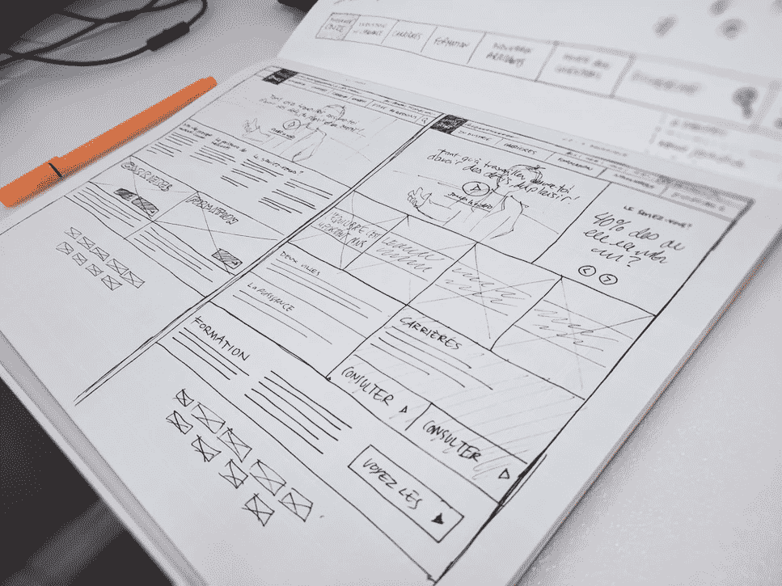

# 如何为你的下一个软件开发项目写文档

> 原文：<https://www.freecodecamp.org/news/how-to-write-documentation-for-your-next-software-development-project/>

你有新的软件项目吗？你应该为成功做准备。发展的过程决定结果。确保事情顺利进行的一个关键部分是准备好正确的文档。

在开始设计、编码、构建和测试之前，花时间准备好所有需要的软件文档。这不是软件项目中最令人兴奋的部分，但它确实会带来很大的不同。

## 文档有多重要？

软件业是一个节奏特别快的行业。为了跟上进度，一旦你有了好主意，你可能就想开始开发了。但是不要着急。抄近路实际上不会让你走得更远。

花在文档而不是开发上的时间不会浪费。相反，如果做得好，不仅能节省你的时间，还能提高你的产品。随着项目规模的扩大，文档将作为指导方针，使您能够在第一次尝试时就把事情做好。没有猜测或自由风格。

一个在头脑中对项目有一个很好的概述的项目经理是很棒的——但是开发人员或新的团队成员不能获得这种概述。细节可能会在交流中丢失。

技术文档可以成就或毁掉一个项目。如果一个项目的每一步都有良好的文档记录，它就能顺利运行并节省时间。没有一对一的谈话给正确的人正确的信息，因此，没有误解。

## 为什么要写项目文档？

### 你的项目将减少对个人的依赖

有了详细的文档，让新团队成员入职变得轻而易举。当您的产品在成长、变化和扩展时，您可以很容易地让新人才查阅必要的文档，并让他们立即投入使用。

反之亦然:如果一个团队成员离开了，他们并没有带走所有关于项目的知识。它仍然在文档中。

一个拥有优秀文档的项目仅仅是减少了对从事这项工作的个人的依赖。它有自己的框架，任何人都可以使用。它使你的软件项目更能适应意想不到的挑战。

### 与利益相关者和客户的沟通变得更加容易

但是拥有一个良好记录的软件项目的好处不仅仅是内部过程。

有了正确的文档，向利益相关者展示您的产品也变得更加容易，使您将创造的东西更容易理解。写在纸上的任何东西都比你头脑中的想法更容易回顾和理解。

你的产品文档在推销过程中很有帮助，但在你更进一步的时候也会有帮助。如果客户认可了你提交的文件，那么一旦出现问题，就很容易依靠他们。不，他-说-她-说:都在那里，随时可以查阅。

归根结底，一个成功的项目不仅仅是你构建的产品，还包括你建立的关系。尽可能避免任何问题，确保愉快的合作。

## 如何写好文档

所有这些都不需要百科全书式的文档。只是要确保你具体涵盖了项目的要点。在这篇文章中，我们会给你一些建议。

## 列出你需要的文件清单

你脑子里已经计划好整个项目了吗？这是一个很好的开始——但是我仍然建议您记录下来。如果你看不到为自己创建任何文档的意义，请记住，你主要是为最终项目的用户做这件事。

他们会注意到:不仅仅是软件工具运行的有多好，还有它交付的有多快——在发布后你不必做很多改变。

但是您实际上需要什么样的文档呢？根据项目的规模，您可能需要指导日常过程的文档。或者也许你更需要一个更大的框架。

让我们把软件文档分为两类:**过程**和**产品**文档。

### 什么是产品文档？

产品文档描述了最终目标:您正在构建的实际产品。它是如何工作的，如何使用它，技术规格，手册——一旦产品存在，你需要知道的任何东西。

对于开发人员来说，最重要的产品文档是系统文档。它解释了软件产品如何工作，为什么它以某种方式工作，以及如何使用它。

对于软件产品的实际用户来说，用户文档是必不可少的。思考教程，常见问题解答，以及帮助他们按照你的意愿使用和喜爱你的产品的手册。

### 什么是过程文档？

请将此视为将您的项目从想法变为现实的路线图。在这方面，您可以包括:

*   测试标准和时间表:确保每个人都用同样的方式测试你的产品，这样结果才是相关的。
*   会议记录:保存好它们，这样一旦出现分歧，你就可以把它们交给你的客户。
*   项目计划:你将如何构建你的产品？在这个过程中，你想在什么时候达到什么样的里程碑？

## 确定关键信息

在您的流程文档中，您可以决定绘制步骤和流程的详细程度。如果你是一个有经验的软件开发人员或项目经理，你会知道什么问题可能会出现，什么讨论会出现。

如果你是新手，你可能不知道你可以或者应该包括什么。这里有一些你可能忽略或没有想到的例子，它们可以加速你的项目开发。

### 数据和隐私合规性

如果它与你的产品相关，创建指导方针，帮助你的团队保持在数据法规允许的界限之间。有什么规定？员工应该遵循什么流程才能知道自己是安全的？

### 应急预案

当您的服务器离线时，您会怎么做？安全漏洞出现后的第一步是什么？如果您的硬件明天决定不再工作，该怎么办？拥有这些问题的答案可以为你节省大量的时间和金钱。

### 视觉文档

设计师们不用担心，技术文档不只是文字。人们仍然大多是视觉思考者。这就是为什么图表可以帮助您使工作流程更加清晰。

但是在项目结束时解释产品应该如何工作的视觉效果也有助于更简化的工作方式——尤其是如果你正在构建的东西非常复杂的话。

还不确定包括什么？问问相关的人。让您的团队坐在桌子周围，共同确定他们想要写在纸上的内容，以防止将来出现问题。

## 撰写有效的技术文档

别担心，我会告诉你怎么做。大多数人不是天生的作家——更不用说天生的技术作家了。撰写技术文档似乎是一项枯燥而又令人生畏的任务。毕竟，在技术文档中犯一个错误可能会对产品或过程产生相当大的影响。在用户手册中出错也是可能的。

### 注意你的语言

你不需要用一份技术文档来打动任何人。你的团队成员会知道你知识渊博，而不用你在根本不必要的地方使用行话。

当涉及到商业相关的文件时，许多人觉得需要写更难的语言。但是你仍然在和人打交道，和以某种方式和你说话的人打交道。试着在你的写作中使用这种说话方式，让你的文件更容易理解。

保持你的句子简短。简化你的话。防止误解。

技术文档的目标是让事情更清楚，加快速度。不要产生更多的问题。对于面向最终用户的文档，这一点更是如此。

为了加分，根据不同的用户角色编写不同的文档。以 [Python](https://www.python.org/doc/) 为例，它为从初学者到经验丰富的专业人员的各种不同用户提供了大量文档。

### 整理你的思绪

是的，如果你打算写一个计划，你需要有一个写它的计划。在你的技术文档中有一个清晰的结构可以节省读者和用户的时间。使用标题。找一个时间顺序。

如果这是你的第一次表演，简单地从为你的技术文档使用模板开始。你不必重新发明轮子。

### 测试时间到了

让其他人阅读你的技术文档，以确保它易于理解并涵盖所有相关方面。

用户手册经常被视为副产品，不包括在测试中。将它包含在你的测试和开发中，为你的成功做好准备。

## 为将来的项目帮自己一个忙

创建技术文档不仅仅有益于您正在进行的项目。它还可以帮助未来的项目，因为框架已经存在。只要根据你的产品和过去的经验做出必要的改变，你就可以开始开发了。