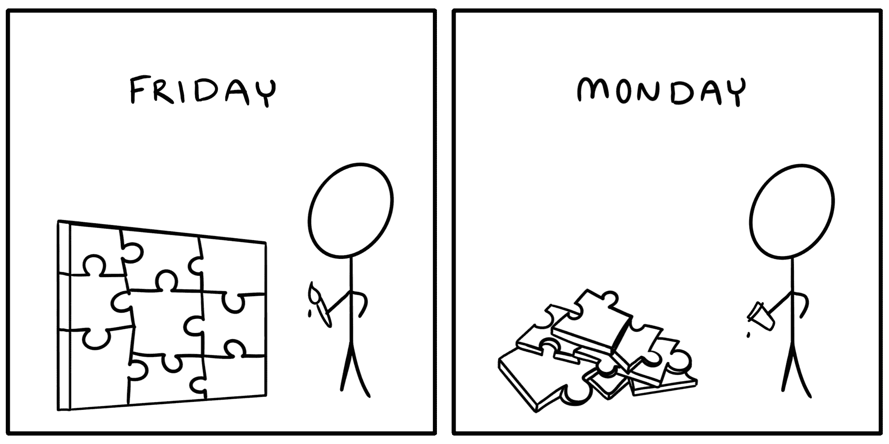

# 如何写好文档

> 原文：<https://www.freecodecamp.org/news/how-to-write-good-documentation/>

在本文中，我将分三步讨论永远不要忘记项目如何工作的秘密。

如果你曾经在休假前写了一半的软件项目，当你重新打开 IDE 时，你会发现你需要这篇文章。

Don't worry, it'll all come together by Friday again... (Comic by author)

在我领导的技术团队中，我们不断努力记录所有的事情。文档作为一个平等的参与者与代码共存。

这有助于确保没有人需要对某件事情如何工作做出假设，或者召集冗长的会议来获得某个特性的工作知识。好的文档为我们节省了大量的时间和麻烦。

也就是说，与流行的观点相反，最有价值的软件文档并不是主要为其他人编写的。正如我在这条广受好评的推文中所说:

> 好的文档的秘密是在你写代码的时候写文档。你是你的第一批观众。解释你在对自己做什么。将来你会感谢你的！

> —维多利亚·德雷克[2020 年 11 月 24 日](https://twitter.com/victoriadotdev/status/1331262801797652483?ref_src=twsrc%5Etfw)

这里有三个具体的步骤，你可以在为时已晚之前写好文档。

## 1.从准确的音符开始

当你用代码写出想法时，从准确的笔记开始，确保你不会很快忘记重要的细节。虽然您稍后会想用长格式向自己解释事情，但短格式的笔记足以捕捉细节，而不会中断您的编码会话流程。

在你的代码旁边打开一个文档，记下你使用的命令、决定和资源。这可以包括:

*   您键入的终端命令
*   为什么你选择了一种特殊的方法
*   你求助过的链接或者*咳*复制粘贴*咳*灵感
*   你做事的顺序

此时不要担心完整的句子。只要确保你准确地捕捉上下文，相关的代码片段和有用的网址。打开任何可用的自动保存选项也会有所帮助。

## 2.详细解释决策

处理这一步的理想时间是当你从编码中休息的时候，但是在你完全出去吃午饭之前，无论你正在做什么。

当你向自己解释时，你要确保背景、想法和决定在你的头脑中仍然是新鲜的。

检查你做的简短笔记，并开始将它们扩展到会话写作中。做自己的橡皮鸭。描述你正在做的事情，就像你在教别人一样。您可以涵盖以下主题:

*   古怪的决定:“我通常会这样做，但我选择做一些不同的事情，因为…
*   你遇到的挑战以及你是如何克服的
*   支持项目目标的架构决策

紧扣要点。长篇大论的写作并不意味着你会按字数付酬！使用完整的句子，就像向同事解释你的项目一样。毕竟，你在向未来的你解释。

## 3.不要忽视必备知识

这一步最好在长时间的午休后完成，甚至是第二天(但可能不是两天)。重读你的文档，并在你和项目之间拉开距离后，填补任何明显的空白。

特别注意填写或至少链接到必备知识，尤其是如果您经常使用不同的语言或工具。即使像粘贴到您使用的 API 文档的链接这样小的操作也可以节省未来搜索的时间。

记下或链接到阅读材料、安装步骤和相关支持问题。对于频繁执行的命令行操作，您可以使用一个[自文档 Makefile](https://victoria.dev/blog/how-to-create-a-self-documenting-makefile/) 来避免每次回到项目时不得不执行`man`常见任务。

即使只是短暂地离开项目，也很容易忘记支持细节。捕捉这次你发现的任何有用的东西。

## 记录所有的事情！

下次你发现自己在想，“我肯定会记住这一部分，没必要写下来，”只要回忆一下这个表情符号:🤦‍♀️

软件项目不仅仅是由代码组成的。为了更好地为你未来的成功做准备，记录下所有的事情！无论它是你已经建立的过程、作为代码的基础设施，还是一个转瞬即逝的未来路线图想法——把它写下来！将来你会为此感谢你的。

如果你喜欢这篇文章，我很想知道。在 victoria.dev 上加入成千上万和我一起学习的人吧！请访问并订阅更多关于构建您的编码技能堆栈的信息。