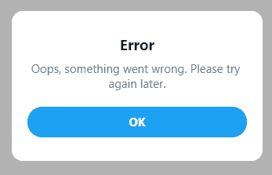
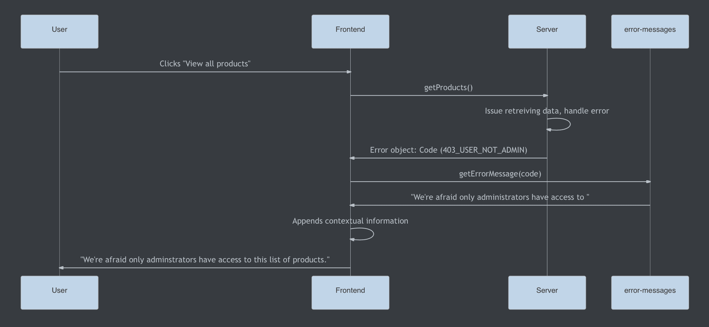
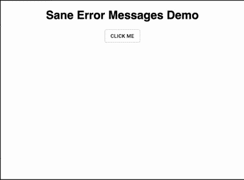

# 如何编写有用的错误消息来改善应用程序的用户体验

> 原文：<https://www.freecodecamp.org/news/how-to-write-helpful-error-messages-to-improve-your-apps-ux/>

无用的通用错误消息的时代已经一去不复返了。



*Screenshot taken moments before a rage-quit*

如果你在这里，你可能关心的是让你的面向用户的产品尽可能的令人愉快。错误消息在其中扮演着重要的角色。

有了有用的错误消息，最终用户就可以尽可能愉快地面对令人沮丧的场景。

这篇文章分为两部分。第一部分围绕错误消息以及它们为什么重要来构建上下文。无论您是否是 JavaScript 开发人员，这一部分都会很有用。

第二部分是一个简短的后续部分，帮助您开始管理自己的错误消息。

## **错误消息的当前状态**

在一个完美的世界里，错误消息是多余的，用户可以使用你构建的任何东西——好的，没问题——但是错误会发生，你的最终用户会遇到错误。

这些错误可能源于:

*   验证失败
*   服务器端故障
*   限速
*   破损代码
*   不可抗力

当出现问题时，面向客户端的错误消息通常以两种方式之一出现:

*   无意义信息的一般错误，例如`Something went wrong, please try again later`
*   服务器发送的来自堆栈跟踪的超级特定消息，例如`Error 10x29183: line 26: error mapping Object -> Int32`

两者对我们的最终用户都没有帮助。

对于我们的用户来说，一般性的错误会产生一种无助和沮丧的感觉。如果他们收到这样的消息，他们就无法完成一个动作，也无法知道为什么会发生错误，以及如何(或是否)解决它。这可能导致失去最终用户的信任，失去客户，或愤怒的评论。

另一方面，超级特定的错误消息是一个有漏洞的抽象，不应该被我们的最终用户看到。

首先，这类错误提供了关于服务器端逻辑的实现信息。这是一个安全问题吗？大概？我不是验笔师。

第二，如果我们的业务是打造引人入胜的用户体验，(你为什么不呢？)我们的错误消息应该是人性化的，面向服务的。这是我接触到的许多资料中都有的观点，其中许多我已经包括在最后的延伸阅读部分。

## 为什么我应该创建 sane 错误消息？

### 为了帮助保持开发人员的理智

搜寻 bug 很难，扫描日志也很乏味。有时我们会被告知事情失败的原因，有时则不会。如果最终用户报告了一个 bug，他们能向我们提供尽可能多的有用信息是很重要的。

一个用户报告说:

`Hi, I was using the app sometime last night updating my profile and all of a sudden it stopped working. The error said something about a validation error, but I don't know what that means`

远不如:

`Hi, I was using the app sometime last night updating my profile and all of a sudden it stopped working. The error said "We had trouble updating your details. Your address must be located within the EU" but I live in England`

这节省了我们的时间，减少了转移注意力的事情。一个清晰具体的错误信息也可以帮助最终用户理解他们自己做错了什么，并允许他们改正错误。

### 帮助保持组织的健全

合理的错误消息也能在组织层面上带来好处。对于那些在大公司工作的人来说，复制/信息传递可能是一个完全独立的部门的职责。代码中需要修改副本的地方越多，副本就越容易与公司的品牌方针不同步。

相反，把你所有的错误信息放在一个来源中会让那些拥有拷贝的人更容易遵守那些品牌准则。

其他部门，如支持团队，可能会被来自用户的支持票淹没。如果您是一名工程师，为什么不联系您的支持团队，看看通过改进错误消息传递可以避免多少支持罚单。

当用户不正确地填写表单、缺少数据或没有特定操作的权限时，解决您的消息传递问题可能会对支持团队的生活产生积极影响。

### 为了帮助维护最终用户的理智

通过提供合理的错误消息，我们希望不会让我们的最终用户感到无助。

如前所述，我们的消息传递应该是 **服务* - *面向** 。他们应该指导我们的用户如何完成他们的过程，或者至少让他们知道如果问题超出了他们的控制范围，他们可以去哪里寻求帮助。

在乔恩·亚布隆斯基的《UX 法则》一书中，他描述了一个心理学概念，叫做“峰端法则”:

> 人们对一段经历的评价很大程度上是基于他们在巅峰和结束时的感受，而不是这段经历每一刻的总和或平均值

在这篇文章的上下文中，如果人们变得如此沮丧以至于离开你的站点，他们对你的应用程序的持久记忆是使用它是多么令人沮丧。

错误信息在防止这一点上起了很大的作用，因为它们可以充当最后的把关人，防止用户陷入困境而沮丧地退出你的应用程序。

如果有人出于交易目的使用你的产品，比如买机票或网上购物，而他们在一项任务中突然停下来，没有办法继续下去，那么他们离开你的网站去另一个网站的可能性就会大增。又一个流失的顾客。

虽然这完全是轶事，但我经常因为不知道如何完成一个过程而离开网站——要么当我点击一个按钮时什么也没发生，要么我只是不断收到模糊的错误信息。

除非这些网站/应用是为数不多的无处不在的平台之一(像谷歌、Instagram、苹果)，否则我可能从那以后就没用过它们。我相信你甚至能记起发生在你身上的事情。事实上，我会通过 [Twitter](https://twitter.com/andricokaroulla?lang=en) 公开欢迎可怕的错误信息图片

如果事情不顺利，使用合理的错误消息传递可以帮助抵消这种挫败感。令人惊讶的是，创建一个有用的错误消息只需要一些特性。

## 什么是好的错误消息？

摘自 [Microcopy:完整指南](https://www.microcopybook.com/)。有用的错误消息应该满足以下条件:

*   解释清楚有问题
*   解释问题是什么
*   如果可能，提供一个解决方案，以便用户可以完成该过程，或者
*   告诉他们可以去哪里寻求帮助
*   让令人沮丧的场景变得尽可能愉快

这听起来似乎很难用几句话来概括，但这里有一些我认为是好的错误消息的例子:

*   我们限制了您每小时重置密码的次数。你可以稍后再试。
*   请登录以查看此档案
*   我们无法创建您的个人资料，只有英国居民可以使用我们的应用。

值得注意的是，我不是 UX 的研究员/设计师，只是一个对 UX 有浓厚兴趣的前端开发人员。可能我上面的例子没有抓住你的项目或组织需要什么。

也就是说，如果你是一名前端工程师，改善你的组织的错误消息传递是一个提升技能和与 UXer 同事合作的绝佳机会。

## 我怎样才能开始写理智的错误消息呢？

我开源了一个叫做`sane-error-messages`的简单工具。运行该工具将生成一个全新的 repo，用来存放您的默认错误消息。您可以调整默认值，添加或删除消息，然后将其发布到面向客户端的应用程序中。

`sane-error-messages`的工作原理是将你所有的消息聚集到一个 JavaScript 对象中。键是错误代码，值是相应的消息。

错误代码应该与您从服务器收到的代码相同，例如`POSTS_NOT_FOUND`或`CONFLICTING_USER_RECORD`。您的错误消息传递 repo 公开了一个从错误代码中获取错误消息的函数。

这种方法的灵感来自于像 [Cypress](https://www.freecodecamp.org/news/p/009d4c55-b3e6-4e48-b186-541f5959af8c/*https://github.com/cypress-io/cypress/blob/develop/packages/server/lib/errors.js*) 这样的工具处理错误消息的方式。

只要您的服务器返回可预测的错误代码，服务器端的实现就无关紧要。以下顺序只是实现 **`sane-error-messages`** 的一种方式



Having a separate repo becomes more important the more user-facing apps you have.

简而言之:

*   用户“查看所有产品”
*   前端发出网络请求
*   网络请求失败，并返回错误代码“USER_NOT FOUND”
*   前端从您的`error-messages`包中请求相应的错误消息。
*   前端应用任何相关的上下文信息
*   前端向最终用户显示这些信息。

如果你想亲自尝试一些东西，你可以玩这个 [CodeSandbox](https://codesandbox.io/s/amazing-platform-dxtjc?file=/src/App.js) 。CodeSandbox 向模拟服务器发出一个请求，该服务器随机返回 12 个错误代码中的 1 个。

客户端将使用错误代码从错误消息报告中检索相同的错误消息。然后，客户端向用户显示错误消息。如果代码没有指定的消息，就会显示一般的回退(这很糟糕)。



Some sane error messages in the wild

## 如何设置您的错误信息

注:你可以在这里找到[回购。如果你在教程过程中遇到任何问题，你可以提交一个 GitHub 问题。](https://github.com/andrico1234/sane-error-messages#readme)

从跑步开始

`yarn global add sane-error-message`

然后

`sane-error-messages create <dirName>`

来支撑你的项目。这样做将创建一个全新的模块，您可以自定义默认的错误消息。

您的新模块使用`tsdx`来处理所有的模块管理脚本，比如运行、构建和测试。

你可以在这里了解更多关于 [tsdx 的信息。](https://www.freecodecamp.org/news/p/009d4c55-b3e6-4e48-b186-541f5959af8c/*https://tsdx.io/*)

简而言之，新包的内容将如下所示:

```
/* errorCodes.ts: The file that defines each error code like */
const USER_NOT_ADMIN = '403_USER_NOT_ADMIN'

/* defaultErrorMessages.ts: Maps each code to a default message */
const errorCodes {
  // your codes and messages go here...
  [USER_NOT_ADMIN]: "We're afraid only administrators have access to "
}

/* ErrorMessages.ts: The class you'll use to instantiate your error messages object in the consuming project */
class ErrorMessages {
  // You can override default messages with more specific ones
  constructor: (customErrorMessages: Partial<Record<string | number, string>>): ErrorMessages;

  // Pass through an error code to get your custom message
  getErrorMessage: (code: string | number, fallbackMessage?: string): string;

  // Checks to see if the argument is a valid error code and acts as a guard for non-ErrorCode values
  isErrorCode(code: string | number): boolean;

  // Returns the errorCodes object with your custom messages
  messages: Record<ErrorCode, string>
}

type ErrorCode = ValueOf<errorCodes>
```

## 如何使用你的错误信息

如果您创建了一个名为`custom-error-messages`的回购，并将其发布到 npm，您可以通过执行以下操作在您的应用程序中使用它:

```
import { ErrorMessages } from 'custom-error-messages';

const customErrorMessages = {
  '400_validation': 'Please enter the fields in your form correctly',
};

// Initialise your errorMessages object with your custom messages
const errorMessages = new ErrorMessages(customErrorMessages);

function riskyFunction() {
  try {
    // Throws an error 
    await boom();
  } catch (err) {
    // Get the error code our server sent over
    const { code } = err;

    // Get the code's corresponding message
    const message = errorMessages.getErrorMessage(code);

    // Display the message to the client
    displayNotification(message);
  }
}
```

然后，您可以获取服务器端返回的所有错误代码，并对它们应用相应的消息。

准备就绪后，您可以将工具发布到 NPM，然后从面向客户端的应用程序中使用它。

## **结论**

我希望你喜欢学习 web 开发中一个经常被忽视的方面。

为了了解错误消息，我做了大量的阅读，并在下面分享了一些我最喜欢的资源。有些是书，有些是短文，但它们都值得你花时间去读。

如果教程的任何部分不清楚，或者如果你觉得我可以简化事情，你也可以联系我。感谢阅读。

## 常见问题

### 为什么服务器端不能直接返回这些消息？

服务器不应该关心任何面向客户端的逻辑。但是，如果您足够幸运，能够使用一个 API，为每个失败的请求提供有用的错误代码，那么您就快成功了。

### 我需要为每个 API 消费者创建一个错误消息的实例吗？

不一定。因为这个包可以接受默认消息和代码的列表，只要它与 API 同步，您的前端将能够使用相同的包。

在每个客户端实例中，您可以传递额外的错误代码，或者覆盖现有的消息来定制您的前端消息传递。

### 我认为这个包应该有 X 或者做 Y 不同

我在工作中在内部研究这个问题，这是一个我非常陌生的问题空间。我很乐意听到对 **`sane-error-messages`的整体架构或功能集的任何建议或改进。**

## **延伸阅读**

****Microcopy:一个完整的指南****
我之前提到过这本书，它是我最喜欢的一本书，可以让我面向用户的产品更加人性化。

这本书的作者金内特·伊弗拉赫慷慨地提供了一张九折优惠券，你可以在这里购买。

电子书优惠券代码:安德里科电子书

捆绑包的优惠券代码:andrico-bundle

****错误消息指南:NN Group****
一篇关于 sane 错误消息重要性的短文，其中分享了一些关于如何创建 sane 错误消息的非常有用的提示。

简而言之:

*   错误应该用简单的语言表达出来
*   指出问题所在
*   建议一个解决方案

****错误消息(设计基础知识):微软****
一篇[深入的文章](https://docs.microsoft.com/en-us/windows/win32/uxguide/mess-error)，涵盖了两种设计指南消息传递实践

****UX 定律****
一本[的小册子](https://www.amazon.co.uk/gp/product/149205531X/ref=as_li_tl?ie=UTF8&camp=1634&creative=6738&creativeASIN=149205531X&linkCode=as2&tag=calistheni02b-21&linkId=3f089ce27d59c4eeb48522be9ac52fb2)介绍了一些心理学概念如何被用来改善你的产品 UX。