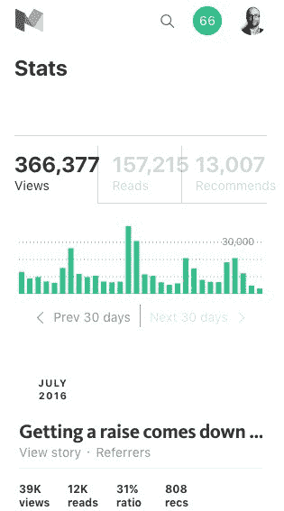
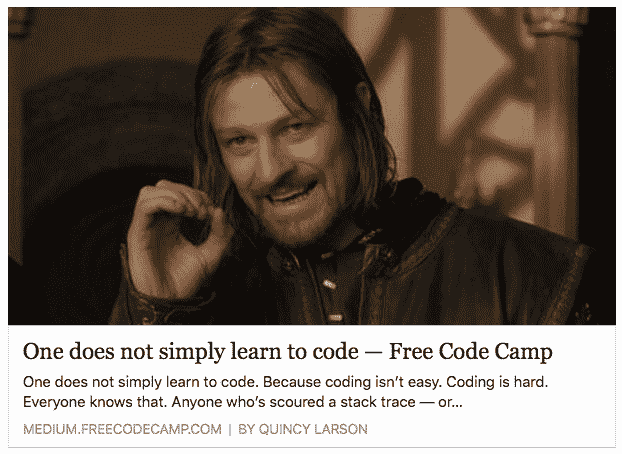
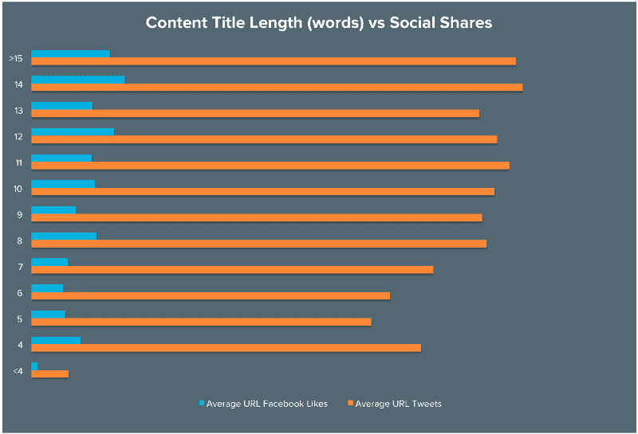

# 如何写出人们会真正阅读的媒介故事

> 原文：<https://www.freecodecamp.org/news/how-to-write-medium-stories-people-will-actually-read-92e58a27c8d8/>

每月有超过 3000 万人使用 Medium。他们来这里寻找值得一读的东西。一些实质性的东西。你可以给他们。

Medium 的算法让你置身于一个公平的竞争环境。你的故事可以主宰新闻。你可以破解 Medium 的头条新闻列表。你可以打败专业作家和名人。

我会告诉你怎么做。

但是你为什么要关心一些软件开发人员对写作的看法呢？

A screenshot of my Medium stats page.

因为在过去的 30 天里，我的媒体报道平均每天有 12000 次点击。Medium 的读者已经推荐了我的故事 13000 次。我是媒体最大的出版物之一的编辑。

简而言之，我知道在媒体上写什么是有效的。

但是好的文笔如果不能引起人们的注意，对你没有任何帮助。

#### 吸引大众的武器

作为一个作家，你在和冷漠作战。你必须迫使人们足够关心你，才会点击进入你的故事。你必须说服他们给你一个机会。

面对铺天盖地的新闻提要，你只有两种武器:标题和图片。

以下是一个故事在 Medium 的新闻源中的样子:

这是它在脸书的样子:

这是它在推特上的样子:

你的标题和开头形象是人们评判你的故事的唯一依据。在他们阅读你故事的第一段之前，他们必须回答一个问题。这是我们每天都在问自己的同一个问题:**这值得我花时间吗？**

作为一名作家，你的首要任务是选择一个能让人们回答“是”的标题和图片

#### 标题:部分艺术，部分科学

你的标题是你故事中最重要的部分。花时间完善它。

BuzzFeed 依靠引人注目的标题建立了一个出版帝国。下面是对 6 万条 BuzzFeed 标题的词法分析，以及什么对它们最有效。

我不是说你应该使用类似 BuzzFeed 的标题。但是你应该意识到它们。它们充满了夸张和对错过的恐惧。想想它们的有效性对人类心理和自然新闻源有什么影响。

以下是一些适合在媒体上使用的标题类型:

*   像“X 结束了”、“X 坏了”或“X 是牛****”这样的豪言壮语
*   使用负面词汇的标题，如“停止”、“永远不要”和“再也不要”
*   “我 _____ 并且它是 _____”模式(例如:“我早餐吃了比萨饼，它很棒”)

你的标题应该有多长？HubSpot [分析了](http://blog.hubspot.com/marketing/seo-social-media-study#sm.00000z83pnwr7kdwxvrrsinzxyr7l)6000 篇博文，发现标题为 8 到 14 个字的故事获得了更多的社交媒体份额。

另一个需要考虑的是标题的情绪化程度。标题越情绪化(积极或消极)，人们就越有可能点击它。

这里有一个[工具](http://coschedule.com/headline-analyzer)可以帮助你平衡标题的长度和情绪。

A screenshot of the tool’s analysis of this story’s headline. Your mileage my vary.

标题传统上是用“标题格”写的美联社说“除了冠词、并列连词和三个或更少字母的介词，每个单词的第一个字母都要大写。”

在 Medium 上，我经常把标题格扔出窗外，就像普通句子一样写标题。必要时，我甚至包括标点符号。这种格式更具对话性，也更容易阅读。

#### 引人注目的图像

你的故事第二重要的方面是它的开头形象。

Medium 为您的开始图像分配 og-image 元属性。这意味着你的开场图片将在任何地方充当你的故事的大使:社交媒体新闻源、Reddit、谷歌新闻——甚至是 RSS 阅读器。

在这篇报道中，我选择了一张艾玛·斯通的照片，描绘了 20 世纪 60 年代一位满怀抱负的记者站在她的打字机前。这是 2011 年热门电影《救命恩人》中的一句话

某人坐在笔记本电脑前的照片看起来太普通了。我们的新闻源已经充满了这些图片。

不过，如果你确实想使用库存照片，你可以在你的故事中使用大量免费的[知识共享许可库存照片](http://finda.photo/)。

我建议在整个故事中保持照片主题的一致性。这是另一张艾玛·斯通文字的图片。这有助于打断较长的文本。

有一个故事，我只用了《黑暗骑士》三部曲中的图像:

[**薪资谈判:如何不把一堆钱点着**](https://medium.freecodecamp.com/salary-negotiation-how-not-to-set-a-bunch-of-money-on-fire-605aabbaf84b)
[*突击测验，热拍。*medium.freecodecamp.com](https://medium.freecodecamp.com/salary-negotiation-how-not-to-set-a-bunch-of-money-on-fire-605aabbaf84b)

我只用了《广告狂人》中佩吉·奥尔森的照片作为另一个例子:

获得加薪归结为一件事:杠杆。
[*也许你在你的工作岗位上已经有一段时间了，你的工资还没有跟上你所在城市的生活成本。*medium.freecodecamp.com](https://medium.freecodecamp.com/youre-underpaid-here-s-how-you-can-get-the-pay-raise-you-deserve-fafcf52956d6)

这些故事在正文中没有提到黑暗骑士或者广告狂人。这些图像在视觉上强化了每个故事的信息，同时也增添了它们的味道。

> 一勺图像有助于文字往下走。

另一个流行的技巧是在你的开场图片上突出你故事的标题。我的朋友 Kristyna 在 Medium 上最受推荐的故事中这样做了:

[**学习新事物的 37 个最佳网站**](https://entrepreneurs.maqtoob.com/the-37-best-websites-to-learn-something-new-895e2cb0cad4)
[*你绝对没有理由不掌握一项新技能，扩展你的知识面，或最终促进你的职业……*entrepreneurs.maqtoob.com](https://entrepreneurs.maqtoob.com/the-37-best-websites-to-learn-something-new-895e2cb0cad4)

在写作过程的早期就开始考虑图像。永远不要在没有至少一张图片的情况下发布。否则你的故事将会在新闻报道中消失。

#### 以强大的领先优势建立势头

一旦你的读者点击进入你的故事，审判就开始了。他们正在寻找任何借口跳转回他们的新闻源。阅读比浏览猫的照片需要更多的努力。

不要浪费时间在介绍或更新上——立即开始提出观点并讲述你的故事。

#### 建立信誉

想办法在前几段建立你的可信度。如果你是你所在领域的顶尖专家，就这么说。不要假设人们会花时间用谷歌搜索你。

> "你的声音太大了，我听不见你在说什么。"——拉尔夫·瓦尔多·爱默生

你是以非医生的身份写健康吗？你是以非百万富翁的身份写个人理财吗？你需要克服读者对你可信度的任何怀疑。

我通过发布我最近的媒体统计数据，建立了我作为一个作家的信誉。你需要找到一个你可以吹嘘的成就。给你的读者留下“这个人知道他们在说什么”的印象

在整个故事中强化你的可信度。用数据支持你的论点。使用内联链接到(非付费的)研究。

这不是新英格兰医学杂志。这是中号的。所以不要用脚注。

#### 写得聪明

好的文笔很难。像任何技能一样，它需要练习。成为一名优秀的作家没有捷径可走。

帮自己一个忙:**写出你所知道的**。

你听说过“作家群”这个词吗？当你对一个话题了解不多，无法写下来时，就会出现文思枯竭。解药是研究。学习。到野外去。

不要发表任何你不引以为豪的东西。媒体不是数字游戏。这是一种社会契约。人们追随你。反过来，你也尊重他们宝贵的时间。

好的媒介故事不是自然产生的。对于每一分钟的故事长度，至少要花一个小时来写、重写和编辑你的故事。

说到故事长度…

#### 中等读者喜欢较长的故事。

Medium 的数据科学家发现，7 分钟是 Medium 故事的最佳长度。

实际上，一个故事应该有多长就有多长，不要太长。

如果你不能想出至少 5 分钟的想法，重新考虑你的故事的前提。

一个例外是大部分是图像、嵌入或代码的故事。

#### 以六年级的水平写作

仅仅因为你的许多读者上过大学，并不意味着他们喜欢大学水平的阅读。他们中的许多人都不是以英语为母语的。

将你的故事粘贴到[海明威编辑器](http://www.hemingwayapp.com/)中。这将突出密集的句子，副词，被动语态，和其他风格问题。它还会给你的整体写作评分。

不管你在英语作文课上学到了什么，比起“文字墙”，人们更喜欢短段落

单句段落没什么不好。

宁可创造新的段落。

#### 添加 5 个标签

Medium 允许您为您的故事添加最多五个标签。使用它们。

人们在媒体上关注特定的话题。最受欢迎的是#科技、#生活课程、#旅行、#设计和#创业。

关注您使用的标签的人可以在他们的新闻订阅源中看到您的文章。标签也让人们更容易在搜索结果中偶然发现你的故事。

#### 在社交媒体上推广你的故事

一旦你点击发布，你的故事将开始在 Medium 的推荐引擎中“腐烂”。久而久之，它会出现在更少的新闻提要。抵消这种衰退的唯一方法是获得更多的观点和推荐。

最初的几个小时至关重要。确保你的故事立即得到一些推荐。这些将作为概念证明。

同龄人的压力是强大的。如果其他人已经点击了推荐心脏，则人类更有可能点击该心脏。

在脸书、推特和 LinkedIn 上分享你的故事。你可以实时查看你的故事的[状态](https://medium.com/me/stats)。向你的朋友和追随者寻求反馈。将这些反馈融入你的故事中。

一旦人们推荐了你的故事，就在相关的 Reddit 子网站和脸书群组上分享它。

如果你有一个邮件列表，你也可以把它发给你的订户。

#### 将你的故事提交给大型专业出版物。

接触更多读者的另一种方法是在媒体的出版物上联合你的故事。这些是作家和编辑的社区，他们专门撰写一些关键话题，如健康或教育。

例如，自由代码营的媒体出版物(我是其编辑)专注于开发、设计和数据科学。它有超过 50，000 名追随者。

当一个出版物联合你的故事，它会出现在它的追随者的新闻提要中。出版物也可以在他们的登陆页面上展示你的故事。

找出这些出版物的编辑是谁，并向他们推销你的故事。

#### 求大家推荐分享。

介质还是挺新的。大多数人不明白它的推荐和关注机制是如何工作的。

这是我在 Medium 上扩大读者群的最后一个建议:在你的故事底部包括说明和自定义的 GIF 图片。这将向人们展示如何推荐你的故事并关注你。

我只写编程和技术。如果你在推特上关注我，我不会浪费你的时间。？