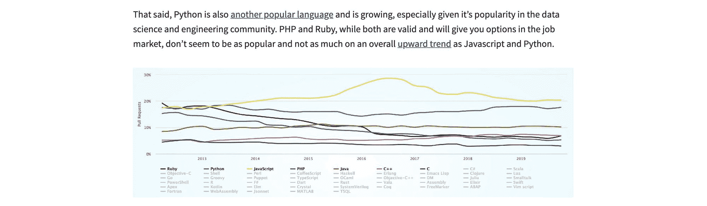

# 如何更有效地写作并形成自己独特的风格

> 原文：<https://www.freecodecamp.org/news/how-to-write-more-effectively-and-develop-your-unique-style/>

写作是我们所有人分享思想和经历的重要方式。虽然内容本身很重要，但我们还能做些什么来更有效地表达我们的想法呢？

## 为什么写作首先是重要的？

每个人都有自己的理由来解释为什么写作对他们很重要，但是写作的某些方面可以帮助我们所有人。

写作是教别人和教自己的一种方式。虽然写一份技术指南显然有助于教听众，但你也在强化自己的学习。记录你的经历不仅提供了一种深入挖掘你所学知识的方法，也给了你一种在未来参考它的方法。

虽然写作对一些人来说比对其他人来说更容易，但并不一定要可怕！不管你是新来的还是有经验的，总会有人从你的角度学习。

写作最大的好处是你可以为自己而写。如果你想通过写作来帮助自己成长，你可以私下这样做，千万不要和公众分享！但是在做决定的时候，要权衡利弊，因为在公共场合学习还是有好处的。

那么现在你确信了，你能做些什么来使你的写作更有效呢？

## 用标题组织你的内容

让别人阅读你的内容已经够难了，但是当你有一大堆文本时，这只会让挖掘变得更加令人生畏。

自然地，在阅读时，设置断点有助于让你的大脑保持思维有序，并理解页面的层次结构。通过使用标题，我们可以有效地将我们的想法分解成大块的内容，这样可以帮助其他人更容易理解。

React's use of headings on their [documentation website](https://reactjs.org/docs/add-react-to-a-website.html)

解决这个问题的一个简单方法是在你深入研究之前想好你的页面的轮廓。写这篇文章的时候，我想了想我要讲什么，按照什么顺序讲我觉得最有意义。

尽管有些人可能已经理解了这篇文章，但在讨论我们如何变得更有效之前，解释一下为什么它很重要更有意义。在我写内容的时候，拥有这种流畅感也有助于我更好地表达我的想法。

从 SEO 的角度来看，这也是有帮助的。当你使用 [HTML 标题](https://developer.mozilla.org/en-US/docs/Web/HTML/Element/header)(这在大多数内容管理系统中很常见)，你是在向谷歌和其他搜索巨头传达你的页面是关于什么的，什么是最重要的。

通过有效地使用标题，你不仅可以帮助你的读者，还可以向搜索你页面的机器人发出正确的信号。

## 用图像可视化你的想法

与页眉类似，看到一堵没有可视断点的文本墙可能很难理解。我们可以分解这些内容并提供更多价值的另一种方法是添加图片来配合我们的想法。

图片有很多用处。对于复杂的概念，有一个图表可以帮助说明难以理解的厚数据。在一个句子中抛出一串数字更容易创造，但是提供一个图表可以帮助人们真正理解这些数字的含义。

[New York Times data visualization of running shoes](https://www.nytimes.com/interactive/2018/07/18/upshot/nike-vaporfly-shoe-strava.html)

添加一个新想法的例子可以帮助你把你的想法联系起来。这可以作为一种展示用例或者用成功的实现来激励某人的方式。

但是有时候图片是打破紧张的好方法。稍后我们会谈到寻找你的声音，但这是一种帮助塑造它的方法。虽然有趣的 gif 可能不适合出现在科学论文中，但它可能是在技术演练中获得笑声的一个好方法，特别是在完成一个枯燥、具有挑战性的部分之后！

Spongebob bored

## 链接到其他来源以获得更多的上下文和信任

写作时，我们大多数人可能会想到的最后一件事就是添加到其他页面的链接。但是这可以成为你使用的一个有价值的工具！

从你的读者的角度来看，链接到其他页面是展示你的作品权威的一种方式。你是在根据事实做主张吗？链接到那些事实！通过支持你的观点，你可以让你的读者相信你在做研究。

[Link and chart to show language popularity trends](https://www.colbyfayock.com/2020/02/how-to-become-a-full-stack-web-developer-in-2020/)

但你也在帮助你自己。如果你已经写了一段时间了，你已经有了很多想分享的好内容。为什么不用一些[内部链接](https://moz.com/learn/seo/internal-link)链接到你过去的一些作品呢？

当我解释为什么写作很重要时，这篇文章的第一句话是我以前的一篇文章的链接:[克服你对写作的恐惧以及你如何找到动力](https://www.colbyfayock.com/2020/04/overcoming-your-fear-of-writing-and-how-you-can-find-motivation)。我不需要重写所有相同的内容，我可以突出一个关键点，并提供一个链接，如果读者感兴趣的话，可以跟着读。我在帮助读者获得更多价值的同时，也分享了更多我的内容。

通过[外部链接](https://moz.com/learn/seo/external-link)提供到其他来源的链接也是有帮助的。除了与你的读者一起支持你的声明，你也帮助与搜索引擎建立信任，他们可以看到你链接到可信任的资源。

另外，其他网站的人也有可能看到你发送的链接。如果你给他们带来流量，而他们看到了你的工作的价值，他们可能会回报你，把人送到你这里来。

与标题类似，提供内部和外部链接是我们与读者和搜索引擎建立信任的另一个工具。

## 寻找你的声音

每个人在与他人交谈时都倾向于拥有自己独特的声音。我说的不是你的声音，而是你的风格。而是你使用的词语，你如何表达它们，以及你的经历。

你甚至可能会有一些不同的声音。有时我们需要在学校或工作环境中更专业一点，而在朋友和家人面前我们可以更放松。但是类似于你和人说话的时候，每个人写作的时候都有自己的声音。

这是会随着时间发展的。有些人运气好，发现得早，但是你写得越多，你就越能形成自己独特的风格，人们会越来越喜欢。

ThinkGeek's historically unique writing voice

这是你不需要也不应该伪装的。虽然如果你是代表别人写作，改变你写作的声音可能很重要，但当你从自己的角度写作时，试着做你自己，通过写作打开你的思维。

对我来说，它来自于我工作的激情。我喜欢做一名开发人员，所以当我写文章来帮助其他人完成他们自己的旅程时，我的声音自然就来了。试着记住你为什么写作，这将帮助你用激情塑造你的声音。

## 其他一些想法

这里还有几点值得一提。

### 代码片段

与图像类似，代码也是证明你观点的有效方式。它也证明是一种分享代码的方式，就像你在如何创建一样。

虽然很有帮助，但是注意不要滥用代码片段。您不希望长代码块超出页面，甚至超出页面的一半。如果代码很长，尝试使用类似于 [gist](https://gist.github.com/) 、git repo、 [CodeSandbox](https://codesandbox.io/) 或 [Codepen](http://codepen.io/) 的东西。

### 图像质量

没有人喜欢看质量差的图像。添加新图像时，确保分辨率足够高，以确保图像清晰，不会看起来模糊。

您也不希望过分使用高分辨率图像，因为图像越大，文件也越大。尽量避免大图片，这样你的读者就不必下载那些大文件了。

### 书写工具

试着熟悉你的书写工具。无论您是使用类似于 [Bear](https://bear.app/) 的东西来编写 markdown，还是喜欢直接在 CMS 中编写，都有大量的选项。

还有很多工具可以帮助你提高写作质量。海明威会分析你文章的可读性，并帮助指出你可以改进的地方。

## 有效的讲故事

这些只是一些可以帮助你讲述故事的工具。虽然我们都是为了自己的目的而写作，但是你可以使用这些工具来最终帮助提升你正在努力创作的伟大内容！

## 你有什么好的写作技巧？

[在 Twitter 上与我分享](https://twitter.com/colbyfayock)并开始对话！

*   [？在 Twitter 上关注我](https://twitter.com/colbyfayock)
*   [？️订阅我的 Youtube](https://youtube.com/colbyfayock)
*   [✉️注册我的简讯](https://www.colbyfayock.com/newsletter/)