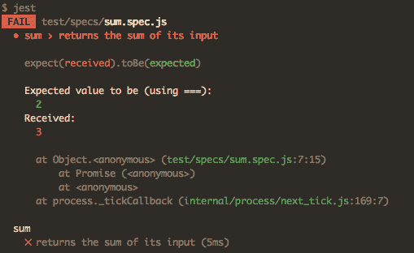
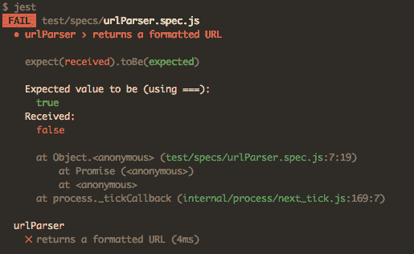

# 如何使用值断言编写更强大的单元测试

> 原文：<https://www.freecodecamp.org/news/how-to-write-powerful-unit-tests-using-value-assertions-3de5146c0088/>

作者:艾德·耶伯格

# 如何使用值断言编写更强大的单元测试


单元测试棒极了。编写单元测试[可以减少 40-80%的 bugs】。](https://www.computer.org/csdl/mags/so/2007/03/s3024.pdf)

但是你需要做好。写得不好的单元测试会窒息代码库，并导致比它们解决的问题更多的问题。

改进单元测试的一个方法是使用**值断言**。

在本文中，我们将看看什么是值断言，以及如何使用它们来改进您的测试。

### 理解断言

断言是进行检查以确保代码按照我们预期的方式运行的函数。

不同的语言有不同的约定。在 JavaScript 中，遵循`expect`模式是很常见的。这是您`expect`匹配一个值的条件的地方。

我们将`expect`函数与另一个叫做**匹配器**的函数结合起来。

在下面的例子中，我们将`sum(1,1)`的结果`expect`设为等于`2`。`toBe`匹配器检查期望值是否等于`2`。

```
expect(sum(1,1)).toBe(2)
```

如果`sum(1,1)`的结果等于`2`，该函数将不做任何事情，测试将通过。如果`sum(1,1)`不等于`2`，函数抛出**断言错误**，测试失败。

### 调试断言错误

在测试框架中，断言错误被格式化以使消息更容易阅读。断言错误可以让您快速找出测试中的错误。

您可以在下面看到一个失败的 [Jest](https://facebook.github.io/jest/) 断言错误:



A Jest assertion error

由于某种原因，`sum(1,1)`返回了`3`。

如果我们检查代码，我们会发现有人不小心把`b`加了两次:

```
function sum(a,b) {  return a + b + b}
```

我们可以快速修复错误，让`sum`函数再次工作。断言错误帮助我们找出哪里出了问题。

### 什么是价值主张？

值断言是比较两个值的断言。

我们刚刚写了一个价值断言:

```
expect(sum(1,1)).toBe(2)
```

它产生了断言错误:

```
Expected value to be (using ===): 2 Received: 3
```

### 还有哪些论断？

另一个常见的断言是布尔断言。

布尔断言是比较两个布尔的断言。

```
expect(add(1,1) === 2).toBe(true)
```

这将生成布尔断言错误:

```
Expected value to be (using ===): true Received: false
```

### 调试值断言

值断言抛出描述性断言错误。

当测试因值断言而失败时，您可以看到测试失败的原因。这为我们提供了代码中发生的事情的线索:

```
warning: expected 'somevalue' to equal 'some value'
```

当您看到这样的错误时，您知道应该在代码中寻找什么。哦，看起来有人不小心删除了一个空间。

值断言提高了单元测试的可调试性(是的，这是一个词)。通过阅读断言错误，您可以看到测试中哪里出错了。

让我们看看布尔断言的断言错误:



A Jest boolean assertion error

出了什么问题？

用布尔断言调试测试需要更长的时间，因为你不知道被测试的代码返回了什么值。

这使得布尔断言错误在单元测试中毫无用处。

### 编写价值断言

所以我们想写值断言。

大多数 JavaScript 测试库都提供了编写值断言的函数。

Jest 包含大量[有用的匹配器](https://facebook.github.io/jest/docs/en/expect.html)来创建价值断言:

```
.toBeGreaterThan(number).toContain(item).toHaveBeenCalled().toHaveProperty(keyPath, value)
```

### 行动呼吁

现在你理解了价值断言的力量，你的测试将会改进。

出去写一些可调试的单元测试吧！

如果你喜欢这篇文章，请给我一些掌声，让更多的人看到它。谢谢！