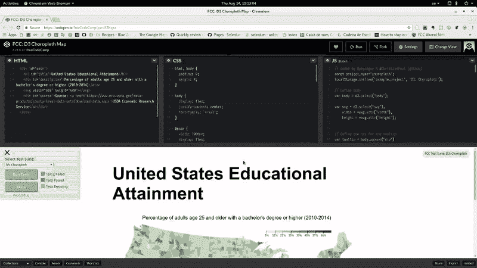
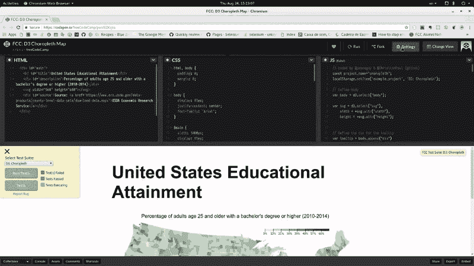

# 如何使用 Selenium 和 Node.js 编写可靠的浏览器测试

> 原文：<https://www.freecodecamp.org/news/how-to-write-reliable-browser-tests-using-selenium-and-node-js-c3fdafdca2a9/>

托德·查菲

# 如何使用 Selenium 和 Node.js 编写可靠的浏览器测试


有许多关于如何开始使用 Selenium 的 NodeJS 版本进行自动化浏览器测试的好文章。

有些用 Mocha 或 Jasmine 包装测试，有些用 npm 或 Grunt 或 Gulp 自动化一切。所有这些都描述了如何安装您需要的东西，并给出了一个基本的工作代码示例。这非常有帮助，因为让所有不同的部分第一次工作可能是一个挑战。

但是他们没有深入研究使用 Selenium 时自动化浏览器测试的许多问题和最佳实践的细节。

本文在其他文章停止的地方继续，将帮助您使用 NodeJS Selenium API 编写更加可靠和可维护的自动化浏览器测试。

### 避免睡觉

硒方法是你最大的敌人。每个人都用它。这可能是因为 [Selenium](http://seleniumhq.github.io/selenium/docs/api/javascript/) 的 Node.js 版本的文档很简洁，只涵盖了 API 的语法。它缺乏现实生活中的例子。

也可能是因为博客文章和像 StackOverflow 这样的问答网站上的大量示例代码使用了它。

让我们说一个面板从零到全尺寸的动画。让我们看看。



它发生得如此之快，以至于你可能没有注意到面板内部的按钮和控件在不断地改变大小和位置。

这是一个缓慢的版本。注意绿色的关闭按钮，您可以看到面板大小和位置的变化。



这对真正的用户来说几乎不是问题，因为动画发生得太快了。如果它足够慢，就像在第二个视频中，当这发生时，你试图手动点击关闭按钮，你可能会点击错误的按钮，或者完全错过按钮。

但这些动画通常发生得如此之快，你永远没有机会这样做。人类只是等待动画完成。硒则不然。它的速度如此之快，以至于它可以尝试单击仍处于动画状态的元素，您可能会得到一条错误消息，如:

```
System.InvalidOperationException : Element is not clickable at point (326, 792.5)
```

这是很多程序员会说“啊哈！我必须等待动画结束，所以我将使用`driver.sleep(1000)`来等待面板可用。”

#### 那么问题出在哪里？

`driver.sleep(1000)`语句做的和它看起来的一样。它停止执行你的程序 1000 毫秒，并允许浏览器继续工作。做布局，淡入或动画元素，加载页面，或任何事情。

使用上面的例子，如果面板淡入超过 800 毫秒，`driver.sleep(1000)`将**通常**完成你想要的。那么为什么不用呢？

最重要的原因是它不是[确定性的](https://en.wikipedia.org/wiki/Deterministic_algorithm#What_makes_algorithms_non-deterministic.3F)。这意味着它只能在某些时候起作用。由于它只在某些时候起作用，我们最终会得到在某些情况下会崩溃的脆弱的测试。这给了自动化浏览器测试一个坏名声。

为什么它只在部分时间有效？换句话说，为什么不是确定性的？

你用眼睛注意到的并不是网站上唯一发生的事情。元素淡入或动画就是一个很好的例子。如果这些事情做得好，我们不应该注意到它们。

如果您告诉 Selenium 首先找到一个元素，然后单击它，那么这两个操作之间可能只有几毫秒的时间。硒可以远比人快。

当一个人使用网站时，我们在点击之前会等待元素淡入。当淡入不到一秒钟时，我们可能甚至没有意识到我们在“等待”。Selenium 不仅更快、更不宽容，您的自动化测试还必须处理各种其他不可预测的因素:

1.  网页的设计者可能会将动画时间从 800 毫秒更改为 1200 毫秒。你的测试刚刚结束。
2.  浏览器并不总是完全按照你的要求去做。由于系统负载，动画实际上可能会停止，花费的时间超过 800 毫秒，甚至可能比你睡眠的 1000 毫秒还要长。*你的测试刚刚破了*。
3.  不同的浏览器有不同的布局引擎，对布局操作的优先级也不同。在你的测试套件中添加一个新的浏览器，你的测试刚刚突破了 T1。
4.  浏览器和控制页面的 JavaScript 本质上是异步的。如果我们示例中的动画改变了需要来自后端的信息的功能，程序员可能会添加一个 AJAX 调用，并在启动动画之前等待结果。我们现在正在处理网络延迟，并且不能保证面板显示需要多长时间。*你的测试刚刚打破了*。
5.  肯定还有我不知道的其他原因。即使是一个单独的浏览器也是一头复杂的野兽，它们都有缺陷。所以我们在讨论如何让同样的东西在几种不同的浏览器、几种不同的浏览器版本、几种不同的操作系统以及几种不同的操作系统版本上工作。
    在某些时候*如果你的测试不具有确定性，你的测试就会失败*。难怪程序员放弃自动化浏览器测试，并抱怨测试是多么脆弱。

当上述任何一种情况发生时，程序员通常会做什么来解决问题？他们将事情追溯到计时问题，因此显而易见的答案是增加 driver.sleep 语句中的时间。然后祈祷它涵盖了系统负载、布局引擎差异等所有可能的未来场景。是**不确定性**和**它破**，所以不要这样！

如果你还不相信，这里还有一个理由:你的测试会运行得更快。我们希望这个例子中的动画只需要 800 毫秒。为了处理“我们希望”并使测试在所有条件下都能工作，你可能会在现实世界中看到类似于`driver.sleep(2000)`的东西。

在你的自动化测试中，仅仅一步就损失了整整一秒**。经过许多步骤，它会快速增加。最近对我们的一个网页进行了重构测试，由于过度使用 driver.sleep 花费了几分钟，现在只需要不到十五秒。**

本文余下的大部分给出了具体的例子，告诉你如何使你的测试完全确定，并避免使用`driver.sleep.`

### 关于承诺的一个注解

Selenium 的 JavaScript API 大量使用了承诺，并且通过使用内置的承诺管理器很好地隐藏了这些承诺。这种情况正在改变，[将被弃用](https://github.com/SeleniumHQ/selenium/issues/2969)。

将来，你要么需要自己学习如何使用承诺链，要么使用新的 JavaScript 异步函数，比如`await`。

在本文中，示例仍然使用传统的内置 Selenium promise manager，并利用承诺链。如果您理解承诺是如何工作的，这里的代码示例会更有意义。但是如果你想暂时跳过学习承诺，你仍然可以从这篇文章中得到很多。

### 我们开始吧

继续我们的例子，我们想在一个面板上点击一个按钮，让我们看看几个具体的陷阱，可能会破坏我们的测试。

如果一个元素被动态地添加到页面中，并且在页面加载完成后还不存在呢？

#### 等待 DOM 中出现一个元素

如果在页面加载后将 CSS id 为“my-button”的元素添加到 DOM 中，以下代码将不起作用:

```
// Selenium initialization code left out for clarity
```

```
// Load the page.driver.get('https:/foobar.baz');
```

```
// Find the element.const button = driver.findElement(By.id('my-button'));
```

```
button.click();
```

`driver.findElement`方法期望元素已经存在于 DOM 中。如果不能立即找到元素，它将出错。在这种情况下，由于之前的`driver.get statement`，立即意味着“页面加载完成后”。

请记住，当前版本的 JavaScript Selenium 会为您管理承诺。因此，在进入下一条语句之前，每条语句都将完全完成。

**注意:**上述行为并不总是不可取的。如果你确定元素已经存在，那么它本身可能会很方便。

首先让我们看看错误的解决方法。被告知可能需要几秒钟才能将元素添加到 DOM 中:

```
driver.get('https:/foobar.baz');
```

```
// Page has been loaded, now go to sleep for a few seconds.driver.sleep(3000);
```

```
// Pray that three seconds is enough and find the element.const button = driver.findElement(By.id('my-button'));
```

```
button.click();
```

出于前面提到的所有原因，这可能会破裂，而且很可能会破裂。我们需要学习如何等待一个元素被定位。这相当容易，你会在网上的例子中经常看到。在下面的例子中，我们使用记录良好的`driver.wait`方法等待 20 秒，以便在 DOM 中找到元素:

```
const button = driver.wait(  until.elementLocated(By.id('my-button')),   20000);
```

```
button.click();
```

这有立竿见影的好处。例如，如果在一秒钟内将元素添加到 DOM 中，那么 driver.wait 方法将在一秒钟内完成。它不会等待指定的整整二十秒。

由于这种行为，我们可以在超时中放置大量填充，而不用担心超时会降低测试速度。不像`driver.sleep` 总是等待指定的整个时间。

这在很多情况下都行得通。但是有一种情况它不起作用，那就是试图单击一个已经存在于 DOM 中但还不可见的元素。

Selenium 非常聪明，不会点击不可见的元素。这很好，因为用户不能点击不可见的元素，但它确实让我们更加努力地创建可靠的自动化测试。

#### 等待直到元素可见

我们将基于上面的例子，因为在一个元素变得可见之前等待它被定位是有意义的。

您还可以在下面找到我们首次使用的承诺链:

```
const button = driver.wait(  until.elementLocated(By.id('my-button')),   20000).then(element =&gt; {   return driver.wait(     until.elementIsVisible(element),     20000   );});
```

```
button.click();
```

我们几乎可以就此打住，而你已经过得很好了。使用上面的代码，您将消除测试用例的负载，否则这些测试用例会因为元素没有立即出现在 DOM 中而中断。或者因为它不是立即可见的，例如动画。或者两个原因都有。

既然您已经理解了这种技术，就没有理由编写不确定的 Selenium 代码。这并不是说这总是容易的。

当事情变得更加困难时，开发者往往会再次放弃，求助于`driver.sleep`。我希望通过给出更多的例子，我可以鼓励你使你的测试具有确定性。

#### 写你自己的条件

由于有了`until`方法，JavaScript Selenium API 已经有了一些[的方便方法](http://seleniumhq.github.io/selenium/docs/api/javascript/module/selenium-webdriver/lib/until.html)可以和`driver.wait`一起使用。您还可以等到某个元素不再存在、某个元素包含特定文本、某个警告出现或许多其他情况出现。

如果你不能在提供的方便方法中找到你需要的，你将需要写你自己的条件。这实际上很简单，但是很难找到例子。有一个问题，我们将会谈到。

[根据文档](http://seleniumhq.github.io/selenium/docs/api/javascript/module/selenium-webdriver/lib/webdriver_exports_WebDriver.html#wait)，你可以给`driver.wait`提供一个返回`true`或`false`的函数。

假设我们想等一个柠檬变得完全不透明:

```
// Get the element.const element = driver.wait(  until.elementLocated(By.id('some-id')),  20000);
```

```
// driver.wait just needs a function that returns true of false.driver.wait(() => {   return element.getCssValue('opacity')          .then(opacity => opacity === '1');});
```

这似乎很有用，可以重复使用，所以让我们把它放在一个函数中:

```
const waitForOpacity = function(element) {  return driver.wait(element => element.getCssValue('opacity')          .then(opacity => opacity === '1');  );};
```

然后我们可以使用我们的函数:

```
driver.wait(  until.elementLocated(By.id('some-id')),  20000).then(waitForOpacity);
```

抓住你了。如果我们想在元素达到完全不透明后点击它呢？如果我们试图分配上面返回的值，我们不会得到我们想要的:

```
const element = driver.wait(  until.elementLocated(By.id('some-id')),  20000).then(waitForOpacity);
```

```
// Oops, element is true or false, not an element.element.click();
```

出于同样的原因，我们也不能使用承诺链。

```
const element = driver.wait(  until.elementLocated(By.id('some-id')),  20000).then(waitForOpacity).then(element => {  // Nope, element is a boolean here too.  element.click();}); 
```

这很容易解决。下面是我们改进的方法:

```
const waitForOpacity = function(element) {  return driver.wait(element => element.getCssValue('opacity')          .then(opacity => {      if (opacity === '1') {        return element;      } else {        return false;    });  );};
```

上面的模式是一个可重用的模式，当条件为 true 时**返回元素，否则返回 false，您可以在编写自己的条件时使用。**

下面是我们如何将它与承诺链结合使用:

```
driver.wait(  until.elementLocated(By.id('some-id')),  20000).then(waitForOpacity).then(element => element.click());
```

或者甚至:

```
const element = driver.wait(  until.elementLocated(By.id('some-id')),  20000).then(waitForOpacity);
```

```
element.click();
```

通过编写您自己的简单条件，您可以扩展使您的测试具有确定性的选项。但这并不总是足够的。

### 变消极

没错，有时候你需要的是消极而不是积极。我这么说的意思是测试一些不再存在的东西或者一些不再可见的东西。

假设一个元素已经存在于 DOM 中，但是在通过 AJAX 加载一些数据之前，您不应该与它交互。该元件可以用“装载…”面板覆盖。

如果你密切关注`until`方法提供的条件，你可能会注意到像`elementIsNotVisible`或`elementIsDisabled`或不太明显的`stalenessOfElement`这样的方法。

您可以测试“正在加载…”面板是否不再可见:

```
// Already added to the DOM, so this will return immediately.const desiredElement = driver.wait(  until.elementLocated(By.id('some-id')),  20000);
```

```
// But the element isn't really ready until the loading panel// is gone.driver.wait(  until.elementIsNotVisible(By.id('loading-panel')),  20000);
```

```
// Loading panel is no longer visible, safe to interact now.desiredElement.click();
```

我发现`stalenessOfElement`特别有用。它会一直等待，直到从 DOM 中删除了一个元素，这也可能在页面刷新时发生。

下面是一个等待`iframe`的内容刷新后再继续的例子:

```
let iframeElem = driver.wait(  until.elementLocated(By.className('result-iframe')),  20000  );
```

```
// Now we do something that causes the iframe to refresh.someElement.click();
```

```
// Wait for the previous iframe to no longer exist:driver.wait(  until.stalenessOf(iframeElem),  20000);
```

```
// Switch to the new iframe. driver.wait(  until.ableToSwitchToFrame(By.className('result-iframe')),  20000);
```

```
// Any following code will be relative to the new iframe.
```

### 永远要有确定性，不要睡觉

我希望这些例子能够帮助您更好地理解如何使您的 Selenium 测试具有确定性。不要依靠`driver.sleep`任意猜测。

如果您有问题或者您自己的使 Selenium 测试具有确定性的技术，请留下评论。