# React 单元测试手册+ Redux 测试工具包

> 原文：<https://www.freecodecamp.org/news/how-to-write-unit-tests-in-react-redux/>

在这个循序渐进的教程中，您将学习如何在 React 中轻松地开始单元测试。您将学习如何使用 React 测试库和 Jest 编写 Redux 状态测试以及基本的 Redux 切片测试。

## **🔐下面是我们将要讲述的内容**

*   您将会看到在 React 中设置您的第一个单元测试是多么容易。
*   你将提高你的一般反应知识。
*   您将会明白为什么测试驱动开发(TDD)对您的编码工作流程有帮助。

## ****📝**** 先决条件

*   您应该熟悉基本的 React 工作流结构(包括功能组件和挂钩)。
*   您应该对 Redux 有一个基本的了解(本指南中我使用的是 Redux Toolkit)。
*   你不需要任何关于测试的先验知识。
*   我使用的是`npm`安装方法，而不是`yarn`安装方法。

## ****🎯**** 客观

在学习 React 的高级概念时，您可能会偶然发现测试这个话题。对于任何即将到来的前端开发人员来说，能够使用自动测试也是非常方便的。

然而，当我自己学习 React 时，我很难找到关于如何为像 Redux 这样的库实现测试的信息(即使它是我一直在使用的库)。

除此之外，我发现当你不知道如何使用 Redux 库时，在 React 中进行任何组件测试基本上都是不可行的。

因此，我花了一些时间阅读 Redux 文档，并对其进行了反复研究。然后我决定写一个 React 中单元测试的实用入门指南，包括 Redux，分享一下我学到的东西。

因为我想采用一种现代的方法，所以我也将使用 Redux 工具包。我们将在本指南中讨论 Redux 实现。

### 我们将涵盖的内容:

首先，在我直接开始创建第一个通用单元测试之前，我将提供一些关于测试的一般信息。

接下来，我将简要介绍如何实现一些 Redux 工具包逻辑。

然后，我们将在使用 Redux Toolkit 的应用程序中进行一些单元测试。对于这一步，我们将调整我们先前创建的测试，以适应新的 Redux 环境。

这是一个循序渐进的指南。如果您是测试新手，我建议您按照从上到下的顺序来遵循这个指南。

我还为这个指南创建了一个[公共 GitHub 库](https://github.com/Matthes-Baer/unit-test-redux-article-app),并添加了一些注释。如果你想查找某样东西，而不需要从头到尾滚动一遍，你可以使用它。

## 目录

1.  有哪些不同种类的测试？
2.  [如何设置 React 测试环境](#how-to-set-up-your-react-testing-environment)
3.  [检查您创建的 React 应用程序](#-check-out-your-created-react-application)
4.  [如何创建你的第一个单元测试](#how-to-create-your-first-unit-test)
5.  [如何故意创建失败的测试](#how-to-create-a-failing-test-on-purpose)
6.  [如何创建一些额外的测试](#-how-to-create-some-additional-tests)
7.  [如何使用 React Redux 工具包进行测试](#-how-to-perform-testing-with-the-react-redux-toolkit)
8.  [高级测试展望](#-outlook-for-advanced-testing)

## 📋有哪些不同种类的测试？

这个快速指南不会为你提供关于所有不同种类测试的详细理论知识。在这一点上，你应该明白通常有三种测试:

*   单元测试
*   集成测试
*   端到端测试

简而言之:你可以看到这三种类型的测试的复杂性普遍增加。

虽然[单元测试](https://www.freecodecamp.org/news/unit-tests-explained/)涵盖了单一的功能和组件，但是集成测试通常关注多个功能以及它们之间的相互联系。[端到端测试](https://www.freecodecamp.org/news/end-to-end-testing-tutorial/)甚至更复杂，并且给出了关于多种功能和组件结构的见解。

还有其他的测试概念，但是这三个对于 web 开发人员来说是最重要的。

再一次，这真的是用简单的话来说。但是在这种情况下，知道单元测试基本上是这三个测试中最不复杂的就足够了。

一旦你对测试的一般工作原理有了基本的了解，使用单元测试也是很容易的。

我还想快速强调一下，测试您的应用程序主要有两种方法。

*   人工测试
*   自动测试

手动测试几乎就是你可能已经为你创建的所有应用程序所做的。当手动测试您的应用程序时，您基本上用`npm run start`启动您的 React 应用程序，并实际点击按钮来检查相应的功能是否工作。

另一方面，自动测试很大程度上是您创建的功能，它自动检查您的应用程序，以查看各个步骤是否如您在这些测试中定义的那样工作。这种自动测试对于大型项目来说是非常重要的。

有了这种自动化的方法，扩展您的测试也更加容易。最后，你会有很多测试，这些测试会在相对较短的时间内自动测试你的整个应用程序。这些测试可以帮助您发现开发过程中可能发生的任何潜在错误。如果您经常回去手动测试您的应用程序，这将花费更多的时间。

作为一名前端开发人员，能够使用自动测试通常对你的简历也是一个很大的加分。

## 🔧如何设置您的 React 测试环境

为了有一个实际的开始，我们将直接进入 React 应用程序。

您将看到测试环境的设置在 React 中相对容易——或者更准确地说，React 会在常规安装过程中为您完成所有工作。

因此，我创建了一个 React 应用程序，代码如下:

`npx create-react-app <name of your application>`

在这一步之后，我们需要在 React 应用程序中使用 Redux 应该添加的所有内容:

*   **React Redux:** `npm install react-redux`(例如提供一些强制挂钩)
*   **React Redux Toolkit:** `npm install @reduxjs/toolkit`(例如提供创建商店或切片的逻辑)

值得一提的还有 **Redux 核心** ( `npm install redux`)。但是这已经是 React Redux 工具包安装的一部分，所以我们不必在这里也安装它。

如果您想在没有 React Redux Toolkit 的情况下使用 React，那么您必须单独安装 Redux 核心。

您还可以使用`npx create-react-app my-app --template redux`从头开始创建一个新的 React 应用程序，它包括 React Redux 工具包、React 核心、React Redux 以及 React Redux 工具包中的一个模板。

如果您没有任何现有的 React 应用程序，请选择这种方法，因为它可能更方便。

在引擎盖下，您现在有了一个应用程序，它使用了结合了 **Jest** (一个测试框架)的 **React 测试库**。总之，它们拥有测试 React 应用程序所需的几乎所有东西。

你不必为此安装其他任何东西。这些工具是标准的 React 安装自带的。

## 🔎查看您创建的 React 应用程序

当您进入新创建的 React 应用程序时，您会发现您可能很熟悉的文件夹和文件结构。除了其他，还有一个`App.js`文件，它是这样创建的:

```
import logo from './logo.svg';
import './App.css';

function App() {
  return (
    <div className="App">
      <header className="App-header">
        
        <p>
          Edit <code>src/App.js</code> and save to reload.
        </p>
        <a
          className="App-link"
          href="https://reactjs.org"
          target="_blank"
          rel="noopener noreferrer"
        >
          Learn React
        </a>
      </header>
    </div>
  );
}

export default App;
```

current file structure of `App.js`

在`src`文件夹中，还有文件`App.test.js`。这个文件实际上是 React 安装的第一个测试。该文件的结构如下:

```
import { render, screen } from '@testing-library/react';
import App from './App';

test('renders learn react link', () => {
  render(<App />);
  const linkElement = screen.getByText(/learn react/i);
  expect(linkElement).toBeInTheDocument();
});
```

current file structure of `App.test.js`

例如，即使没有完全理解`render`或`screen`是什么，我们也可以看到我们的`App`组件正在发生一些事情。事实上，这是一个关注于`App`组件特定部分的单元测试。

虽然这个测试的第一个模板是一个测试外观的便捷表示，但是我想从头开始创建一个测试文件。

一般来说，测试被分成不同的测试套件。例如，这些测试套件通常是一组集中在同一个组件上的测试。同一测试套件中的测试基本上有相同的上级主题。

为了检查这一点，当您在 React 应用程序中时，尝试在您的终端中输入`npm run test`。

它可能会说“自上次提交以来没有新的测试或更改”——在这种情况下，只需在终端中输入`a`即可运行所有测试。

最后，您应该能够在终端中看到:

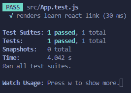

Result of `npm run test`

在顶部，可以看到`App.test.js`文件通过了。基本上，这个文件中的所有测试都是成功的。

在下面，你可以看到`renders learn react link`:这是对这个特殊测试的描述，我们可以单独定义。我们稍后将回到这一点。

再往下，我们终于可以看到测试套件和测试了。如您所见，我们有一个测试套件和一个测试。更准确地说，我们有一个测试套件包括这一个测试。

稍后，你会发现我们会使用 1-3 个测试套件，而大约会有 5 个以上的测试。同样，测试套件基本上提供了一个将单个测试组合在一起的结构。

快照的内容对于您的具体情况并不重要。

[快照](https://jestjs.io/docs/snapshot-testing)是一种先进的测试概念。因此，在一些操作发生后，参考快照(如拍摄的图像)将与版本进行比较。这有助于检查 UI 在一些操作之后是否保持不变，或者是否突然发生了一些变化。

在本文中，我不会重点讨论使用快照进行测试。这是一个在理解了一些单元测试基础知识之后，你可能想要查找的主题。

## 🔨如何创建您的第一个单元测试

现在我们已经看了单元测试，让我们开始第一个测试，我们将从头开始构建我们自己的测试。

为此，我想创建一个名为`__tests__`的新文件夹。这在您处理测试或检查其他应用程序时很常见。

我还将已经可用的`App.test.js`文件拖到这个文件夹中。这不会改变任何结果。

我们的文件夹结构现在看起来像这样:

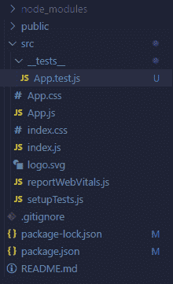

general folder structure with `__tests__`

在`__tests__`中，我们创建了文件`myFirstTesting.test.js`。我们需要这个`<test name>.test.js`的文件结构。您也可以用`<test name>.spec.js`创建一个测试文件——这两种方法都是一样的。

我们的第一步是导入`App.js`组件:`import App from "../App";`。

为了创建我们的第一个测试，我们必须利用`test()`函数。你也可以使用`it()`。两者都会达到同样的结果。

这个函数的第一个参数必须是一个字符串，它描述了我们将要测试的内容(还记得我们查看的测试文件中的“renders learn react link”吗？).这将有助于您在运行所有测试后有一个更精确的概述。

在这种情况下，我将使用描述`"renders logo in App component"`。第二个参数是我们使用匿名箭头函数的另一个函数。我们的`myFirstTesting.test.js`文件现在看起来像这样:

```
import App from "../App";

test("renders logo in App component", () => {

})
```

current file structure of `myFirstTesting.test.js`

即使没有发生太多事情，让我们再次尝试输入`npm run test`。我们将在终端中发现以下结果:


因此，我们现在有两个测试文件，产生了两个测试套件和两个测试。

现在我们想测试一些东西。因为我们添加了描述`"renders logo in App component"`，所以我们将测试它。

为了做到这一点，我们需要`render()`函数，每当我们真正想从应用程序中呈现一个组件时，我们都会用到它。

为了添加`render()`函数，我们必须从 React 测试库中导入它，它已经是我们 React 应用程序的一部分，没有任何其他安装。

当我们在导入的这一步时，让我们也导入`screen`(也是 React 测试库的一部分)。它提供了对不同函数的访问，这些函数会在某些东西被渲染后浏览当前屏幕，并找到特定的元素。

添加这两个导入后，我们的`myFirstTesting.test.js`文件现在看起来像这样:

```
import App from "../App";
import { render, screen } from "@testing-library/react";

test("renders logo in App component", () => {

})
```

current file structure of `myFirstTesting.test.js`

现在我们有了所有这些，让我们实际上开始我们的测试工作。

首先，我们需要渲染我们的组件。请记住，测试是自包含的，并且不知道我们在 React 应用程序中有一个带有相应内容的`App.js`。我们必须通过在测试的顶部使用`render()`来单独告诉特定的测试一个组件的存在。这将是这样的:`render(<App />);`。

既然我们已经在这个测试中呈现了`App.js`组件，我们应该尝试检查测试是否可以找到特定的内容部分。这样，我们实际上可以测试`App.js`是否像预期的那样被渲染。

假设出了问题，我们将无法找到 React 徽标，例如，它目前是`App.js`组件的一部分。

所以我们会尝试找到这个 logo，这是一个`img`元素。为此，我们可以利用`getByAltText()`函数，通过特定的`alt`属性找到元素，这通常用于图像。我们可以使用之前导入的`screen`来访问这个函数。

我们现在有了这个表达:`screen.getByAltText("logo")`。因此，测试查看我们预先呈现了`App.js`组件的屏幕，然后获取一个元素，该元素具有一个`"logo"`的`alt`属性。我们将把这一切与一个变量联系起来。

我们的测试文件现在看起来像这样:

```
import App from "../App";
import { render, screen } from "@testing-library/react";

test("renders logo in App component", () => {
  render(<App />);
  const image = screen.getByAltText("logo");
})
```

current file structure of `myFirstTesting.test.js`

有许多不同的函数，比如`getByAltText()`，可以用来查找具有特定文本内容、特定角色(比如按钮)的元素，甚至可以添加到实际元素中的测试 id。

你也有机会寻找多种元素。除此之外，你不必使用字符串作为参数。例如，带有`/logo/i`的正则表达式也是可行的。在本入门指南中，我们将使用不同的方法来查找元素。

对于最后一步，我们必须利用`expect()`，我们使用它来查看我们可以预期的行为。在这种情况下，我们期望我们的`image`变量是组件的一部分，因此存在。

对于这种方法，我们的文件如下所示:

```
import App from "../App";
import { render, screen } from "@testing-library/react";

test("renders logo in App component", () => {
  render(<App />);
  const image = screen.getByAltText("logo");
  expect(image).toBeInTheDocument();
})
```

current file structure of `myFirstTesting.test.js`

## ❗如何故意制造一个失败的测试

如果我们现在用`npm run test`运行我们的测试，一切都会通过。现在，让我们试着颠倒这个逻辑，这样我们实际上创建了一个失败的测试。这样，我们可以检查这个测试实际上是否有一些影响。

为此，我们可以进入我们的`App.js`文件，并更改徽标图像的`alt`属性。如果你把它改成`alt="loo"`，测试会失败，它会给你一些信息。

不过，在我们的例子中，我想改变测试本身的一些东西，使它失败，并向您展示另一个便于了解的表达式。我们也可以输入`expect(image).not.toBeInTheDocument();`来代替`expect(image).toBeInTheDocument();`。所以我们在这里加了一个`not`。这基本上颠倒了逻辑，现在测试期望没有这样的图像元素存在。

如果我们现在尝试运行测试，我们将在终端中发现以下错误消息:

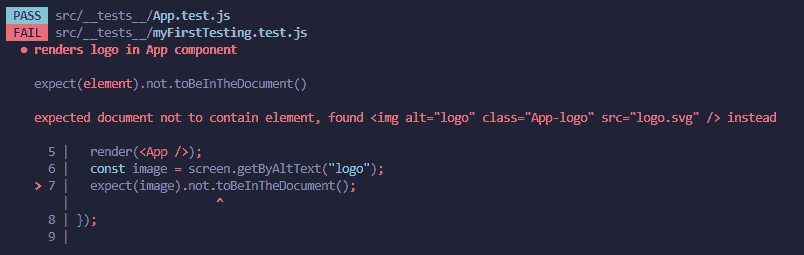

The error message we get

您可以看到测试预期没有像`image`这样的元素。但是，它发现了一些东西，因此用一个错误消息进行了回答。

你不必故意让你的所有测试都失败，以检查它们是否有效。我只是想让你看看真正失败的测试是什么样的。

## ✏️如何创建一些额外的测试

现在我们已经完成了我们的第一个测试，并且对单元测试有了一些基本的了解。接下来，我们将检查一些其他的测试示例。

为了创建一个更真实的场景，我将添加一个额外的组件，我们将把它插入到`App.js`组件中。

对于这一步，首先我们在我们的`src`文件夹中创建一个名为`components`的文件夹。这不是必须的，但是像这样构造文件是很常见的。

在`components`文件夹中，我们创建了`List.js`。我们的文件夹结构现在看起来像这样:

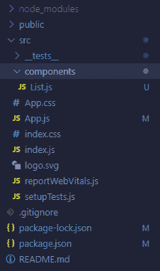

current folder structure

现在，让我们试着遵循更现代的测试驱动开发(TDD)工作流程。我不一定说这总是值得推荐的。但是现在越来越多的人认为 TDD 方法是最佳实践。

当然，在本教程中，我们“仅仅”讨论单元测试，而不是集成或端到端测试，但是总的 TDD 工作流程对于所有三个测试类别都是相似的。

因此，使用这种测试驱动的开发方法，我们基本上可以同时添加测试和开发我们的应用程序。

更准确地说，我们甚至在您在应用程序中实现这个经过测试的逻辑之前，就为单个组件和功能部分创建测试。

所以有很多来回，而不是在最后一次创建所有的测试。

### 如何开始设置`List.js`

在我们的例子中，我们已经添加了`List.js`组件。在这个组件中，我想添加一个带有按钮的列表。当用户单击按钮时，它会向列表中添加一些内容(一个具有多个键和值的对象)。

为了有某种框架，在我们深入实际的逻辑之前，我将首先向我们的`List.js`组件添加一些`div`元素和类似的东西。

`List.js`组件现在看起来像这样:

```
const List = () => {
  return (
    <div
      style={{ marginLeft: "auto", marginTop: "500px", marginBottom: "500px" }}
    >
      <h1>This is a list</h1>
      <ul style={{ listStyleType: "none" }}>
        <li>This is the first list entry</li>
      </ul>
      <button>This button can add a new entry to the list</button>
    </div>
  );
};

export default List; 
```

current file structure of `List.js`

我还将`List.js`组件作为孩子添加到了`App.js`(在`App.js`中所有其他东西的下面)，这样它就可以在不改变任何其他东西的情况下被看到。

结果看起来像这样:

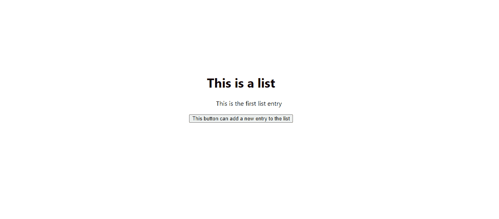

How it looks

这不会为你赢得任何风格比赛，但对我们来说已经足够了。

### `List.js`的测试设置

因为我们想在处理组件的同时进行测试，所以我现在将直接跳到测试部分，即使我们的`List.js`组件在点击功能方面没有发生任何事情。

我们可以创建一个新的测试文件，但是我想向您展示一个新的功能，我们可以专门用于我们的测试套件。这个函数叫做`describe()`，可以方便地进一步构建我们的测试。

为了使用`describe()`，我们跳到`__tests__`内的`myFirstTesting.test.js`。现在，这个文件基本上作为我们专门为`App.js`组件创建的测试的一个测试套件。但是我希望在这个测试文件中有两个测试套件:一个用于`App.js`测试，一个用于`List.js`测试。

对于这一步，我使用的是`describe()`函数，它在参数方面基本上与`test()`函数类似。

第一个参数将是一个字符串，描述各自的测试套件。第二个参数是一个函数，它包含了我们的`test()`函数和它们的内容。

在我们的例子中，它看起来像这样:

```
import App from "../App";
import { render, screen } from "@testing-library/react";

describe("App.js component", () => {
  test("renders logo in App component", () => {
    render(<App />);
    const image = screen.getByAltText("logo");
    expect(image).toBeInTheDocument();
  });
});

describe("List.js component", () => {
  test("example", () => {});
}); 
```

current file structure of `myFirstTesting.test.js`

在我们开始新的测试之前，我想为`App.js`测试添加一些东西。既然我们有了这个`describe()`模块，我们可以添加一个新的`test()`函数——这就是我要做的。

参见以下用`"renders List.js component in App.js"`描述的新增测试:

```
import App from "../App";
import { render, screen } from "@testing-library/react";

describe("App.js component", () => {
  test("renders logo in App component", () => {
    render(<App />);
    const image = screen.getByAltText("logo");
    expect(image).toBeInTheDocument();
  });

   test("renders List.js component in App.js", () => {
    render(<App />);
    const textInListJS = screen.getByText(/This is a list/i);
    expect(textInListJS).toBeInTheDocument();
  });
});

describe("List.js component", () => {
  test("example", () => {});
}); 
```

current file structure of `myFirstTesting.test.js`

所以我呈现了`App.js`组件，并通过正则表达式寻找文本，这是`List.js`组件的一部分。这个测试基本上可以理解为对`List.js`的渲染测试。如果`List.js`不能在`App.js`内渲染，这个测试就不会通过。

如果你对不在`List.js`组件上单独使用`render()`就能工作感到困惑，请记住`List.js`是`App.js`的一部分，而`App.js`内的一切都将在典型条件下呈现。如果你试图寻找一个在`List.js`中不存在的文本短语，这个新的测试将会失败。现在，在我们的情况下，它通过了。

我还想强调的是，在同一个测试中可以有多个`expect()`函数。因此，我们也可以这样构建这个新测试:

```
import App from "../App";
import { render, screen } from "@testing-library/react";

describe("App.js component", () => {
  test("renders logo in App component", () => {
    render(<App />);
    const image = screen.getByAltText("logo");
    const textInListJS = screen.getByText(/This is a list/i);

    expect(image).toBeInTheDocument();
    expect(textInListJS).toBeInTheDocument();
  });
});

describe("List.js component", () => {
  test("example", () => {});
}); 
```

current file structure of `myFirstTesting.test.js` with 2 `expect()` functions within the same test

在我们的情况下，这也可以很好地工作。这在你测试一些小元素的时候会很方便，这些小元素彼此直接相连，并且有相同的渲染需求。

但是请记住，在我们的例子中，我们应该调整这个测试的描述。这是因为如果我们在这个测试中测试的比这个多，那么`"renders logo in App component"`就不再正确了。所以现在让我们用两个独立的测试回到这个结构。但是请记住，你能够这样工作。

### 回到对`List.js`的测试

现在，我想使用我们刚才创建的第二个`describe()`块，在这里我们想使用专门针对`List.js`组件的测试。

因为我们的目标是测试驱动的开发方法，所以我们应该考虑我们将要构建什么，编写一个测试，然后在我们的组件中实现那个逻辑。

我们想在我们的`List.js`组件中创建一个简单的列表。所以会有一个数组，我们用`map()`来遍历。

对于这种方法，我们将利用`useState()`钩子，这样我们就有了一个可以动态调整的状态(列表项的数组)。我们的第一个测试是检查这个数组在初始状态下的长度是否等于`1`。

为了找到这个状态中的项目，我们将使用`getAllByTestId()`方法，该方法允许我们搜索在前端用`data-testid`标记的特定元素。

我创建的描述为`"renders initial state of listData state"`的测试现在包括在内:

```
import App from "../App";
import { render, screen } from "@testing-library/react";

describe("App.js component", () => {
  test("renders logo in App component", () => {
    render(<App />);
    const image = screen.getByAltText("logo");
    const textInListJS = screen.getByText(/This is a list/i);

    expect(image).toBeInTheDocument();
    expect(textInListJS).toBeInTheDocument();
  });
});

describe("List.js component", () => {
   test("renders initial state of listData state", () => {
    render(<List />);
    const list = screen.getAllByTestId("list-item");
    expect(list.length).toEqual(1);
  });
}); 
```

current file structure of `myFirstTesting.test.js`

当然，现在这个测试会失败，因为我们还没有向组件添加任何逻辑。

于是我调整了一下`List.js`组件。现在看起来是这样的:

```
import { useState } from "react";

const List = () => {
  const initialState = [
    {
      id: `${new Date().getSeconds()}`,
      description: "This is something",
      significance: 7,
    },
  ];
  const [listData, setListData] = useState(initialState);

  return (
    <div
      style={{ marginLeft: "auto", marginTop: "500px", marginBottom: "500px" }}
    >
      <h1>This is a list</h1>
      <ul style={{ listStyleType: "none" }}>
        {listData.map((listItem) => {
          return (
            <li key={listItem.id} data-testid="list-item">
              {listItem.description}
            </li>
          );
        })}
      </ul>
      <button>This button can add a new entry to the list</button>
    </div>
  );
};

export default List; 
```

current file structure of `myFirstTesting.test.js`

新添加的是通过一个`useState()`钩子的`listData`状态数组和一个 initialState，我在最顶端用一个对象初始化了它。我还利用了`map()`函数来通过这个`listData`来创建一个列表。

对于每个`<li>`元素，我添加了一个键和一个`data-testid`。这个`data-testid`是我们在测试中寻找各自元素所需的 id。

在我们的实际应用中，我们可以看到这个初始状态的`listItem.description`:

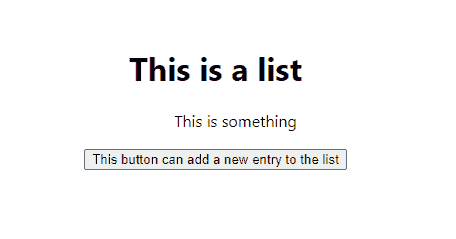

所以通过手动测试(实际上在浏览器中查看我们的应用程序)，我们可以看到这应该是可行的。如果我们现在运行我们的测试，我们也会看到我们创建的测试通过了。

### 如何将对象添加到状态

现在让我们测试一些更令人兴奋的东西:向这个`listData`状态添加一个新对象的逻辑。同样，在 React 组件中实际实现所需的逻辑之前，我们将首先进行测试。

有了这个由`"adds a new data entry to listData after button click"`描述的新添加的测试，我们的测试文件现在看起来像这样:

```
import App from "../App";
import List from "../components/List";
import { render, screen } from "@testing-library/react";

import userEvent from "@testing-library/user-event";

describe("App.js component", () => {
  test("renders logo in App component", () => {
    render(<App />);
    const image = screen.getByAltText("logo");
    expect(image).toBeInTheDocument();
  });

  test("renders List.js component in App.js", () => {
    render(<App />);
    const textInListJS = screen.getByText(/This is a list/i);
    expect(textInListJS).toBeInTheDocument();
  });
});

describe("List.js component", () => {
  test("renders initial state of listData state", () => {
    render(<List />);
    const list = screen.getAllByTestId("list-item");
    expect(list.length).toEqual(1);
  });

  test("adds a new data entry to listData after button click", () => {
    render(<List />);
    let listItems = screen.getAllByTestId("list-item");
    const button = screen.getByRole("button", {
      name: /This button can add a new entry to the list/i,
    });

    expect(list.length).toEqual(1);
    userEvent.click(button);
    list = screen.getAllByTestId("list-item");
    expect(list.length).toEqual(2);
  });
}); 
```

current file structure of `myFirstTesting.test.js`

在底部，你可以看到这个测试。因此，在寻找所有我们分配了测试 id 的可用列表项之前，我们首先呈现了`List.js`组件。过一会儿，您将会看到我们将测试 id 放在哪里。

我们还必须寻找我们想要测试的按钮，以查看单击它是否会向列表中添加一些内容。我们用`getByRole()`来做这件事，例如，它期望像`"button"`或`"table"`这样的角色作为第一个参数(有许多不同的角色可以作为目标)。第二个参数是可选的，它是一个可以接收`name`键的值的对象。

`name`在这种情况下，就是我们专门为按钮准备的文本内容。当您的组件中有多个类型为`"button"`的元素并且想要从中获得一个特定的按钮时，这个可选的第二个参数非常方便。

在得到`listItems`和`button`之后，我们从第一个`expect()`开始测试初始状态。在这个初始状态，我们期望只有一个列表项。

然后，在`userEvent`的帮助下，我们将点击按钮。在这种情况下，您也可以使用`fireEvent`(`userEvent`与`fireEvent`方法相比还是相当新的)。两者都可以工作，并且对于任何想要与特定元素进行交互的操作都很有帮助。在这种情况下，我想模拟点击一个按钮。

测试通常遵循“安排->动作->断言”模式，您可以遵循这种模式来构建它们。在“arrange”部分，您初始化并获取所有必需的元素。例如，对于“act”部分，您可以模拟鼠标点击(就像我们的例子一样)。使用“断言”，您将检查它是否像您预期的那样运行。

例如，在另一种情况下，您可以用`fireEvent.change(inputField, { target: { value: someValueVariable } })`模拟改变输入字段的值。也许你想聚焦一个输入字段或者甚至拖动一个元素——这样的动作可以通过`fireEvent`和`userEvent`来模拟。

点击按钮后，它再次寻找所有的`listItems`,因为这个变量的当前值仍然是上一次初始化的`1`。这个步骤一完成，它就使用另一个`expect()`函数来检查`listItems`数组的长度现在是否等于`2`而不是`1`。

现在我们有了测试逻辑，让我们跳回`List.js`组件并实现相应的逻辑:

```
import { useState } from "react";

const List = () => {
  const initialState = [
    {
      id: `${new Date().getSeconds()}`,
      description: "This is something",
      significance: 7,
    },
  ];
  const [listData, setListData] = useState(initialState);

  return (
    <div
      style={{ marginLeft: "auto", marginTop: "500px", marginBottom: "500px" }}
    >
      <h1>This is a list</h1>
      <ul style={{ listStyleType: "none" }}>
        {listData.map((listItem) => {
          return (
            <li key={listItem.id} data-testid="list-item">
              {listItem.description}
            </li>
          );
        })}
      </ul>
      <button
        onClick={() =>
          setListData([
            ...listData,
            { id: 999, description: "999", significance: 100 },
          ])
        }
      >
        This button can add a new entry to the list
      </button>
    </div>
  );
};

export default List; 
```

current file structure of `List.js`

唯一改变的部分是这个文件底部的按钮。所以我添加了一个函数，当点击这个按钮时就会被调用。然后，该函数调整负责呈现列表的`listData`的当前状态。我用 spread 操作符复制了当前状态，然后添加了另一个硬编码的对象作为这个列表的新条目。

当然，还有更有创意的方法来填充`id`、`description`和`significance`键的值。

我还想强调的是，您有机会在`return()`之外创建一个单独的函数，并像这样在同一个按钮元素上访问这个函数:`onClick={separateFunctionToAddObjectToState}`。这也可以工作，而不必在测试中呈现额外的东西。

如果我们现在运行我们的测试，我们将看到它通过。如果您尝试在点击按钮后仍然期望长度为`1`，测试将会失败，如下所示:

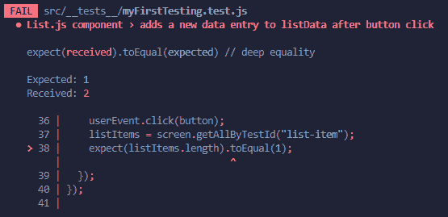

error alert for length of 1

所以它实际上做了它应该做的事情。

## 🔧Redux 的设置

在通过`useState()`钩子处理了本地状态之后，我想处理相同的文件，并为 Redux(或者更准确地说，Redux 工具包)调整它们。

我不打算深入探究 Redux 到底是什么，以及每个术语如`action`、`store`或`reducer`的详细含义——因为这值得一个全新的指南。如果你想要的话，你可以[阅读这本指南来还原基础知识](https://www.freecodecamp.org/news/redux-for-beginners/)。

相反，我将给出一个快速的纲要，并显示我正在添加和编辑的文件。然后我会谈谈如何处理`render()`方法，包括 Redux store provider，如果你不了解它，在测试时会造成很多挫败感。

### 整体文件夹结构:

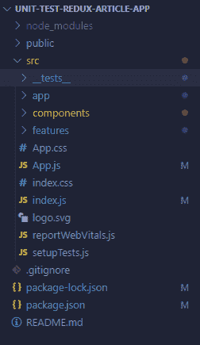

current overall folder structure with the React Redux Toolkit

您可以看到我添加了一个`app`(用于商店)和一个`features`(用于切片)文件夹。

### 更新的`index.js`文件:

```
import React from "react";
import ReactDOM from "react-dom/client";
import "./index.css";
import App from "./App";
import reportWebVitals from "./reportWebVitals";
import { Provider } from "react-redux";
import store from "./app/store";

const root = ReactDOM.createRoot(document.getElementById("root"));
root.render(
  <React.StrictMode>
    <Provider store={store}>
      <App />
    </Provider>
  </React.StrictMode>
);
```

structure of `index.js`, including the React Redux Toolkit

您可以看到，我添加了一个`provider`并将其包装在应用程序中，这样我们就可以从任何地方访问商店。

### 创建的`store.js`文件:

```
import { configureStore } from "@reduxjs/toolkit";
import { ListSlice } from "../features/ListSlice";

const store = configureStore({
  reducer: {
    listReducers: listSlice.reducer,
  },
});

export default store; 
```

structure of `store.js` in `app/`, including the React Redux Toolkit

在这个文件中，我们已经为 Redux 实现创建了所需的存储。

### 在`features`文件夹中创建了`ListSlice.js`文件:

```
import { createSlice } from "@reduxjs/toolkit";

export const initialState = {
  value: [
    {
      id: `${new Date().getSeconds()}`,
      description: "This is something",
      significance: 7,
    },
  ],
};

export const ListSlice = createSlice({
  name: "listReducers",
  initialState,
  reducers: {},
});

export const { } = ListSlice.actions;
export default ListSlice.reducer; 
```

structure of `ListSlice.js` in `features/`, including the React Redux Toolkit

这里，我们创建了添加到商店中的切片。请注意，我还没有添加任何缩减器。这个切片只包含当前对应的状态。

### 更新了`components`文件夹中的`List.js`文件:

```
import { useSelector, useDispatch } from "react-redux";

const List = () => {
  const listState = useSelector((state) => state.listReducers.value);
  const dispatch = useDispatch(); // not used right now

  return (
    <div
      style={{ marginLeft: "auto", marginTop: "500px", marginBottom: "500px" }}
    >
      <h1>This is a list</h1>
      <ul style={{ listStyleType: "none" }}>
        {listState.map((listItem) => {
          return (
            <li key={listItem.id} data-testid="list-item">
              {listItem.description}
            </li>
          );
        })}
      </ul>
      <button>This button can add a new entry to the list</button>
    </div>
  );
};

export default List; 
```

structure of `List.js` in `components/`, including the React Redux Toolkit

在前端，我们用 Redux 状态(使用 useSelctor 钩子)交换了本地状态(使用 useState 钩子)。你也会看到我调整了按钮。不再有点击功能(我们稍后将回到这一点)。

## 🔎如何使用 React Redux 工具包执行测试

既然我们已经更新并创建了 React Redux Toolkit 逻辑的所有必要文件，我想对我们之前创建的所有测试进行一个快速测试。

结果是所有测试都失败了:

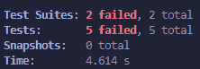

请记住，例如，我调整了`List.js`中的按钮，因此相应的测试预计会失败。然而，并不是所有的测试都应该失败。

测试环境在他们自己的世界中工作。他们不知道您是否在`index.js`的某个地方包装了一个提供者并启用了 Redux 逻辑。因此，测试仍然试图使渲染工作没有 Redux。但是我们的应用程序现在依赖 Redux 来管理我们的主状态。

这意味着我们必须调整`render()`函数，以便该函数实际上与 Redux 逻辑一致。

实现这一点的方法是引入一个助手函数，我们将把它存储在一个名为`utils`的新文件夹中。该文件将被称为`utils-for-tests.jsx`。内容将如下所示:

```
import React from "react";
import { render } from "@testing-library/react";
import { configureStore } from "@reduxjs/toolkit";
import { Provider } from "react-redux";
// As a basic setup, import your same slice reducers
import { ListSlice } from "../features/ListSlice";

export function renderWithProviders(
  ui,
  {
    preloadedState = {},
    // Automatically create a store instance if no store was passed in
    store = configureStore({
      reducer: { listReducers: ListSlice.reducer },
      preloadedState,
    }),
    ...renderOptions
  } = {}
) {
  function Wrapper({ children }) {
    return <Provider store={store}>{children}</Provider>;
  }

  // Return an object with the store and all of RTL's query functions
  return { store, ...render(ui, { wrapper: Wrapper, ...renderOptions }) };
} 
```

file structure of `utils-for-tests.jsx` in `utils/`

该代码信息可在 [Redux 文档](https://redux.js.org/usage/writing-tests)中找到。您几乎可以为您的应用程序复制和粘贴它。

但是你必须调整那里使用的切片。因为在我们的应用程序中只有`ListSlice`我们没有太多要添加的。只需导入并更新`configureStore()`函数的内容，就像我们在`store.js`文件中管理它一样。

这一步对于模拟整个 Redux 逻辑并把它放入一个新的`render()`函数是必要的。

这样，我们可以将这个新函数导入到我们的测试文件(`App.test.js`和`myFirstTesting.test.js`)中，然后用`renderWithProviders()`替换所有的`render()`函数。例如，`App.test.js`文件现在看起来是这样的:

```
import { screen } from "@testing-library/react";
import App from "../App";
import { renderWithProviders } from "../utils/utils-for-tests";

test("renders learn react link", () => {
  renderWithProviders(<App />);
  const linkElement = screen.getByText(/learn react/i);
  expect(linkElement).toBeInTheDocument();
}); 
```

current file structure of `App.test.js`

没什么可做的了！如果我们现在再次运行我们的测试(并注释掉这个测试，因为按钮逻辑不再活动，所以无论如何它都将失败)，它将再次工作。

### 切片测试

Redux 测试的另一个令人兴奋的部分是测试切片。如果您使用 React Redux Toolkit 模板创建了您的应用程序，那么您将获得一些相应的测试。

对于我们的例子，我还想实现一个新的测试文件，我们将在其中专门测试`ListSlice.js`及其相应的 Redux 逻辑。

对于这个切片，我们必须导入我们想要测试的切片和相应的 reducers。首先，我将导入切片并测试它是否用 initialState 初始化。

这实际上不是 TDD 方法，因为我们已经手动测试了这部分。尽管如此，我还是想实现一个自动测试:

```
import ListSlice, { initialState } from "../features/ListSlice";

describe("tests for ListSlice", () => {
  test("initialize slice with initialValue", () => {
    const listSliceInit = ListSlice(initialState, { type: "unknown" });
    expect(listSliceInit).toBe(initialState);
  });
}); 
```

current file structure of `listSlice.spec.js`

注意，我用的是`.spec`而不是`.test`。这不重要。你可以选择任何一个。在这种情况下，我和`.spec`一起去提醒你，这也是一个可行的选择。

还记得我们在切片中导出了 initialState(见上文)。所以我们可以在这里导入它。

除此之外，我们已经熟悉了`describe()`环境，其中包括一个`test()`。在这个测试中，我初始化了一个变量`listSliceInit`，它将保存切片操作发生后我们接收到的值。

对于这个操作，我们使用`ListSlice`作为函数，并将初始状态作为第一个参数(在本例中是`initialState`)。第二个参数在大多数情况下是一个缩减器。

但是在这种情况下，我们不需要输入减速器。相反，我们使用一个带有`type: "unknown"`的对象。这基本上是告诉函数我们不想执行任何额外的操作。

因此，`listSliceInit`现在应该包括我们的状态值，它包括一个只有一个条目的数组。相应的测试就会通过。

为了强制失败，我将进入`expect(listSliceInit).toBe({ value: [] });`而不是之前的`expect()`函数。所以我们期望它有一个空数组，而不是我们的`initialState`。现在，我们的测试环境将告诉我们以下内容:

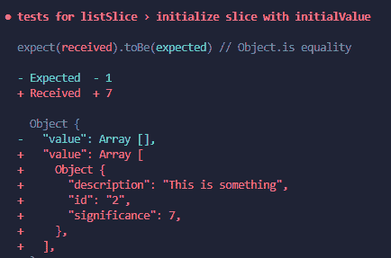

failing test

所以它实际上告诉我们它到底期望什么——在这种情况下，它期望的是`initialState`。

接下来，我想测试一个减速器。然而，我们还没有添加一个。所以我会这样调整`ListSlice.js`文件中的`ListSlice`:

```
export const ListSlice = createSlice({
  name: "listReducers",
  initialState,
  reducers: {
    testAddReducer: (state, action) => {
      state.value.push(action.payload);
    },
  },
});
```

ListSlice in `ListSlice.js`

因此，我添加了`testAddReducer()`，它负责将一个额外的元素推送到当前状态值，该值是通过来自调度的输入(通过`action.payload`)接收的。

如果我们现在跳回到`listSlice.spec.js`文件，我将添加另一个单元测试:

```
import ListSlice, { initialState, testAddReducer } from "../features/ListSlice";

describe("tests for ListSlice", () => {
  test("initialize slice with initialValue", () => {
    const listSliceInit = ListSlice(initialState, { type: "unknown" });
    expect(listSliceInit).toBe(initialState);
  });

  test("testAddReducer", () => {
    const testData = {
      id: `${new Date().getSeconds()}`,
      description: "This is for the test section",
      significance: 5,
    };

    const afterReducerOperation = ListSlice(
      initialState,
      testAddReducer(testData)
    );

    expect(afterReducerOperation).toStrictEqual({
      value: [initialState.value.at(0), testData],
    });
  });
}); 
```

current file structure of `listSlice.spec.js`

我添加了对`testAddReducer`的测试。你可以看到我也导入了减速器。

首先，我正在初始化一个新变量`testData`，它包含了我想要推到当前状态的数据。

之后，我们用`afterReducerOperation`遵循和之前一样的结构。但是代替这个`type: "unknown"`的东西，我们添加了减速器作为第二个参数。它接收`testData`作为参数——基本上就像您在调度中看到的一样。

然后，我们期望这个`afterReducerOperation`变量严格等于一个数组的值，这个数组有两个条目:`initialState.value.at(0)`(我们的`initialState`的第一个条目)和`testData`。这个测试会像我们预期的那样通过。

如果我们尝试输入一些其他条目或更改当前条目，您将会看到此测试失败:

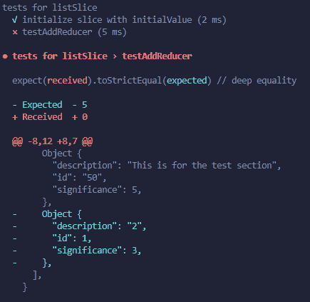

forced error: I added a third entry to the array

### 如何让按钮点击功能再次工作

还记得`List.js`组件中的按钮 click(用于向`listData`状态添加一些东西)在我们更改为 Redux 设置后不再工作了吗？为了完整起见，让我们快速更新一下，使该逻辑在 Redux 环境中工作。既然我们现在有了所需的减速器，这将是一个简单的步骤。

为了让测试再次工作，这为状态添加了一个新元素，我们必须在前端对它进行一点调整，以实现 Redux 逻辑。(以前我们使用本地状态的 useState 钩子。)

对于这一步，我们将利用`dispatch()`函数来访问`testAddReducer`:

```
import { useSelector, useDispatch } from "react-redux";
import { testAddReducer } from "../features/ListSlice";

const List = () => {
  const listState = useSelector((state) => state.listReducers.value);
  const dispatch = useDispatch();

  return (
    <div
      style={{ marginLeft: "auto", marginTop: "500px", marginBottom: "500px" }}
    >
      <h1>This is a list</h1>
      <ul style={{ listStyleType: "none" }}>
        {listState.map((listItem) => {
          return (
            <li key={listItem.id} data-testid="list-item">
              {listItem.description}
            </li>
          );
        })}
      </ul>
      <button
        onClick={() =>
          dispatch(
            testAddReducer({
              id: `${new Date().getSeconds()}1`,
              description: "This is added",
              significance: 5,
            })
          )
        }
      >
        This button can add a new entry to the list
      </button>
    </div>
  );
};

export default List; 
```

structure of `List.js` with the dispatch

除了按钮逻辑之外，这个文件中没有其他任何变化。

在相应的测试中(在`myFirstTesting.test.js`内没有任何变化)，如果我们现在测试所有的东西——包括这个更新的测试——我们将会看到所有的东西都工作正常:

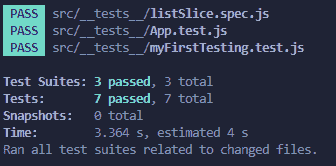

final test run

这就是基本切片和通用 Redux 单元测试的全部内容！

## 🔭高级测试展望

也可以测试不同的主题，如 [thunks](https://redux-toolkit.js.org/api/createAsyncThunk) (或者 [RTK Query](https://redux-toolkit.js.org/rtk-query/overview) 作为替代)。但是我认为这是一个高级的话题，需要更多的时间来解释这些过程。

如果您现在不想成为测试专家，我们在本教程中讨论的关于 Redux 中单元测试的主题应该足够了。

总的来说，我建议深入研究所谓的模仿、间谍和快照。如果您正在进行其他一些更高级的测试，这些将会很有帮助。

关于`renderWithProvider()`的东西基本上是基于这样一个模拟——在那里，我们人为地创建了一个带有 reducers 和 provider 的存储来创建这个新的`render()`函数。例如，模拟对于任何第三方库都特别有用。

正如我所说的，模仿、间谍和快照是一个更高级的话题。

## 📣进一步学习的机会

我最近开始着手我的第一个免费课程。虽然这第一个免费课程涵盖了带有德语音频和手动添加英语字幕的 React Redux 工具包的基础知识，但我也计划在未来完全用英语发布其他 Udemy 课程。

如果您能查看这一免费课程，并向我提供一些反馈，我将不胜感激。