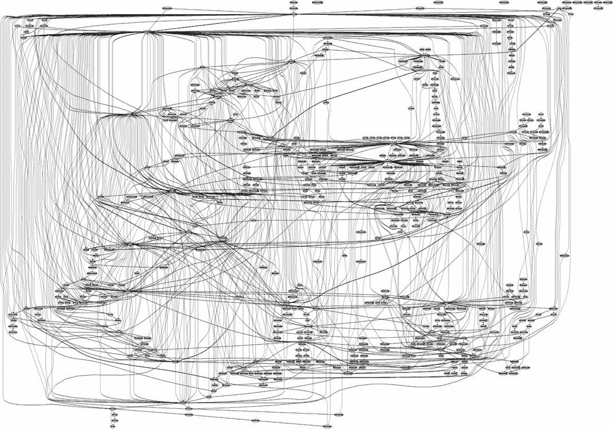

# 学习如何编码

> 原文：<https://www.freecodecamp.org/news/how-to/>

你是刚入门的新开发者吗？或者您是一名经验丰富的开发人员，希望扩展您的技能吗？

不管怎样，freeCodeCamp 社区会保护你。

很多时候，学习如何编程与其说是一条直线，不如说是一个巨大的流程图，有许多重复的部分和循环:

A flowchart for system calls in Windows Server Edition ([source](https://slideplayer.com/slide/11896895/))

但没必要这么复杂。

我已经浏览了我们大量的教程目录，并创建了一个关于如何学习开发人员需要了解的几乎所有知识的最佳资源列表。

该列表被松散地组织成不同的部分和子部分。请随意浏览下面的目录，并跳过寻找任何你想学习的文章。

此外，这个列表中的许多内容需要一些其他技术的先决知识。如果你发现自己打开了多个版块的文章，不要惊讶。

最后，这是一个动态文档，随着我们发布更多有用的文章，它将会不断发展。一定要经常回来看看，如果你觉得有帮助的话，把这个分享给你的朋友。

## 目录

*   [如何建立一个网站](#how-to-build-a-website)
    *   [HTML](#html)
    *   [CSS](#css)
*   [如何学习编程](#how-to-learn-programming)
    *   [JavaScript](#javascript)
    *   [Node.js](#node-js)
    *   [打字稿](#typescript)
    *   [Deno](#deno)
    *   [Python](#python)
    *   [Java](#java)
    *   [围棋(Golang)](#go-golang-)
    *   [生锈](#rust)
    *   [C](#c)
    *   [C++](#c-)
    *   [C#](#c--1)
*   [如何学习 Linux](#how-to-learn-linux)
*   [如何学习 Git 和版本控制](#how-to-learn-git-and-version-control)
*   [如何学习一个前端框架/库](#how-to-learn-a-frontend-framework-library)
    *   [反应](#react)
    *   视图
    *   [角度](#angular)
*   [如何学习网络基础知识和网络安全](#how-to-learn-web-basics-and-web-security)
    *   [网络基础知识](#web-basics)
    *   [HTTPS](#https)
    *   [饼干](#cookies)
*   [如何学习数据库](#how-to-learn-databases)
    *   [SQL / MySQL](#sql-mysql)
    *   [猫鼬/猫鼬(NoSQL)](#mongodb-mongoose-nosql-)
    *   [雷伊斯(NoSQL)](#redis-nosql-)
    *   [Postgres / PostgreSQL](#postgres-postgresql)
*   [如何学习后端开发](#how-to-learn-backend-development)
    *   [快递](#express)
    *   [烧瓶](#flask)
    *   姜戈
*   [如何学习静态站点生成器](#how-to-learn-static-site-generators)
    *   盖茨比
    *   [Next.js](#next-js)
    *   [雨果](#hugo)
    *   [Nuxt.js](#nuxt-js)
    *   [武打〔t1〕](https://www.freecodecamp.org/news/how-to/vuepress)
*   [如何学习捆绑器、编译器、依赖管理器、任务运行器、格式化器和链接器](#how-to-learn-bundlers-compilers-dependency-managers-task-runners-formatters-and-linters)
    *   [网络包和巴别塔](#webpack-and-babel)
    *   [ESLint 和 beauty](#eslint-and-prettier)
    *   [包裹](#parcel)
    *   [一饮而尽](#gulp)
    *   [npm 脚本](#npm-scripts)
*   [如何学习移动应用开发](#how-to-learn-mobile-application-development)
    *   [反应原生](#react-native)
    *   [离子型](#ionic)
    *   [颤动](#flutter)
*   [如何学习桌面应用开发](#how-to-learn-desktop-application-development)
    *   [电子](#electron)
    *   [质子原生](#proton-native)
*   [如何学习数据科学和机器学习](#how-to-learn-data-science-and-machine-learning)
    *   [通用机器学习](#general-machine-learning)
    *   熊猫
    *   [Numpy](#numpy)
    *   [Scikit-Learn](#scikit-learn)
    *   [Seaborn](#seaborn)
    *   [Matplotlib](#matplotlib)
    *   [TensorFlow](#tensorflow)
    *   [指针](#pytorch)
    *   [Keras](#keras)
*   [如何学习虚拟化和容器化](#how-to-learn-virtualization-and-containerization)
    *   [虚拟机](#virtual-machines)
    *   [码头工人](#docker)
    *   [Kubernetes](#kubernetes)
*   [如何学习云计算](#how-to-learn-cloud-computing)
    *   [亚马逊网络服务(AWS)](#amazon-web-services-aws-)
    *   [谷歌云平台(GCP)](#google-cloud-platform-gcp-)
    *   [微软 Azure](#microsoft-azure)
*   [如何学习 DevOps](#how-to-learn-devops)
    *   一般 DevOps
    *   [特拉维斯 CI](#travis-ci)
    *   詹金斯
    *   [GoCD](#gocd)
    *   [可回答的](#ansible)
    *   [厨师](#chef)
    *   [卡夫卡](#kafka)
    *   [地形](#terraform)

## 如何建立一个网站

要建立一个基本的网站，你真正需要的只是 HTML(超文本标记语言)和 CSS(层叠样式表)。HTML 提供了网站的内容和结构，CSS 用于样式化。

这里有一些关于 HTML 和 CSS 的最佳资源。一旦你熟悉了这些技术，继续下一节，学习 JavaScript，让你的网站更具交互性。

### 超文本标记语言

*   [只需 15 分钟就能学会初学者的 HTML 基础知识](https://www.freecodecamp.org/news/html-basics-for-beginners/)
*   [如何使用标签上的 HREF 属性制作 HTML 超链接](https://www.freecodecamp.org/news/how-to-make-html-hyperlinks-using-the-href-attribute-on-tags/)
*   [如何使用 HTML 在新标签页中打开链接](https://www.freecodecamp.org/news/how-to-use-html-to-open-link-in-new-tab/)
*   [HTML 链接代码——如何使用 HREF 插入网站链接](https://www.freecodecamp.org/news/html-link-code-how-to-insert-a-link-to-a-website-with-href-3/)
*   [HTML 实体——HTML 空格和其他 HTML 符号以及特殊字符代码的列表](https://www.freecodecamp.org/news/html-entities-symbols-special-character-codes-list/)
*   [如何在 HTML 电子邮件中启用黑暗模式——你需要知道的一切](https://www.freecodecamp.org/news/dark-mode-in-html-email-everything-you-need-to-know/)
*   [制作 Blink HTML 教程——如何使用 Blink 标签，并附有代码示例](https://www.freecodecamp.org/news/make-it-blink-html-tutorial-how-to-use-the-blink-tag-with-code-examples/)
*   HTML 基础:一门免费的全日制课程
*   [HTML 手册](https://www.freecodecamp.org/news/the-html-handbook/)

### 半铸钢ˌ钢性铸铁(Cast Semi-Steel)

*   [CSS 字体大小教程——如何在 HTML 中改变文本大小](https://www.freecodecamp.org/news/css-font-size-tutorial-how-to-change-text-size-in-html/)
*   HTML 背景色教程——如何改变一个 Div 背景色，用代码示例解释
*   [内联 CSS 指南——如何直接设计 HTML 标签的样式](https://www.freecodecamp.org/news/inline-css-guide-how-to-style-an-html-tag-directly/)
*   HTML 居中文本–如何 CSS 垂直对齐一个 Div
*   如何用 CSS 居中对齐一个 Div，文本等等
*   [HTML vs Body:如何设置全页面大小的宽度和高度](https://www.freecodecamp.org/news/html-page-width-height/)
*   如何给任何 HTML 元素添加阴影
*   [CSS 定位和 Flexbox 如何工作——举例说明](https://www.freecodecamp.org/news/css-positioning-and-flexbox-explained/)
*   Flexbox——终极 CSS Flex Cheatsheet(带动画图！)
*   [CSS 网格布局介绍(附示例)](https://www.freecodecamp.org/news/intro-to-css-grid-layout/)
*   [通过在 17 分钟内构建 5 个布局来学习 CSS 网格](https://www.freecodecamp.org/news/learn-css-grid-by-building-5-layouts/)
*   [CSS Grid 如何改变我们构建内容的方式](https://www.freecodecamp.org/news/css-grid-changes-how-we-can-think-about-structuring-our-content/)
*   [Flexbox vs Grid——如何构建最常见的 HTML 布局](https://www.freecodecamp.org/news/flexbox-vs-grid-how-to-build-the-most-common-html-layouts/)
*   [在这个免费的 6 小时视频课程中学习 CSS](https://www.freecodecamp.org/news/learn-css-in-this-free-6-hour-video-course/)
*   《CSS 手册:开发人员使用 CSS 的便捷指南》

### 如何学习编程

本质上，编程是人类告诉计算机做什么的方式。无论是笔记本电脑、智能手机还是浏览器，编程和编程语言都为我们提供了一种与这些设备进行交互的方式。

在本节中，您将学习编程的基础知识以及当今一些最流行的编程语言的基础知识。

如果你想学习前端和后端开发，一定要学习 JavaScript 和 Node.js。

如果你对数据科学和机器学习更感兴趣，学习 Python。对于移动应用，了解 Java 是有帮助的。游戏开发？C++，C#，甚至 Java。

我们什么都有，包括更新的编程语言，比如 Go。

### Java Script 语言

*   [JavaScript 变量 var、const 和 let 初学者指南](https://www.freecodecamp.org/news/javascript-variables-beginners-guide/)
*   [JavaScript 分割字符串示例——如何在 JS 中把一个字符串分割成一个数组](https://www.freecodecamp.org/news/javascript-split-string-example/)
*   [JavaScript Type of–如何检查 JS 中变量或对象的类型](https://www.freecodecamp.org/news/javascript-typeof-how-to-check-the-type-of-a-variable-or-object-in-js/)
*   如何检查 JavaScript 数组是否为空？长度
*   [JS For Loop 教程——如何在 JavaScript 中迭代数组](https://www.freecodecamp.org/news/javascript-loop-tutorial-how-to-iterate-over-an-array-in-javascript/)
*   [JavaScript 数组排序——如何使用 JS 排序方法(附代码示例)](https://www.freecodecamp.org/news/javascript-array-sort-tutorial-how-to-use-js-sort-methods-with-code-examples/)
*   [JavaScript 反向数组–包含示例 JS 代码的教程](https://www.freecodecamp.org/news/javascript-array-reverse-tutorial-with-example-js-code/)
*   [JavaScript forEach–如何在 JS 中循环数组](https://www.freecodecamp.org/news/javascript-foreach-how-to-loop-through-an-array-in-js/)
*   [JavaScript 数组切片 vs 拼接:用蛋糕解释区别](https://www.freecodecamp.org/news/javascript-array-slice-vs-splice-whats-the-difference/)
*   [JavaScript 对象键教程——如何使用 JS 键-值对](https://www.freecodecamp.org/news/javascript-object-keys-tutorial-how-to-use-a-js-key-value-pair/)
*   [JavaScript 创建对象——如何在 JS 中定义对象](https://www.freecodecamp.org/news/javascript-create-object-how-to-define-objects-in-js/)
*   [JavaScript 中的面向对象编程——举例说明](https://www.freecodecamp.org/news/how-javascript-implements-oop/)
*   [为 JS 初学者讲解的 JavaScript `this` Keyword + 5 键绑定规则](https://www.freecodecamp.org/news/javascript-this-keyword-binding-rules/)
*   JavaScript 原型初学者指南
*   [JavaScript Date Now——如何在 JavaScript 中获取当前日期](https://www.freecodecamp.org/news/javascript-date-now-how-to-get-the-current-date-in-javascript/)
*   [JavaScript Date and moment . js 终极指南](https://www.freecodecamp.org/news/the-ultimate-guide-to-javascript-date-and-moment-js/)
*   [什么是函数式编程？初级 JavaScript 指南](https://www.freecodecamp.org/news/javascript-array-reverse-tutorial-with-example-js-code/)
*   [学习 JavaScript——面向初学者的 134 节完整课程](https://www.freecodecamp.org/news/learn-javascript-full-course/)
*   [JavaScript 中的数据结构和算法——初学者全教程](https://www.freecodecamp.org/news/data-structures-and-algorithms-in-javascript/)
*   [JavaScript 中的稀疏数组与密集数组——举例说明](https://www.freecodecamp.org/news/sparse-and-dense-arrays-in-javascript/)
*   [JavaScript 正则表达式匹配示例——如何在字符串上使用 JS 替换](https://www.freecodecamp.org/news/javascript-regex-match-example-how-to-use-the-js-replace-method-on-a-string/)
*   JavaScript 正则表达式的快速简单指南
*   [JavaScript 键码列表–Enter、Space、Backspace 等按键事件键码](https://www.freecodecamp.org/news/javascript-keycode-list-keypress-event-key-codes/)
*   [JavaScript 对象析构、扩展语法和 Rest 参数——实用指南](https://www.freecodecamp.org/news/javascript-object-destructuring-spread-operator-rest-parameter/)
*   [JavaScript 中的 Nullish 合并运算符如何工作](https://www.freecodecamp.org/news/nullish-coalescing-operator-in-javascript/)
*   [JavaScript 中的 Try/Catch——如何处理 JS 中的错误](https://www.freecodecamp.org/news/try-catch-in-javascript/)
*   [如何在 JavaScript 中使用 Async/Await，JS 代码示例](https://www.freecodecamp.org/news/async-await-in-javascript/)
*   [问号(？)运算符在 JavaScript 中工作](https://www.freecodecamp.org/news/how-the-question-mark-works-in-javascript/)
*   [三元运算符 JavaScript If 语句教程](https://www.freecodecamp.org/news/ternary-operator-javascript-if-statement-tutorial/)
*   [去抖——如何在 JavaScript 中延迟一个函数(JS ES6 示例)](https://www.freecodecamp.org/news/javascript-debounce-example/)
*   [如何用 JavaScript 找到一个字符串中元音的个数](https://www.freecodecamp.org/news/find-the-number-of-vowels-in-a-string-with-javascript/)
*   [数据验证——如何用示例 JavaScript 代码检查用户在 HTML 表单上的输入](https://www.freecodecamp.org/news/form-validation-with-html5-and-javascript/)
*   [什么是递归？一个用 JavaScript 代码解释的递归函数示例](https://www.freecodecamp.org/news/what-is-recursion-in-javascript/)
*   【React 所需的 JavaScript 技巧(+实际例子)
*   [JavaScript 中的高阶函数——在 JS 代码中达到新的高度](https://www.freecodecamp.org/news/higher-order-functions-in-javascript-examples/)
*   [节点模块导出说明——带 JavaScript 导出函数示例](https://www.freecodecamp.org/news/node-module-exports-explained-with-javascript-export-function-examples/)
*   [如何使用 HTML、SCSS 和 JavaScript 制作登陆页面](https://www.freecodecamp.org/news/how-to-make-a-landing-page-using-html-scss-and-javascript/)
*   [如何用普通的 HTML、CSS、& JS](https://www.freecodecamp.org/news/build-and-validate-beautiful-forms-with-vanilla-html-css-js/) 构建和验证漂亮的表单
*   [如何用 HTML、CSS 和 JavaScript 构建一个响应式动态进度条](https://www.freecodecamp.org/news/how-to-build-a-responsive-and-dynamic-progress-bar/)
*   [JavaScript 初学者手册](https://www.freecodecamp.org/news/the-complete-javascript-handbook-f26b2c71719c/)

### 节点. js

*   [如何在 Windows 上安装 Node.js 和 NPM](https://www.freecodecamp.org/news/how-to-install-node-js-and-npm-on-windows/)
*   [如何在 Ubuntu 上安装 Node.js 并将 npm 更新到最新版本](https://www.freecodecamp.org/news/how-to-install-node-js-on-ubuntu-and-update-npm-to-the-latest-version/)
*   [节点模块导出说明——带 JavaScript 导出函数示例](https://www.freecodecamp.org/news/node-module-exports-explained-with-javascript-export-function-examples/)
*   [npm 备忘单-最常见的命令和 nvm](https://www.freecodecamp.org/news/npm-cheat-sheet-most-common-commands-and-nvm/)
*   [什么是 npm？初学者的节点包管理器教程](https://www.freecodecamp.org/news/what-is-npm-a-node-package-manager-tutorial-for-beginners/)
*   [如何忽略 npm 包中的文件](https://www.freecodecamp.org/news/how-to-ignore-files-from-your-npm-package-4724e6d9575d/)
*   [如何将包发布到 npm(行业做事的方式)](https://www.freecodecamp.org/news/how-to-publish-packages-to-npm-the-way-the-industry-does-things-2077ec34d7e8/)
*   [如何制作一个漂亮、小巧的 npm 包并发布它](https://www.freecodecamp.org/news/how-to-make-a-beautiful-tiny-npm-package-and-publish-it-2881d4307f78/)
*   [如何强制使用纱线或 NPM](https://www.freecodecamp.org/news/how-to-force-use-yarn-or-npm/)
*   [如何用 Node 和 Express 启用 ES6(及以上)语法](https://www.freecodecamp.org/news/how-to-enable-es6-and-beyond-syntax-with-node-and-express-68d3e11fe1ab/)
*   [如何用 Node.js 自动化简单任务](https://www.freecodecamp.org/news/automate-simple-tasks-with-nodejs/)
*   [终极 Node.js 生产检查表](https://www.freecodecamp.org/news/node-js-production-checklist/)
*   [如何入门 GraphQL 和 Node.js](https://www.freecodecamp.org/news/get-started-with-graphql-and-nodejs/)

### 以打字打的文件

*   [如何安装并开始使用 TypeScript](https://www.freecodecamp.org/news/how-to-install-and-begin-using-typescript/)
*   [如何向 JavaScript 项目添加 TypeScript](https://www.freecodecamp.org/news/how-to-add-typescript-to-a-javascript-project/)
*   [学习 TypeScript 数据类型——从零到英雄](https://www.freecodecamp.org/news/learn-typescript-data-types-from-zero-to-hero/)
*   [关于 TypeScript 静态成员| TypeScript OOP](https://www.freecodecamp.org/news/all-about-typescript-static-members-typescript-oop/)
*   不，TypeScript 中的 Getters 和 setter&JavaScript 不是没用的
*   打字稿速成班
*   [解释了打字稿的类型——一个帮助你思考类型的心智模型](https://www.freecodecamp.org/news/a-mental-model-to-think-in-typescript-2/)
*   [React TypeScript cheat sheet–如何在挂钩上设置类型](https://www.freecodecamp.org/news/react-typescript-how-to-set-up-types-on-hooks/)
*   【TypeScript 泛型如何帮助你编写更少的代码
*   [如何使用 React、TypeScript 和 React 测试库创建出色的用户体验](https://www.freecodecamp.org/news/ux-studies-with-react-typescript-and-testing-library/)
*   [高级打字稿类型备忘单(附示例)](https://www.freecodecamp.org/news/advanced-typescript-types-cheat-sheet-with-examples/)
*   TypeScript 实用指南——如何使用 HTML、CSS 和 TypeScript 构建 Pokedex 应用程序
*   [如何用 React、TypeScript、NodeJS 和 MongoDB 构建 Todo 应用](https://www.freecodecamp.org/news/how-to-build-a-todo-app-with-react-typescript-nodejs-and-mongodb/)
*   [如何用 TypeScript 构建 RocketChat 聊天机器人](https://www.freecodecamp.org/news/how-to-build-a-rocketchat-bot-with-typescript/)
*   [权威打字手册](https://www.freecodecamp.org/news/the-definitive-typescript-handbook/)
*   [通过这个速成班学习打字稿](https://www.freecodecamp.org/news/learn-typescript-with-this-crash-course/)
*   [如何使用 React 和 TypeScript 构建测验应用](https://www.freecodecamp.org/news/how-to-build-a-quiz-app-using-react-and-typescript/)
*   [用 React 和 TypeScript 创建一个购物车](https://www.freecodecamp.org/news/build-a-shopping-cart-with-react-and-typescript/)
*   [如何在 React 中使用 Typescript](https://www.freecodecamp.org/news/typescript-in-react/)

### 德诺

*   [学习 Deno，一个 Node.js 备选](https://www.freecodecamp.org/news/learn-deno-a-node-js-alternative/)
*   [如何使用 AlephJS 库用 Deno 构建 React 应用](https://www.freecodecamp.org/news/build-react-app-using-deno-and-alephjs/)
*   [如何在 Deno 中构建一个网址缩写器](https://www.freecodecamp.org/news/build-a-url-shortener-in-deno/)
*   [如何在 Deno 和 Oak 中创建 Todo API](https://www.freecodecamp.org/news/create-a-todo-api-in-deno-written-by-a-guy-coming-from-node/)
*   《Deno 手册:带代码示例的 TypeScript 运行时教程》
*   [使用 JSON Web 令牌保护 Node.js RESTful APIs】](https://www.freecodecamp.org/news/securing-node-js-restful-apis-with-json-web-tokens-9f811a92bb52/)
*   [学习 Node.js 并开始在浏览器外执行 JavaScript】](https://www.freecodecamp.org/news/getting-started-with-node-js/)

### 计算机编程语言

*   [Python 的 Hello World 编程教程](https://www.freecodecamp.org/news/hello-world-programming-tutorial-for-python/)
*   [Python While 循环教程–While True 语法示例和无限循环](https://www.freecodecamp.org/news/python-while-loop-tutorial/)
*   [Python 换行符以及如何在没有换行符的情况下进行 Python 打印](https://www.freecodecamp.org/news/python-new-line-and-how-to-python-print-without-a-newline/)
*   [Python 字典 101:详细的可视化介绍](https://www.freecodecamp.org/news/python-dictionaries-detailed-visual-introduction/)
*   [Python 集:详细的可视化介绍](https://www.freecodecamp.org/news/python-sets-detailed-visual-introduction/)
*   [Python 读取 JSON 文件——如何从文件加载 JSON 并解析转储文件](https://www.freecodecamp.org/news/python-read-json-file-how-to-load-json-from-a-file-and-parse-dumps/)
*   [Python 目录中的列表文件指南——listdir VS system(" ls ")举例说明](https://www.freecodecamp.org/news/python-list-files-in-a-directory-guide-listdir-vs-system-ls-explained-with-examples/)
*   [Python 写入文件——打开、读取、追加和其他文件处理功能说明](https://www.freecodecamp.org/news/python-write-to-file-open-read-append-and-other-file-handling-functions-explained/)
*   [Python 空列表教程——如何在 Python 中创建空列表](https://www.freecodecamp.org/news/python-empty-list-tutorial-how-to-create-an-empty-list-in-python/)
*   [Python List Append——如何向数组中添加元素，举例说明](https://www.freecodecamp.org/news/python-list-append-how-to-add-an-element-to-an-array-explained-with-examples/)
*   [Python List Append VS Python List Extend——用数组方法示例解释差异](https://www.freecodecamp.org/news/python-list-append-vs-python-list-extend/)
*   [Python 排序列表数组方法——升序和降序举例说明](https://www.freecodecamp.org/news/the-python-sort-list-array-method-ascending-and-descending-explained-with-examples/)
*   [Python 唯一列表–如何获取列表或数组中的所有唯一值](https://www.freecodecamp.org/news/python-unique-list-how-to-get-all-the-unique-values-in-a-list-or-array/)
*   [Python 中的 Truthy 和 Falsy 值:详细介绍](https://www.freecodecamp.org/news/truthy-and-falsy-values-in-python/)
*   Python 模运算符——Python 中的%符号是什么意思？(已解决)
*   [Python 的 datetime 模块——如何在 Python 中处理日期](https://www.freecodecamp.org/news/python-datetime-module/)
*   [如何在 Python 中处理异常:详细的可视化介绍](https://www.freecodecamp.org/news/exception-handling-python/)
*   [Python 中的@property 装饰器:它的用例、优点和语法](https://www.freecodecamp.org/news/python-property-decorator/)
*   [Python 睡眠功能——如何让 Python 在继续之前等待几秒钟，示例命令](https://www.freecodecamp.org/news/the-python-sleep-function-how-to-make-python-wait-a-few-seconds-before-continuing-with-example-commands/)
*   [Python 中的可变对象与不可变对象——直观实用的指南](https://www.freecodecamp.org/news/mutable-vs-immutable-objects-python/)
*   [如何构建你的第一个 Python 包](https://www.freecodecamp.org/news/build-your-first-python-package/)
*   [Python 字典指南——如何在 Python 3.9 中迭代、复制和合并字典](https://www.freecodecamp.org/news/python-dictionary-guide/)
*   [Python 中的二分搜索法:可视化介绍](https://www.freecodecamp.org/news/binary-search-in-python-visual-introduction/)
*   多线程 Python:突破 I/O 瓶颈？
*   [如何在 Ubuntu 20.04 上建立 Python 虚拟环境](https://www.freecodecamp.org/news/how-to-set-up-python-virtual-environment-on-ubuntu-20-04/)
*   [如何在 Ubuntu 18.04 上用 Virtualenvwrapper 设置 Virtualenv】](https://www.freecodecamp.org/news/virtualenv-with-virtualenvwrapper-on-ubuntu-18-04/)
*   [使用 Virtualenv 在 Windows 上安装多个 Python 版本](https://www.freecodecamp.org/news/installing-multiple-python-versions-on-windows-using-virtualenv/)
*   [通过这个 6 小时的免费视频课程，让您的 Python 技能更上一层楼](https://www.freecodecamp.org/news/intermediate-python-course/)
*   [Python 手册](https://www.freecodecamp.org/news/the-python-handbook/)

### Java 语言(一种计算机语言，尤用于创建网站)

*   [Java String to Int–如何将字符串转换成整数](https://www.freecodecamp.org/news/java-string-to-int-how-to-convert-a-string-to-an-integer/)
*   [Java 列表方法教程–Util 列表 API 示例](https://www.freecodecamp.org/news/java-list-tutorial-util-list-api-example/)
*   [Java 数组方法——如何用 Java 打印数组](https://www.freecodecamp.org/news/java-array-methods-how-to-print-an-array-in-java/)
*   [对任意对象列表使用 Java 的 Arrays.sort()](https://www.freecodecamp.org/news/utilizing-javas-arrays-sort-for-any-list-of-objects-e3e2db61d70b/)
*   [如何在 Java 中处理 NullPointerException](https://www.freecodecamp.org/news/how-to-handle-nullpointerexception-in-java/)
*   [举例说明 Java 中的优先级队列](https://www.freecodecamp.org/news/priority-queue-implementation-in-java/)
*   Java 中面向对象的编程原则:面向初学者的 OOP 概念
*   [Java 教程中的多态性——带有面向对象编程示例代码](https://www.freecodecamp.org/news/polymorphism-in-java-tutorial-with-object-oriented-programming-example-code/)
*   [学习 Java 函数式编程-全教程](https://www.freecodecamp.org/news/functional-programming-in-java-course/)
*   [Java 中的多线程:如何开始使用线程](https://www.freecodecamp.org/news/how-to-get-started-with-multithreading-in-java/)
*   [Java 随机数生成器——如何用 Math Random 生成整数](https://www.freecodecamp.org/news/generate-random-numbers-java/)
*   [Java 中的垃圾收集——什么是垃圾收集，它在 JVM 中是如何工作的](https://www.freecodecamp.org/news/garbage-collection-in-java-what-is-gc-and-how-it-works-in-the-jvm/)
*   [JVM 教程——为初学者讲解的 Java 虚拟机架构](https://www.freecodecamp.org/news/jvm-tutorial-java-virtual-machine-architecture-explained-for-beginners/)
*   [在 Android 课程中使用 REST API -网络数据构建 Java Android 应用](https://www.freecodecamp.org/news/java-android-app-using-rest-api-network-data-in-android-course/)
*   [如何设置 Java Spring Boot JWT 授权和认证](https://www.freecodecamp.org/news/how-to-setup-jwt-authorization-and-authentication-in-spring/)
*   [JVM 教程——为初学者讲解的 Java 虚拟机架构](https://www.freecodecamp.org/news/jvm-tutorial-java-virtual-machine-architecture-explained-for-beginners/)
*   [使用 Spring Boot 和 Java 创建 Rest API(教程)](https://www.freecodecamp.org/news/use-spring-boot-and-java-to-create-a-rest-api-tutorial/)
*   [如何构建数独游戏 Java 桌面应用——2 小时免费课程](https://www.freecodecamp.org/news/build-a-sudoku-java-desktop-application/)

### Go (Golang)

*   [Go (Golang)编程语言](https://www.freecodecamp.org/news/go-golang-programming-language/)
*   [学习围棋——从零到英雄](https://www.freecodecamp.org/news/learning-go-from-zero-to-hero-d2a3223b3d86/)
*   [如何自动化您的 GitHub 档案自述文件](https://www.freecodecamp.org/news/go-automate-your-github-profile-readme/)
*   [如何使用 Go 和 AWS 建立自己的无服务器用户列表](https://www.freecodecamp.org/news/build-your-own-serverless-subscriber-list-with-go-and-aws/)
*   [如何在 Go 中验证 SSL 证书](https://www.freecodecamp.org/news/how-to-validate-ssl-certificates-in-go/)
*   [如何在 Go 中设计事务键值存储](https://www.freecodecamp.org/news/design-a-key-value-store-in-go/)
*   [我如何在 ChromeOS 上使用 Go 构建网络服务器](https://www.freecodecamp.org/news/how-i-built-a-web-server-using-go-and-on-chromeos-3b83e4c2da5f/)
*   [如何使用 Go 设置 gRPC 服务器端流](https://www.freecodecamp.org/news/grpc-server-side-streaming-with-go/)
*   [如何用 Go 和 Vue 建立一个真实的项目](https://www.freecodecamp.org/news/how-i-set-up-a-real-world-project-with-go-and-vue/)
*   [如何在 Go 中实现 elastic search](https://www.freecodecamp.org/news/go-elasticsearch/)
*   [如何在 Go 标准库中实现堆排序](https://www.freecodecamp.org/news/reading-challenge-heap-sort-in-go/)
*   [7 小时学会快速简单的围棋编程语言(Golang)](https://www.freecodecamp.org/news/go-golang-course/)
*   [在这个速成班里学习围棋](https://www.freecodecamp.org/news/learn-go-in-this-crash-course/)

### 锈

*   [Rust for 初学者——开始使用最受欢迎的编程语言](https://www.freecodecamp.org/news/rust-getting-started-with-the-most-loved-programming-language/)
*   [不安装任何软件如何学习 Rust】](https://www.freecodecamp.org/news/learn-rust-with-github-actions/)
*   [Rust 编程语言教程——如何构建待办事项 App](https://www.freecodecamp.org/news/how-to-build-a-to-do-app-with-rust/)
*   [如何用 Rust 构建强大的 GraphQL 服务器](https://www.freecodecamp.org/news/building-powerful-graphql-servers-with-rust/)

### C

*   通过阅读 Git 的代码来提升你的编程技能
*   [C 语言中的格式说明符](https://www.freecodecamp.org/news/format-specifiers-in-c/)
*   [C 语言中的文件处理——如何打开、关闭和写入文件](https://www.freecodecamp.org/news/file-handling-in-c-how-to-open-close-and-write-to-files/)

### C++

*   [c++中的类如何工作](https://www.freecodecamp.org/news/how-classes-work-in-cplusplus/)
*   [使用示例循环语法在 C++中执行 While 循环](https://www.freecodecamp.org/news/do-while-loops-in-c-plus-plus-example-loop-syntax/)
*   [如何在 C++中重载运算符](https://www.freecodecamp.org/news/how-to-overload-operators-in-cplusplus/)
*   [C++图举例说明](https://www.freecodecamp.org/news/c-plus-plus-map-explained-with-examples/)
*   [如何在 C++中写出干净的代码](https://www.freecodecamp.org/news/how-to-write-clean-code-in-c/)
*   [如何在 Visual Studio 代码中编译你的 C++代码](https://www.freecodecamp.org/news/how-to-compile-your-c-code-in-visual-studio-code/)
*   [学习 C++ |全视频课程中的面向对象编程(OOP)](https://www.freecodecamp.org/news/learn-object-oriented-programming-oop-in-c-full-video-course/)

### C#

*   C#编程:初学者入门
*   [C#基础——你的第一个 C#程序，类型和变量，以及流程控制语句](https://www.freecodecamp.org/news/c-basics-your-first-c-program-types-and-variables-and-flow-control-statements/)
*   [c#内部关键字是不是代码味？](https://www.freecodecamp.org/news/is-the-c-internal-keyword-a-code-smell/)
*   [如何用 Vue.js 和 C#搭建 SPA？网络核心](https://www.freecodecamp.org/news/how-to-build-an-spa-with-vuejs-and-c-using-net-core/)
*   [通过制作数字桌面游戏学习 C#和 Unity](https://www.freecodecamp.org/news/learn-c-and-unity-by-making-digital-tabletop-games/)
*   [从头到尾创建一个 C#应用程序——完成 24 小时的课程](https://www.freecodecamp.org/news/c-sharp-24-hour-course/)

## 如何学习 Linux

不管你是否知道，你可能每天都在使用 Linux。Android 是基于 Linux 的，和 Linux 一样基于 Unix 的 macOS 是近亲。据估计，截至 2021 年 3 月，74.2%的网络服务器运行在 Unix 上，其中绝大多数可能是 Linux。

简而言之，如果您从事 web 工作，您应该熟悉 Linux 及其默认 shell Bash。这里是一些我们最好的入门教程:

*   [Linux 命令——您应该知道的基本 Bash 命令行提示](https://www.freecodecamp.org/news/basic-linux-commands-bash-tips-you-should-know/)
*   [Linux 中的 Cat 命令——用 Bash 示例解释连接](https://www.freecodecamp.org/news/the-cat-command-in-linux-concatenation-explained-with-bash-examples/)
*   [Linux 中的 Cat 命令——如何用 Cat 或 Touch 创建文本文件](https://www.freecodecamp.org/news/the-cat-command-in-linux-how-to-create-a-text-file-with-cat-or-touch/)
*   [Grep 命令教程——如何在 Linux 和 Unix 中使用递归查找来搜索文件](https://www.freecodecamp.org/news/grep-command-tutorial-how-to-search-for-a-file-in-linux-and-unix/)
*   [Linux:如何用 useradd 添加用户和创建用户](https://www.freecodecamp.org/news/linux-how-to-add-users-and-create-users-with-useradd/)
*   [Linux 用户组讲解:如何添加新组、新组成员以及更改组](https://www.freecodecamp.org/news/linux-user-groups-explained-how-to-add-a-new-group-a-new-group-member-and-change-groups/)
*   [Linux LS 命令——如何列出目录中的文件+选项标志](https://www.freecodecamp.org/news/the-linux-ls-command-how-to-list-files-in-a-directory-with-options/)
*   [Linux 中的 Tar——Tar GZ、Tar 文件、Tar 目录和 Tar 压缩命令示例](https://www.freecodecamp.org/news/tar-in-linux-example-tar-gz-tar-file-and-tar-directory-and-tar-compress-commands/)
*   [Linux 中的 Tar 命令:Tar CVF 和 Tar XVF 用示例命令解释](https://www.freecodecamp.org/news/tar-command-linux-tar-cvf-tar-xvf/)
*   [Linux 中的符号链接教程——如何创建和删除符号链接](https://www.freecodecamp.org/news/symlink-tutorial-in-linux-how-to-create-and-remove-a-symbolic-link/)
*   [使用快照的 Linux 包管理](https://www.freecodecamp.org/news/linux-package-management-with-snaps/)
*   [如何从头开始构建自己的 Linux 点文件管理器](https://www.freecodecamp.org/news/build-your-own-dotfiles-manager-from-scratch/)
*   [了解 Linux 的基础知识以及道德黑客如何利用它](https://www.freecodecamp.org/news/linux-for-ethical-hackers-course/)
*   [如何配置和操作 Linux 服务器-全程](https://www.freecodecamp.org/news/linux-server-course-system-configuration-and-operation/)
*   [Linux 命令手册](https://www.freecodecamp.org/news/the-linux-commands-handbook/)

## 如何学习 Git 和版本控制

一旦你的程序开始变得越来越大，越来越复杂，你需要一种方法来跟踪你的变化，以防你需要回滚到一个更早的版本。

Git 让您可以做到这一点，并且是目前使用的最流行的版本控制软件。如果你想与其他开发人员合作，并在该行业找到一份工作，了解 Git 的工作原理是很重要的。

下面列出了我们关于 Git 的一些最好的文章。此外，当您使用 Git 时，可能会通过命令行，所以在深入了解之前，请确保您了解一些基本的 Linux / Bash。

*   [Git 是什么？Git 版本控制初学者指南](https://www.freecodecamp.org/news/what-is-git-learn-git-version-control/)
*   [一小时学会 Git 和版本控制](https://www.freecodecamp.org/news/learn-git-and-version-control-in-an-hour/)
*   Git vs GitHub——什么是版本控制，它是如何工作的？
*   [什么是 GitHub？Git 是什么？以及如何使用这些开发工具](https://www.freecodecamp.org/news/what-is-github-what-is-git-and-how-to-use-these-developer-tools/)
*   [你应该知道的 Git 命令，带代码示例](https://www.freecodecamp.org/news/5-git-commands-you-should-know-with-code-examples/)
*   [Git 备忘单——你应该知道的 50 个 Git 命令](https://www.freecodecamp.org/news/git-cheat-sheet/)
*   [Git 重置到远程头–如何将远程分支重置到原点](https://www.freecodecamp.org/news/git-reset-to-remote-head-how-to-reset-a-remote-branch-to-origin/)
*   [Git 结账远程分支教程](https://www.freecodecamp.org/news/git-checkout-remote-branch-tutorial/)
*   [如何在 Git 中使用分支——终极备忘单](https://www.freecodecamp.org/news/how-to-use-branches-in-git/)
*   [Git 初学者指南——如何编写一个好的提交消息](https://www.freecodecamp.org/news/a-beginners-guide-to-git-how-to-write-a-good-commit-message/)
*   如何编写好的提交消息:实用 Git 指南
*   [Git 初学者指南——什么是变更日志以及如何生成它](https://www.freecodecamp.org/news/a-beginners-guide-to-git-what-is-a-changelog-and-how-to-generate-it/)
*   [如何获取和配置您的 Git 和 GitHub SSH 密钥](https://www.freecodecamp.org/news/git-ssh-how-to/)
*   [如何在一台计算机上使用多个 Git 配置](https://www.freecodecamp.org/news/how-to-handle-multiple-git-configurations-in-one-machine/)
*   [如何理解和解决 Git 中的冲突](https://www.freecodecamp.org/news/how-to-handle-merge-conflicts-in-git/)
*   [如何用 Git 撤销错误](https://www.freecodecamp.org/news/how-to-undo-mistakes-with-git/)
*   [如何使用 Git 别名提高工作效率](https://www.freecodecamp.org/news/how-to-use-git-aliases/)
*   [Git 复位说明——如何使用复位命令拯救世界](https://www.freecodecamp.org/news/save-the-day-with-git-reset/)
*   [Git 秘密:你可能不知道的 7 个命令](https://www.freecodecamp.org/news/7-git-commands-you-might-not-know/)
*   [如何从 Git 中取消提交敏感文件](https://www.freecodecamp.org/news/how-to-uncommit-sensitive-files-from-git/)
*   [Git Pull Force–如何用 Git 覆盖本地更改](https://www.freecodecamp.org/news/git-pull-force-how-to-overwrite-local-changes-with-git/)
*   [Git 克隆分支——如何克隆特定的分支](https://www.freecodecamp.org/news/git-clone-branch-how-to-clone-a-specific-branch/)
*   [如何在本地 Git 存储库中的问题之间切换](https://www.freecodecamp.org/news/how-to-switch-between-issues-in-git/)
*   [如何将您的 Fork 与原始 Git 存储库同步](https://www.freecodecamp.org/news/how-to-sync-your-fork-with-the-original-git-repository/)
*   [Git 和 GitHub 速成班](https://www.freecodecamp.org/news/git-and-github-crash-course/)

## 如何学习前端框架/库

一旦你知道如何用 HTML、CSS 和 JavaScript 构建基本的网站，通过学习前端框架/库来提升你的技能。其中，最受欢迎的三个是 React、Vue 和 Angular。

Angular 被认为是一个框架，因为它包括了很多东西，比如开箱即用。

另一方面，React 通常被称为一个库，因为默认情况下它不会提供很多。相反，您需要添加一些额外的包来处理路由和其他事情。

就功能和重量而言，Vue 处于中间位置。

不管你怎么称呼它们，它们都有各自的优点和缺点。没有最好的框架/库——只要选择一个看起来最有趣的，或者你所在地区的公司正在招聘的，然后从那里开始。

### 反应

*   [如何用 create-react-app 安装 React.js】](https://www.freecodecamp.org/news/install-react-with-create-react-app/)
*   [React 功能组件、道具、JSX——React . js 初学者教程](https://www.freecodecamp.org/news/react-components-jsx-props-for-beginners/)
*   [React 中的 JSX——举例说明](https://www.freecodecamp.org/news/jsx-in-react-introduction/)
*   [React 背景图片教程——如何设置内嵌 CSS 样式的 Background Image】](https://www.freecodecamp.org/news/react-background-image-tutorial-how-to-set-backgroundimage-with-inline-css-style/)
*   [如何在 React 中从头开始构建折叠菜单——无需外部库](https://www.freecodecamp.org/news/build-accordion-menu-in-react-without-external-libraries/)
*   [如何用 react-hook-form 构建 React 表单最简单的方法](https://www.freecodecamp.org/news/how-to-build-react-forms/)
*   如何构建自己的 React 钩子:一步一步的指南
*   [React 测试库–JavaScript 代码示例教程](https://www.freecodecamp.org/news/react-testing-library-tutorial-javascript-example-code/)
*   [如何用 React 和 React 挂钩构建天气应用](https://www.freecodecamp.org/news/learn-react-by-building-a-weather-app/)
*   [如何在 React 中添加拖拽与 React 美丽的 DnD](https://www.freecodecamp.org/news/how-to-add-drag-and-drop-in-react-with-react-beautiful-dnd/)
*   [如何在 React 中使用 SVG 图标与 React 图标和字体牛逼](https://www.freecodecamp.org/news/how-to-use-svg-icons-in-react-with-react-icons-and-font-awesome/)
*   [如何使用 React 挂钩创建购物清单(带起始代码和视频演示)](https://www.freecodecamp.org/news/how-to-build-a-shopping-list-using-react-hooks-w-starter-code-and-video-walkthrough/)
*   [创建一个 React 预算跟踪应用程序——通过这个有趣的项目学习 React &上下文 API](https://www.freecodecamp.org/news/react-budget-tracker-app/)
*   【React 组件的最佳文件结构
*   [React Props 备忘单:你应该知道的 10 种模式](https://www.freecodecamp.org/news/react-props-cheatsheet/)
*   [如何将 Google Sheets 转换成 REST API 并与 React 应用程序一起使用](https://www.freecodecamp.org/news/react-and-googlesheets/)
*   [如何在 React 中获取数据:备忘单+示例](https://www.freecodecamp.org/news/fetch-data-react/)
*   [如何在 React 中使用 YouTube IFrame API](https://www.freecodecamp.org/news/use-the-youtube-iframe-api-in-react/)
*   [如何使用 create-react-app 在本地设置 HTTPS](https://www.freecodecamp.org/news/how-to-set-up-https-locally-with-create-react-app/)
*   [如何创建带有节点后端的 React 应用程序:完整指南](https://www.freecodecamp.org/news/how-to-create-a-react-app-with-a-node-backend-the-complete-guide/)
*   [如何将无服务器数据库添加到 React 项目中](https://www.freecodecamp.org/news/build-a-shopping-cart-with-react-and-typescript/)
*   [React 脚本启动命令–创建-React-App npm 脚本解释](https://www.freecodecamp.org/news/create-react-app-npm-scripts-explained/)
*   [用 React 和 TypeScript 创建一个购物车](https://www.freecodecamp.org/news/build-a-shopping-cart-with-react-and-typescript/)
*   [通过构建项目学习 React.js 创建生日提醒 App](https://www.freecodecamp.org/news/react-practice-project-birthday-reminder-app/)
*   [如何创建 Next.js Starter 轻松引导新的 React 应用](https://www.freecodecamp.org/news/how-to-create-a-nextjs-starter-to-easily-bootstrap-a-new-react-app/)
*   [了解如何使用 React 和 GraphQL 创建一个完整的社交网络](https://www.freecodecamp.org/news/learn-how-to-use-react-and-graphql-to-make-a-full-stack-social-network/)
*   [面向初学者的 React 面向前端开发人员的 React.js 手册](https://www.freecodecamp.org/news/react-beginner-handbook/)

### 某视频剪辑软件

*   [学习 Vue:一个 3 分钟的互动 Vue JS T](https://www.freecodecamp.org/news/learn-basic-vue-js-crash-course-guide-vue-tutorial-e3da361c635/) utorial
*   [了解如何使用 Vue.js CLI](https://www.freecodecamp.org/news/learn-how-to-use-the-vue-js-cli-8349fb23a566/)
*   [Learn Vue.js -初学者全教程](https://www.freecodecamp.org/news/vue-js-full-course/)
*   [Vue 组件:交互式 Vue JS 教程](https://www.freecodecamp.org/news/vue-js-components-an-interactive-guide-1b8149ecc254/)
*   [如何使用 Vue.js 中的路由创建更好的用户体验](https://www.freecodecamp.org/news/how-to-use-routing-in-vue-js-to-create-a-better-user-experience-98d225bbcdd9/)
*   [用 Vue.js 构建一个 Markdown 预览器](https://www.freecodecamp.org/news/markdown-previewer-vue-js-tutorial/)
*   [如何为 Vue 应用添加国际化](https://www.freecodecamp.org/news/how-to-add-internationalization-to-a-vue-application-d9cfdcabb03b/)
*   [如何向 Vue.js 应用程序添加图表和图形](https://www.freecodecamp.org/news/how-to-add-charts-and-graphs-to-a-vue-js-application-29f943a45d09/)
*   [如何用 Vue.js 搭建内存卡游戏](https://www.freecodecamp.org/news/how-to-build-a-memory-card-game-with-vuejs/)
*   [如何创建和发布 Vue 组件库](https://www.freecodecamp.org/news/how-to-create-and-publish-a-vue-component-library/)
*   [如何用 MongoDB、Express、Vue 和 Node(MEVN 栈)构建一个全栈 RPG 字符生成器](https://www.freecodecamp.org/news/build-a-full-stack-mevn-app/)
*   [如何使用 Firebase 为 Vue 应用添加认证](https://www.freecodecamp.org/news/how-to-add-authentication-to-a-vue-app-using-firebase/)
*   [如何使用 Auth0 为 Vue 应用添加认证](https://www.freecodecamp.org/news/how-to-add-authentication-to-a-vue-app-using-auth0/)
*   [如何使用 AWS Amplify 为 Vue 应用添加认证](https://www.freecodecamp.org/news/how-to-add-authentication-to-a-vue-app-using-aws-amplify/)
*   [Vue 手册:Vue.js 的全面介绍](https://www.freecodecamp.org/news/the-vue-handbook-a-thorough-introduction-to-vue-js-1e86835d8446/)

### 有角的

*   [如何在 Windows 上安装 Angular:Angular CLI、Node.js 和构建工具指南](https://www.freecodecamp.org/news/how-to-install-angular-on-windows-a-guide-to-angular-cli-node-js-and-build-tools/)
*   [初学者角度 9-组件和字符串插补](https://www.freecodecamp.org/news/angular-9-for-beginners-components-and-string-interpolation/)
*   [Angular 9 初学者——如何用 Angular CLI 安装你的第一个应用程序](https://www.freecodecamp.org/news/angular-9-for-beginners-how-to-install-your-first-app-with-angular-cli/)
*   [Angular 中关于 ng-template、ng-content、ng-container 和*ngTemplateOutlet 的所有信息](https://www.freecodecamp.org/news/everything-you-need-to-know-about-ng-template-ng-content-ng-container-and-ngtemplateoutlet-4b7b51223691/)
*   什么会出错？如何处理角度误差
*   [如何在 Angular 中构建一个通用的表单验证器](https://www.freecodecamp.org/news/angular-generic-form-validator/)
*   [如何验证角度模板驱动表单](https://www.freecodecamp.org/news/how-to-validate-angular-template-driven-forms/)
*   [如何验证角反应形式](https://www.freecodecamp.org/news/how-to-validate-angular-reactive-forms/)
*   [如何为角度项目创建可重复使用的装载指示器](https://www.freecodecamp.org/news/how-to-create-reusable-loading-indicator-for-angular-projects-d0a11f4631e0/)
*   [我如何构建一个带有角度动态组件的可定制负载指示器](https://www.freecodecamp.org/news/how-i-built-a-customizable-loading-indicator-with-angular-dynamic-components-a291310f01d/)
*   [如何使用 ASP.NET 核心、Angular 5 和 Highcharts 进行在线调查](https://www.freecodecamp.org/news/how-to-create-an-online-poll-with-asp-net-core-angular-5-and-highcharts-85ff7fecbaf1/)
*   [如何在 Angular 10 中生成二维码](https://www.freecodecamp.org/news/generate-qr-codes-in-angular-10/)
*   [使用 Angular Material 将现代 UI 组件添加到您的 Angular 项目中](https://www.freecodecamp.org/news/angular-material-course/)
*   [角度 RxJS 深度](https://www.freecodecamp.org/news/angular-rxjs-in-depth/)
*   [如何使用 Angular 和 Azure 计算机视觉创建光学字符阅读器](https://www.freecodecamp.org/news/how-to-create-an-optical-character-reader-using-angular-and-azure-computer-vision/)
*   [学习 Angular - Full 教程](https://www.freecodecamp.org/news/angular-tutorial-course/)

## 如何学习网络基础和网络安全

当您熟悉在您选择的框架/库中构建网站和 web 应用程序时，您会想要部署它们。但是在你把你的作品放到网上之前，了解网络是如何工作的以及网络安全的基础知识是有帮助的。

### 网络基础

*   【HTTP 如何工作及其重要性——用简单的英语解释
*   [HTTP 401 错误与 HTTP 403 错误-状态代码响应解释](https://www.freecodecamp.org/news/http-401-error-vs-http-403-error-status-code-responses-explained/)
*   [HTTP 错误 403 禁止:它的含义和如何修复](https://www.freecodecamp.org/news/http-error-403-forbidden-what-it-means-and-how-to-fix-it/)
*   错误 403 禁止解释-我如何修复这个 HTTP 错误代码？
*   [HTTP 错误 500–用简单英语解释的内部服务器错误](https://www.freecodecamp.org/news/http-error-500-internal-server-error-explained-in-plain-english/)
*   [HTTP 错误 503 服务不可用已解释——503 错误代码的含义](https://www.freecodecamp.org/news/http-error-503-service-unavailable-explained-what-the-503-error-code-means/)
*   [HTTP 缓存的深入介绍:缓存控制&变化](https://www.freecodecamp.org/news/an-in-depth-introduction-to-http-caching-cache-control-vary/)
*   [HTTP 简介:你需要知道的一切](https://www.freecodecamp.org/news/http-and-everything-you-need-to-know-about-it/)
*   [什么是 TCP/IP 模型？解释的层和协议](https://www.freecodecamp.org/news/what-is-tcp-ip-layers-and-protocols-explained/)
*   [WPA 密钥、WPA2、WPA3 和 WEP 密钥:Wi-Fi 安全说明](https://www.freecodecamp.org/news/wifi-security-explained/)
*   [什么是 TLS？用简单的英语解释传输层安全加密](https://www.freecodecamp.org/news/what-is-tls-transport-layer-security-encryption-explained-in-plain-english/)

### HTTPS

*   什么是 HTTPS？安全网页浏览和浏览器加密指南
*   HTTPS 搞什么鬼？
*   [如何通过 5 个简单的步骤用 HTTPS 保护你的 WordPress 网站](https://www.freecodecamp.org/news/chrome-plans-to-implement-insecure-form-warnings-how-can-wordpress-plugins-help-fix-your-form/)
*   [如何使用？htaccess](https://www.freecodecamp.org/news/how-to-redirect-http-to-https-using-htaccess/)
*   [亚马逊 S3 和 HTTPS 的简单网站托管](https://www.freecodecamp.org/news/simple-site-hosting-with-amazon-s3-and-https-5e78017f482a/)
*   [HTTPS 用信鸽解释](https://www.freecodecamp.org/news/https-explained-with-carrier-pigeons-7029d2193351/)
*   [如何在 5 分钟内让 HTTPS 在您的本地开发环境中工作](https://www.freecodecamp.org/news/how-to-get-https-working-on-your-local-development-environment-in-5-minutes-7af615770eec/)
*   [如何在 10 分钟内将 HTTPS 免费添加到您的网站，以及为什么您现在比……更需要这样做](https://www.freecodecamp.org/news/free-https-c051ca570324/)

### 饼干

*   [网络安全:如何强化你的 HTTP cookie](https://www.freecodecamp.org/news/web-security-hardening-http-cookies-be8d8d8016e1/)
*   [你需要知道的关于网络开发 Cookies 的一切](https://www.freecodecamp.org/news/everything-you-need-to-know-about-cookies-for-web-development/)
*   什么是网络上的 Cookies，你如何使用它们？

## 如何学习数据库

到目前为止，你可能已经建立了一堆网站和应用程序。您可能已经使用了 API 来获取诸如天气之类的数据，或者获取一个随机的报价来显示在页面上。

但是如果你曾经想要创建你自己的 API，或者存储来自你的用户的信息，你将需要学习如何使用数据库。

一般来说，数据库分为两类:**关系型**，或 SQL，和**非关系型**，或 NoSQL。SQL 代表“结构化查询语言”，是一个泛指关系数据库的术语。NoSQL，或“不仅是 SQL”指的是非关系数据库。

没有哪种数据库比另一种更好或更差——它主要取决于您正在进行的项目，以及您将要处理的数据类型。

以下是我们关于数据库的一些最佳文章的列表。如果不清楚，我将记下数据库系统是关系型(SQL)还是非关系型(NoSQL ):

### SQL / MySQL

*   [什么是 SQL？什么是数据库？用简单的英语解释关系数据库管理系统(RDBMS)](https://www.freecodecamp.org/news/sql-and-databases-explained-in-plain-english/)
*   [为什么你应该学习 SQL——即使你不是开发人员](https://www.freecodecamp.org/news/why-learn-sql/)
*   [基本 SQL 命令——您应该知道的数据库查询和语句列表](https://www.freecodecamp.org/news/basic-sql-commands/)
*   [用这 5 个简单的食谱学习 SQL](https://www.freecodecamp.org/news/sql-recipes/)
*   [SQL Create Table 语句-示例语法](https://www.freecodecamp.org/news/sql-create-table-statement-with-example-syntax/)
*   [SQL 运算符教程——按位、比较、算术和逻辑运算符查询示例](https://www.freecodecamp.org/news/sql-operators-tutorial/)
*   [SQL 连接教程:交叉连接、全外连接、内连接、左连接和右连接](https://www.freecodecamp.org/news/sql-joins-tutorial/)
*   [用 MySQL 语法示例解释 SQL 外键与主键](https://www.freecodecamp.org/news/sql-foreign-key-vs-primary-key-explained-with-mysql-syntax-examples/)
*   [SQL 视图讲解——如何在 SQL 和 MySQL 中创建视图](https://www.freecodecamp.org/news/sql-create-view-mysql/)
*   [SQL Update 语句解释:更新表的查询(包括 MySQL 示例)](https://www.freecodecamp.org/news/the-sql-update-statement-explained/)
*   [SQL Insert Into 和 Insert 语句:示例 MySQL 语法](https://www.freecodecamp.org/news/sql-insert-and-insert-into-statements-with-example-syntax/)
*   [用 MySQL 和 Postgres 的语法示例解释 SQL 创建表](https://www.freecodecamp.org/news/sql-create-table-explained-with-mysql-and-postgres-examples/)
*   [SQL 中的检查约束——用 MySQL 和 SQL Server 语法示例解释](https://www.freecodecamp.org/news/check-constraint-sql-server-mysql/)
*   [SQL Delete Row 语句-如何使用示例查询从表中删除数据](https://www.freecodecamp.org/news/sql-delete-row-statement-examples/)
*   [主键 SQL 教程——如何在数据库中定义主键](https://www.freecodecamp.org/news/primary-key-sql-tutorial-how-to-define-a-primary-key-in-a-database/)
*   [了解 SQL 注入的基础知识以及如何保护您的 Web 应用](https://www.freecodecamp.org/news/learn-the-basics-of-sql-injection-and-how-to-protect-your-web-apps/)
*   [SQL 注入教程——什么是 SQL 注入，如何防范](https://www.freecodecamp.org/news/what-is-sql-injection-how-to-prevent-it/)
*   [SQL 更新语句—更新表值的示例查询](https://www.freecodecamp.org/news/sql-update-statement-example-queries-for-updating-table-values/)
*   [如何确保您的 MySQL 数据库安全](https://www.freecodecamp.org/news/cjn-is-your-mysql-secured-7793e5444cf5/)
*   [如何用 Python 创建和操作 SQL 数据库](https://www.freecodecamp.org/news/connect-python-with-sql/)
*   [如何用 Laravel 和 MySQL 构建你的第一个 CRUD 应用](https://www.freecodecamp.org/news/laravel-5-7-tutorial-build-your-first-crud-app-with-laravel-and-mysql-15cbd06c6cef/)
*   [SQL 和数据库——初学者的完整课程](https://www.freecodecamp.org/news/sql-and-databases-full-course/)

### 猫鼬 DB /猫鼬(NoSQL)

注意:Mongoose 是一个用于 MongoDB 的工具，它允许您做像对象数据建模(ODM)这样的事情来为您的数据创建模型或模式。很多人使用 Mongoose 与 MongoDB 数据库进行交互，所以我在这里将它们结合起来。

*   [如何在 10 分钟内开始使用 MongoDB](https://www.freecodecamp.org/news/learn-mongodb-a4ce205e7739/)
*   [如何使用 MongoDB 的聚合框架进行高级数据处理](https://www.freecodecamp.org/news/mongodb-aggregation-framework/)
*   [通过创建 URL Shortener 项目学习 Node+MongoDB](https://www.freecodecamp.org/news/mongodb-node-express-project/)
*   [如何通过 Node.js 使用 MongoDB+mongose——后端开发的最佳实践](https://www.freecodecamp.org/news/mongodb-mongoose-node-tutorial/)
*   [如何使用 MongoDB Atlas 将 MERN 应用部署到 Heroku](https://www.freecodecamp.org/news/deploying-a-mern-application-using-mongodb-atlas-to-heroku/)
*   [如何用 React、TypeScript、NodeJS 和 MongoDB 构建 Todo 应用](https://www.freecodecamp.org/news/how-to-build-a-todo-app-with-react-typescript-nodejs-and-mongodb/)
*   [如何用 MongoDB、Express、Vue 和 Node(MEVN 栈)构建一个全栈 RPG 字符生成器](https://www.freecodecamp.org/news/build-a-full-stack-mevn-app/)
*   [如何用 Node.js、MongoDB 和 Fastify 构建超快的 graph QL API](https://www.freecodecamp.org/news/how-to-build-a-blazing-fast-graphql-api-with-node-js-mongodb-and-fastify-77fd5acd2998/)
*   [如何使用 Socket.io，React，Node & MongoDB](https://www.freecodecamp.org/news/how-to-create-a-realtime-app-using-socket-io-react-node-mongodb-a10c4a1ab676/) 创建实时应用
*   [如何用 Node.js、MongoDB、Fastify 和 Swagger 构建超快的 REST APIs】](https://www.freecodecamp.org/news/how-to-build-blazing-fast-rest-apis-with-node-js-mongodb-fastify-and-swagger-114e062db0c9/)
*   [为 MongoDB 介绍 mongose](https://www.freecodecamp.org/news/introduction-to-mongoose-for-mongodb-d2a7aa593c57/)
*   [如何在带有 Mongoose 插件的 Express.js 应用中登录 node . js API](https://www.freecodecamp.org/news/how-to-log-a-node-js-api-in-an-express-js-app-with-mongoose-plugins-efe32717b59/)
*   《猫鼬 101:基础知识、子文档和群体简介》
*   [如何允许用户使用 Node/Express、Mongoose 和 Cloudinary 上传图片](https://www.freecodecamp.org/news/how-to-allow-users-to-upload-images-with-node-express-mongoose-and-cloudinary-84cefbdff1d9/)
*   [使用 Python 的 MongoDB 快速入门](https://www.freecodecamp.org/news/mongodb-quickstart-with-python/)
*   [MongoDB 教程-使用 Node.js 从头开始 CRUD 应用](https://www.freecodecamp.org/news/mongodb-crud-app/)
*   [MongoDB 全程 w/ Node.js，Express，&mongose](https://www.freecodecamp.org/news/mongodb-full-course-nodejs-express-mongoose/)
*   [如何使用 Node、Express 和 Mongo 构建 RESTful API](https://www.freecodecamp.org/news/restful-api-using-node-express-mongo/)

### 里兹(NoSQL)

*   [如何使用 Redis 增强你的 Web API](https://www.freecodecamp.org/news/redis-caching-essentials-with-node-and-mongoose/)
*   [一部《月球脚本编写快速指南》](https://www.freecodecamp.org/news/a-quick-guide-to-redis-lua-scripting/)
*   [Redis 散列表扫描功能如何工作](https://www.freecodecamp.org/news/redis-hash-table-scan-explained-537cc8bb9f52/)
*   [如何使用 MERN 堆栈构建带有动画过渡的多步注册应用](https://www.freecodecamp.org/news/build-a-multi-step-registration-app-with-animated-transitions-using-mern-stack/)

### Postgres / PostgreSQL

*   [如何开始使用 PostgreSQL](https://www.freecodecamp.org/news/how-to-get-started-with-postgresql-9d3bc1dd1b11/)
*   [在 PostgreSQL 中学习这些快速技巧](https://www.freecodecamp.org/news/postgresql-tricks/)
*   [如何在 PostgreSQL 中使用模糊字符串匹配](https://www.freecodecamp.org/news/fuzzy-string-matching-with-postgresql/)
*   [如何用 PostgreSQL 更新 JSONB 数组中的对象](https://www.freecodecamp.org/news/how-to-update-objects-inside-jsonb-arrays-with-postgresql-5c4e03be256a/)
*   [如何在 AWS Elastic Beanstalk 上部署 Rails 5.2 PostgreSQL 应用](https://www.freecodecamp.org/news/how-to-deploy-a-rails-5-2-postgresql-app-on-aws-elastic-beanstalk-34e5cec3a984/)
*   [如何用 Python 3.6 在 AWS EC2 上创建运行 uWSGI、NGINX 和 PostgreSQL 的 Django 服务器](https://www.freecodecamp.org/news/django-uwsgi-nginx-postgresql-setup-on-aws-ec2-ubuntu16-04-with-python-3-6-6c58698ae9d3/)
*   [如何用 NestJS、Postgres 和 Sequelize 构建 Web APIs 初学者指南](https://www.freecodecamp.org/news/build-web-apis-with-nestjs-beginners-guide/)
*   [如何使用 Express、Postgres、PM2 和 NGINX 在 AWS 上将 React 应用部署到生产中](https://www.freecodecamp.org/news/production-fullstack-react-express/)
*   [Docker 开发工作流程——带 Flask 和 Postgres 的指南](https://www.freecodecamp.org/news/docker-development-workflow-a-guide-with-flask-and-postgres-db1a1843044a/)
*   [在流行的 PostgreSQL 数据库上通过这一免费的 4 小时课程学习 SQL](https://www.freecodecamp.org/news/postgresql-full-course/)

## 如何学习后端开发

类似于前端开发是一个广泛的主题，后端开发可以涉及许多事情，并且包含许多不同的技术。

通常当你开始在后台工作时，你会使用像 Express、Flask 或 Django 这样的框架，后台控制着网站和 web 应用程序如何在幕后工作。

### 表达

*   [如何用 Node 和 Express 启用 ES6(及以上)语法](https://www.freecodecamp.org/news/how-to-enable-es6-and-beyond-syntax-with-node-and-express-68d3e11fe1ab/)
*   [如何使用 Express.js 和 Heroku 将您的应用程序部署到网络上](https://www.freecodecamp.org/news/how-to-deploy-your-site-using-express-and-heroku/)
*   [如何在 2 分钟内将 GraphQL 服务器添加到 RESTful Express.js API 中](https://www.freecodecamp.org/news/add-a-graphql-server-to-a-restful-express-js-api-in-2-minutes/)
*   [Express.js 安全提示:如何保存和保护你的应用程序](https://www.freecodecamp.org/news/express-js-security-tips/)
*   [如何用 MongoDB、Express、Vue 和 Node(MEVN 栈)构建一个全栈 RPG 字符生成器](https://www.freecodecamp.org/news/build-a-full-stack-mevn-app/)
*   如何用 Phaser 3、Express 和 Socket 构建多人卡牌游戏？IO
*   [如何用 Vue、Phaser、Node、Express、Socket 搭建多人桌面游戏模拟器？IO](https://www.freecodecamp.org/news/how-to-build-a-multiplayer-tabletop-game-simulator/)
*   [如何在你的 Express.js 应用中让输入验证变得简单干净](https://www.freecodecamp.org/news/how-to-make-input-validation-simple-and-clean-in-your-express-js-app-ea9b5ff5a8a7/)
*   [如何编写生产就绪节点和 Express App](https://www.freecodecamp.org/news/how-to-write-a-production-ready-node-and-express-app-f214f0b17d8c/)
*   [如何使用 Node、Express 和 Mongo 构建 RESTful API](https://www.freecodecamp.org/news/restful-api-using-node-express-mongo/)
*   [在这个完整的课程中学习 express . js](https://www.freecodecamp.org/news/learn-express-js-in-this-complete-course/)

### 瓶

*   [如何开发一个端到端的机器学习项目，并用 Flask 部署到 Heroku](https://www.freecodecamp.org/news/end-to-end-machine-learning-project-turorial/)
*   [通过使用 Django、Flask 和 React 构建应用了解 Python 微服务](https://www.freecodecamp.org/news/python-microservices-course/)
*   [如何使用 Python 和 Flask 构建 Web 应用——深度教程](https://www.freecodecamp.org/news/how-to-use-python-and-flask-to-build-a-web-app-an-in-depth-tutorial-437dbfe9f1c6/)
*   [在 GitLab 上设置 CI/CD，以便在 Heroku 上部署 Python Flask 应用程序](https://www.freecodecamp.org/news/setting-up-a-ci-cd-on-gitlab-for-deploying-a-python-flask-application-on-heroku-e154db93952b/)
*   [在这个 1 小时的免费课程中学习 Python 的 Flask Web 开发](https://www.freecodecamp.org/news/learn-flask-for-python-full-tutorial/)
*   [从哈佛的 CS50](https://www.freecodecamp.org/news/learn-web-programming-with-flask-from-harvards-cs50/) 用 Flask 学习 Web 编程
*   [通过构建电子商务平台学习 Flask Python Web 开发框架](https://www.freecodecamp.org/news/learn-the-flask-python-web-framework-by-building-a-market-platform/)

### 姜戈

*   [如何在 Django 中编写高效的视图、模型和查询](https://www.freecodecamp.org/news/how-to-write-efficient-views-models-and-queries-in-django/)
*   [如何使用 Django 迁移操作数据](https://www.freecodecamp.org/news/how-to-manipulate-data-with-django-migrations/)
*   [让您的开发人员满意的 Django 项目最佳实践](https://www.freecodecamp.org/news/django-project-best-practices-for-happy-developers/)
*   [Django 测试套件介绍——如何增加你作为 Python 开发人员的信心](https://www.freecodecamp.org/news/increase-developer-confidence-with-a-great-django-test-suite/)
*   [ELI5 全栈基础:Django 的突破& EmberJS](https://www.freecodecamp.org/news/eli5-full-stack-basics-breakthrough-with-django-emberjs-402fc7af0e3/)
*   我用 Python 和 Django 在我的网站上建了一个会员区。以下是我学到的。
*   [如何使用 Django、MongoDB 和数据透视表构建基于 Web 的仪表板](https://www.freecodecamp.org/news/how-to-build-a-web-based-dashboard-with-django-mongodb-and-pivot-table/)
*   [如何在 Django 应用中创建分析仪表板](https://www.freecodecamp.org/news/how-to-create-an-analytics-dashboard-in-django-app/)
*   [如何用 Django 和 Python 构建电子商务网站](https://www.freecodecamp.org/news/how-to-build-an-e-commerce-website-with-django-and-python/)
*   [用 Django Rest 框架构建 Moodle / Blackboard 克隆& React](https://www.freecodecamp.org/news/django-rest-framework-react-tutorial/)
*   [如何用 Django 和 Celery 构建网页进度条](https://www.freecodecamp.org/news/how-to-build-a-progress-bar-for-the-web-with-django-and-celery-12a405637440/)
*   [如何使用 Sphinx 工具记录您的 Django 项目](https://www.freecodecamp.org/news/sphinx-for-django-documentation-2454e924b3bc/)
*   [Python Django Web 框架-初学者完整课程](https://www.freecodecamp.org/news/python-django-course/)
*   [通过使用 Django、Flask 和 React 构建应用了解 Python 微服务](https://www.freecodecamp.org/news/python-microservices-course/)

## 如何学习静态站点生成器

静态站点生成器是为了使开发变得容易而创建的，它们代表了 [JAMstack](https://www.freecodecamp.org/news/what-is-the-jamstack-and-how-do-i-host-my-website-on-it/) 中的“M”(JavaScript、API 和标记)。有了静态站点生成器，创建一个快速、可扩展的网站、博客或 web 应用程序变得容易得多，并具有服务器端渲染等现代优势。

### 盖茨比（姓）

*   [Gatsby Starter 博客:如何在支持 Twitter 卡片的帖子中添加标题图片](https://www.freecodecamp.org/news/gatsby-blog-header-image-twitter-card/)
*   [如何使用 Gatsby 和 Cloudinary 创建图片库](https://www.freecodecamp.org/news/how-to-create-an-image-gallery-gatsby-and-cloudinary/)
*   [如何用 Gatsby 和 Netlify CMS 建立博客——完整指南](https://www.freecodecamp.org/news/how-to-build-a-blog-with-gatsby-and-netlify-cms/)
*   [用 Strapi 和 GatsbyJS 创建一个全栈网站](https://www.freecodecamp.org/news/create-a-full-stack-website-with-strapi-and-gatsbyjs/)
*   [如何用 Gatsby、React 传单、& GraphCMS](https://www.freecodecamp.org/news/how-to-create-a-travel-bucket-list-map-with-gatsby-react-leaflet-graphcms/) 创建旅行清单地图
*   [如何为您的 Gatsby 站点启用离线模式](https://www.freecodecamp.org/news/how-to-enable-offline-mode-for-gatsby-site/)
*   什么是环境变量，我如何在 Gatsby 和 Netlify 中使用它们？
*   [用 TinaCMS](https://www.freecodecamp.org/news/3-ways-to-edit-markdown-with-tina-gatsby/) + Gatsby 编辑 Markdown 的 3 种方式
*   [如何使用 Gatsby 和 MDX 从头开始构建您的编码博客](https://www.freecodecamp.org/news/build-a-developer-blog-from-scratch-with-gatsby-and-mdx/)
*   [盖茨比是什么，为什么是时候登上炒作列车了](https://www.freecodecamp.org/news/what-is-gatsby-and-why-its-time-to-get-on-the-hype-train/)
*   [如何用 Gatsby 和 Netlify 构建认证的无服务器 JAMstack 应用](https://www.freecodecamp.org/news/building-jamstack-apps/)
*   [如何在 Gatsby.js 中用本地状态保持页面之间的状态](https://www.freecodecamp.org/news/keeping-state-between-pages-with-local-state-in-gatsby-js/)
*   [如何用 RSS 自动交叉发布你的 GatsbyJS 博客](https://www.freecodecamp.org/news/how-to-automatically-cross-post-from-your-gatsbyjs-blog-with-rss/)
*   [如何用 Gatsby 创建可搜索的日志](https://www.freecodecamp.org/news/how-to-create-a-searchable-log-with-gatsby-d624bf3a05af/)
*   [从零到部署:我如何使用 Netlify + Gatsby 从零开始创建一个静态网站](https://www.freecodecamp.org/news/from-zero-to-deploy-how-i-created-a-static-website-from-scratch-using-netlify-gatsby-ebca82612ffd/)
*   [将你的 GraphCMS 数据放入 Gatsby](https://www.freecodecamp.org/news/get-your-graphcms-data-into-gatsby-2018/)
*   [了不起的盖茨比. js 训练营](https://www.freecodecamp.org/news/great-gatsby-bootcamp/)

### Next.js

*   [什么是静态站点生成？Next.js 如何将 SSG 用于动态网络应用](https://www.freecodecamp.org/news/static-site-generation-with-nextjs/)
*   [Next.js 基础教程——服务器端渲染、静态站点、REST APIs、路由等等](https://www.freecodecamp.org/news/nextjs-basics/)
*   [next . js 中的路由–完全初学者指南](https://www.freecodecamp.org/news/routing-in-nextjs-beginners-guide/)
*   [如何创建 Next.js Starter 轻松引导新的 React 应用](https://www.freecodecamp.org/news/how-to-create-a-nextjs-starter-to-easily-bootstrap-a-new-react-app/)
*   [如何用 Next.js 和 Vercel - Jamstack 手册建立 Jamstack 网站](https://www.freecodecamp.org/news/how-to-build-a-jamstack-site-with-next-js-and-vercel-jamstack-handbook/)
*   [如何用 Netlify Forms 和 Next.js 创建联系人表单](https://www.freecodecamp.org/news/how-to-create-a-contact-form-with-netlify-forms-and-nextjs/)
*   [如何使用 Pexels API 和 Chakra UI 用 NextJS 构建图片库](https://www.freecodecamp.org/news/build-an-image-gallery-with-nextjs/)
*   [如何使用 Framer Motion 将交互式动画和页面过渡添加到 Next.js Web 应用程序中](https://www.freecodecamp.org/news/how-to-add-interactive-animations-and-page-transitions-to-a-next-js-web-app-with-framer-motion/)
*   [如何使用 Github Actions 将 Next.js 网站部署到 AWS S3](https://www.freecodecamp.org/news/how-to-use-github-actions-to-deploy-a-next-js-website-to-aws-s3/)
*   [如何通过 Next.js 使用 Chakra UI 并做出反应](https://www.freecodecamp.org/news/how-to-use-chakra-ui-with-next-js-and-react/)
*   [如何使用 Cypress 和 Applitools 在 Next.js 应用上运行可视化回归测试](https://www.freecodecamp.org/news/how-to-use-sass-with-css-modules-in-next-js/)
*   [如何用 Apollo GraphQL 获取 Next.js 中的 GraphQL 数据](https://www.freecodecamp.org/news/how-to-fetch-graphql-data-in-next-js-with-apollo-graphql/)
*   [发现 Next.js 并以简单的方式编写服务器端 React 应用](https://www.freecodecamp.org/news/discover-next-js-and-write-server-side-react-apps-the-easy-way-cc920dea2d9d/)
*   [next . js 手册](https://www.freecodecamp.org/news/the-next-js-handbook/)

### 雨果

*   如何创建你的第一个 Hugo 博客:实用指南
*   [一个可移植的 Makefile，用于与 Hugo 和 GitHub 页面的连续交付](https://www.freecodecamp.org/news/a-portable-makefile-for-continuous-delivery-with-hugo-and-github-pages/)
*   [从私有 Hugo 库部署公共 GitHub Pages 站点的两种方法](https://www.freecodecamp.org/news/two-ways-to-deploy-a-public-github-pages-site-from-a-private-hugo-repository-627312ec63b9/)
*   [Hugo + Firebase:如何分分钟免费创建自己的静态网站](https://www.freecodecamp.org/news/hugo-firebase-how-to-create-your-own-dynamic-website-for-free-in-minutes-463b4fb7bf5a/)
*   [Hugo vs Jekyll:静态站点生成器主题的史诗之战](https://www.freecodecamp.org/news/hugo-vs-jekyll-battle-of-static-site-generator-themes/)
*   [如何自托管 Hugo 网络应用](https://www.freecodecamp.org/news/my-latest-self-hosted-hugo-workflow/)

### Nuxt.js

*   [如何在静态 Nuxt 应用中使用平面文件数据](https://www.freecodecamp.org/news/how-to-use-flat-file-data-in-a-static-nuxt-app/)
*   [Up &与 Nuxt.js、布尔玛和萨斯一起走](https://www.freecodecamp.org/news/up-goind-with-nuxt-js-bulma-and-sass/)
*   [nuxt . js 中的通用应用代码结构](https://www.freecodecamp.org/news/universal-application-code-structure-in-nuxt-js-4cd014cc0baa/)
*   [如何使用 Nuxt.js 和 Nebulas 构建 DApp](https://www.freecodecamp.org/news/architecting-dapp-using-nuxt-js-nebulas-fc00712ae341/)
*   [在 5 分钟内将 Nuxt 应用部署到 S3](https://www.freecodecamp.org/news/deploy-a-nuxt-app-to-s3-in-5-minutes-515a161eb74f/)

### Vuepress

*   [如何使用 VuePress 创建文档网站](https://www.freecodecamp.org/news/how-to-create-a-documentation-website-using-vuepress-eeabe8a99045/)

## 如何学习捆绑器、编译器、依赖管理器、任务运行器、格式化器和 Linters

一旦你开始使用前端框架/库，或者你的项目在规模和复杂性上开始增长，事情会很快失控。

为了让事情有条不紊，学习林挺很有帮助，尤其是如果你在大型团队中工作。有了林挺，您可以在错误发生之前捕捉它们，有了像 prettier 这样的格式化程序，您可以为整个团队强制执行代码风格指南。

尽管许多 Angular、Vue 和 React 项目已经包含了 Webpack 这样的捆绑器，但如果您需要在以后调整它的行为，了解更多有关它如何工作的信息会很有帮助。

### 网络包和巴别塔

*   Webpack 简介:它是什么以及如何使用它
*   [如何从头开始创建生产就绪的 Webpack 4 配置](https://www.freecodecamp.org/news/creating-a-production-ready-webpack-4-config-from-scratch/)
*   [如何使用 Webpack 在 HTML、CSS 和 JavaScript 之间共享变量](https://www.freecodecamp.org/news/how-to-share-variables-across-html-css-and-javascript-using-webpack/)
*   [如何结合 Webpack 4 和 Babel 7 创建一个奇妙的 React 应用](https://www.freecodecamp.org/news/how-to-combine-webpack-4-and-babel-7-to-create-a-fantastic-react-app-845797e036ff/)
*   [如何设置&使用 Webpack 和 Babel 从头开始部署 React 应用](https://www.freecodecamp.org/news/how-to-set-up-deploy-your-react-app-from-scratch-using-webpack-and-babel-a669891033d4/)
*   [如何使用 Babel 宏和 React Native](https://www.freecodecamp.org/news/using-babel-macros-with-react-native-8615aaf5b7df/)
*   [学习 Webpack 以简化和加速您的网站](https://www.freecodecamp.org/news/webpack-course/)

### 埃斯林特和更漂亮

*   什么是林挺，它如何为您节省时间？
*   不要只是丢弃你的代码——用更漂亮的代码来修复它
*   [如何创建自己的 ESLint 配置包](https://www.freecodecamp.org/news/creating-your-own-eslint-config-package/)
*   [ESLint:关于基本前端工具的基本事实](https://www.freecodecamp.org/news/the-essentials-eslint/)
*   [如何利用 Travis CI 和 ESLint 在错误触及您的代码库之前阻止它们](https://www.freecodecamp.org/news/how-to-stop-errors-before-they-ever-hit-your-codebase-with-travis-ci-and-eslint-7a5a6b1fcd4a/)

### 包裹

*   [如何用包裹设置 React App](https://www.freecodecamp.org/news/how-to-up-a-react-app-with-parcel/)
*   [如何使用 package 捆绑 React.js 应用](https://www.freecodecamp.org/news/how-to-use-parcel-to-bundle-your-react-js-application-d023979e9fe4/)
*   [如何用 React + Parcel 构建 Chrome 扩展](https://www.freecodecamp.org/news/building-chrome-extensions-in-react-parcel-79d0240dd58f/)
*   [使用带 React 的包裹捆扎机](https://www.freecodecamp.org/news/using-parcel-bundler-with-react/)

### 吞咽

*   [初学者超级简单大口教程](https://www.freecodecamp.org/news/super-simple-gulp-tutorial-for-beginners-45141974bfe8/)
*   [在 Sass 和 JS 文件的工作流程中使用 Gulp 4](https://www.freecodecamp.org/news/gulp-4-walk-through-with-example-code-c3c018eab306/)
*   [如何用吞咽功能缩小图片&吞咽图片并提升你网站的性能](https://www.freecodecamp.org/news/how-to-minify-images-with-gulp-gulp-imagemin-and-boost-your-sites-performance-6c226046e08e/)

### npm 脚本

*   [为什么我离开吞咽和咕哝 npm 脚本](https://www.freecodecamp.org/news/why-i-left-gulp-and-grunt-for-npm-scripts-3d6853dd22b8/)
*   [React 脚本启动命令–创建-React-App npm 脚本解释](https://www.freecodecamp.org/news/create-react-app-npm-scripts-explained/)

## 如何学习移动应用开发

如今，许多移动应用程序开发都是使用 React Native 这样的框架来完成的。

在过去，开发一个移动应用程序，你必须知道像 Java 这样的特定语言，而有了框架，你的许多前端框架/库知识可以用来开发一个移动应用程序。

此外，如果你使用框架，你可以只构建一次应用程序，并从相同的代码库创建 iOS 和 Android 版本。

### 反应自然

*   [动画如何在 React Native 中工作](https://www.freecodecamp.org/news/how-react-native-animations-work/)
*   [如何在 React Native 中使用视频作为背景](https://www.freecodecamp.org/news/how-to-create-a-background-video-in-react-native-cb53304ee4f6/)
*   [如何用 react-navigation 5 处理 React Native 中的导航](https://www.freecodecamp.org/news/introducing-react-navigation-5/)
*   [为什么我转而使用 React Native 来创建一个超级简单的底部表单](https://www.freecodecamp.org/news/i-switched-to-react-native-and-created-a-bottom-sheet-its-easier-than-native/)
*   【React Native 如何构建应用布局(以及 Fabric 将如何改变它)
*   [如何使用 Expo 和 React Native 创建相机应用](https://www.freecodecamp.org/news/how-to-create-a-camera-app-with-expo-and-react-native/)
*   [如何构建您的第一个无服务器 React 本地应用程序，并进行用户认证](https://www.freecodecamp.org/news/build-react-native-app-user-authentication/)
*   [如何使用 Firebase 在三个步骤中添加身份验证以实现本地反应](https://www.freecodecamp.org/news/how-to-add-authentication-to-react-native-in-three-steps-using-firebase/)
*   [如何构建 React 原生 App 并与 Firebase 集成](https://www.freecodecamp.org/news/react-native-firebase-tutorial/)
*   [如何在 React Native & Firebase](https://www.freecodecamp.org/news/google-login-with-react-native-and-firebase/) 中设置 Google 登录
*   [添加手势和动画来反应原生项目](https://www.freecodecamp.org/news/react-native-gestures-animations-tutorial/)
*   [如何使用 Babel 宏和 React Native](https://www.freecodecamp.org/news/using-babel-macros-with-react-native-8615aaf5b7df/)
*   [用 React Native、Firebase Firestore、Redux 和 Expo 构建 Instagram 克隆](https://www.freecodecamp.org/news/build-an-instagram-clone-with-react-native-firebase-firestore-redux-and-expo/)
*   [React Native 课程:如何使用相同的代码库构建 iPhone 应用、Android 应用和网站](https://www.freecodecamp.org/news/create-an-app-that-works-on-ios-android-and-the-web-with-react-native-web/)
*   [如何使用 React Native 和 Expo 将 Redux 集成到您的应用中](https://www.freecodecamp.org/news/how-to-integrate-redux-into-your-application-with-react-native-and-expo-ec37c9ca6033/)
*   [如何将 React App 转换为 React Native](https://www.freecodecamp.org/news/converting-a-react-app-to-react-native/)
*   [React Native 课程简介](https://www.freecodecamp.org/news/react-native-course-for-beginners/)

### 离子的

*   [如何写“你好，世界！”在离子中](https://www.freecodecamp.org/news/how-to-write-hello-world-in-ionic/)
*   [如何使用 Ionic 3 创建 CRUD 待办事项应用](https://www.freecodecamp.org/news/creating-a-crud-to-do-app-using-ionic-4/)
*   [如何使用 API 调用构建您的第一个 Ionic 4 应用](https://www.freecodecamp.org/news/how-to-build-your-first-ionic-4-app-with-api-calls-f6ea747dc17a/)
*   [如何使用 Ionic 4 和 Firebase 获得推送通知](https://www.freecodecamp.org/news/how-to-get-push-notifications-working-with-ionic-4-and-firebase-ad87cc92394e/)
*   [如何用 Firebase 和 Ionic 开发一个出色的脸书登录流程](https://www.freecodecamp.org/news/how-to-develop-a-great-facebook-login-flow-with-firebase-and-ionic-656a295c4fe9/)
*   [如何使用 Firebase 将谷歌登录整合到 Ionic 应用中](https://www.freecodecamp.org/news/how-to-integrate-google-login-into-an-ionic-app-with-firebase-41cb69234919/)
*   [学习 Ionic 4 并开始创建 iOS / Android 应用](https://www.freecodecamp.org/news/ionic-full-course/)

### 摆动

*   [飞镖和颤振的简单介绍](https://www.freecodecamp.org/news/https-medium-com-rahman-sameeha-whats-flutter-an-intro-to-dart-6fc42ba7c4a3/)
*   颤振介绍:基础知识
*   [如何在 Flutter 中序列化一个对象](https://www.freecodecamp.org/news/serialize-object-flutter/)
*   [如何使用阻塞模式处理颤振状态](https://www.freecodecamp.org/news/how-to-handle-state-in-flutter-using-the-bloc-pattern-8ed2f1e49a13/)
*   [如何在 Flutter 中使用流、块和 SQLite](https://www.freecodecamp.org/news/using-streams-blocs-and-sqlite-in-flutter-2e59e1f7cdce/)
*   [如何在你的 Flutter 应用中处理导航](https://www.freecodecamp.org/news/how-to-handle-navigation-in-your-flutter-apps-ceaf2f411dcd/)
*   [如何在 Flutter 中使用提供者模式](https://www.freecodecamp.org/news/provider-pattern-in-flutter/)
*   [如何用旋舞镖搭建聊天 App UI](https://www.freecodecamp.org/news/build-a-chat-app-ui-with-flutter/)
*   [如何使用 Firebase 云消息向 Flutter 应用添加推送通知](https://www.freecodecamp.org/news/how-to-add-push-notifications-to-flutter-app/)
*   [如何将 Google AdMob 整合到 Flutter 中](https://www.freecodecamp.org/news/how-to-add-google-admob-to-flutter/)
*   [如何用 WebView 和 JavaScript 在 Flutter 中搭建原生的沟通桥梁](https://www.freecodecamp.org/news/how-to-build-a-native-communication-bridge-in-flutter-with-webview-and-javascript/)
*   [如何使用 Flutter 搭建小费计算器](https://www.freecodecamp.org/news/build-a-tip-calculator-with-flutter/)
*   [如何使用 Flutter SDK 构建加密货币价格表 App](https://www.freecodecamp.org/news/how-to-build-a-cryptocurrency-price-list-app-using-flutter-sdk-1c75998e1a58/)
*   [Flutter UI 教程——如何使用 Flutter SDK 构建一个有故事的聊天应用](https://www.freecodecamp.org/news/flutter-messenger-clone/)
*   [Flutter 课程——如何使用 Flutter UI Tookit 创建一个生产 iPhone 和 Android 应用程序](https://www.freecodecamp.org/news/how-to-create-a-production-app-with-flutter/)
*   [使用 Flutter 为移动、网络和桌面开发一个应用程序——所有这些都使用一个代码库](https://www.freecodecamp.org/news/flutter-app-course-mobile-web-desktop/)
*   [学习用 Flutter 构建 iOS 和 Android 应用](https://www.freecodecamp.org/news/flutter-course-ios-android/)

## 如何学习桌面应用开发

与现代移动应用程序开发类似，如今许多桌面应用程序都是使用框架开发的。这有很多相同的优点，这意味着你只需编写一次桌面应用程序，就可以从相同的代码库创建 Windows、macOS 甚至 Linux 版本。

### 电子

*   [在电子设备中写入特定于操作系统的代码](https://www.freecodecamp.org/news/how-to-write-os-specific-code-in-electron-bf6379c62ff6/)
*   [使用 create-react-app 构建电子应用](https://www.freecodecamp.org/news/building-an-electron-application-with-create-react-app-97945861647c/)
*   [电子版快速、无痛、自动更新](https://www.freecodecamp.org/news/quick-painless-automatic-updates-in-electron-d993d5408b3a/)
*   [下面是我如何用 Electron 和 React 创建一个 Markdown 应用程序](https://www.freecodecamp.org/news/heres-how-i-created-a-markdown-app-with-electron-and-react-1e902f8601ca/)
*   [如何使用 Angular 和 SQLite3 创建电子应用程序](https://www.freecodecamp.org/news/creating-an-electron-app-using-angular-and-sqlite3-24ca7d892810/)
*   [在与 Electron.js 合作之前我希望知道的事情](https://www.freecodecamp.org/news/lessons-learned-from-electronjs/)
*   [如何用 JavaScript 构建电子桌面应用程序:多线程、SQLite、原生模块和其他常见痛点](https://www.freecodecamp.org/news/how-to-build-an-electron-desktop-app-in-javascript-multithreading-sqlite-native-modules-and-1679d5ec0ac/)

### 质子原生

*   [如何用 JavaScript 构建原生桌面应用(Pr](https://www.freecodecamp.org/news/build-native-desktop-apps-with-javascript-a49ede90d8e9/) oton Native)

## 如何学习数据科学和机器学习

数据科学和机器学习风靡一时，每个领域的工作数量每年都在增长。

简而言之，数据科学是指用于分析和理解大量数据的广泛技术。

机器学习属于数据科学的范畴，它采用了数据科学家用来让计算机从所有这些数据中学习的技术。

有很多东西需要理解，但不要担心——这里有一些关于机器学习的最好的文章和课程，以及你将在工作中使用的不同的库和框架。

### 通用机器学习

*   [面向开发者的机器学习基础知识](https://www.freecodecamp.org/news/machine-learning-basics-for-developers/)
*   [什么是卷积神经网络？机器学习和深度学习初学者教程](https://www.freecodecamp.org/news/convolutional-neural-network-tutorial-for-beginners/)
*   [所有数据科学家都应该知道的机器学习中的聚类算法](https://www.freecodecamp.org/news/8-clustering-algorithms-in-machine-learning-that-all-data-scientists-should-know/)
*   [用简单的英语解释关键的机器学习算法](https://www.freecodecamp.org/news/a-no-code-intro-to-the-9-most-important-machine-learning-algorithms-today/)
*   [随机森林分类器教程:如何使用基于树的算法进行机器学习](https://www.freecodecamp.org/news/how-to-use-the-tree-based-algorithm-for-machine-learning/)
*   [谷歌 BERT NLP 机器学习教程](https://www.freecodecamp.org/news/google-bert-nlp-machine-learning-tutorial/)
*   [SVM 机器学习教程——什么是支持向量机算法，用代码示例解释](https://www.freecodecamp.org/news/svm-machine-learning-tutorial-what-is-the-support-vector-machine-algorithm-explained-with-code-examples/)
*   [使用 Scikit-Learn 的机器学习—完整课程](https://www.freecodecamp.org/news/machine-learning-with-scikit-learn-full-course/)

### 熊猫

*   [Python 数据科学熊猫图书馆终极指南](https://www.freecodecamp.org/news/the-ultimate-guide-to-the-pandas-library-for-data-science-in-python/)
*   [Python 熊猫入门指南](https://www.freecodecamp.org/news/python-pandas-functions/)
*   [如何用 Python 和熊猫绘制重大风暴、悲观情绪、硬数据](https://www.freecodecamp.org/news/python-pandas-major-storms-hard-data/)
*   [如何用 Python 分析数据，熊猫& Numpy - 10 小时课程](https://www.freecodecamp.org/news/how-to-analyze-data-with-python-pandas/)

### Numpy

*   [Python 科学计算 NumPy 包的终极指南](https://www.freecodecamp.org/news/the-ultimate-guide-to-the-numpy-scientific-computing-library-for-python/)
*   [Python NumPy 速成班——如何为机器学习构建 N 维数组](https://www.freecodecamp.org/news/numpy-crash-course-build-powerful-n-d-arrays-with-numpy/)
*   [学习 NumPy，开始用 Python 做科学计算](https://www.freecodecamp.org/news/numpy-python-tutorial/)

### Scikit-Learn

*   [使用 Scikit-Learn 的机器学习—完整课程](https://www.freecodecamp.org/news/machine-learning-with-scikit-learn-full-course/)
*   [我如何通过 Scikit-Learn 和 Statsmodels 使用回归分析来分析预期寿命](https://www.freecodecamp.org/news/regression-analysis-on-life-expectancy/)

### 希伯恩

*   [Python 数据分析:如何用 Pandas、Matplotlib 和 Seaborn 可视化 Kaggle 数据集](https://www.freecodecamp.org/news/kaggle-dataset-analysis-with-pandas-matplotlib-seaborn/)

### Matplotlib

*   [Matplotlib 课程–学习 Python 数据可视化](https://www.freecodecamp.org/news/matplotlib-course-learn-python-data-visualization/)
*   [如何使用 Python 和 Matplotlib 在您的网站上嵌入交互式 Python 可视化效果](https://www.freecodecamp.org/news/how-to-embed-interactive-python-visualizations-on-your-website-with-python-and-matplotlib/)
*   [如何使用 IEX 云、Matplotlib 和 AWS 在 Python 中创建自动更新的数据可视化](https://www.freecodecamp.org/news/how-to-create-auto-updating-data-visualizations-in-python-with-matplotlib-and-aws/)
*   [Python 数据分析:如何用 Pandas、Matplotlib 和 Seaborn 可视化 Kaggle 数据集](https://www.freecodecamp.org/news/kaggle-dataset-analysis-with-pandas-matplotlib-seaborn/)
*   Python 数据科学——面向初学者的 12 小时免费课程。了解熊猫、NumPy、Matplotlib 等

### TensorFlow

*   [在这个大规模的免费课程中学习如何使用 TensorFlow 2.0 进行机器学习](https://www.freecodecamp.org/news/massive-tensorflow-2-0-free-course/)
*   [使用 Python 和 TensorFlow 2.0 学习自然语言处理——不需要机器学习经验](https://www.freecodecamp.org/news/learn-natural-language-processing-no-experience-required/)
*   [在这个完整的课程中，学习使用 Pytorch 应用深度学习](https://www.freecodecamp.org/news/applied-deep-learning-with-pytorch-full-course/)
*   [在本初级课程中，学习使用 TensorFlow 2.0 开发神经网络](https://www.freecodecamp.org/news/learn-to-develop-neural-networks-using-tensorflow-2-0-in-this-beginners-course/)

### PyTorch

*   [PyTorch 张量方法——如何在 Python 中创建张量](https://www.freecodecamp.org/news/pytorch-tensor-methods/)
*   [如何用 PyTorch 从零开始构建神经网络](https://www.freecodecamp.org/news/how-to-build-a-neural-network-with-pytorch/)
*   [了解如何使用 PyTorch 进行深度学习](https://www.freecodecamp.org/news/pytorch-full-course/)
*   [免费直播课程:PyTorch 深度学习](https://www.freecodecamp.org/news/free-deep-learning-with-pytorch-live-course/)

### Keras

*   [Keras 课程——学习 Python 深度学习和神经网络](https://www.freecodecamp.org/news/keras-video-course-python-deep-learning/)
*   [如何在 Keras 中用深度学习对蝴蝶进行分类](https://www.freecodecamp.org/news/classify-butterfly-images-deep-learning-keras/)
*   [如何用 Keras 建立你的第一个预测房价的神经网络](https://www.freecodecamp.org/news/how-to-build-your-first-neural-network-to-predict-house-prices-with-keras-f8db83049159/)

## 如何学习虚拟化和容器化

一旦你学习了 Linux 的基础知识，你会想要学习虚拟机/虚拟化和容器化。

两者的主要区别在于，虚拟化是硬件级别的抽象，并允许多个模拟机器在一台机器上运行。

例如，通过虚拟化，您可以将单台机器的资源(CPU、SSD、RAM 等)分成两台较小的机器，一台运行 Windows server，另一台运行 Ubuntu。

另一方面，容器化是软件级别的仿真。这允许您将应用程序及其所有依赖项打包到一个小的、可移植的容器中，该容器几乎可以在任何地方运行。

有了容器化，你就有了一个在 Ubuntu 上运行的 Node.js 应用。你可以把你的应用程序，它所有的`node_module`文件，甚至整个 Ubuntu 操作系统，放在一个大约 1 GB 的小容器里。虚拟机的大小通常在 20 - 160 GB 之间。

但是两者都是有用的，并且服务于不同的目的。查看下面的教程，了解更多关于虚拟化和容器化的知识。

### 虚拟计算机

*   [Linux 服务器虚拟化:基础知识](https://www.freecodecamp.org/news/linux-server-virtualization-the-basics/)
*   VirtualBox:你的钱花得值吗？
*   [如何在 VirtualBox 上安装 Ubuntu](https://www.freecodecamp.org/news/how-to-install-ubuntu-with-oracle-virtualbox/)
*   [什么是虚拟机，如何在 Windows、Linux 和 Mac 上设置虚拟机](https://www.freecodecamp.org/news/what-is-a-virtual-machine-and-how-to-setup-a-vm-on-windows-linux-and-mac/)

### 码头工人

*   [Docker 是做什么用的？面向初学者的 Docker 容器教程](https://www.freecodecamp.org/news/what-is-docker-used-for-a-docker-container-tutorial-for-beginners/)
*   [对 Docker、虚拟机和容器的全面介绍](https://www.freecodecamp.org/news/comprehensive-introductory-guide-to-docker-vms-and-containers-4e42a13ee103/)
*   [Docker 101 -如何从创建到部署](https://www.freecodecamp.org/news/docker-101-creation-to-deployment/)
*   [Docker 初学者指南——如何创建你的第一个 Docker 应用程序](https://www.freecodecamp.org/news/a-beginners-guide-to-docker-how-to-create-your-first-docker-application-cc03de9b639f/)
*   [Docker 删除图像:举例说明如何删除 Docker 图像](https://www.freecodecamp.org/news/docker-remove-image-how-to-delete-docker-images-explained-with-examples/)
*   [如何获得 Docker 容器的 IP 地址——举例说明](https://www.freecodecamp.org/news/how-to-get-a-docker-container-ip-address-explained-with-examples/)
*   [如何在 Ubuntu 18.04 上安装 Docker【CE 和 EE 指南】](https://www.freecodecamp.org/news/how-to-install-docker-on-ubuntu-18-04-guide-for-both-ce-and-ee/)
*   [如何在 Windows 10 家庭版上运行 Docker](https://www.freecodecamp.org/news/how-to-run-docker-on-windows-10-home-edition/)
*   [如何用 VSCode、Docker 和你的终端调试 Node.js 应用](https://www.freecodecamp.org/news/node-js-debugging/)
*   [Docker Exec——如何在 Docker 镜像或容器中运行命令](https://www.freecodecamp.org/news/docker-exec-how-to-run-a-command-inside-a-docker-image-or-container/)
*   Docker 图像存储在哪里？码头集装箱路径解释
*   [Docker 数据容器](https://www.freecodecamp.org/news/docker-data-containers/)
*   [Docker 映像指南:如何删除 Docker 映像、停止容器以及移除所有卷](https://www.freecodecamp.org/news/docker-image-guide-how-to-remove-and-delete-docker-images-stop-containers-and-remove-all-volumes/)
*   [清理码头](https://www.freecodecamp.org/news/cleaning-up-docker/)
*   [Docker 标签快速介绍](https://www.freecodecamp.org/news/an-introduction-to-docker-tags-9b5395636c2a/)
*   [如何使用 Docker 卷在基于 Docker 的应用程序上启用实时重新加载](https://www.freecodecamp.org/news/how-to-enable-live-reload-on-docker-based-applications/)
*   [Docker Compose 实用介绍](https://www.freecodecamp.org/news/a-practical-introduction-to-docker-compose/)
*   [Docker 初学者指南——如何使用 docker-compose 创建客户端/服务器端](https://www.freecodecamp.org/news/a-beginners-guide-to-docker-how-to-create-a-client-server-side-with-docker-compose-12c8cf0ae0aa/)
*   [Docker 部署指南——如何使用 AWS Lightsail 将容器部署到云中](https://www.freecodecamp.org/news/how-do-deploy-docker-containers-to-the-cloud-with-aws-lightsail/)
*   [码头工人手册–2021 年版](https://www.freecodecamp.org/news/the-docker-handbook/)
*   [Docker 和 Kubernetes 上的 4 小时免费课程](https://www.freecodecamp.org/news/course-on-docker-and-kubernetes/)
*   [通过这个免费的 2 小时 Docker 课程学习 DevOps 基础知识](https://www.freecodecamp.org/news/docker-devops-course/)

### 库伯内特斯

*   [Kubernetes VS Docker:有什么区别？举例说明](https://www.freecodecamp.org/news/kubernetes-vs-docker-whats-the-difference-explained-with-examples/)
*   [Kubernetes 容器编排的简单介绍](https://www.freecodecamp.org/news/a-simple-introduction-to-kubernetes-container-orchestration/)
*   对 Kubernetes 的友好介绍
*   [如何用 Joy 开发 Kubernetes 应用](https://www.freecodecamp.org/news/developing-kubernetes-applications-with-joy/)
*   [什么是舵图？Kubernetes 初学者教程](https://www.freecodecamp.org/news/what-is-a-helm-chart-tutorial-for-kubernetes-beginners/)
*   [舵图教程:Kubernetes 包经理讲解](https://www.freecodecamp.org/news/helm-charts-tutorial-the-kubernetes-package-manager-explained/)
*   [在 3 小时内学会 Kubernetes:编排容器的详细指南](https://www.freecodecamp.org/news/learn-kubernetes-in-under-3-hours-a-detailed-guide-to-orchestrating-containers-114ff420e882/)
*   [Docker Swarm vs Kubernetes:如何在两个虚拟机中设置两者](https://www.freecodecamp.org/news/docker-swarm-vs-kubernetes-how-to-setup-both-in-two-virtual-machines-f8897fce7967/)
*   [【立方手册】](https://www.freecodecamp.org/news/the-kubernetes-handbook/)
*   [Kubernetes Helm 软件包管理器简介](https://www.freecodecamp.org/news/an-introduction-to-the-helm-package-manager-for-kubernetes/)

## 如何学习云计算

一旦你学会了虚拟机的基础知识，你就会想要学习云计算。

不久以前，如果一家公司想要运行一个服务器来托管一个网站，他们必须自己构建和维护服务器。

借助云计算，您可以在几分钟内启动运行您选择的操作系统的虚拟机。更好的是，托管您的虚拟机的公司将为您负责一般维护，并确保服务器在线且高度可用。

有了云计算，你甚至不需要一台 24/7 全天候运行的服务器——对于某些服务，你可以运行一项功能，只需为完成这项功能所需的毫秒时间付费。

查看我们下面的教程，了解这个领域三大巨头的云计算的更多信息:亚马逊网络服务、谷歌云平台和微软 Azure。

### 亚马逊网络服务(AWS)

*   [AWS 培训–学习亚马逊网络服务的基础知识](https://www.freecodecamp.org/news/learn-the-basics-of-amazon-web-services/)
*   [AWS Cheatsheet:开始使用亚马逊网络服务首先要学习的 5 件事](https://www.freecodecamp.org/news/top-5-things-to-learn-first-when-getting-started-with-aws/)
*   [关于 AWS S3 你需要知道的一切](https://www.freecodecamp.org/news/everything-you-need-to-know-about-aws-s3/)
*   [如何在 AWS 上启动远程服务器](https://www.freecodecamp.org/news/getting-started-with-server-administration-on-aws/)
*   [如何在 Mac 上安装 AWS Elastic Beanstalk CLI](https://www.freecodecamp.org/news/install-elastic-bean-cli-on-mac/)
*   [AWS CLI 教程——如何安装、配置和使用 AWS CLI 来了解您的资源环境](https://www.freecodecamp.org/news/aws-cli-tutorial-install-configure-understand-resource-environment/)
*   [如何通过四个步骤在云中托管静态站点](https://www.freecodecamp.org/news/how-to-host-a-static-site-in-the-cloud-in-4-steps/)
*   [如何托管和部署静态网站或 JAMstack 应用到 AWS S3 和 CloudFront](https://www.freecodecamp.org/news/how-to-host-and-deploy-a-static-website-or-jamstack-app-to-s3-and-cloudfront/)
*   [如何用 AWS 托管你的静态网站——初学者指南](https://www.freecodecamp.org/news/a-beginners-guide-on-how-to-host-a-static-site-with-aws/)
*   [Cron Job AWS Lambda 函数教程–如何调度任务](https://www.freecodecamp.org/news/using-lambda-functions-as-cronjobs/)
*   [如何在本地机器上构建和部署 AWS 应用程序](https://www.freecodecamp.org/news/how-to-build-and-deploy-aws-applications-on-local-machine/)
*   [如何使用 AWS SAM 构建无服务器应用](https://www.freecodecamp.org/news/how-to-build-a-serverless-application-using-aws-sam/)
*   [如何使用 AWS Chalice 构建无服务器应用](https://www.freecodecamp.org/news/how-to-build-a-serverless-application-using-aws-chalice/)
*   [如何设计几乎任何后端并将其部署到 AWS 而无需代码](https://www.freecodecamp.org/news/design-and-deploy-backend-with-amplify-sandbox/)
*   [如何使用 AWS Amplify 为 Vue 应用添加认证](https://www.freecodecamp.org/news/how-to-add-authentication-to-a-vue-app-using-aws-amplify/)
*   [如何使用 Terraform、AWS API Gateway 和 AWS Lambda 构建截图捕捉 API](https://www.freecodecamp.org/news/build-a-screenshot-capture-api-using-terraform-aws-api-gateway-and-aws-lambda/)
*   [如何使用 Go 和 AWS 建立自己的无服务器用户列表](https://www.freecodecamp.org/news/build-your-own-serverless-subscriber-list-with-go-and-aws/)
*   [如何在 AWS 上保护您的工作负载](https://www.freecodecamp.org/news/how-to-secure-your-workloads-on-aws/)
*   [如何使用 AWS Amplify 和 React 构建全栈应用](https://www.freecodecamp.org/news/ultimate-guide-to-aws-amplify-and-reacxt/)
*   [如何使用 Github Actions 将 Next.js 网站部署到 AWS S3](https://www.freecodecamp.org/news/how-to-use-github-actions-to-deploy-a-next-js-website-to-aws-s3/)
*   [如何优化您的 AWS 云架构成本](https://www.freecodecamp.org/news/cost-optimization-in-aws/)
*   [使用 TypeScript 和 AWS 构建 API 的完整指南](https://www.freecodecamp.org/news/build-an-api-with-typescript-and-aws/)
*   [如何使用 Node.js 和 CloudFormation 在 AWS Lambda 中构建和部署 GraphQL 服务器](https://www.freecodecamp.org/news/how-to-build-and-deploy-graphql-server-in-aws-lambda-using-nodejs-and-cloudformation/)
*   [如何用无服务器构建完整的后端系统](https://www.freecodecamp.org/news/complete-back-end-system-with-serverless/)
*   [亚马逊 S3 和 HTTPS 的简单网站托管](https://www.freecodecamp.org/news/simple-site-hosting-with-amazon-s3-and-https-5e78017f482a/)
*   [通过 14 小时免费课程的 AWS SysOps 管理员助理考试](https://www.freecodecamp.org/news/aws-sysops-adminstrator-associate-certification-exam-course/)
*   [DynamoDB 备忘单——关于 2020 年 AWS 认证开发人员助理认证的亚马逊 DynamoDB，你需要知道的一切](https://www.freecodecamp.org/news/ultimate-dynamodb-2020-cheatsheet/)
*   [通过 16 小时免费课程的 AWS 开发人员助理考试](https://www.freecodecamp.org/news/pass-the-aws-developer-associate-exam-with-this-free-16-hour-course/)

### 谷歌云平台(GCP)

*   [谷歌云平台教程:与 GCP 一起从零到英雄](https://www.freecodecamp.org/news/google-cloud-platform-from-zero-to-hero/)
*   [如何使用 SSH 创建并连接 Google 云虚拟机](https://www.freecodecamp.org/news/how-to-create-and-connect-to-google-cloud-virtual-machine-with-ssh-81a68b8f74dd/)
*   [如何通过几乎每一个谷歌云平台专业认证考试](https://www.freecodecamp.org/news/how-to-pass-almost-every-google-cloud-professional-certification-exam/)
*   [如何在持续集成的 Google Cloud Run 上运行 Laravel 分步指南](https://www.freecodecamp.org/news/how-to-setup-laravel-6-on-google-cloud-run-with-continuous-integration-ci-step-by-step/)
*   [如何使用 Blazor 和 Google Cloud Firestore 执行 CRUD 操作](https://www.freecodecamp.org/news/how-to-perform-crud-operations-using-blazor-and-google-cloud-firestore-52890b06e2f8/)
*   【2020 年 JavaScript + Firestore 教程:通过实例学习
*   [Firestore:如何保持在 Firebase 新的数据库免费层的范围内](https://www.freecodecamp.org/news/firestoreliving/)
*   [用 React Native、Firebase Firestore、Redux 和 Expo 构建 Instagram 克隆](https://www.freecodecamp.org/news/build-an-instagram-clone-with-react-native-firebase-firestore-redux-and-expo/)
*   [如何使用 Python 入门 Firebase】](https://www.freecodecamp.org/news/how-to-get-started-with-firebase-using-python/)
*   [如何使用 Firebase 为 Vue 应用添加认证](https://www.freecodecamp.org/news/how-to-add-authentication-to-a-vue-app-using-firebase/)
*   [如何用 Firebase 和 Kotlin 构建 Android 应用](https://www.freecodecamp.org/news/how-to-build-an-android-app-with-firebase-and-kotlin/)
*   [如何使用 Firebase 认证用户并在数据库中保存数据](https://www.freecodecamp.org/news/authenticate-users-and-save-data-in-a-database-using-firebase/)
*   [如何在 React Native & Firebase](https://www.freecodecamp.org/news/google-login-with-react-native-and-firebase/) 中设置 Google 登录
*   [如何使用 ReactJS 和 Firebase 构建 TodoApp】](https://www.freecodecamp.org/news/how-to-build-a-todo-application-using-reactjs-and-firebase/)
*   [如何使用 HTML、CSS、JavaScript 和 Firebase 构建活动预订应用](https://www.freecodecamp.org/news/how-to-build-an-event-booking-app-using-html-css-javascript-and-firebase/)
*   [我是如何让 Netlify 函数、Firebase 和 GraphQL 最终协同工作的](https://www.freecodecamp.org/news/netlify-functions-firebase-and-graphql-working-together-at-last/)
*   [你不能从这里到达那里:Netlify Lambda 和 Firebase 如何把我带到一个没有服务器的死胡同](https://www.freecodecamp.org/news/you-cant-get-there-from-here-how-netlify-lambda-and-firebase-led-me-to-a-serverless-dead-end/)
*   [使用 React 和 Firebase 构建 Evernote 克隆(视频教程)](https://www.freecodecamp.org/news/evernote-clone-react-firebase-tutorial/)
*   [了解如何使用 React、Firebase、Redux 和 Express 从头开始创建社交媒体应用](https://www.freecodecamp.org/news/react-firebase-social-media-app-course/)

### 微软 Azure

*   [如何开始使用微软 Azure 功能应用、HTTP 触发器和事件队列](https://www.freecodecamp.org/news/getting-started-with-microsoft-azure/)
*   [Azure 函数代理快速介绍](https://www.freecodecamp.org/news/introduction-to-azure-function-proxies/)
*   [理解 Azure 持久功能](https://www.freecodecamp.org/news/making-sense-of-azure-durable-functions/)
*   Azure 持久功能简介:模式和最佳实践
*   [如何用 Blazor WebAssembly 实现 Azure Serverless】](https://www.freecodecamp.org/news/how-to-implement-azure-serverless-with-blazor-web-assembly/)
*   [如何使用 Azure 函数处理高吞吐量消息](https://www.freecodecamp.org/news/how-to-use-azure-functions-to-process-high-throughput-messages-996d05d4ab23/)
*   [Azure 基础认证(AZ-900)–通过这个 3 小时免费课程的考试](https://www.freecodecamp.org/news/azure-fundamentals-course-az900/)

## 如何学习 DevOps

现在，您已经了解了虚拟化、容器化和云计算，是时候进入下一个阶段了。

DevOps 等同于软件开发和 IT 运营。如果您参与开发运维，您不仅可以构建应用，还可以启动虚拟机、部署应用、监控服务器，以及随着越来越多的人开始使用应用，扩展应用和资源。

内容很多，这些文章应该可以帮助您开始 DevOps 之路。

### 德沃普斯将军

*   [2020 年 Web 开发者路线图——成为前端、后端或 DevOps 开发者的可视化指南](https://www.freecodecamp.org/news/2019-web-developer-roadmap/)
*   [如何让你的创业公司的云更稳定:4 个实用的 DevOps 技巧](https://www.freecodecamp.org/news/how-to-make-your-startups-cloud-more-stable-4-practical-devops-tips-823e4202518c/)
*   [通过这个免费的 2 小时 Docker 课程学习 DevOps 基础知识](https://www.freecodecamp.org/news/docker-devops-course/)
*   [想学 DevOps？这个 3 小时的免费课程将教你入门的先决条件](https://www.freecodecamp.org/news/devops-prerequisites-course/)

### 特拉维斯·CI

*   [如何利用 Travis CI 和 ESLint 在错误触及您的代码库之前阻止它们](https://www.freecodecamp.org/news/how-to-stop-errors-before-they-ever-hit-your-codebase-with-travis-ci-and-eslint-7a5a6b1fcd4a/)
*   [如何使用 Travis CI 在 GitHub-Pages 上实现自动化部署](https://www.freecodecamp.org/news/learn-how-to-automate-deployment-on-github-pages-with-travis-ci/)
*   [如何使用 Travis CI 设置高级自动部署](https://www.freecodecamp.org/news/advanced-automatic-deployment-with-travis-ci-1da32f7930ce/)
*   [如何使用 Travis CI 和 GitHub 来提升您的 Web 开发工作流程](https://www.freecodecamp.org/news/how-to-wire-travis-ci-to-do-the-heavy-lifting-in-your-workflow-72693c855696/)

### 詹金斯

*   老爷，您按铃了吗？Docker in Docker with Jenkins 声明性管道
*   [如何与詹金斯和浪子一起创建一个 iOS 按需构建系统](https://www.freecodecamp.org/news/how-to-make-an-ios-on-demand-build-system-with-jenkins-and-fastlane-8eb1e02c73d1/)

### GoCD

*   [如何将 DangerJS 集成到 GoCD 管道中](https://www.freecodecamp.org/news/how-to-integrate-dangerjs-into-gocd-pipelines-7f930932ea07/)

### Ansible

*   [如何使用 Ansible 管理您的 AWS 资源](https://www.freecodecamp.org/news/ansible-manage-aws/)
*   [为什么你可能需要 Ansible 却不知道它](https://www.freecodecamp.org/news/why-you-might-need-ansible-and-not-even-know-it-d33b6e4b2ebe/)

### 厨师

*   [一个完整的厨师入门指南和基础设施代码](https://www.freecodecamp.org/news/an-introduction-to-chef-and-infrastructure-as-code-7d8ad2689b8/)

### 卡夫卡

*   [如何使用 Kafka 流实现变更数据捕获](https://www.freecodecamp.org/news/how-to-implement-the-change-data-capture-pattern-using-kafka-streams/)
*   [无痛 Apache Kafka 集成需要考虑什么](https://www.freecodecamp.org/news/what-to-consider-for-painless-apache-kafka-integration-df559e828876/)
*   [如何将 Kafka 流中的数据摄取到 Neo4j 中](https://www.freecodecamp.org/news/how-to-ingest-data-into-neo4j-from-a-kafka-stream-a34f574f5655/)
*   如何用 Kafka、Grafana、Prometheus 和 Slack 构建一个简单的聊天机器人

### 将（行星）地球化（以适合人类居住）

*   [Terraform 工作流程:如何在团队中独立工作](https://www.freecodecamp.org/news/terraform-workflow-working-individually-and-in-a-team/)
*   什么是 Terraform 模块，它们是如何工作的？
*   [如何使用 Terraform 自动化您的 AWS 云基础设施——教程](https://www.freecodecamp.org/news/how-to-use-terraform-to-automate-your-aws-cloud-infrastructure-tutorial/)
*   [如何使用 Terraform 的 Direct Connect 扩展您的 AWS 基础设施](https://www.freecodecamp.org/news/how-to-extend-your-aws-infrastructure/)
*   [如何使用 Terraform 管理波前资源](https://www.freecodecamp.org/news/how-to-manage-wavefront-resources-using-terraform/)
*   [如何使用 Terraform、AWS API Gateway 和 AWS Lambda 构建截图捕捉 API](https://www.freecodecamp.org/news/build-a-screenshot-capture-api-using-terraform-aws-api-gateway-and-aws-lambda/)

## 最后

谢谢你读到这里。如果你觉得这个资源汇编很有帮助，那就和你的朋友们分享，这样他们也能学到一些东西。

有没有你喜欢的文章或视频教程？我错过什么了吗？在推特上让我知道。