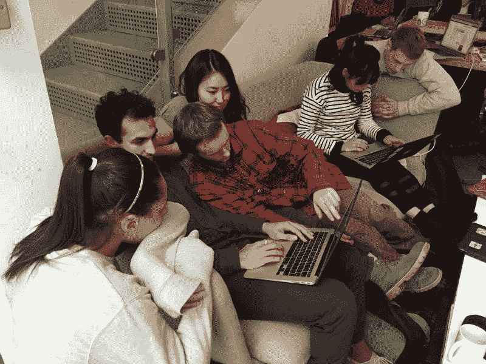
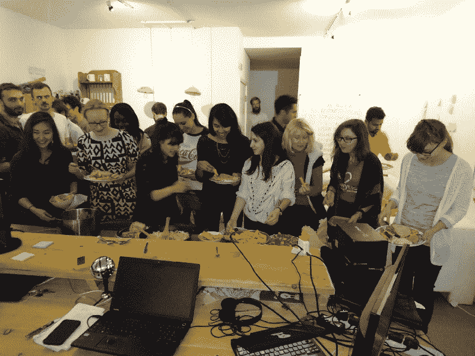
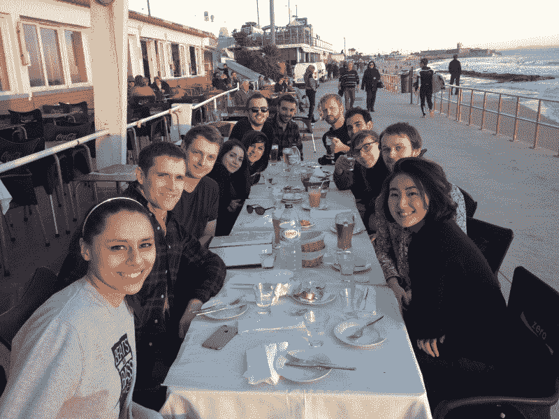
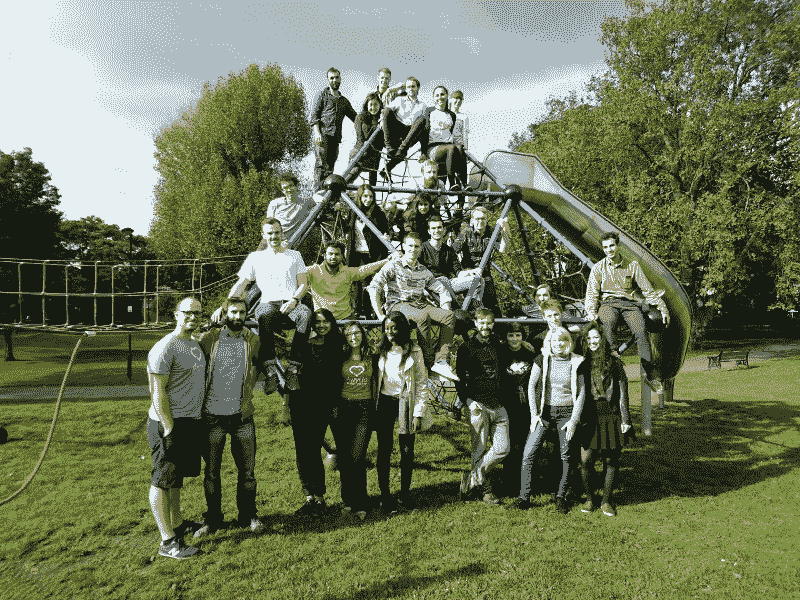
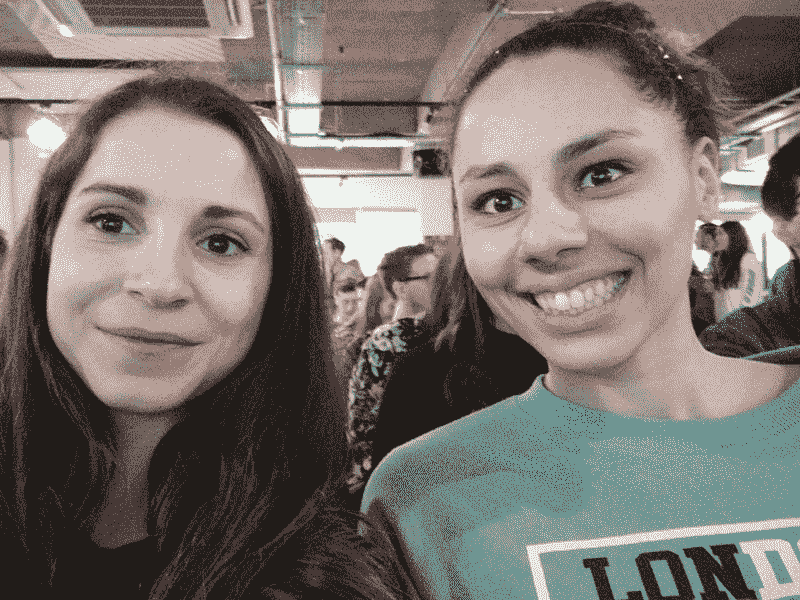

# 两个朋友如何转行，学习编码，并建立了一个创业公司

> 原文：<https://www.freecodecamp.org/news/how-two-friends-changed-careers-learned-to-code-and-built-a-startup-e40c0b060de8/>

丽贝卡·雷丁

# 两个朋友如何转行，学习编码，并建立了一个创业公司

#### Katerina Pascoulis 和 Ruth Uwemedimo 谈论他们从自由职业中学到了什么，以及为什么他们喜欢在 Personably 一起工作

Ruth (left) and Katerina (right)

*2016 年，[露丝](https://github.com/rug1)和[卡特琳娜](https://twitter.com/KatAlexPas)分别离开了[福克斯顿](https://www.foxtons.co.uk/)和 [Crowdcube](https://www.crowdcube.com/) 的工作岗位，加入了第六批[创始人和程序员](http://www.foundersandcoders.com)，这是一个在伦敦的同龄人领导的网络开发培训项目。课程结束后，他们以自由职业者的身份工作，为非技术型创始人创建 MVP，然后分道扬镳:Ruth 加入了 JustGiving 的开发团队，Katerina 以个人身份共同创建了。2017 年 12 月，personally[筹集了 50 万的风险投资](https://techcrunch.com/2018/04/18/personably/)，并聘请 Ruth 作为其第一名员工。*

鲁思和卡特琳娜，非常感谢你们抽出时间和我聊天。卡特琳娜，你已经写了关于[学习法律如何帮助你编程](https://hackernoon.com/how-studying-law-helped-me-with-programming-6af88ac77a8e)以及你如何在“[可怕的短时间内](https://www.gadgette.com/2016/02/19/how-i-learnt-to-code-in-a-scarily-short-space-of-time/)”学会编码，所以让我们从露丝开始吧。你能给我们讲讲你的旅程吗？

**鲁斯:**当然！我在大学里学了数学和哲学，但不确定以后想做什么。我接受了福克斯顿公司的工作，因为卖房子听起来很有趣，而且我想要一辆车。一年后，我离开了福克斯顿，开始寻找新的工作。我觉得在一家初创公司工作可能会令人兴奋，我看到了很多开发人员职位的列表，比如前端开发人员和全栈开发人员。我心想，*这是怎么回事，这些角色有什么区别？*

我研究了学习编码并阅读了付费训练营，但是因为我不确定它是否适合我，所以我还没准备好投入如此昂贵的事情。最后，我读了《卫报》上的一篇文章，丹在文章中谈到了创始人和程序员，于是我想，“嗯……一个免费的、同行主导的项目？我需要了解更多这方面的知识！”。我在 Bethnal Green(我们的家，直到 2018 年搬到 Finsbury 公园)遇见了 Dan，他带我在 Mile End 公园散步。当我们回到太空时，我知道我想申请。

丽贝卡:卡特琳娜，你告诉过我你想编码，这样你就可以自己做东西了。说说你在 Founders and Coders 学习在同行主导的环境中编码的经历吧。

Katerina: 对于创始人和程序员来说，不知道如何做某件事只是解决问题过程的开始，而不是结束。我学会了使用互联网来帮助我问正确的问题，然后确定该问谁或者在哪里可以找到答案。我认为处在一个填鸭式的环境中不会给你这种技能。这是我学习编码时，使用像 [Codeacademy](https://www.codecademy.com/) 这样的工具的主要问题。当你陷入困境时，它不会促使你去寻找答案，所以我很难让自己超越初级阶段。

Rebecca: Ruth，你能告诉我一些你参加这个课程的经历吗？

鲁斯:参加这个课程让我确定了我热爱编程，并且我想成为一名开发人员。我也爱上了 Founders and Coders 的社区，尤其是每个人都愿意互相帮助学习和提高他们的编码技能。

Ruth working with a team on a project at Founders and Coders

丽贝卡:你还记得你是什么时候意识到自己想以编程为职业的吗？

鲁斯:大概有两三个星期了，我真的很喜欢这门课程，我知道这就是我想做的。人们看着代码会想“哦，我的天啊，我永远也学不会那个”，所以当你真的理解它的时候，就像是“我不敢相信我真的理解这个”。此外，能够编写一些代码，有助于生产一些有形的东西，一些人们可以使用的东西——这是一种非凡的感觉。

丽贝卡:你提到被创始人和程序员们互相帮助的意愿所打动。有没有一段时间有人不厌其烦地帮助你？

鲁斯:一周有几天，在最初的半个小时里，前一批人会带领我们进行所谓的“早晨挑战”我记得[尼基](https://www.linkedin.com/in/nikhilaravi/?originalSubdomain=uk)在 ES6 上做了一个挑战，那是刚刚出来的，她谈到了解构，当然，我现在觉得很容易！我*刚刚*学会了如何在 ES5 中访问对象内部的属性，我无法理解 ES6。感觉好像除了我，其他人都明白了，但不管我问了多少问题，尼基都愉快地抽出时间回答了所有的问题。

在整个课程中，我们得到了在该领域工作的应届毕业生和校友的大力支持。我认为让过去的一群人来教现在的一群人最好的一点是，以前的一群人最近处在新一群人的位置上，他们正在努力理解一段简单的代码是如何工作的，所以他们可以很容易地联系起来。有时候我觉得更有经验的程序员可能会忘记初学者是什么样的。

A group lunch at Founders and Coders

**Rebecca:** 你自己成为导师的时候是什么感觉？

鲁斯:我建议将测试作为下一期课程的一个主题，因为我们在课程中没有明确地研究过它，但我认为它非常有价值，我们可能应该花一周时间来研究它。那一周，我和一个伙伴一起牵头，我喜欢和其他想学同样东西的人分享我最近学到的所有东西！我还发现它巩固了我所有的学习，因为我必须真正理解它才能教它。

Katerina: 当Ruth 开始研究 Personably 时，她开始钻研代码，她说的第一句话是，“所有的测试都在哪里？”公平地说，我们有一些-只是不够。因此，进行更多的测试成为她的首要项目之一，现在我们有了一个非常好的测试基础设施，一切都更加稳定了。

Rebecca: 告诉我你们在 Founders and Coders 一起合作的项目。

鲁斯:我们第一次合作是在一个名为 [Causr](https://causr.co/) 的应用的 MVP 上。卡特琳娜是一个很好的项目经理！

Katerina : Ruth 在这方面很慷慨——我没有很好地评估这个项目，我们基本上在三周内就完成了为商业建立 Tinder 和位置匹配的工作。学习如何确定项目范围是一种考验。真的，那应该是一个有预算匹配的三个月的项目，而不是一个三周的项目！

我意识到，在课程上做好周末项目准备并不等同于做好客户生产准备。当你在球场上建立一些东西时，你可能没有完成最后的百分之二十，这很好，但对于一个客户来说，这些收尾工作比你预期的要长得多！当你同意价格时，你必须考虑到这一点，否则你可能会以低于最低工资的工资结束工作。

鲁斯:我们后来的项目进行得更顺利了！

**Katerina:** 我试图将这一点传递给下一批人，指导他们应该做什么样的事情，以及需要注意什么(比如早期公司想要很多工作，但不愿意为你支付任何费用)。我回来过几次，就类似的话题发表过演讲。

在 Crowdcube，我与早期创始人一起寻找资金，这意味着我能够通过寻找新的毕业生自由职业项目和处理到来的事情来回报创始人和程序员。

Ruth and Katerina with members of their Founders and Coders cohort on a trip to Portugal

丽贝卡:对阅读这篇采访的未来自由职业者有什么建议吗？

**卡特琳娜:**很多！首先，确保你有一个清晰的项目范围，在你设定的时间框架内你要交付什么，并把付款和那些可交付成果联系起来。这样，如果客户后来要求一些不在原来范围内的东西，您可以对额外的时间收取更多的费用。这也有助于避免“功能蔓延”，当客户多次要求“再做一件事”时！

此外，在其他地方已经说过，但值得重复的是:如果你正在构建一个 MVP，将客户要求的削减到最基本的版本。如果你的客户说，“嘿，我们的用户需要能够发送消息，所以你能建立一个应用内消息服务吗”，后退一步，探索你是否能够使用其他人的客户端使用 [Twilio](https://www.twilio.com/) 或 API 获得相同的功能。

丽贝卡:露丝，你从自由职业中学到了什么，这对你决定下一步做什么有什么帮助？

在完成《创始人与编码者》之后，我总共做了一年左右的自由撰稿人。卡特琳娜和我一起为 [Juno](https://junopayments.com/) (自动化产权转让)、Causr(与你周围的人建立网络)、Piccnicc (Deliveroo 但用于机场)和 [WCRS](http://www.wcrs.com/) 的项目工作。我还和 Founders and Coders 的其他人一起做过几个持续一周到一个月的短期项目。

做一名自由职业者有利有弊，但总的来说，我喜欢这样。自由职业让我在开始永久的工作之前，可以接触很多不同的技术，找出我最喜欢的技术。它还帮助我获得了获得全职工作所需的经验和信心。还有，既然自己管理自己的时间，想去度假也可以！

另一方面，你总是要担心找到你的下一个项目。我最长的空档是五周，这是一段没有收入的相当长的时间。幸运的是，当时我住在家里，所以我不必担心租金，但如果你这样做，那就更有压力了。

Katerina: 当你是一名更资深的开发人员时，你可以收取 400 - 1000 英镑的日工资，这足够支付你没有工资的日子，但作为一名初级人员，这很难，因为 150 英镑/天不会剩下多少，特别是在伦敦这样的昂贵城市。

A snapshot of the Founders and Coders community circa 2016

丽贝卡:露丝，我很想听听你求职的经历。你申请了多少份工作？你在寻找什么样的角色？

鲁斯:实际上我只申请了 JustGiving 的那份工作。我仍在进行一个为期三个月的自由职业项目，我并没有认真寻找一个永久的角色，但我也知道我没有下一个自由职业项目，所以当我阅读 JustGiving 的职位描述时，我不能错过它。

丽贝卡:什么特别引起了你的注意？

鲁斯:主要是因为这份工作需要使用 React，当时我觉得这很有挑战性。我记得在给出之前，我不喜欢用 React，因为我不太理解它。

**Katerina:** 当我们在 2015 年学习 React 时，它刚刚问世，在生态系统中处于早期，所以没有我们现在拥有的资源。

Ruth: 我记得我看了很多关于 React 的问题，但是没有任何活动，实际上没有答案。现在好多了！

卡特琳娜:我们实际上在 Personably 使用 React。当我的联合创始人开始研究我们将使用什么技术时(当时我正和 Ruth 一起完成一个项目)，他告诉我他将使用 React，对此我想，“我们必须这样做吗？

*丽贝卡:露丝，跟我说说 JustGiving 的面试吧。*

*鲁斯:因为这是我的第一次技术编码面试，所以我并没有期望得到这份工作，我主要是申请参加面试练习，看看是什么样的。但是 JustGiving 的面试过程变得非常愉快:我很放松，每个面试我的人都很友好。我满怀信心地离开了，我会得到我所需要的支持，去学习更多，提高我的技能。*

*丽贝卡:卡特琳娜，自由职业后，你参与创办了 Personably。你是如何想出你想成为公司的首席执行官，而不是首席技术官的？*

*卡特琳娜:我认为这是因为我在公司外部方面有更多的经验，比如投资、公开演讲和销售。这让我更适合做首席执行官。我的联合创始人刘易斯(Lewis)一直在研究新技术，尝试签署随机产品，寻找最佳实践，这正是早期首席技术官所需要的。不过，在最初的六个月里，我们俩做了几乎相同的工作——做东西，和客户/潜在客户交谈。*

*

Katerina and Ruth at a Design Club event* 

*丽贝卡:露丝，你离开了自己喜欢的工作，去为卡特琳娜工作。你为什么这么做？*

*鲁斯:我很喜欢在 JustGiving 工作，这是我第一个完美的工程职位，我周围的人都有丰富的经验，我学到了很多东西！我受到该组织通过众筹支持慈善机构、非营利组织和个人的使命的启发。*

*然而，六个月后，JustGiving 被一家美国公司收购，很明显在接下来的一年左右会有很多变化。我不认为这是一件坏事，它并没有真正困扰我，但我也知道我想从初级开发人员的角色中走出来。所以当卡特琳娜问我为 Personably 工作的时候，这是一个我无法拒绝的机会。*

*Rebecca: 告诉我从大公司到小公司的第一名员工的转变。*

*鲁斯:大公司和小公司的主要区别在于事情发展的速度。在大型组织中，事情做出最终决定可能需要很长时间，但在小型早期创业公司中，事情往往进展得更快。*

*丽贝卡:有什么例子可以说明在人际交往方面比仅仅给予方面发展得更快？*

*鲁斯:随便什么功能发布！在 JustGiving 的时候，我做的第一个项目花了两个月才发布，第二个项目在我离开的时候还没有发布——而我已经做了六个月了。在 Personably，我们做小项目，并快速发布。*

*Katerina: 例如，Ruth 用新设计在最多两到三周内重建了我们的整个主页。我们试图快速发布东西，让人们试用，这样我们就可以收集反馈和迭代！否则，你可能会花很长时间构建一些东西，然后不得不废弃，因为它们不是你的客户所需要的。*

*丽贝卡:卡特琳娜，告诉我你为什么第一个雇佣露丝。*

*卡特琳娜:因为她很棒！我们在一起工作了一年的大部分时间(有一段时间还住在一起)，所以我知道我们合作得很好。我正在创建这家公司，我有宏伟的计划，我非常了解露丝，知道她会做好准备。她总是非常积极，从不害怕难以解决的问题。在我看到她如何出色地处理了我们自由职业工作的不可预测性之后，我相信她能够应对初创企业的不确定性。另外，她一直是比我更好的开发人员！*

*此外，我并不直接管理 Ruth，因为我的联合创始人 Lewis 是她的团队的负责人，所以我们仍然感觉像是同事！*

*

Katerina and Lewis, Personably founders, with Ruth, their first employee!* 

*鲁斯:为你以前共事过的人工作很好，因为你知道他们是如何工作的，而且，至少在我们的情况下，没有惊喜。*

*丽贝卡:卡特琳娜，你曾经是雇员，自由职业者，现在是自己的老板。告诉我这次旅行的情况。*

***卡特琳娜:**他们都促成了我现在的地位！成为一家高速增长的初创企业的员工是一次很棒的经历，我很早就承担了很多责任，并通过它在伦敦理工学院建立了自己的关系网。自由职业是我第一次为自己找工作，管理一个项目，并对其交付负全部责任的经历。我还看到了其他创始人是如何开始创业的。*

*现在有了一个六人团队，风险资本投资和付费客户与最初几个月非常不同，当时刘易斯和我试图建立一些我们认为有一天可能有用的东西。我们对客户、团队和投资者承担了更多的责任，所以这更像是一份真正的工作——只是风险更大。尽管这很令人兴奋！*

*丽贝卡:卡特琳娜，告诉我更多关于你作为首席执行官的职责。你最喜欢什么？最艰难的部分是什么？*

*卡特琳娜:我负责招聘、销售、投资以及任何与营销相关的事务。我最喜欢看到我们雇佣的优秀团队比刘易斯或我做得更好。我也非常喜欢与快乐的客户和我们节省时间的人交谈！*

*随着公司的变化和团队的发展，我的工作大约每三个月就会发生变化。这意味着无论我在处理什么问题，我都不会像第一次那样感到完全放松。我喜欢这种不确定性，但这意味着你永远不会觉得自己在破坏它。我需要更好地反思我们做得好的地方，并庆祝这些事情。我认为这是我的个性，但我不断向前推进——一旦我成为某方面的专家，这意味着我太专注于它，我需要雇用别人来做这件事！*

*丽贝卡:我想在初创公司工作不会让你有很多空闲时间，但请告诉我你在工作/技术之外的兴趣。*

*鲁斯:我最近刚买了一栋房子！所以在过去的 3 - 4 个月里，我工作之外的每一点时间都用来做这件事了！*

*Katerina: 尝试肖尔迪奇所有不同的披萨店？我现在最喜欢的是 HomeSlice！*

*要了解更多关于创始人和程序员免费培训项目的信息，以及阅读更多对我们毕业生的采访，请访问[www.foundersandcoders.com](http://www.foundersandcoders.com)*