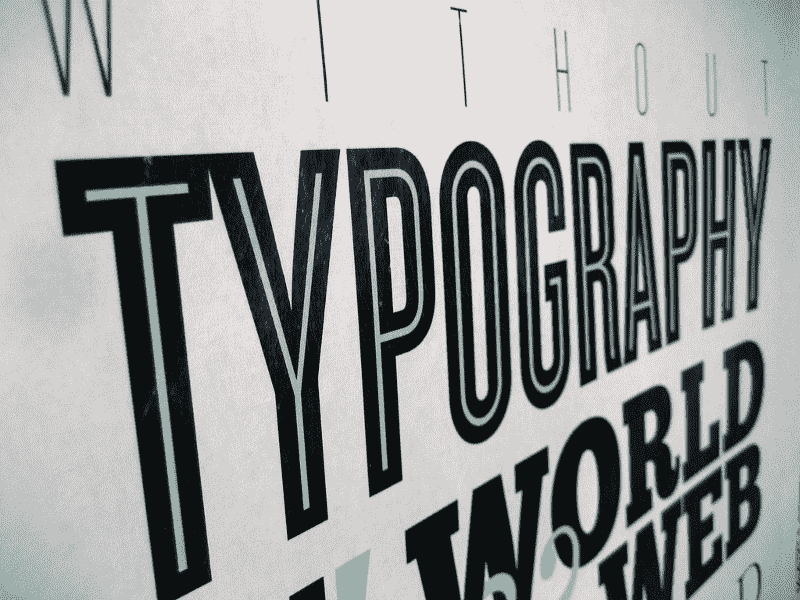
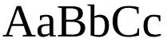
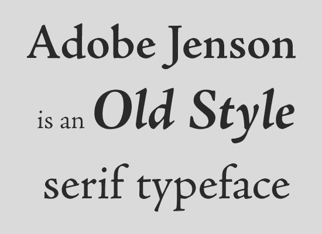
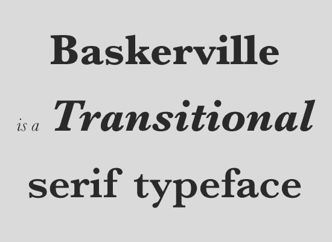
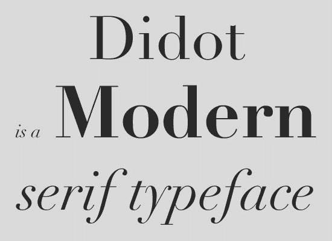
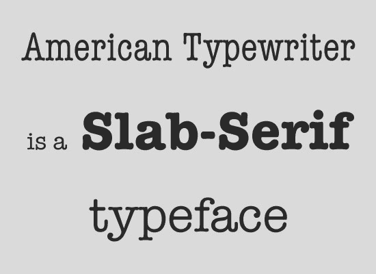
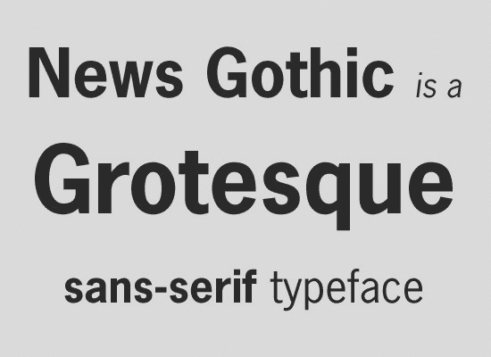
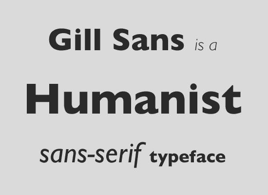
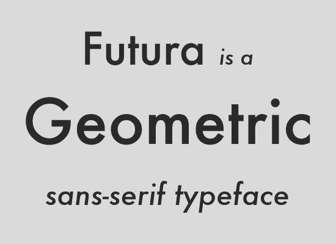

# 版式如何决定可读性:衬线字体与无衬线字体，以及如何组合字体。

> 原文：<https://www.freecodecamp.org/news/how-typography-determines-readability-serif-vs-sans-serif-and-how-to-combine-fonts-629a51ad8cce/>

作者 Harshita Arora

# 

对于数字设计来说，知道和理解如何使用以及如何组合不同的字体是很重要的。每种心情都有一种字体！

这篇文章将向你简要介绍印刷术中最大的家族:衬线字体和无衬线字体。作为一名设计师，你如何选择合适的字体并组合它们。

开始吧！

### 衬线字体系列

Example of a Serif font.

衬线字体和无衬线字体的区别在于一种叫做衬线的小脚状的东西。

The areas in red are called the serif.

你会看到很多衬线字体看起来更传统或保守。

**起源**:他们之所以有这些小脚，其实是因为石雕。早在人们需要在石头上雕刻出拉丁字母的时候，设计师通常会用画笔描绘出他们想要的字母。但是石匠必须把它从那幅画上刻出来。石雕在字母上创造了这些衬线。

人们倾向于用衬线字体来处理一些非常严肃的事情。这是因为他们的传统和保守的外观和感觉。

衬线字体进一步分为四个字体系列。

#### *1。旧* *风格*

这是最古老的衬线族。它包括的字体有 Adobe Jenson、Centaur、Goudy Old style 等等。他们的字体是模仿 15 世纪时的文字。很老的样子。

[Image credits](https://www.noupe.com/essentials/icons-fonts/a-crash-course-in-typography-the-basics-of-type.html)

#### *2。过渡性*

这看起来更现代一点。这个字体系列包括 Times New Roman、Baskerville、Georgia 等。

[Image credits](https://www.noupe.com/essentials/icons-fonts/a-crash-course-in-typography-the-basics-of-type.html)

#### *3。现代*

更加现代和优雅。这包括迪多特，这是用于时尚杂志标题的字体。

[Image credits](https://www.noupe.com/essentials/icons-fonts/a-crash-course-in-typography-the-basics-of-type.html)

#### 4.平板衬线

他们是有粗衬线的字体系列。平板衬线字体的例子包括 American Typewriter，Archer 等。

[Image credits](https://www.noupe.com/essentials/icons-fonts/a-crash-course-in-typography-the-basics-of-type.html)

现在，你如何区分衬线字体系列中的这四个主要类别？

其实挺容易的。看看前三个家庭:旧风格、过渡风格和现代风格。将它们并排放置。如果你看一下字母的最细和最粗的部分，你会发现，当你从较老的类型发展到较现代的类型时。你会看到我们称之为字体调制的差异越来越大。例如，把注意力集中在 O 上。比较旧的风格和现代的类型，厚度和薄度的差异将小于现代的。

这种变化很大程度上来源于人们过去用扁平笔尖的笔写字。

Slab-Serif 怎么样？

如果你看一下平板衬线字体，你会发现字体最粗和最细的部分几乎没有区别。

它是故意设计成这样的。它是衬线字体家族的现代成员之一。然而，它并没有遵循“越往后，字体最粗和最细的部分之间的差异越大”的规则。平板衬线是在过去纸张质量很差的时候，为了更清晰地阅读报纸而发明的。

### 无衬线字体系列

Example of a Sans-Serif font

无衬线字体不同于有衬线字体。它没有衬线(小脚)或任何装饰元素沿中央梁和顶部酒吧。无衬线比有衬线略现代。

它们也被细分为四个家族。

#### *1。奇形怪状*

最老的那个。这包括新闻哥特式，富兰克林哥特式，等等。

[Image credits](https://www.noupe.com/essentials/icons-fonts/a-crash-course-in-typography-the-basics-of-type.html)

#### *2。新怪诞派*:

稍微现代一点。Helvetica 和爱丽儿就是例子。

[Image credits](https://www.noupe.com/essentials/icons-fonts/a-crash-course-in-typography-the-basics-of-type.html)

#### *3。人文学者:*

以后更是如此。吉尔桑斯就是一个例子。

[Image credits](https://www.noupe.com/essentials/icons-fonts/a-crash-course-in-typography-the-basics-of-type.html)

#### *4。几何图形*:

它们基于几何形状。Futura 就是一个例子。

[Image credits](https://www.noupe.com/essentials/icons-fonts/a-crash-course-in-typography-the-basics-of-type.html)

你如何区分这四者？

现在，类似于衬线，你可以从古老的怪诞家族，到新怪诞，再到人文主义者。你可以看到字体最粗和最细部分的差异变得越来越夸张。当你看着奇形怪状的东西时，它几乎在所有的点上都是等距的。当你看人文主义字体时，你开始看到调制的变化。

在几何字体中，O 总是完美的圆形。O 看起来就像你用量角器画的一样。而且这种字体有点像 Slab-Serif 类型。尽管它是这个家族中的现代字体之一，但它与潮流背道而驰，几乎没有任何变化，在所有的点上都是等距的。

### 排版如何决定可读性

了解字体系列及其子系列有助于设计样式。但更重要的是，它关乎可读性。设计是关于功能和形式的。什么使字体更易读？

人文主义者的无衬线字体被认为比怪诞更具可读性。原因是:

*   人文主义字体有更开放的形状。
*   人文主义字体的字符间距比奇形怪状字体的字符间距要大，这使得它更容易阅读。
*   在这种奇形怪状的字体中，字符彼此模糊不清。小写的“g”和奇形怪状的“9”看起来非常相似，它们都是方形的，增加了更多的混乱，降低了可读性。而在人文主义字体中，你可以清楚地区分字符。

这些是使字体可读性更好的一些因素。现在你可以根据用途选择字体。

### 如何组合字体

当你组合不同的字体时，通常你会有不同的标题字体和不同的正文字体。这是为了在你的设计中创造一个轻微的对比和兴趣。

设计师在组合不同字体时使用的一些通用规则:

1.  衬线和无衬线配合得非常好。它倾向于创造一个好的设计。与衬线相比，无衬线略微增加了可读性。这就是为什么无衬线字体是一个伟大的字体正文。不要把衬线字体和有衬线字体、无衬线字体和无衬线字体组合在一起，因为这样看起来有点乏味，没有区别。
2.  一个设计中有太多的字体不是一件好事。结果看起来太奇怪了。坚持 2 种字体(一种来自衬线族，另一种来自无衬线)。
3.  就像欣赏颜色一样欣赏字体的意境。也不要把不同的心情结合在一起。尝试将更现代的字体与现代字体相结合，旧字体与更传统的字体相结合。如果你获得了字体的情绪，你就会开始创造一些难以置信的美丽设计。
    你应该保持相似的东西:字体的情绪和时代
    你应该对比的东西:衬线度(例如，一种字体应该是衬线的，另一种应该是无衬线的)和粗细。
    粗细表示文本的粗细或粗体。大多数设计软件都有一系列的权重。例如，浅、中、粗、超粗等等。用不同的重量进行对比，创造出有趣的设计。

永远不要使用——漫画书，纸莎草纸，Viner，Kristen，Curlz。不管你在设计什么，它们都会让你的设计看起来很糟糕。

### 排版工具

1.  一个 chrome 扩展，告诉你任何网站上的字体名称。
2.  [字体松鼠](https://www.fontsquirrel.com/)
    我通常从这里下载字体。它们可以免费用于商业用途。

这是对印刷术这一广阔领域的简要概述。希望你学到了有趣的东西，可以用在你的设计中！:)