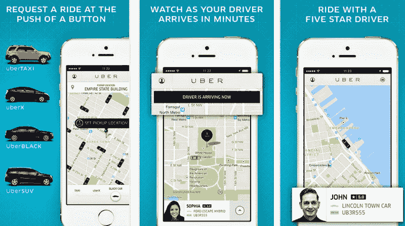
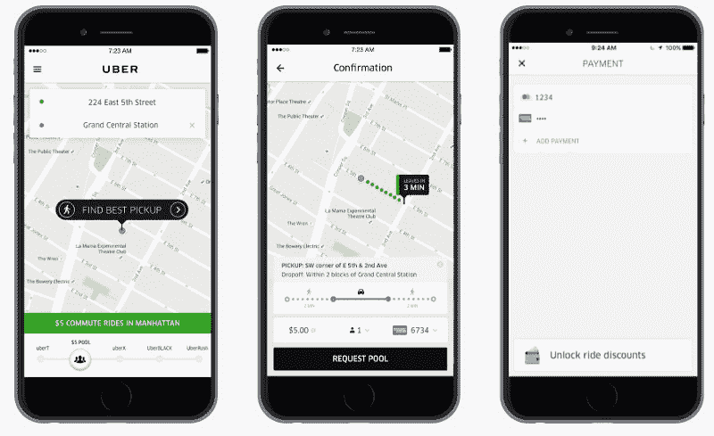
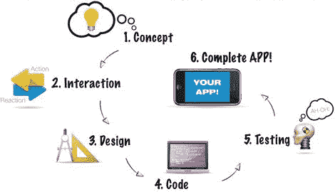

# 优步是如何形成的

> 原文：<https://www.freecodecamp.org/news/how-uber-was-made-da3c631066d0/>

作者:迪米特罗·布罗夫金

# 优步是如何形成的

优步改变了世界。事实上，很难想象一个没有创新拼车服务便利的世界。追溯其起源于一个不断放松管制的市场，优步已经成功崛起。优步在超过 58 个国家开展业务，市值约为 660 亿美元，并迅速扩张，在超过 82 个国家的超过 581 个城市设立了分支机构，其中美国、巴西、中国、墨西哥和印度是优步最活跃的国家。

如果这还不够令人印象深刻的话，2016 年该公司在一周内完成了总共 20 亿次乘坐。当你考虑到第一个十亿次乘坐花费了优步 6 年时间，第二个十亿次仅用了 6 个月，优步成为全球商业领袖就不足为奇了。这种全球现象建立在一个简单的想法上，其前提很有吸引力——除了你的智能手机，你什么都不用就能叫到车。

它解决了打车的问题，给了每个人一个公平的解决方案，同时进一步利用了新兴市场。聪明的人会问正确的问题:*我如何为我的业务需求开发一个像优步这样的应用程序？*

### 卑微的出身

这一切都始于 2008 年，优步的创始人在一次会议上讨论科技的未来。到了 2010 年，优步在三藩市正式推出。在 6 个月内，他们有 6000 名用户，提供了大约 20000 次乘坐。他们成功的关键是什么？首先，优步的创始人专注于同时吸引司机和乘客。旧金山是美国科技社区的中心，因此是这种形式的技术创新蓬勃发展的完美共鸣板。

一开始，优步通过口碑传播他们的应用，主办和赞助科技活动，并让活动参与者免费使用他们的应用。这种“走向市场”的形式一直延续到今天——给第一次骑优步的新骑手 50%的折扣。最初的折扣激励用户成为长期骑手，剩下的就是历史了。随着越来越多的人在社交媒体上向世界介绍这款创新的新应用程序，他们的营销策略获得了回报。

### 产品技术凝聚力:优步如何运作

是什么造就了优步的优步？首先，这是无处不在的吸引力，或者他们简化产品、软件和技术的方式。一开始，它是新鲜的，创新的，前所未有的。因此，如果有人想复制这种模式，他们需要看看优步的品牌战略。

要使用优步，你必须下载该应用程序，它首先在 iPhone 上启动，然后扩展到 Android 和黑莓。

优步的联合创始人加勒特·坎普和特拉维斯·卡兰尼克非常依赖基于 iOS 和 Android 地理定位的关键技术。不过，真正让它大卖的是它清晰的核心价值——能够绘制和追踪你所在地区所有可用的出租车。所有其他的互动都基于这一核心价值——这也是优步与众不同的地方(也是你的应用与众不同的地方)。要构建像优步这样的应用程序，您需要具备:

**1。注册/登录功能:**优步允许您使用您的名字、姓氏、电话号码和首选语言进行注册。注册后，他们会向您发送一条短信来验证您的号码，这样您就可以设置您的支付首选项。通过这种无现金系统，每次乘车后都要收取车费。

**2。预订功能:**这使司机可以选择接受或拒绝来电乘车请求，并获得客户当前位置和目的地的信息。

**3。识别设备位置的能力:**优步通过 [CoreLocation 框架](https://developer.apple.com/library/ios/documentation/CoreLocation/Reference/CoreLocation_Framework/_index.html)(用于 iOS 平台)获取设备的地理位置和方向，以安排位置和交付。理解 iOS 和 Android 地理定位功能对于这一步至关重要，因为这是你的应用程序运行的基础。

**4。点对点路线:**优步应用程序为司机和用户提供路线。优步应用的开发者使用 iOS 版的[地图工具包](https://developer.apple.com/library/ios/documentation/MapKit/Reference/MapKit_Framework_Reference/_index.html)和安卓版的[谷歌地图安卓 API](https://developers.google.com/maps/documentation/android/?hl=uk) 来计算路线并提供方向。他们进一步为 iPhone 和 Android 实现了谷歌地图，但巧妙地采用了其他地图公司的技术来解决可能出现的任何后勤问题。

**5。推送通知和短信:**当你预订一次乘车时，你会立即收到来自优步的多达 3 条通知。

*   通知您司机何时接受您的请求
*   一种是当司机靠近你的位置时
*   你的行程被取消的可能性微乎其微

您还可以进一步获得您的司机状态的完整更新，包括车辆品牌和牌照号码，以及出租车的预计到达时间。

**6。价格计算器:**优步提供无现金支付系统，每次乘车后自动向司机付款，通过用户的信用卡处理。优步收取司机车费的 25%,这很容易获利。他们与移动支付行业的世界领导者 Braintree 合作，但其他可用的好选择是 Stripe，或 Paypal，通过[卡。](https://www.card.io/)

这里有几个更受用户欢迎的功能:

*   **能够查看司机的个人资料和状态:**你的客户能够看到你的司机验证会感到更安全，这对于确保你知道谁在使用你的应用程序获利具有很好的安全意义。
*   **接收提醒的能力:**接收关于您的乘坐状态和任何取消的即时通知。
*   **从手机上看到路线的能力(内置导航系统):**这与您的地理定位功能有着内在联系，您希望能够将您的出租车指引到最快捷、最可行的路线。
*   **价格计算:**按需计算价格，实现无现金支付系统。
*   **一个“分摊费用”的选项:**优步推出的这个选项非常成功。它允许朋友们分摊乘车费用。
*   **询问以前的司机:**这有点像让你最喜欢的出租车司机快速拨号，是确保回头客的好方法。
*   **等待列表而非激增定价:**通过采用等待列表功能，避免了采用激增定价的媒体争议，因此您的用户可以被添加到等待列表中，而不是被收取超出其应得的费用，并防止他们在高峰时段刷新应用程序，从而减少后端基础架构所需的资源。

类似应用的潜在开发者应该注意到，优步成功的另一个关键是优步的运营方式。他们进入了不止一个市场，这意味着更多的骑手、更多的司机和公司更多的业务。优步已经掌握了本地化的艺术——击败现有市场和竞争对手的能力，这通过改善自己的商业策略进一步保留了他们的客户群。

他们考虑到了当地的背景和环境。例如，他们在 2013 年 11 月与 Paypal 合作，为尽可能多的德国人提供不使用信用卡的服务，并在亚洲转向基于短信的服务，因为亚洲人多但人均智能手机少。这有助于他们迎合各种市场和优化利润。

优步的营销策略不是静态的，而是动态的。扩张是必要的，这种商业模式通过用客户和司机饱和出租车市场来获取利润，推动其指数级增长。有抱负的应用程序开发者可以从中吸取的是，你需要为*灵活性设计你的应用程序。*

设计你的应用程序时，要让它能承受打击，并能从容应对。拥有一个允许你在应用程序中有效地构建和集成变化，并允许团队成员有效地交流的系统是至关重要的。

优步如此成功的原因是它有能力重塑我们对技术及其运作的看法。事实上，它通过创新的按需服务使市场变得更好、更高效。

### 优步建立在什么技术之上？

该应用的技术部分主要是用 JavaScript 编写的，JavaScript 也用于计算供应和预测需求。实时调度系统建立在 Node.js 和 Redis 上。Java 和 Objective-C 用于 iPhone 和 Android 应用程序。 [Twilio](http://www.twilio.com/customers/stories/hulu) 是优步短信背后的力量，推送通知是通过 iOS 平台的[苹果推送通知服务](https://developer.apple.com/library/ios/documentation/NetworkingInternet/Conceptual/RemoteNotificationsPG/Chapters/ApplePushService.html)和安卓应用的[谷歌云消息](http://developer.android.com/google/gcm/index.html) (GCM)实现的。

### 优步挣多少钱？

其实比你想的少很多。在扣除 25%的佣金(约为每次 0.19 美元)后，660 亿美元的估值主要用于信用卡处理、利息、税收、员工薪酬、客户支持、市场营销和各种反欺诈工作。

### 建设优步需要多少钱？

优步不只是一个应用程序，而是两个——一个给骑手，一个给司机。开发像优步这样的应用程序的成本取决于很多因素

*   构建 MVP 的成本
*   产品开发和采购
*   理清营销经济学
*   构建和改进应用程序分析能力的持续成本

当你制作一个像优步这样的应用程序时，你会在设计服务、后端和网络开发、项目管理方面投入相当多的资金，更不用说 Android 和 iOS 原生应用程序开发了。对于类似的按需打车应用程序，总工时约为 5000 小时，这使得开发这样一个应用程序的成本约为 50，000 美元(假设您的团队每小时工作 50 美元)。然而，由于每小时的费用大致在 20 美元到 150 美元之间，中间值可能会更高或更低。

### 结论

总而言之，Ubers 的成功要归功于几个因素，包括清晰的商业模式和基于互动的功能，而不是反过来与专注于吸引用户的营销策略相结合。

每个人心中的问题当然是，当你开发一个应用程序时，如何通过确保你的想法和产品是可行的来降低失败的总体风险？

一种方法是使用移动应用程序开发合作伙伴(如 [Octodev](https://octodev.net/) )，他们已经开发了许多这样的应用程序，并且了解相关的流程。使用这样的合作伙伴的一个好处是，他们已经在许多这样的应用程序开发项目中工作过，并且有产品开发的实践经验，以避免陷阱并充分利用你的视野。

Octodev App Development Process

确保您的应用程序开发项目快速顺利执行的另一个重要部分是在项目期间有一个清晰的路线图和定期沟通。有许多方法可以实现这一点，在 Octodev，我们使用咨询方法来开发应用程序。我们从成功的应用程序实施中汲取经验。[如果你想知道你自己的优步式应用的准确成本，现在就和我们联系](https://octodev.net/contact-us/)。

这篇文章最初发表在 [Octodev 博客](https://octodev.net/how-uber-was-made/)上。