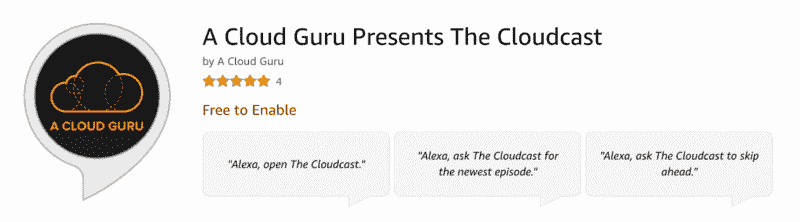
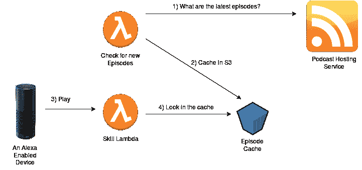
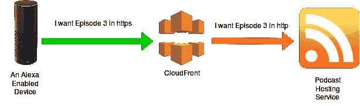

# ACG 如何在 Alexa 上实现一个获奖的技术播客，以及我们在这个过程中学到了什么

> 原文：<https://www.freecodecamp.org/news/how-we-brought-an-award-winning-tech-podcast-to-life-on-alexa-and-what-we-learned-along-the-way-201ab40dda28/>

#### 当由语音优先界面控制时，播客甚至更好。

每个月，6700 万美国人收听播客，普通播客粉丝每周收听 5 个节目。

音频播客很受欢迎是有原因的。在平均 30 分钟的播客中，听众可以受到有影响力的内容的启发和教育，而不受屏幕的干扰。

在听一集的时候，你可以补收邮件、锻炼、通勤或者在甲板上放松。播客的纯听觉体验解放了你的其他感官——为听众提供了一个多任务的机会。

在最近的一篇文章中，福布斯强调了屏幕疲劳是播客受欢迎程度上升的关键因素之一，推动了听众在过去一年中 11%的增长。

> “起初令人兴奋的是，对于许多用户来说，屏幕已经变得令人疲惫不堪，播客代表了一种令人耳目一新的选择。你不用眼睛，而是用耳朵；有沉默、停顿和真实的人声，而不是屏幕上的文字和图像。”

不幸的是，播客体验的全部好处经常被图形界面的摩擦打断。为了消费听觉内容，听众必须点击控制并在他们的设备上导航屏幕。

播客最好是在没有屏幕的情况下播放——使用语音优先的界面来控制体验，消除干扰和疲惫。与其浏览屏幕来查找过去的剧集、控制回放或调节音量，不如*问问 Alexa* 。

> 阿利克夏，播放云彩。Alexa，跳过前面。
> Alexa，暂停。

这正是为什么如此多的顶级播客正在创造专门为 Alexa 设计的定制技能。通过简单地询问 Alexa，听众现在可以从流行节目如 NPR 或 TED Talks 中提取 325 个播客。

现在，精通技术的听众可以享受一个关于云计算的获奖播客。自 2011 年以来，Aaron Delp 和 Brian Gracely 在北卡罗来纳州罗利的工作室制作了超过 300 集的[The cloud cast](https://acloud.guru/cloudcast)——2017 年累积了惊人的 100 万次收听率。

#### 那么在 Alexa 上发布一个播客需要什么呢？

一个常见的起点是 github 上可供开发者使用的几个播客模板中的一个——所有这些模板都使用亚马逊的[音频播放器界面](https://developer.amazon.com/public/solutions/alexa/alexa-skills-kit/docs/custom-audioplayer-interface-reference#valid-response-types-4)。许多模板要求每集手动上传到 S3 桶，而其他模板依赖于播客的 RSS 提要。

为了为 Cloudcast 开发高质量的播客技能，我们与一家专门从事 Alexa 播客的新创业公司合作。我们的团队从一篇关于使用 AWS Lambda 托管 Alexa 技能的[课程的文章](https://read.acloud.guru/lambda-for-alexa-skills-7-tips-from-the-trenches-684c963e6ad1)中了解到他们独特的*播客即服务*。

在与 Fourthcast 合作时，我们有机会探索如何为 Alexa 播客技能开发托管解决方案，以提供一百万次收听。以下是我们经验中的一些感悟。

#### ***播客是移动的目标。***

随着新剧集的发布，一项技能需要自动检测更新，以便听众可以立即获得。对于 Cloudcast 技能，使用不同的 Lambda 函数来频繁检查新剧集的可用性。函数的结果被缓存在 S3 中——一个单独的 Lambda 函数检查状态。这种方法确保了我们总是能得到听众可以得到的最新剧集。

#### ***表现***

为了避免流媒体音频的延迟问题，听众通常依赖于一个 *podcatcher* 应用程序——比如苹果 iTunes 客户端。这些应用程序用于订阅播客，并自动下载新剧集进行本地存储和播放。

与传统设备不同，亚马逊 Echo 不具备本地缓存剧集的功能——完全依赖实时流媒体。因此，到 Echo 设备的 Alexa 播客流的质量在很大程度上取决于托管解决方案的质量。

对于许多播客来说，他们目前的托管解决方案不够快，无法支持 Alexa 的实时流媒体需求。在这些情况下，Fourthcast 使用一个 S3 桶作为 *podcatcher* 来下载和缓存当前内容。为了提高大型 MP3 文件的流媒体性能，录音会使用[弹性转码器](https://aws.amazon.com/elastictranscoder/)自动重新编码为较小的流媒体质量文件。

#### ***《HTTPS 协议》***

大多数播客 RSS 源使用 HTTP URL 来引用一集——而 Alexa 播客技能需要使用 HTTPS。幸运的是，大多数播客服务支持 HTTPS——这意味着您可以简单地将引用的 URL 修改为 HTTPS 协议。

在少数情况下，这不起作用，简单地创建一个 CloudFront 代理，在请求端使用 HTTPS，在源端使用 HTTP。

#### 一个数据库

任何有价值的播客技能都需要一个数据库。出于几个关键原因，这是必不可少的——跟踪用户的进度 1) *跨集*和 *2)在集内。*通过使用数据库，播客会话可以在未完成的剧集的精确位置恢复。DynamoDB 是这项工作的自然选择——因为它与 Lambda 的连接是低延迟的。

将所有这些元素整合在一起会带来更高质量的播客体验——随着像[通知 API](https://developer.amazon.com/blogs/alexa/post/8cc45487-d5fb-413b-b6c7-eeea4794d10c/amazon-announces-notifications-for-alexa-feature-is-coming-soon-sign-up-to-stay-tuned) 这样的新功能的出现，我们迫不及待地想整合更多元素，让 Alexa 上的播客变得更好。

[**Cloud cast，由云大师**](https://acloud.guru/cloudcast)
[*呈现一个关于云计算的获奖播客，由云大师呈现。acloud . guru*](https://acloud.guru/cloudcast)

既然你已经了解了如何在 Alexa 上实现播客，我们希望你喜欢最新一集的[一位云专家介绍了 Cloudcast](https://acloud.guru/cloudcast) ！