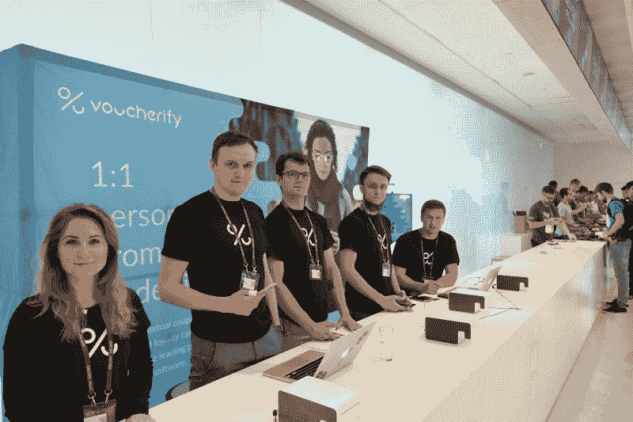
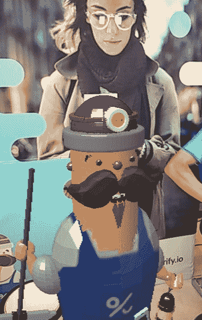
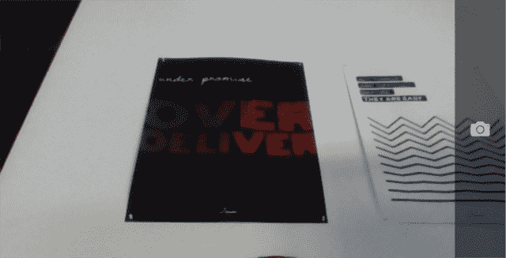
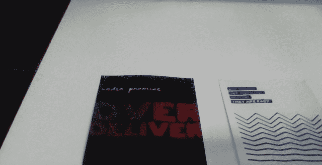
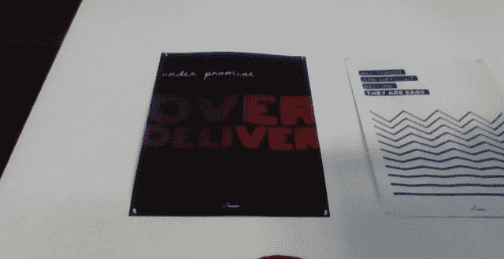
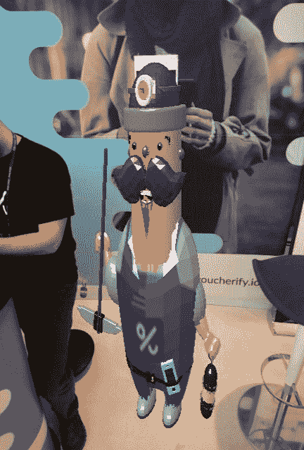
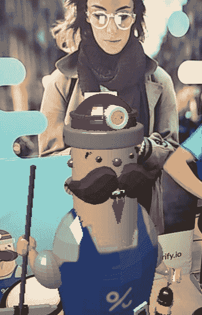

# 我们如何通过 AR.js 将我们的产品吉祥物变得栩栩如生

> 原文：<https://www.freecodecamp.org/news/how-we-brought-our-product-mascot-to-life-87830db12ff4/>

马提乌斯塔尔塔罗斯

# 我们如何通过 AR.js 将我们的产品吉祥物变得栩栩如生

Photo by [Rodion Kutsaev](https://unsplash.com/photos/OQ0zP6AS2DI?utm_source=unsplash&utm_medium=referral&utm_content=creditCopyText) on [Unsplash](https://unsplash.com/search/photos/augmented-reality?utm_source=unsplash&utm_medium=referral&utm_content=creditCopyText)

简单回答:使用基于浏览器的增强现实(AR)应用程序。详细答案，请看下文。

玩 AR 的想法最初是一个随机的有趣实验。在我们公司，我们努力保持在曲线的边缘。我们半定期地相互分享技术创新和新技术。由于我们主要是在处理 web 技术，浏览器中 AR 的概念真正开始流行起来。

由于 AR 主要是一种娱乐技术，所以实际应用从一开始就不明显。幸运的是，两件不相关的事情同时发生了:

*   我们刚刚为我们的[产品](https://voucherify.io)——[休伯特](https://uploads-ssl.webflow.com/58fe5d0657dd045f17ae2345/5ab8c85eff9c8b50cbce8b28_voucherify_index_v2_03%20(2).png)创造了一个吉祥物，
*   我们必须在 2018 年的 [devoxxPL 上做一个营销展台](https://devoxx.pl/)

我们决定在活动期间将休伯特带入生活，以 AR 应用程序的形式供人们玩耍。在我们看来，用户应该能够:

*   在他们的手机里把休伯特渲染到墙上的背景上
*   拍摄渲染模型的照片
*   在推特上发布照片(不是本文的主题)

最终结果可以在[glitch.com](https://meet-hubert.glitch.me/)上获得，缩小并旋转以适合桌面体验(你也可以快速浏览一下[源代码](https://glitch.com/edit/#!/meet-hubert?path=contestant_app/index.html:1:0))。

### 实时渲染休伯特

我们使用 [AR.js](https://github.com/jeromeetienne/AR.js/) (来自 [this commit](https://github.com/jeromeetienne/AR.js/commit/bfe82a70eae397e02e457801052ca54a3dbd09e2) 的版本)作为我们 AR 应用的主要构建模块——它打包了 webRTC 相机访问、标记识别和 3D 场景渲染。我们喜欢它，主要是因为你可以用大约 20 行代码运行一个基本的演示。

在幕后，AR.js 可以使用 three.js 或 A-frame 实现来渲染 3D 场景。

*   three.js 提供对 3D 渲染的细粒度控制，并且是基于 JavaScript 的。您可能在浏览器中渲染 2D 和 3D 场景时听说过它。
*   A-frame 是一个专门为构建 VR 和 AR 体验而设计的 web 框架。它有一个类似 HTML 的标记，比 three.js 更具声明性，但为了便于使用，牺牲了一些控制。

我们没有 VR 或 3D 专家(除了 [Mrówa](https://twitter.com/mr_oova) ，他准备了 3D 模型)。由于 A-frame 的类似 HTML 的声明性语法对我们来说更熟悉，我们选择了 A-frame 来进行渲染。

这里你可以看到渲染休伯特的代码，点上 30 行。为了简单起见，我们省略了一些选项和 A-frame 调整。可以参考回购看看全部。

这给了我们 Hubert 在网络浏览器中实时呈现的效果。

### 捕捉照片以发布推文

不幸的是，我们没有一个单一的视频呈现整个场景。这是来自你相机的视频和一个渲染的 3D 场景。我们很快发现，我们必须从两个来源捕捉一个帧，并把它们放在一起，为休伯特拍摄一张漂亮的照片。

从 webRTC 视频流中提取帧非常简单。关于这个主题的最好的材料可以在这里找到。如果您的浏览器有合适的 API，您需要两个元素:

*   对您的源标签的引用
*   放置框架的目标元素

然后，这只是一个简单的问题，从视频到画布上绘制 2D 图像。在我们的例子中，这两个都有点棘手。

我们使用的视频是由 AR.js 生成和嵌入的。我们不知道如何优雅地获取它，所以我们用一个循环和一个 DOM 选择器来解决它:

我们还需要破解一些缩放。AR.js 不向用户呈现原始视频，他们在不损失纵横比的情况下缩放它以填充屏幕。这意味着我们需要对我们的框架应用同样的缩放。如果没有，我们的屏幕截图会比屏幕上显示的“更多”的视频。我们不想混淆这里的用户。

用户看到的内容:

如果我们拍摄一个没有经过缩放的帧**，并试图从点(0，0)开始复制，我们会失去 AR.js 所施加的边距。这与呈现给用户的画面完全不同:**

简单地说，我们只是对缩放进行了逆向工程，并找出了用户所看到的边界框:

为了实现这一最终结果(与现场呈现给用户的结果相同，给予或采取一些相机抖动):

现在我们只需要让休伯特参与进来。同样，[API](https://github.com/aframevr/aframe/blob/master/docs/components/screenshot.md)非常简单。为了捕捉一个渲染过的 A 帧场景的截图，我们需要获取场景的画布。相关部分被复制到我们的目标画布上，位于先前拍摄的视频帧之上。

在我们的案例中，获取相关部分是一个棘手的问题。由于 AR.js 缩放，我们不能简单地获得场景的“透视”镜头并使用它。它会看起来太宽或太短，这取决于方向。

对于横向模式(宽度>高度)，我们用于视频的缩放方法非常好。

对于纵向模式，它在 PC 上工作得很好…然而，一旦你进入移动设备领域，缩放比例就会打破，屏幕截图看起来并不好看。你得到这个瘦瘦的休伯特…

…而不是我们可爱活泼的吉祥物:

我们仍然不确定为什么会这样。我们犯了一个错误，没有在实际的移动设备上彻底测试它，认为它在开发机器上的工作是一样的。(是的，我们知道这听起来有多糟糕，但这就是现实。)在会议期间，我们设法找出了肖像缩放的公式，并介绍了一个修复方法:

不好看。这是那种“已经很晚了，还能用，别管它了”的修正。上面给出的值产生了令人满意的结果，我们就此打住。

这样，我们就有了休伯特在现实世界中的照片！它可以从目标 canvas 元素中检索并显示在页面上，或者发送到服务器上发布出去。

### 摘要

浏览器中的 AR 是可以的。更有甚者，在中档移动硬件上也有可能(截至 2018 年 6 月)。让它在每一部手机和浏览器上工作仍然是一个漫长的过程，所以不要指望它有广泛多样的用户群。

然而，如果你有一个可控的环境，手机上的增强现实可以用来创造独特的体验。这些不需要特殊的硬件或工作站，这是一个很大很大的优势。只是要确保提前在实际设备上进行测试。