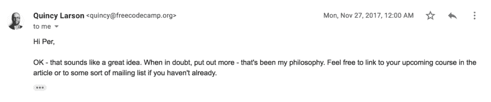

# 我们如何为我们的在线课程建立一个 10K 电子邮件列表

> 原文：<https://www.freecodecamp.org/news/how-we-built-a-10k-email-list-for-our-online-course-7b246e0c29f5/>

一年前，我们在 Scrimba.com 推出了第一个免费的编程课程，这是一个在线学习平台，由我和 T2 的辛德雷·阿瑟共同创建。这个课程是关于 CSS 网格的，它被寄予了很高的期望，因为在发布后的几周里，我们已经建立了一个 10K 人的等候名单。迄今为止，已有超过 5 万名学生注册了该课程。

这门课程成功的原因有很多，但其中一个重要原因无疑是我们事先建立的电子邮件列表。在这篇文章中，我将详细说明这一切是如何发生的，因为我认为可能有一些教训要吸取。

### 偶然的策略

老实说，我们的策略相当偶然。我们根本没有计划创建电子邮件列表。我们的计划是先推出课程*，然后写几篇关于它的文章来获得流量。但由于沟通上的失误，一篇文章在课程开始前很久就发表了，这再次启动了一个非常富有成效的过程。*

*你看，当我在录制课程视频的过程中，我写了一篇 5 分钟的文章草稿，这篇文章向人们传授了 CSS 网格的基础知识。它的标题是*在 5 分钟内学会 CSS 网格，*，我认为它会吸引我们想要注册完整课程的人。*

*[**5 分钟学会 CSS 网格**](https://medium.freecodecamp.org/learn-css-grid-in-5-minutes-f582e87b1228)
[*未来网站布局快速教程。*medium.freecodecamp.org](https://medium.freecodecamp.org/learn-css-grid-in-5-minutes-f582e87b1228)*

*我将草稿提交给 freeCodeCamp 出版社进行审核，并询问他们是否愿意在课程开始的同一天发布，他们确实愿意。*

*在这一点上，值得一提的是我已经是 freeCodeCamp 出版物的投稿人了。在过去的几年里，我写了一些关于在媒体上编码的文章，所以我获得了一些读者。这无疑让我更加轻松，也放大了文章的成功。然而，不管怎样，它都是可行的，只是没有现在的*和*那么好。*

*无论如何，由于 freeCodeCamp 的沟通失误，我的文章最终在到期前几周发表了。当时这感觉很糟糕，但回过头来看，这是塞翁失马，焉知非福，因为它给我上了关于内容营销的重要一课。*

### *昆西的至理名言*

*我给昆西·拉森发了邮件，关于这次混乱。他主动提出撤回这篇文章，并随课程一起重新发布。然而，我们决定不公开这篇文章，而是链接到其中的一个电子邮件表单，这样对这门课程感兴趣的人就可以加入等候名单。当课程即将开始时，Quincy 说我可以再发表一篇关于 CSS Grid 的文章。*

*然后他还分享了一些他营销哲学中的至理名言:*

> *有疑问的时候，多放点*

*这是他发给我的邮件:*

**

*鉴于昆西已经在一系列不同的社交媒体网站上拥有了几十万名粉丝，这似乎是我最好记住的事情。我也认为这与大多数人的反应相反。*

> *当人们有疑问时，他们倾向于避免点击发布按钮。事实是，你需要做相反的事情！*

*换句话说，如果你不确定是否应该发表一篇内容，答案是肯定的。*

### *选择正确的主题*

*[在 5 分钟内学会 CSS 网格](https://medium.freecodecamp.org/learn-css-grid-in-5-minutes-f582e87b1228)的文章结果非常好。几天之内，就有一千多人报名，这大大出乎了我们的意料。*

*其中一个原因是这个主题引起了人们的共鸣。在这一点上，CSS Grid 上没有太多的内容，因为它是一种新兴的技术，很少有开发人员真正使用它。这是一个有意识的选择。我们看到了成为 CSS Grid 的首选课程的机会。*

*因此，这里要吸取的教训是在市场中寻找机会。如果某个主题缺乏内容，而你花了大量的时间和精力自己去创造，这是值得的。*

### *在你的内容中寻找内容*

*这篇文章的成功和 Quincy 的智慧之言开启了寻找更多关于 CSS Grid 的方法。因此，我深入研究了课程内容(我自己创建的)，看看是否能找到适合作为独立媒体文章的材料。原来里面都是帖子的想法。我只是没有去找他们。*

*接下来的一个月，我发表了以下文章:*

*[**如何用 CSS 网格快速原型化网站**](https://medium.freecodecamp.org/how-to-prototype-websites-quickly-with-css-grid-ffc9cba08583)
[*CSS 网格模块是一个非常棒的创建网站模型的工具。它允许你试验布局…*medium.freecodecamp.org](https://medium.freecodecamp.org/how-to-prototype-websites-quickly-with-css-grid-ffc9cba08583)*

*[**为什么 CSS Grid 比 Bootstrap 更适合创建布局**](https://hackernoon.com/how-css-grid-beats-bootstrap-85d5881cf163)
[*CSS Grid 是一种在 web 上创建布局的新方式。有史以来第一次，我们有了一个合适的布局系统…*hackernoon.com](https://hackernoon.com/how-css-grid-beats-bootstrap-85d5881cf163)*

*[**如何通过添加一行 CSS 使你的 HTML 响应迅速**](https://medium.freecodecamp.org/how-to-make-your-html-responsive-by-adding-a-single-line-of-css-2a62de81e431)
[*在这篇文章中，我将教你如何使用 CSS 网格来创建一个超级酷的图像网格，它可以改变列的数量……*medium.freecodecamp.org](https://medium.freecodecamp.org/how-to-make-your-html-responsive-by-adding-a-single-line-of-css-2a62de81e431)*

*[**终极 CSS 之战:Grid vs Flexbox**](https://hackernoon.com/the-ultimate-css-battle-grid-vs-flexbox-d40da0449faf)
[*了解它们的不同之处，以及何时应该使用其中一个。*hackernoon.com](https://hackernoon.com/the-ultimate-css-battle-grid-vs-flexbox-d40da0449faf)*

*他们都做得很好，每个人都获得了一千到五千的中等粉丝。*

*这里要吸取的教训是，要留意你企业内部的内容。这些都是我在课程中接触到的概念，但我只是没有想过把它们变成文章。直到我明白这是多么富有成效。*

*当然，如果你正在建立一门课程、一本书或一些基于内容的东西，这就容易多了。然而，我确信在大多数商业中有很多内容创造的机会。*

*比如 2016 年我给 [Xeneta](http://xeneta.com) 做开发的时候，我们做了一个 lead 资格的机器学习项目。事实证明，这是一件值得写一篇博文的好事情:*

*[**用机器学习提升销量**](https://medium.com/xeneta/boosting-sales-with-machine-learning-fbcf2e618be3)
[*我们如何用自然语言处理来限定销售线索*medium.com](https://medium.com/xeneta/boosting-sales-with-machine-learning-fbcf2e618be3)*

*你只需要训练你的大脑去思考你的企业内部的哪些数据、流程、技术等，其他人可能有兴趣了解。*

### *广泛发表*

*如果你看上面的文章，你会注意到其中两篇发表在 freeCodeCamp，另外两篇发表在 Hacker Noon。当然，这是为了将信息传播给更广泛的受众。这是一个简单而有效的技巧，可能会减少文章间交叉读者的数量。*

*我想提到的另一件事是，我一度开始紧张，因为我们事先放弃了太多的课程，从而限制了人们注册的动机。这显然是完全错误的。这可能更像是相反的:对于每一篇文章，人们对课程看得更远。*

*自从学习了这一课，我不再害怕其他人使用我们的内容。所以我们开始让 freeCodeCamp 把所有 Scrimba 课程放到他们的 YouTube 频道上。就游客质量而言，这是我们拥有的最好的交通渠道之一。*

### *使用列表成功启动*

*在短短几周内，我们的电子邮件列表从 0 增长到 10 000 人，12 月 23 日，我们推出了这门课程。我们通过 freeCodeCamp 出版物做到了这一点，并将其作为圣诞礼物，效果也非常好。*

*[**想学 CSS 网格？这是我的免费全程课程。圣诞快乐！**](https://medium.freecodecamp.org/heres-my-free-css-grid-course-merry-christmas-3826dd24f098)
[*14 个互动截屏带你从初级到高级。*medium.freecodecamp.org](https://medium.freecodecamp.org/heres-my-free-css-grid-course-merry-christmas-3826dd24f098)*

*电子邮件列表对于围绕发布文章制造轰动至关重要，因为它帮助我们在社交媒体上获得了很多关注。从那以后，这个课程就日复一日地进行着。它仍然是 Scrimba 的重要交通驱动因素。*

*所以我希望你从这篇文章中学到了一些东西。如果你有任何问题，不要犹豫，通过推特联系我。*