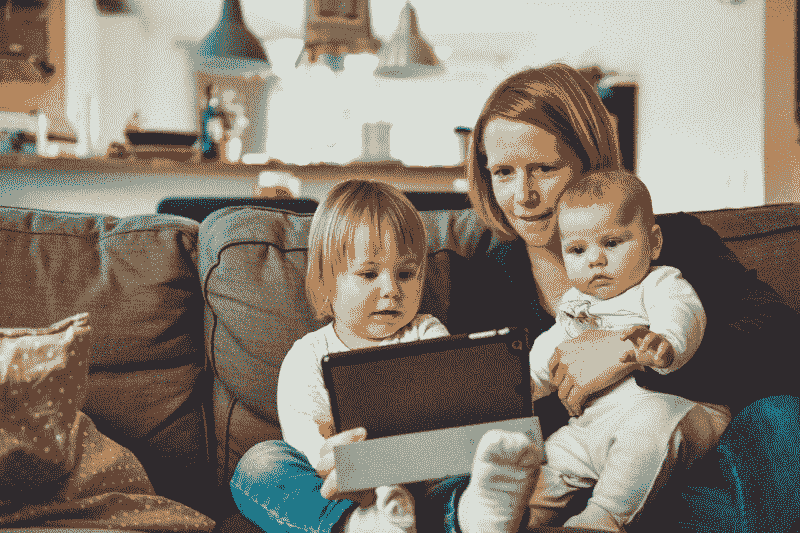

# 我们如何通过帮助妈妈们学习如何编码来增强她们的能力

> 原文：<https://www.freecodecamp.org/news/how-we-can-empower-moms-by-helping-them-learn-how-to-code-30de78a6548d/>

祖扎娜·K

# 我们如何通过帮助妈妈们学习如何编码来增强她们的能力

Photo by [Dai KE](https://unsplash.com/photos/GkraTrCYA_0?utm_source=unsplash&utm_medium=referral&utm_content=creditCopyText) on [Unsplash](https://unsplash.com/search/photos/woman-computer?utm_source=unsplash&utm_medium=referral&utm_content=creditCopyText)

我最近申请成为一名 [MomsCanCode](https://www.momscancode.com/) 教练，我被录取了！我欣喜若狂！但这意味着什么呢？作为 MomsCanCode 教练，我将做些什么？

我将支持其他正在学习编码的妈妈们。

### 为什么我会特别提到妈妈呢？

一旦有了孩子，女性通常会花时间重新评估自己的职业选择。

他们想继续做他们在有孩子之前做的事情吗？这可能吗？或者他们需要找到更适合他们家庭生活的其他东西吗？

妈妈们也普遍意识到，是的，她们确实需要寻找新的东西。一些能让他们陪在家人身边而不会为自己的选择感到愧疚的事情。

#### Web 开发就是其中一个领域。

这并不是说学习编码很容易。哦不，不是的。这是一个艰难、令人筋疲力尽的过程，让你质疑你所知道的一切，并在这个过程中焦虑不安。

学会一项新技能很难。对于一个以前可能不太懂技术的人来说，学会一项技术技能是令人恐惧的。

但这是可能的。

Web 开发是一个广阔的领域，它需要来自各个领域的人。它需要铁杆后端极客，他们在代码行中茁壮成长，从未见过 UI 的光芒。

它还需要有创造力的附庸风雅的人，他们明白东西不仅要实用，还要好看。

它需要人们应用人类心理学的知识来理解为什么特定的用户界面可以工作，为什么其他的不能。

Photo by [rawpixel](https://unsplash.com/photos/a2VqhP3d4Vg?utm_source=unsplash&utm_medium=referral&utm_content=creditCopyText) on [Unsplash](https://unsplash.com/search/photos/computer-development?utm_source=unsplash&utm_medium=referral&utm_content=creditCopyText)

Web 开发需要具备各种技能和背景的人。这就是为什么这是一个非常吸引人的职业。

### 网上有很多资源。

事实上，太多了。很容易不知所措，不知所措。从一个教程转到下一个教程。尝试很多事情，但什么都没学好。

与其他职业相反，你不需要学位就能被雇佣。Web 开发是你可以找到各种背景的人的领域之一。从人文学科到科学——什么都可以。

但这也意味着你需要很好地了解它。你需要有一个好的投资组合。你需要向潜在雇主证明你非常适合，即使你没有计算机科学学位。

MomsCanCode 是一个会员制社区，它支持并鼓励女性——尤其是妈妈们——从事科技职业。一边工作一边照顾他们的孩子。

#### 要有远大的梦想和目标！

作为一名教练，我的职责是为他们加油，并让他们对自己的进步负责。

我将主持一个为期 30 天的挑战，为我的参与者设定一个目标。我将提供课程，并创建一个任务和资源列表，以帮助他们前进。

如果需要的话，我将主持共同工作时间，鼓励其他妈妈来编码，从她们的餐桌或沙发上，把孩子放在她们的腿上。没关系。我去过那里。我现在就在这里！

Photo by [Alexander Dummer](https://unsplash.com/photos/UH-xs-FizTk?utm_source=unsplash&utm_medium=referral&utm_content=creditCopyText) on [Unsplash](https://unsplash.com/search/photos/mother?utm_source=unsplash&utm_medium=referral&utm_content=creditCopyText)

### 我的挑战将是可及性

我对网页可访问性充满热情，我希望其他人理解为什么。可访问性不仅仅是让屏幕阅读器可以访问你的网站。它有如此多的东西。我很乐意分享我所知道的。

这项挑战将于 2018 年秋季开始，我将在比赛开始前发布更多细节。您可以在 [Twitter](https://twitter.com/Zk433) 上关注我的更新。

迫不及待想让你加入我。

让我们让网络无障碍！

加入 MomsCanCode [FaceBook 群组](https://www.facebook.com/groups/momscancode/)查看更新，或者在 [Twitter](http://www.twitter.com/momscancodePGH) 或 [Instagram](https://www.instagram.com/momscancode/) 上关注我们。

如果你觉得这篇文章有益，请考虑留下一些掌声。谢谢大家！