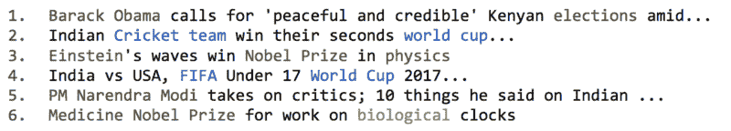
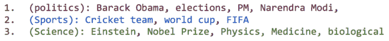
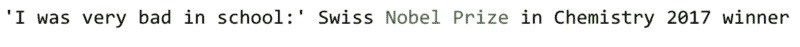
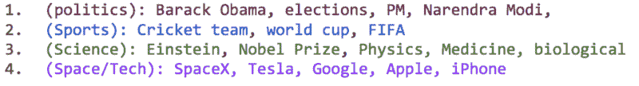
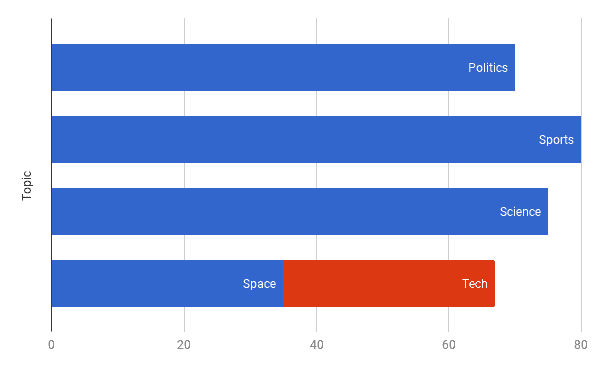
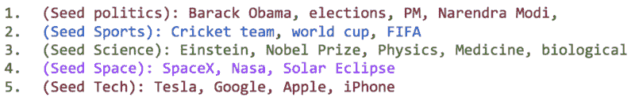
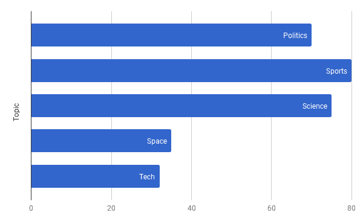
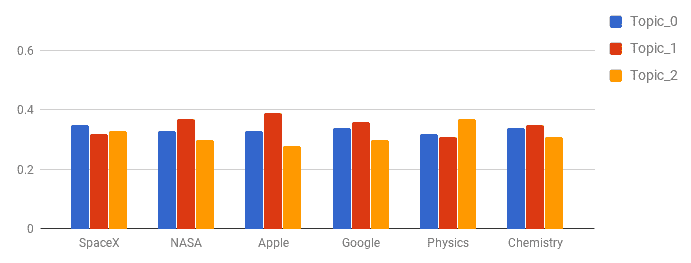
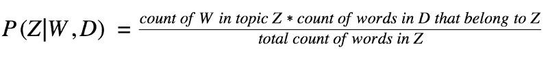
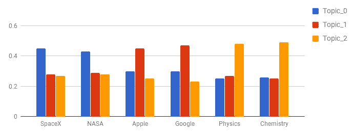

# 我们如何将无监督的 LDA 变为半监督的 GuidedLDA

> 原文：<https://www.freecodecamp.org/news/how-we-changed-unsupervised-lda-to-semi-supervised-guidedlda-e36a95f3a164/>

维卡什·辛格

# 我们的初创企业如何从无人监管的 LDA 转变为半监管的 GuidedLDA


Photo by [Uroš Jovičić](https://unsplash.com/photos/3jBU9TbKW7o?utm_source=unsplash&utm_medium=referral&utm_content=creditCopyText) on [Unsplash](https://unsplash.com/?utm_source=unsplash&utm_medium=referral&utm_content=creditCopyText)

这是一个关于我们如何以及为什么必须编写自己的潜在狄利克雷分配形式的故事。我还会谈到为什么我们需要建立一个引导主题模型(GuidedLDA)，以及在 [GitHub](https://github.com/vi3k6i5/guidedlda) 上开源一切的过程。

### **什么是 LDA(主题建模)？**

假设您有一组新闻文章，它们是文档。通过阅读这些文章，你将能够判断它们是关于体育、政治还是科学。

对于以下标题，您会同意 1 和 5 与政治有关，2 和 4 与体育有关，3 和 6 与科学有关:



Sample Titles from News Articles.

对于一个人来说，找出一篇新闻文章属于哪个主题并不是一个挑战。但是我们如何教计算机理解同样的主题呢？

这就是主题建模发挥作用的地方。主题建模是一类无监督的机器学习算法。这些模型通常擅长将单词组合成主题。LDA 是最流行的主题建模技术。



Words grouped together to form topics

一旦我们将单词分组到主题中，我们现在就可以看到新闻文章和文档谈论的是哪一组单词。然后我们就可以把它归类到那个组或者题目里了。



classify new documents based on previously classified words.

正如我们所看到的，这篇新的新闻文章谈到了诺贝尔奖。我们现在可以预测，这份文件谈的是**科学**的话题。

**注意**:单词不是直接分组到主题里的。而是计算一个概率，例如“一个单词属于一个主题的概率是多少？”。

由 ***p(t|w)给出。*** 或概率题 ***t*** 给定词 ***w*** 。它的核心就是[贝叶斯概率](https://en.wikipedia.org/wiki/Bayesian_probability)。

我很想多谈谈，但不想偏离核心问题。如果你有兴趣，可以在这里阅读更多关于它的内容[。](https://tedunderwood.com/2012/04/07/topic-modeling-made-just-simple-enough/)

### **那么什么是引导式 LDA 呢？**

主题建模一般是一种无监督的学习算法。我们知道**太空**和**理工**是各自的话题。但是，如果我们没有得到很多关于他们的文章，或者如果他们被一起提到，他们可能会被归类到一个主题。

我最近遇到了类似的问题。我在 Belong.co 担任数据科学家，自然语言处理是我工作的一半。最近我在我们的数据语料库上做 LDA 主题建模。大多数话题都如我所料地出现了。但是有些话题没有意义。

有几个话题是重叠的，而一些我期待的话题并没有出现。类似的事情发生了，太空和科技融合在一起。



Space and Tech are getting merged together

在监督学习算法中，你可以回过头去调试你在决策过程中哪里出错了。也许你需要更多的功能。或者更多的训练数据。或者更好的损失函数、度量和采样。

但是，当模型无人监督时，从哪里开始呢？我们决定调试…


That moment in history when we decided to debug LDA…

我们发现融合在一起的主题没有足够的文档来突出。



Space and Tech topics are getting merged together.

我们决定告诉模型把空间和技术分开。这个想法是为空间设置一些种子词，为技术设置一些种子词。然后引导模型向这些术语靠拢。



Seeded Words set for Topic ids

这是一个简单而直观的想法，但是我们找不到 GuidedLDA 的任何实现。很少有论文讨论指导 LDA。

我们参考了 Jagadeesh Jagarlamudi、Hal Daume III 和 Raghavendra Udupa [的论文，将词汇先验纳入主题模型](http://www.umiacs.umd.edu/~jags/pdfs/GuidedLDA.pdf)。该论文讨论了如何将先验(在本例中是**先验**的意思是种子词)设置到模型中，以引导模型朝着某个方向前进。我们稍后将讨论细节。

一旦我们做了这些改变，模型就按照我们想要的方式收敛了。



Space and Tech topics are separated after seeding topics.

### **那么我们是怎么把 LDA 改成 GuidedLDA 的呢？**

为了解释这一部分，我们将不得不进入 LDA 如何工作的细节。我会尽量保持简单。如果你不想深入讨论，你可以直接跳到**使用 guide LDA**部分。

常规 LDA 的工作方式是，首先每个单词被随机分配给一个主题。这个初始化可以通过 Alpha 参数用 Dirichlet 先验来控制。这就是 LDA(潜在狄利克雷分配)得名的原因。如果α大，这种随机性可以是均匀初始化，或者当α小时，这种随机性可以是偏斜初始化。现在让我们继续进行统一初始化。



Default initialization with uniform word topic distribution.

下一步是找出哪个术语属于哪个主题。这是算法的主题建模部分。LDA 采用了一种非常简单的方法，每次为一个术语寻找主题。

比如你想为术语**蓝色起源**找一个话题。LDA 将首先假设语料库中的每隔一个术语被分配给正确的主题。在上一步中，我们已经将每个术语均匀地分布在所有主题中，因此我们将假设这是这些术语的正确主题。

然后我们计算哪些术语**蓝色起源**经常出现。那么，这是这些术语中最常见的话题。我们将把**蓝色起源**分配给该主题。

蓝色起源可能会接近任何话题 **SpaceX** 和 **NASA** 所在的地方。现在你可以看到 **NASA** 、 **SpaceX** 和 ***蓝色*原点**彼此之间的距离比这一步之前要近一些。然后我们将进入下一个学期，重复这个过程。我们将重复整个过程足够的次数，以使模型收敛。

其公式将为: ***的
`Probability`蓝色原点*** 以适合主题`Z` {0，1，2，..}当它出现在一个`document`中时，等于蓝色原点*被分配给主题`Z`的次数乘以该文档中已经属于`Z`的其他`words`的次数，除以任何单词被分配给主题`Z`的总次数。*

*下面是实际的公式:*

**

*对于每个文档 **( `D` )** 和该文档中的每个单词 **( `W` )** ，我们将计算该单词属于每个主题 **( `Z` )** 的概率。*

```
*`for d in all_documents_D:    for w in all_words_W_in_d:        for z in all_topics_Z:            w_in_z = count(across all documents w belongs to z)            d_in_z = count(in d all words that belong to z)            tokens_in_z = count(all assignments in z)            p(z| w, d) = w_in_z * d_in_z / tokens_in_z        # so w belong to max p(z)        # whichever topic the probability was maximum for w        w_z = max(p(z| w, d))`*
```

*最初的结果会是错误的。但是我们将多次运行整个过程，并且随着每次迭代，它们将变得更好。久而久之它们会汇聚形成词主题分布。*

### *当我们植入文档时会有什么变化？*

*比方说我们要播种`**SpaceX**`，`**NASA**` 向`**topic_0**`汇聚。在初始化过程中，我们可以给`**SpaceX**` 和`**NASA**`一些额外的帮助，让它们位于这个特定的主题中。*

*我们可以控制这个参数，即应该给一个术语多少额外的提升。在我们的算法中，我们称之为`**seed_confidence**`，它可以在 0 和 1 之间变化。当`**seed_confidence**`为 0.1 时，你可以将种子词偏向种子主题 10%以上。*

*

Seeded Initialisation with modified word topic distribution.* 

*在上面显示的初始化中，`**NASA**`和`**SpaceX**`被播种给`**Topic_0**`，`**Apple**`和`**Google**`被播种给`**Topic_1**`，而`**Physics**`和`**Chemistry**`被播种给`**Topic_2**`。*

*现在，当我们运行上述过程时，属于种子主题的种子单词将会有更高的计数。GuidedLDA 的公式将保持不变，收敛将向种子主题变化。*

```
*`# for seeded words belonging to seeded topics# this count will be higher now for seeded z.`*
```

```
*`w_in_z = count(across all documents w belongs to z)`*
```

```
*`# Thus probability of p belonging to seeded z will be higher`*
```

```
*`p(z| w, d) ∝ w_in_z`*
```

*因此指导了 LDA。或者 GuidedLDA。*

*我们尝试了很多不同的方法，最后才成功。*

### *使用 GuidedLDA*

*GuidedLDA 是我在 [GitHub repo](https://github.com/vi3k6i5/guidedlda) 上开源的 python 库。*

*您可以通过简单的 pip 安装来安装它:*

```
*`pip install guidedlda`*
```

*使用它的代码相当简单。用`word_id`到`topic_id`的地图为`seed_topics`创建一个字典。并将其传递给`model.fit()`方法。*

1.  *`seed_confidence`可以在 0 到 1 之间变化。*
2.  *`seed_topics`是字典{ `word_id`到`topic_id` }*
3.  *`X`是[文档术语矩阵](https://en.wikipedia.org/wiki/Document-term_matrix)。*

```
*`seed_topics = {    'NASA': 0, 'SpaceX': 0,    'Apple': 1, 'Google': 1,    'Physics': 2, 'Chemistry': 2,}model.fit(X, seed_topics=seed_topics, seed_confidence=0.15).`*
```

*GuidedLDA 的文档链接到[这里](http://guidedlda.readthedocs.io/)。*

#### *信用*

*代码的主要部分是从 [python LDA 库](https://github.com/lda-project/lda)借来的。*

*对该库的作者们大喊一声:艾伦·里德尔和 T2·蒂姆·霍普。*

*特别感谢 Vinodh Ravindranath，他在整个项目中指导了我。*

*通过使用 GuidedLDA，我们能够分离出在语料库中具有较小代表性的主题，并指导文档的分类。*

*我们已经看到这种模型在生产中的成功。但是，算法和实现仍处于早期阶段。我们请求你尝试一下，并分享你的想法、实验和结果。很乐意收到你的来信。*