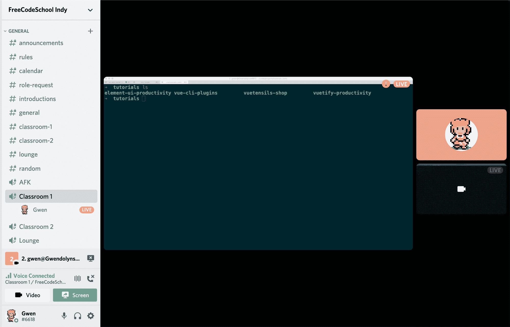
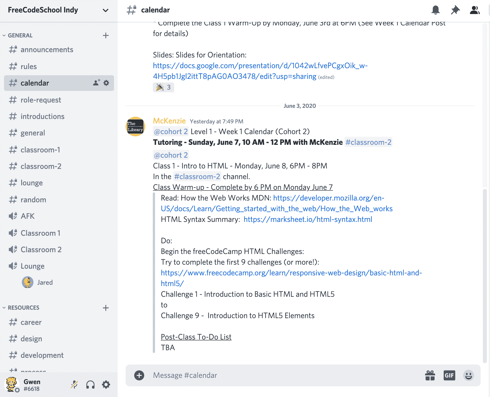

# 我们使用 freeCodeCamp 课程创建了一所本地免费编码学校。这是我们学到的。

> 原文：<https://www.freecodecamp.org/news/how-we-created-a-free-coding-school-with-the-freecodecamp-curriculum/>

虽然这张照片展示的是一个面对面的教室，但由于新冠肺炎的情况，我们已经把我们的学校搬到了完全偏远的地方。

如果你想学习如何编码，一般有三个选项可供选择:

1.  可以自学，自己找课程。
2.  上大学，获得计算机科学/IT 学位。
3.  或者上编码学校。编码学校是实践速成班，旨在让你快速上手，以便你能在三个月到一年内找到你的第一份软件开发工作。

选项一是最便宜的，但也是最令人沮丧和困难的。一路上太容易卡住，想放弃。

第二个和第三个选择可能会很好，如果你能够抽出时间工作(或者至少工作更少的时间)，在你上学和找工作的时候支付学费和生活费，并且仍然能够管理你的家庭和个人生活。不是每个人都能做到这一点。

这就是为什么我们创建了印度自由代码学校。这是一个基于 freeCodeCamp 课程的免费编码项目，我们指导学生完成为期三个月的兼职编码学校项目。

我们每周有两节两小时的课——周一和周三下午 6-8 点，在那里我们教他们从 HTML 基础到 JavaScript 和 React 简介的一切。

学生每周至少要花 6 个小时自学，并可以选择参加我们在周日下午 1-5 点举行的办公时间。如果他们完成了前三个月，那么他们可以参加第二个为期三个月的项目，在那里他们可以学习 Node.js 中的后端 web 开发。

我们一年多前就开始研究这个想法，很高兴可以说我们在五月份完成了第一批实验。现在我们可以分享一下我们在这篇文章中学到了什么。

## 我们建立免费编码学校的目标

我们的目标从一开始就是为每个人提供可获得的、支持性的教育，而不管他们的收入或生活环境如何(比如请假的能力)。

我们并不想与训练营或正规的编码学校竞争——它们也为学生提供了有价值的服务。我们只是试图为那些需要更灵活的时间表或负担不起付费编码学校的人提供另一种更方便的选择。

在整个项目过程中，学生将接受来自工作人员、志愿者和社区成员的指导和指引，之后成为校友。

当然，我们希望我们的学生能够在这个行业找到工作，如果这是他们的目标的话。但是我们没有资源来保证任何事情。我们只是想为学生提供尽可能多的支持，无论他们决定继续自己的学习，还是去更正式的项目，如编码学校或大学。

正如我之前提到的，我们花了大约一年的时间来做好一切准备——包括寻找场地和教师，以及决定项目和课程的类型。这是我们节目准备的所有材料。

## 我们是如何计划这个项目的

我们做的第一件事是选择项目的时间长度和目标。我们上了三个月的课，学生们将学习 HTML、CSS 和 JS 的基础知识，以及一些额外的东西，如 Bootstrap 和 React 组件。

如果一切顺利，我们的目标是休假一个月，为完成第一门课程的学生开设第二门课程。第二阶段是另外三个月，我们将在第一阶段的基础上，教授更多关于 JavaScript 框架的知识，并引入 Node.js。

从三个月的兼职项目开始，帮助我们能够在前进的过程中学习和调整。它也给了学生一个短期的、基于时间的目标，让他们能够在几个月内完成项目并拥有一个小的作品集。

[这是我们在 Github 上的组织](https://github.com/freecodeschoolindy)。我们正在更新和开源我们的资料。

## 采用 freeCodeCamp 的课程

课程开发既费时又费钱。幸运的是，freeCodeCamp 已经有了一个很棒的免费课程，我们可以无条件地使用和修改。

我们采用了 freeCodeCamp 的课程，并将其作为我们讲课的大纲。我们将这些挑战作为学生在课间完成的作业。在这个过程中，我们还使用 freeCodeCamp 的项目作为个人和小组任务。

在整个课程中，我们还鼓励学生尝试做一些额外的工作，以便能够在课程期间或课程结束后获得 freeCodeCamp 认证。

## 我们如何找到一个空间来上课

印第安纳波利斯公共图书馆慷慨地同意接待我们的班级，并为我们提供办公空间。计算机实验室的空间有限，所以我们每节课最多只能容纳 22 名学生。

我们可以在图书馆里使用一个更大的会议室来容纳更多的学生，但这样我们就无法接纳没有笔记本电脑的学生，而且这也不是每个人都可以使用的。

我们不打算成为一个远程程序，所以我们必须调整我们的课程，以便在新冠肺炎发生时使用 Discord 进行讲座和所有学生交流。稍后会详细介绍。

## 我们如何选择技术工具

我们在课程开始前准备了一个讨论论坛(类似于 freeCodeCamp 论坛),这样学生们可以登录，获得通知，提问和发布作业。它也给了管理人员一些特权来跟踪学生和调节学生之间的互动。

## 我们如何管理学校

### 寻找学生

当我们计划这个项目的时候，我们担心的是我们不会得到足够的兴趣，我们所有的计划都将付诸东流。事实是，我们有太多的兴趣，无法容纳每个学生。对于 22 个位置，我们有超过 140 人想参加！这还是在没有做太多营销的情况下。

对我们的项目如此感兴趣是非常令人兴奋的，但我们也必须决定带哪些学生，以及如何以公平的方式进行选择。

我们决定通过要求人们参加三个预筛选活动来缩小范围，在这些活动中，他们将完成一些基本的挑战，如 [Code.org 的 Flappy 游戏](https://studio.code.org/flappy/1)。这让我们知道哪些学生愿意来，并让排队的人数减少到 80 人左右。对于我们现有的空间来说，这仍然太多了，所以我们不得不随机抽签来选择最终的学生。

### 教学生

每个学生的学习方式都不一样，都有自己的个性和喜好。期望我们只给学生讲一个小时的课，他们就能毫无问题地掌握所有信息并建立实验室是不合理的。

我们决定了讲座的形式，每次讲座开始时，我们都会问是否有人有问题——通常我们不会有很多问题。然后，我们进入幻灯片，每隔大约 15 分钟暂停一下，给学生提供指导“实验”,这样他们就可以在有指导的支持下自己尝试编码，并且仍然能够在课堂上提问。

我们还经常在 2 小时课程的最后 30 多分钟留给学生，让他们能够完成他们的课堂项目。

### 收集作业

有些人不交作业。这可能意味着他们羞于在其他学生可以看到的地方分享他们的代码，或者他们认为这没有必要，因为这毕竟是一所免费的编码学校，他们的一些同学也没有这样做。

如果是前者，那么我们鼓励他们只和员工分享任务，并让他们知道我们都曾处于他们的位置。

如果他们不交作业是因为他们不想交...我们对此无能为力。我们试图阻止那些不想完全参与这个项目的学生加入这个班级。

这些作业最初是在论坛上交的，但我们在那里的参与度很低。学生们不经常登录，也从不在那里提问。

现在，作业是通过我们为编码学校准备的服务器上的不和谐频道上交的。

由于我们从同一个 Discord 服务器管理我们的整个项目——包括主持讲座、回答问题和管理项目——我们看到上交的作业数量在增加。我们也从员工和志愿者那里获得了更多有用的反馈。

### 最后期限

我们应该有上交项目的截止日期吗？我们现在的意见是不，我们不应该。

第一批的大部分人有点落后，有些人在课程结束后几周就完成了。我们应该惩罚那些完成了任务，但是没有按时完成的人吗？我们不这么认为，原因如下:每个人都按照自己的速度学习。

如果一个人在 3 个月内完成，另一个学生在 4 个月内完成，那么他们两人应该因为完成了这个项目而得到相同的奖励。

有一天，我们将能够对我们的编码进行滚动录取，并在更细粒度的水平上帮助学生。在此之前，我们至少可以保持灵活性来适应他们，让他们在任何可能的时候提交其余的项目。

### 让学生寻求帮助

这一直是我们最大的问题之一！有些人落后了，有些同学很困惑却不想求助。有些学生很困惑，他们甚至不知道该寻求什么样的帮助。

你不能强迫人们去寻求帮助，但是你可以提示他们。我们发现让他们提问的最好方法是在讲座开始时做简短的回顾，并安排学习时间，学生可以在更小的小组环境中突然出现并提出问题。

如果他们更喜欢将问题打出来，他们可以在学生聊天中发布它，或者向组织者之一发送私人消息。

我们只能做这么多。如果学生迷路或困惑，不想寻求帮助，我们没有办法解决这个问题。我们努力在他们所在的地方遇见他们，但他们也必须努力来找我们。

### 学生调查

定期进行学生调查确实有助于我们获得对我们项目的重要反馈。

第一次，我们在开始时收集了关于学生目标和背景的信息，然后在中间点(大约 6 周)进行了一次学生调查，最后又进行了一次调查。

虽然我们收到了很多有用的信息，但事后看来，我们应该进行更多的调查，并增加一些问题。这一次，我们可能会每月进行调查以获得学生的反馈。以下是我们提出的一些问题:

1.  到目前为止，你觉得这个节目怎么样？它符合你的期望吗？
2.  你觉得讲座对做作业有帮助吗？
3.  我们如何才能更好地帮助您实现目标？
4.  你还有其他反馈给我们吗？

### 处理辍学问题

生活发生了，事情改变了。我们必须理解，完全打算参与的学生可能由于不可避免的情况而不得不退出。

如果他们与我们交流情况，我们会在下一批中为他们提供一个位置。

如果他们只是不出现或与我们沟通，那么他们可以在未来重新申请，但不会为他们保留任何位置。

## 工作人员和志愿者

### 征集志愿者

如果没有志愿者，运行这样一个项目将会非常困难。这里有一些不同类型的志愿者，你需要他们才能成功。

### 职责:

1.  是的，我们也是志愿者。我们很幸运有一个了不起的组织者团队来运作这个项目。这包括我自己、另外两个开发人员和一个来自图书馆的计算机实验室主管，他也知道如何编码。我们每周都会不欢而散地聊几次，以确保项目顺利进行，学生进步。我认为 3-5 对于组织团队来说是一个很好的数字，但我们可能会增加更多来做具体的事情，比如“社区经理”或“志愿者协调员”
2.  主持人-这些人通常在上课时间或周末举行的特别帮助会上讲课。这是最难管理的志愿活动。在我们的项目中，讲座时长为 1.5-2 小时，只有 24 节课，所以每一节课都必须抓住重点，并与课程的其余部分保持一致。一些本意良好的志愿者可能不适合给刚接触发展的人讲课。非常重要的是**要清楚你希望他们在讲座中涵盖的内容，包括个人观点和预期的学习成果。我们还确保给志愿者一个样板幻灯片，让他们进行练习，以便与课程的其余部分相匹配。**
3.  **导师—**学生不仅会有编码方面的问题，还会有关于职业、社交等方面的问题。导师对于回答这类问题很有帮助。我们目前正在努力建立我们的导师计划，志愿者导师将至少每周一次与学生联系，以确保他们在正轨上并回答他们的任何问题。延迟的原因之一是我们一直在研究一个系统，如何处理学生与志愿者一对一会面时可能发生的任何不当语言或行为的投诉。
4.  **实验室助理—**实验室助理在实时实验室会议期间同步提供帮助，通常是在运行软件或调试时遇到问题。当我们进行面对面授课时，我们更多地使用实验室助理。由于距离很远，我们看不到学生的屏幕，所以如果有人卡住了，我们只能让几个人在聊天中回答问题。
5.  **一般助手-**这些人帮助回答学生在聊天中的问题，并执行其他任务，如审查项目和文件夹。他们对学生逃避或鼓励也很有用。

### 志愿者手册

我们制作了一本两页的手册，详细说明了对志愿者行为的期望以及参与我们项目的要求。它现在是非常基本的，但是我确信随着我们的发展，我们将会在它的基础上更进一步。

我们还给他们一个链接，链接到 [freeCodeCamp 行为准则](https://www.freecodecamp.org/news/code-of-conduct/)，因为它简短、甜蜜、中肯:友善、理解等等。

### 确保员工拥有成功的工具

我们确实犯了一些错误，包括让演示者自己制作幻灯片，然后不得不在最后一刻告诉他需要修改。它不是很受欢迎。我们应该更清楚我们想从他那里得到什么。

现在，每个人都会收到我们提供的样板幻灯片，以及要涵盖的主题列表。我们还与他们联系了几次，检查他们演示的进度，以确保它在正确的轨道上。

现在，我们有一份志愿者手册、教学用的课程计划和幻灯片、指导指南和 google drive 文件夹，我们在其中保存了项目的所有文档、学生进度、课程材料和未来计划。我们最近重新整理了所有这些资料，以便在需要时更容易找到。

随着这个项目的发展，我们将需要管理更多的志愿者，甚至是带薪员工。我们正在为此做准备，记录我们的流程，让入职过程每次都更顺利一点。

### 社区合作伙伴

我们目前正试图建立社区伙伴关系，以获得资助的赞助商以及技术设备的捐赠。

我们的一些学生没有好的电脑或快速的互联网连接。当我们举办个人课程时，图书馆为我们提供了这些东西，但现在我们离得很远，这变得更加困难。

此外，图书馆只有有限的时间，而且，对于做多份工作或有其他家庭义务的学生来说，很难在一天中抽出时间完成所有的课堂作业。这就是为什么社区合作伙伴的赞助对于让我们的项目变得可及如此重要。

未来，我们希望能够为需要的学生提供互联网接入和笔记本电脑。

## 组织

### 营销

我们的团队中没有任何营销专家。我们的营销努力基本上包括确保我们保持我们同意的品牌——颜色、措辞等。-在社交媒体上一致、集体地分享更新。

幸运的是，我在 YouTube、LinkedIn 和其他平台上有一小群追随者，我可以在这些平台上征集志愿者，并获得一些社区对我们项目的兴趣。

公共图书馆也有助于接触许多不同的社区，吸引我们可能永远无法接触到的学生。

随着我们的成长，我们可能会开始扩大我们的社交媒体覆盖范围，但目前预算有限，我们只是有机地获得牵引力。

### 远程直播

Discord screen sharing interface.

主持远程直播一直具有挑战性。互联网连接有时会中断，此外，学生使用该软件还需要一个学习过程。

Discord 对我们来说是一个很好的选择，因为我们可以在应用程序中托管直播流，我们所有的聊天和其他东西都在那里。这样，我们只需要解释如何使用一个软件。

此外，Discord 允许我们在语音聊天室中同时与多达 50 人进行屏幕共享。这一切都是免费的！我们研究了 Zoom 和其他一些工具，但我们将坚持使用 Discord，直到我们需要——并且能够负担得起——具有更多功能的东西。

### 合并和融资

我们想开始向公司和个人寻求资金，所以去年我们不得不成立了一个非盈利组织。在美国，这个过程大约需要六个月。我们首先必须在我们的州注册一家公司，然后起草商业文件，并向联邦政府申请非营利地位。

今年年初，我们终于得到确认，我们是一个 501c3 非营利组织！现在，我们正试图找到获得资金和接受捐赠的方法。我们将在我们的网站上增加一个“捐赠”按钮，同时我们也在联系一些公司来寻求更多的捐赠。内部也有一些关于众筹是否是一个好主意的讨论。

在这方面你有什么建议给我们吗？请对这篇文章发表评论或联系我们 contact@freecodeschoolindy.com。

## 通信工具

### 论坛

如前所述，我们开始使用话语论坛，但发现它很难维护，也不能满足我们的需求。人们发现它很难使用，尤其是在手机上。我们也很难让员工和学生登录并经常检查它，以使其值得努力。这就是为什么我们去掉了论坛，把我们的整个程序移到了 Discord。

### 不调和

我们现在有一个为整个编码学校设置的不和谐服务器！我们用它来主持现场讲座——我们可以同时与多达 50 人进行语音聊天和屏幕共享，管理学生，组织志愿者活动，辅导演讲者，回答问题，做小组项目，审查投资组合，以及执行管理任务。

把所有东西都放在一个地方是我们做过的最好的决定。这不仅降低了我们的成本，还使项目管理变得更加容易。我们需要互动的每个人要么已经不和，要么只是需要被邀请不和:)

## 毕业

我们有一个宏伟的计划，那就是今年为学生们举行第一次面对面的毕业典礼。不幸的是，由于新冠肺炎，这些计划不得不被取消。我们不得不凑合着给完成课程的学生邮寄证书，并在完成课程时给每个人一个(虚拟的)鼓励。

现在我们的班级是虚拟的，我们希望能够为八月底第二批学生的毕业做些有趣的事情。你有什么想法吗？如果有，请告诉我们。

## 结论

组装这个程序可能是我做过的最困难的事情。工作量很大，但很值得。它可以改变学生的生活。

不仅仅是我:有一群人在帮忙，如果没有他们，这一切都不会发生。

我要特别感谢 Jared Wilcurt、Casssandra Bautista、Marianne Mckenzie、印第安纳波利斯公共图书馆、freeCodeCamp 以及我们所有出色的志愿者，他们对这个项目的开展至关重要。

我们正在开源我们使用的课程——幻灯片、项目、免费代码营挑战、补充材料等等。将所有内容整理成一个好的格式需要一点时间，但是请耐心等待，我们会很快将它发布给任何感兴趣的人:)

我对你的想法很感兴趣。你有什么想法可以让我们下次做得更好吗？请联系我，让我知道。

我的推特: [@gwen_faraday](https://twitter.com/gwen_faraday)

我的 YouTube: [法拉第学院](https://www.youtube.com/c/FaradayAcademy)

节目网址:[freecodeschoolindy.com](https://freecodeschoolindy.com/)