# 我们如何微调 HAProxy 以实现 2，000，000 个并发 SSL 连接

> 原文：<https://www.freecodecamp.org/news/how-we-fine-tuned-haproxy-to-achieve-2-000-000-concurrent-ssl-connections-d017e61a4d27/>

作者:Sachin Malhotra

# 我们如何微调 HAProxy 以实现 2，000，000 个并发 SSL 连接

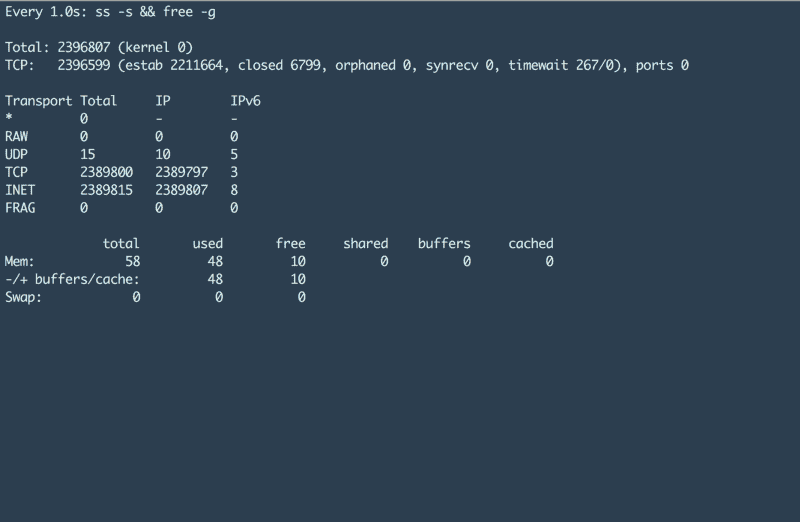

如果你仔细看上面的截图，你会发现两条重要的信息:

1.  该机器已经建立了**238 万个 TCP 连接**，并且
2.  正在使用的内存量大约为 **48 千兆字节**。

很棒吧？更棒的是，如果有人提供设置组件，以及在单个 HAProxy 机器上实现这种规模所需的调整。好吧，我会在这篇文章中这样做；)

这是负载测试系列的最后一部分。如果你有时间，我建议你先去看看这个系列的前两部分。这将有助于您掌握这个设置中所有机器上所需的内核级调优。

[**负载测试 HAProxy(Part-1)**](https://medium.com/@sachinmalhotra/load-testing-haproxy-part-1-f7d64500b75d)
[*负载测试？HAProxy？如果所有这些对你来说都是希腊语，不要担心。我将提供内联链接来阅读……*medium.com](https://medium.com/@sachinmalhotra/load-testing-haproxy-part-1-f7d64500b75d)[**负载测试 HAProxy(第 2 部分)**](https://medium.com/@sachinmalhotra/load-testing-haproxy-part-2-4c8677780df6)
[*这是关于著名的 TCP 负载平衡器和反向代理的性能测试的 3 部分系列的第 2 部分……*medium.com](https://medium.com/@sachinmalhotra/load-testing-haproxy-part-2-4c8677780df6)

有许多小组件帮助我们整合了整个系统并实现了这些数字。

在我告诉你我们使用的最终 HAProxy 配置之前(如果你非常不耐烦，你可以滚动到底部),我想通过我们的思考来建立它。

### 我们想测试的是

我们要测试的组件是 HAProxy 版本 1.6。我们现在在 4 核、30g 机器上的生产中使用它。然而，所有的连接都不是基于 SSL 的。

我们想在这个练习中测试两件事:

1.  当我们将整个负载从非 SSL 连接转移到 SSL 连接时, **CPU 百分比增加了**。由于更长的 5 次握手和包加密，CPU 的使用肯定会增加。
2.  其次，我们希望测试当前生产设置在请求数量和在性能开始下降之前可以支持的最大并发连接数方面的限制。

我们之所以需要第一部分，是因为一个主要特性的推出正在如火如荼地进行，这需要通过 SSL 进行通信。我们需要第二部分，这样我们可以减少生产中专用于 HAProxy 机器的硬件数量。

### 涉及的组件

*   多个客户端机器来强调 HAProxy。
*   各种设置上的单个 HAProxy 机器版本 1.6
    * 4 核、30 千兆位
    * 16 核、30 千兆位
    * 16 核、64 千兆位
*   后端服务器将帮助支持所有这些并发连接。

### HTTP 和 MQTT

如果您已经阅读了本系列的第[篇文章](https://medium.com/@sachinmalhotra/load-testing-haproxy-part-1-f7d64500b75d),您应该知道我们的整个基础设施支持两种协议:

*   HTTP 和
*   MQTT。

在我们的堆栈中，我们不使用 HTTP 2.0，因此不具备 HTTP 上持久连接的功能。因此，在生产中，我们看到的单个 HAProxy 机器(入站+出站)上的最大 TCP 连接数约为(2 * 150k)。尽管并发连接数很低，但每秒的请求数却很高。

另一方面，MQTT 是一种完全不同的通信方式。它提供了很好的服务质量参数和持久的连接。因此双向连续通信可以在 MQTT 通道上进行。至于支持 MQTT(底层 TCP)连接的 HAProxy，我们看到在一台机器上的高峰时间大约有 60-70 万个 TCP 连接。

我们想做一个负载测试，为基于 HTTP 和 MQTT 的连接提供精确的结果。

有很多工具可以帮助我们轻松地对 HTTP 服务器进行负载测试，其中很多工具提供了高级功能，如汇总结果、将基于文本的结果转换为图形等。然而，我们找不到任何用于 MQTT 的压力测试工具。我们确实有自己开发的工具，但它不够稳定，不足以在我们的时间范围内支持这种负载。

所以我们决定对 HTTP 和*客户端进行负载测试，使用相同的方法模拟 MQTT 设置；)*有趣吧？

继续读下去。

### 初始设置

这将是一篇长文，因为我将提供很多细节，我认为这些细节对做类似负载测试或微调的人会很有帮助。

*   我们最初使用 16 核 30g 机器来设置 HAProxy。我们没有继续我们当前的生产设置，因为我们认为在 HAProxy 端发生的 SSL 终止对 CPU 的影响将是巨大的。
*   对于服务器端，我们使用一个简单的 NodeJs 服务器，它在接收到一个`ping`请求时用`pong`进行回复。
*   至于客户端，我们最初使用的是 [Apache Bench](https://httpd.apache.org/docs/2.4/programs/ab.html) 。我们选择`ab`的原因是因为它是一个众所周知的稳定的 HTTP 端点负载测试工具，也因为它提供了漂亮的总结结果，对我们帮助很大。

`ab`工具提供了许多我们在负载测试中使用的有趣参数，比如:

*   `- c, concurrency`指定将命中服务器的并发请求的数量。
*   `-n, no. of requests`顾名思义，指定当前负载运行的请求总数。
*   `-p POST file`包含 POST 请求的主体(如果这是您想要测试的。)

如果你仔细观察这些参数，你会发现通过调整这三个参数可以进行很多排列。一个样本 ab 请求看起来像这样

```
ab -S -p post_smaller.txt -T application/json -q -n 100000 -c 3000 http://test.haproxy.in:80/ping
```

这种请求的示例结果如下所示

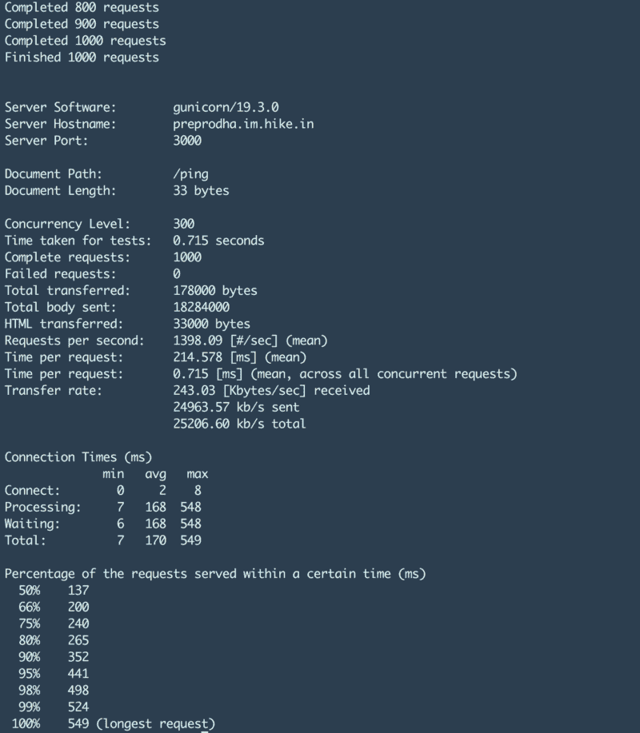

我们感兴趣的数字是

*   99%的延迟。
*   每次请求的时间。
*   失败的请求数。
*   每秒请求数。

`ab`最大的问题是没有提供一个参数来控制每秒的请求数量。我们不得不调整并发级别来获得我们期望的每秒请求数，这导致了大量的跟踪和错误。

### 全能图形

我们不能随机地进行多次负载运行并不断得到结果，因为那不会给我们任何有意义的信息。我们必须以某种特定的方式执行这些测试，以便从中获得有意义的结果。所以我们按照这张图表

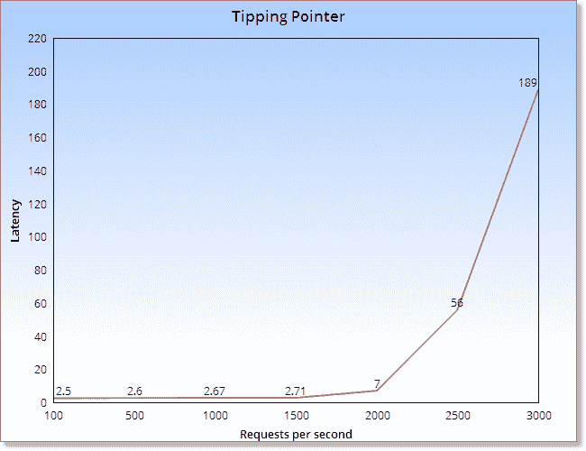

该图表明，直到某一点，如果我们不断增加请求的数量，延迟将几乎保持不变。但是， ***超过某个临界点*** ，延迟就会开始成倍增加。这就是我们想要测量的机器或设置的临界点。

### 神经中枢

在提供一些测试结果之前，我想提一下[神经节](http://ganglia.sourceforge.net/)。

> Ganglia 是一个可伸缩的分布式监控系统，用于集群和网格等高性能计算系统。

请看下面我们的一台机器的截图，了解 ganglia 是什么，以及它提供了关于底层机器的什么样的信息。

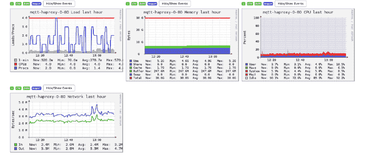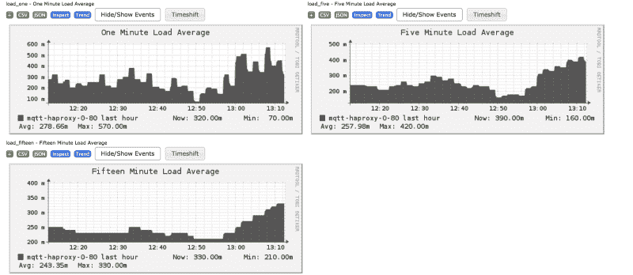

很有趣，是吧？

继续，我们不断地为我们的 HAProxy 机器监视 ganglia，以监视一些重要的事情。

1.  这告诉我们在系统上建立的 tcp 连接的总数。注意:这是入站和出站连接的总和。
2.  我们想看看我们的 HAProxy 机器发送和接收的 tcp 包的总数。
3.  这向我们显示了机器发送和接收的全部数据。
4.  `memory`一段时间内使用的内存量。
5.  `network`通过网络发送数据包所消耗的网络带宽。

以下是通过之前的测试发现的已知限制/我们希望通过负载测试达到的数字。

> 700k TCP 建立连接，
> 发送 50k 包，接收 60k 包，
> 发送和接收 10-15MB 字节，
> 高峰时 14-15g 内存，
> 7MB 网络。
> `ALL these values are on a per second basis`

### HAProxy Nbproc

最初，当我们开始对 HAProxy 进行负载测试时，我们发现使用 SSL 时，CPU 在进程的早期就受到冲击，但每秒的请求数非常低。在研究 [top](http://www.tecmint.com/12-top-command-examples-in-linux/) 命令时，我们发现 HAProxy 只使用了一个内核。而我们还有 15 个备用内核。

谷歌搜索了大约 10 分钟，让我们在 HAProxy 中找到了这个有趣的设置，让 HAProxy 使用多个内核。

它叫做`nbproc`，为了更好地掌握它是什么以及如何设置它，请查看这篇文章:

[http://blog . one fellow . com/post/82478335338/ha proxy-mapping-process-to-CPU-core-for-maximum](http://blog.onefellow.com/post/82478335338/haproxy-mapping-process-to-cpu-core-for-maximum)

调整这个设置是我们负载测试策略向前发展的基础。因为 HAProxy 使用多核的能力让我们能够为我们的负载测试套件形成多种组合。

### 用 AB 进行负载测试

当我们开始我们的负载测试之旅时，我们并不清楚我们应该测量的东西和我们需要达到的目标。

最初，我们心中只有一个目标，那就是通过改变下面提到的所有参数来找到临界点。

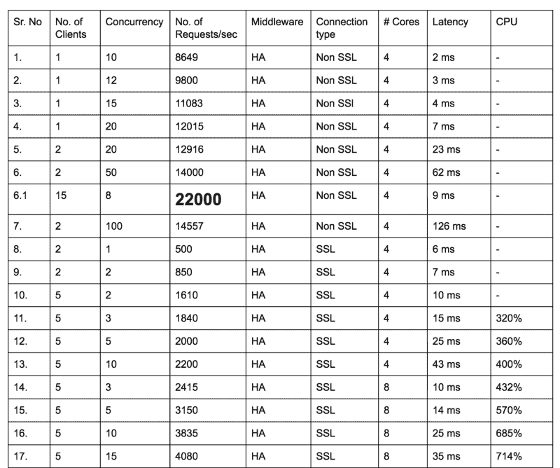

我维护了一个我们给出的各种负载测试的所有结果的表格。总之，我进行了 500 多次测试，才得到最终结果。正如你可以清楚地看到的，每个测试都有很多活动的部分。

#### 单一客户问题

随着每秒请求数的不断增加，我们开始发现客户机正在成为瓶颈。Apache bench 使用单核，从文档中可以明显看出，它没有提供任何使用多核的特性。

为了高效地运行多个客户端，我们发现了一个有趣的 linux 实用程序，叫做 [Parallel](http://www.shakthimaan.com/posts/2014/11/27/gnu-parallel/news.html) 。顾名思义，它可以帮助您并行运行多个命令，并利用多个内核。正是我们想要的。

请看一个使用并行运行多个客户端的示例命令。

```
cat hosts.txt |  parallel  'ab  -S -p post_smaller.txt -T application/json -n 100000 -c 3000 {}'
```

```
sachinm@ip-192-168-0-124:~$ cat hosts.txthttp://test.haproxy.in:80/pinghttp://test.haproxy.in:80/pinghttp://test.haproxy.in:80/ping
```

上面的命令将运行 3 个 ab 客户机，访问同一个 URL。这帮助我们消除了客户端瓶颈。

#### 睡眠和时间参数

我们讨论了 ganglia 中我们想要跟踪的一些参数。让我们逐一讨论。

1.  这可以通过发送一些数据作为 post 请求的一部分来模拟。这也将帮助我们生成一些`network as well as bytes sent and received portions in ganglia`
2.  在我们的场景中，这是我们花了很长很长时间来模拟的。想象一下，如果一个 ping 请求需要大约一秒钟，那么我们将需要大约每秒 70 万个请求来达到我们的 tcp_established 里程碑。
    现在，这个数字在生产中似乎更容易实现，但在我们的场景中是不可能生成的。

你可能会问，我们做了什么？我们在 POST 调用中引入了一个 sleep 参数，它指定了服务器在发出响应之前需要休眠的毫秒数。这将模拟生产中长时间运行的请求。所以现在假设我们有一个大约 20 分钟的睡眠(是的)，这将需要我们每秒 583 个请求来达到 700k 大关。

此外，我们还在对 HAProxy 的 POST 调用中引入了另一个参数，那就是`times`参数。在终止 tcp 连接之前，服务器应该在 TCP 连接上写入响应的指定次数。这帮助我们模拟了更多通过网络传输的数据。

#### apache bench 的问题

虽然我们在 apache bench 上发现了很多结果，但是在这个过程中我们也面临了很多问题。我不会在这里提到他们所有人，因为他们对这篇文章并不重要，因为我将很快介绍另一个客户。

我们对从 apache bench 获得的数字非常满意，但是在某个时间点，生成所需的 tcp 连接变得不可能。不知何故，apache bench 没有正确处理我们引入的 sleep 参数，并且没有为我们扩展。

虽然在一台机器上运行多个 ab 客户机是通过使用并行实用程序来完成的。在多台客户机上运行这种设置对我们来说仍然是一件痛苦的事情。那时我还没有听说过 [pdsh](https://github.com/grondo/pdsh) 实用程序，实际上已经被卡住了。

此外，我们也没有关注任何超时。在 HAProxy、ab 客户端和服务器上有一些默认的超时设置，我们完全忽略了这些。在这个过程中，我们想出了很多事情，并且组织了很多关于如何进行测试的事情。

我们过去常常谈论临界点图表，但随着时间的推移，我们偏离了它很多。然而，只有关注这一点，才能找到有意义的结果。

随着 apache bench 的出现，TCP 连接的数量不再增加。我们有大约 40 到 45 个客户端运行在 5 到 6 个不同的客户端机器上，但是无法达到我们想要的规模。理论上，TCP 连接的数量应该随着我们睡眠时间的增加而增加，但是这对我们没有用。

### 进入贝吉塔


当我遇到 V [egeta](https://github.com/tsenart/vegeta) 时，我正在搜索一些其他的负载测试工具，这些工具可能比 apache bench 更具可伸缩性和更好的功能。

从我个人的经验来看，我认为贝吉塔具有极强的可伸缩性，并且提供了比 apache bench 更好的功能。在我们的负载测试中，单个贝吉塔客户机能够产生相当于 15 个 apache bench 客户机的吞吐量水平。

接下来，我将提供使用贝吉塔测试的负载测试结果。

### 使用贝吉塔进行负载测试

首先，看一下我们用来运行单个贝吉塔客户端的命令。有趣的是，将负载放在后端服务器上的命令叫做`attack` :p

```
echo "POST https://test.haproxy.in:443/ping" | vegeta -cpus=32 attack -duration=10m  -header="sleep:30000"  -body=post_smaller.txt -rate=2000 -workers=500  | tee reports.bin | vegeta report
```

只是喜欢贝吉塔提供的参数。下面让我们来看看其中的一些。

1.  `-cpus=32`指定该客户端要使用的内核数量。由于要生成的负载量，我们必须将我们的客户机扩展到 32 核、64 千兆位。如果你仔细看上面，这个比率并不多。但是，当服务器端的许多连接处于睡眠状态时，就很难维持这样的负载。
2.  我想这是不言自明的。如果不指定任何持续时间，测试将永远运行。
3.  `-rate=2000`每秒的请求数。

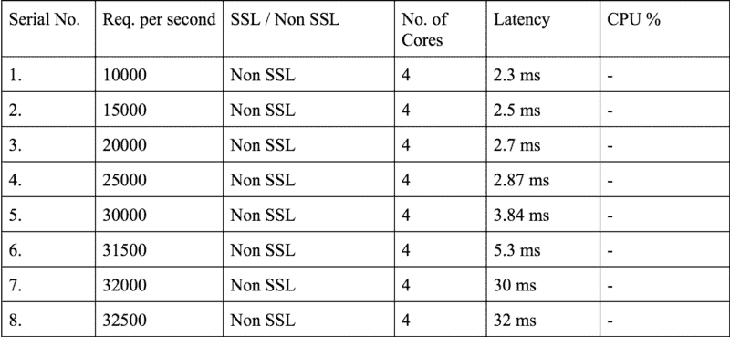

正如你在上面看到的，我们在 4 核机器上达到了每秒 32k 的请求。如果你还记得引爆点图，你就能在上面足够清楚地注意到它。因此，这种情况下的临界点是 31.5k 个非 SSL 请求。

看看负载测试的更多结果。


16k SSL 连接也一点都不差。请注意，在我们的负载测试旅程的这一点上，我们不得不从头开始，因为我们采用了一个新的客户端，它给了我们比 ab 更好的结果。所以我们不得不再次做很多事情。

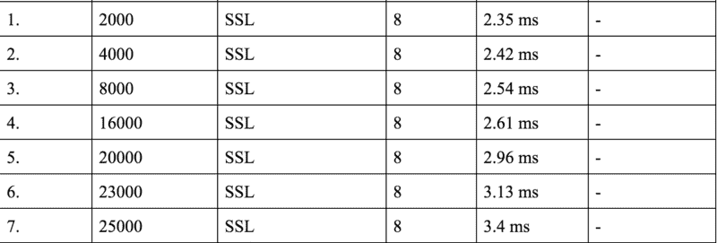

内核数量的增加导致机器在达到 CPU 极限之前每秒可以接受的请求数量增加。

我们发现，如果我们将内核数量从 8 个增加到 16 个，每秒的请求数量并没有实质性的增加。此外，如果我们最终决定在生产中使用 8 核机器，我们永远不会将所有的核心分配给 HAProxy 或任何其他进程。因此，我们决定对 6 个内核进行一些测试，看看我们是否有可接受的数量。

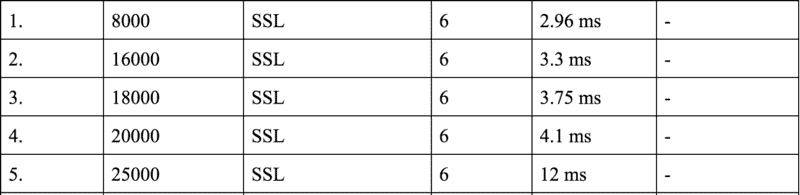

不错。

### 介绍睡眠

到目前为止，我们对我们的负载测试结果相当满意。然而，这并没有模拟真实的生产场景。这发生在我们引入睡眠时间的时候，而睡眠时间在我们的测试中是不存在的。

```
echo "POST https://test.haproxy.in:443/ping" | vegeta -cpus=32 attack -duration=10m  -header="sleep:1000"  -body=post_smaller.txt-rate=2000 -workers=500  | tee reports.bin | vegeta report
```

因此，1000 毫秒的睡眠时间将导致服务器睡眠`x`的时间量，其中`0< x <`；1000 并随机选择。因此，平均而言，上述负载测试将给出≥500 毫秒的延迟

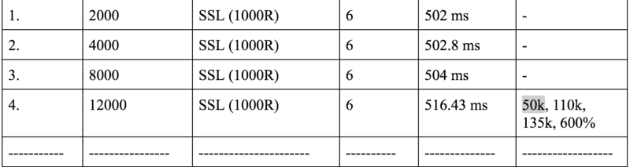

最后一个单元格中的数字代表

```
TCP established, Packets Rec, Packets Sent
```

分别是。正如您可以清楚地看到的，6 核计算机每秒可以支持的最大请求数从 20k 减少到了 8k。显然，睡眠有其影响，这种影响就是建立的 TCP 连接数量的增加。然而，这离我们设定的 70 万大关还差得很远。

### 里程碑#1

我们如何增加 TCP 连接的数量？简单，我们不断增加睡眠时间，他们应该上升。我们一直在玩睡眠时间，我们停在 60 秒的睡眠时间。这意味着平均延迟约为 30 秒。

贝吉塔提供了一个有趣的结果参数，即请求成功的百分比。我们看到，在上述睡眠时间内，只有 50%的呼叫成功。请看下面的结果。

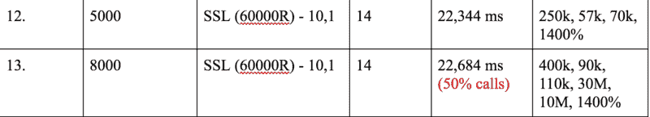

我们实现了每秒 8k 请求和 60000 ms 睡眠时间的 400k TCP 连接。60000R 中的 R 表示随机。

我们的第一个真正发现是，在贝吉塔有一个默认的呼叫超时，为 30 秒，这解释了为什么我们 50%的呼叫失败。所以我们在进一步的测试中把它增加到了 70 秒左右，并在需要的时候不断地改变它。

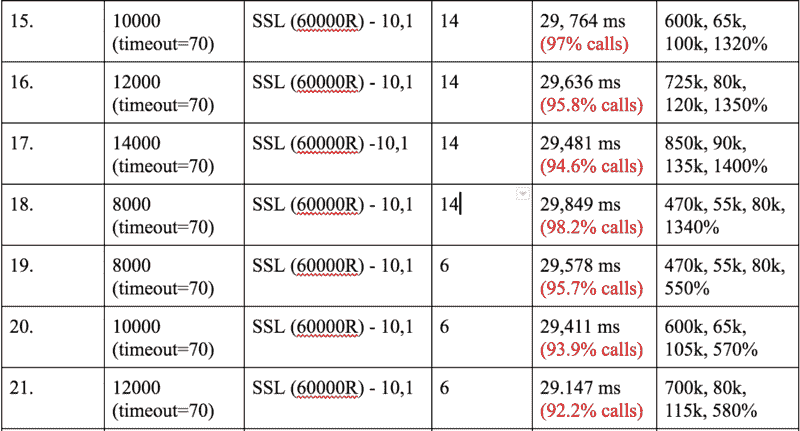

在调整了客户端的超时值后，我们轻松地达到了 700k。唯一的问题是这些并不一致。这些只是高峰。因此，该系统达到了 60 万或 70 万的峰值，但没有在那里停留很长时间。

然而，我们想要类似这样的东西

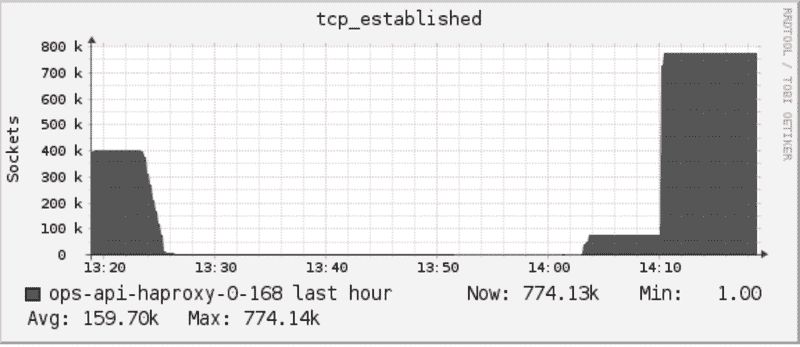

这显示了保持 780k 连接的稳定状态。如果仔细观察上面的统计数据，每秒的请求数非常高。然而，在生产中，我们在一台 HAProxy 机器上的请求数量要少得多(大约 300 个)。

我们确信，如果我们大幅减少生产中的 HAProxies 数量(大约 30，这意味着每秒 30*300 ~ 9k 个连接),我们将达到机器的限制。首先是 TCP 连接的数量，而不是 CPU。

> 所以我们决定实现每秒 900 个请求和 30MB/s 的网络和 210 万个 TCP 建立的连接。我们同意这些数字，因为这将是我们在单个 HAProxy 上的生产负荷的 3 倍。

另外，到目前为止，我们已经选定了 HAProxy 使用的 6 个内核。我们想测试 3 核，只是因为这是我们在生产机器上部署最容易的方式(我们的生产机器，如前所述，是 4 核 30g。因此，用`nbproc = 3`推出改变对我们来说是最容易的。

```
REMEMBER the machine we had at this point in time was 16 core 30 Gig machine with 3 cores being allocated to HAProxy.
```

### 里程碑#2

现在，我们已经有了不同的机器配置可以支持的每秒请求的最大限制，我们只剩下上面提到的一个任务了。

实现 3 倍的生产负载

*   每秒 900 个请求
*   建立了 210 万个 TCP，并
*   30 MB/s 网络。

我们再次陷入困境，因为 TCP established 在 220k 受到重创。无论客户端机器的数量或者睡眠时间是多少，TCP 连接的数量似乎都停滞不前。

我们来看一些计算。220k TCP 建立连接和每秒 900 个请求= 110000/900 ~ = 120 秒。我选择 110k 是因为 220k 连接包括输入和输出。所以这是双向的。

当我们在 HAProxy 端引入日志时，我们对 2 分钟是系统中某个地方的限制的怀疑得到了验证。我们可以在日志中看到大量连接的总时间为 120000 毫秒。

```
Mar 23 13:24:24 localhost haproxy[53750]: 172.168.0.232:48380 [23/Mar/2017:13:22:22.686] api~ api-backend/http31 39/0/2062/-1/122101 -1 0 - - SD-- 1714/1714/1678/35/0 0/0 {0,"",""} "POST /ping HTTP/1.1"
```

```
122101 is the timeout value. See HAProxy documentation on meanings of all these values. 
```

通过进一步调查，我们发现 NodeJs 的默认请求超时为 2 分钟。瞧啊。


[**如何修改 nodejs 请求默认超时时间？**](http://stackoverflow.com/questions/23925284/how-to-modify-the-nodejs-request-default-timeout-time)
[*我使用的是 nodejs 请求，nodejs http 的默认超时是 120000 ms，但对我来说还不够，而我的…*stackoverflow.com](http://stackoverflow.com/questions/23925284/how-to-modify-the-nodejs-request-default-timeout-time)[**http | node . js v 7 . 8 . 0 文档**](https://nodejs.org/api/http.html#http_server_settimeout_msecs_callback)
[*node . js 中的 HTTP 接口被设计为支持协议的许多传统特性…*nodejs.org](https://nodejs.org/api/http.html#http_server_settimeout_msecs_callback)

但是我们的幸福显然是短暂的。在 130 万时，HAProxy 连接突然下降到 0，并再次开始增加。我们很快检查了 [dmesg](http://www.linfo.org/dmesg.html) 命令，该命令为我们的 HAProxy 进程提供了一些有用的内核级信息。

基本上，HAProxy 进程已经被遗忘了。因此，我们决定增加机器 RAM，并使用`nbproc = 3`转移到 16 核 64g 机器，由于这一变化，我们能够达到 240 万个连接。

### 后端代码

下面是正在使用的后端服务器代码。我们还在服务器代码中使用了 statsd 来获取客户机每秒接收的请求的综合数据。

```
var http = require('http');var createStatsd = require('uber-statsd-client');qs = require('querystring');
```

```
var sdc = createStatsd({host: '172.168.0.134',port: 8125});
```

```
var argv = process.argv;var port = argv[2];
```

```
function randomIntInc (low, high){    return Math.floor(Math.random() * (high - low + 1) + low);}
```

```
function sendResponse(res,times, old_sleep){    res.write('pong');    if(times==0)    {        res.end();    }    else    {         sleep = randomIntInc(0, old_sleep+1);        setTimeout(sendResponse, sleep, res,times-1, old_sleep);    }}
```

```
var server = http.createServer(function(req, res){   headers = req.headers;   old_sleep = parseInt(headers["sleep"]);   times = headers["times"] || 0;   sleep = randomIntInc(0, old_sleep+1);   console.log(sleep);   sdc.increment("ssl.server.http");   res.writeHead(200);   setTimeout(sendResponse, sleep, res, times, old_sleep)
```

```
});
```

```
server.timeout = 3600000;server.listen(port);
```

我们还有一个小脚本来运行多个后端服务器。我们有 8 台机器，每台都有 10 个后端服务器(是的！).对于负载测试，我们真的认为客户端和后端服务器是无限的。

```
counter=0while [ $counter -le 9 ]do   port=$((8282+$counter))   nodejs /opt/local/share/test-tools/HikeCLI/nodeclient/httpserver.js $port &   echo "Server created on port "  $port
```

```
 ((counter++))done
```

```
echo "Created all servers"
```

### 客户代码

至于客户端，每个 IP 有 63k 个 TCP 连接的限制。如果你不确定这个概念，请参考我在这个系列的[上一篇文章](https://medium.com/@sachinmalhotra/load-testing-haproxy-part-2-4c8677780df6)。

因此，为了实现 240 万个连接(120 万个来自客户端机器的双向连接)，我们需要大约 20 台机器。在所有 20 台机器上一个接一个地运行贝吉塔命令真的很痛苦，即使你已经找到了使用类似于 [csshx](https://github.com/brockgr/csshx) 的方法，你仍然需要一些东西来组合来自所有贝吉塔客户端的所有结果。

看看下面的脚本。

```
result_file=$1
```

```
declare -a machines=("172.168.0.138" "172.168.0.141" "172.168.0.142" "172.168.0.18" "172.168.0.5" "172.168.0.122" "172.168.0.123" "172.168.0.124" "172.168.0.232" " 172.168.0.244" "172.168.0.170" "172.168.0.179" "172.168.0.59" "172.168.0.68" "172.168.0.137" "172.168.0.155" "172.168.0.154" "172.168.0.45" "172.168.0.136" "172.168.0.143")
```

```
bins=""commas=""
```

```
for i in "${machines[@]}"; do bins=$bins","$i".bin"; commas=$commas","$i;  done;
```

```
bins=${bins:1}commas=${commas:1}
```

```
pdsh -b -w "$commas" 'echo "POST http://test.haproxy.in:80/ping" | /home/sachinm/.linuxbrew/bin/vegeta -cpus=32 attack -connections=1000000 -header="sleep:20" -header="times:2" -body=post_smaller.txt -timeout=2h -rate=3000 -workers=500 > ' $result_file
```

```
for i in "${machines[@]}"; do  scp sachinm@$i:/home/sachinm/$result_file $i.bin ; done;
```

```
vegeta report -inputs="$bins"
```

显然，贝吉塔提供了关于这个名为 [pdsh](https://github.com/grondo/pdsh) 的实用程序的信息，它可以让你远程地在多台机器上同时运行一个命令。此外，贝吉塔允许我们将多个结果合并成一个结果，这正是我们想要的。

### 羟基构型

这可能是你来这里寻找的，下面是我们在负载测试运行中使用的 HAProxy 配置。最重要的部分是`nbproc`设置和`maxconn`设置。maxconn 设置允许我们提供 HAProxy 总体上可以支持的最大 TCP 连接数(单向)。

对`maxconn`设置的更改导致 HAProxy 过程的 ulimit 增加。看看下面

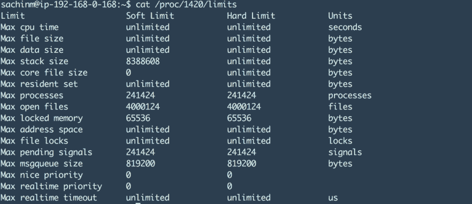

由于 HAProxy 的最大连接数设置为 200 万，最大打开文件数增加到了 400 万。整洁！

查看下面的文章，你可以也应该做大量的 HAProxy 优化来达到我们所达到的统计数据。

[**使用 HAProxy 对 300k 并发 tcp socket 连接进行负载均衡:端口耗尽、保活……**](https://www.linangran.com/?p=547)
[*最近在尝试搭建一个推送系统。为了增加系统的可伸缩性，最佳实践是让……*www.linangran.com](https://www.linangran.com/?p=547)

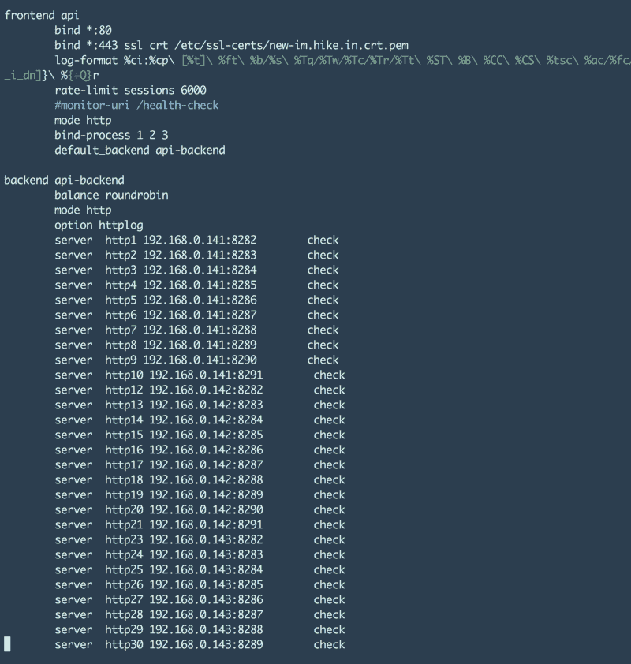

http30 继续到 http83 :p

伙计们，现在就到这里吧。如果你已经看到了，我真的很惊讶:)

特别要感谢 Dheeraj Kumar Sidana，是他一路帮助我们度过了难关，没有他们的帮助，我们不可能取得任何有意义的成果。:)

请让我知道这篇博文对你有什么帮助。此外，如果你认为这篇文章可能对某人有用，请推荐(❤)并尽可能多地传播对这篇文章的爱。