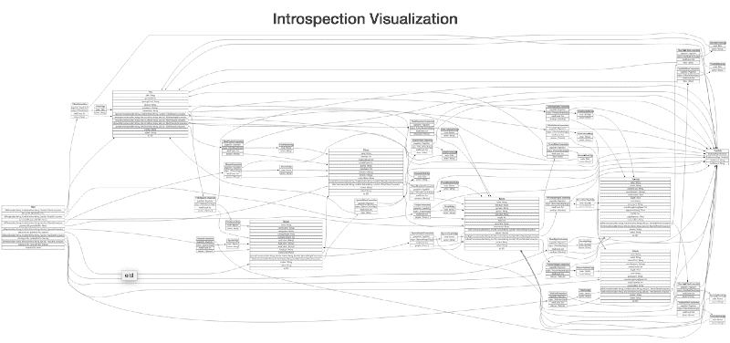
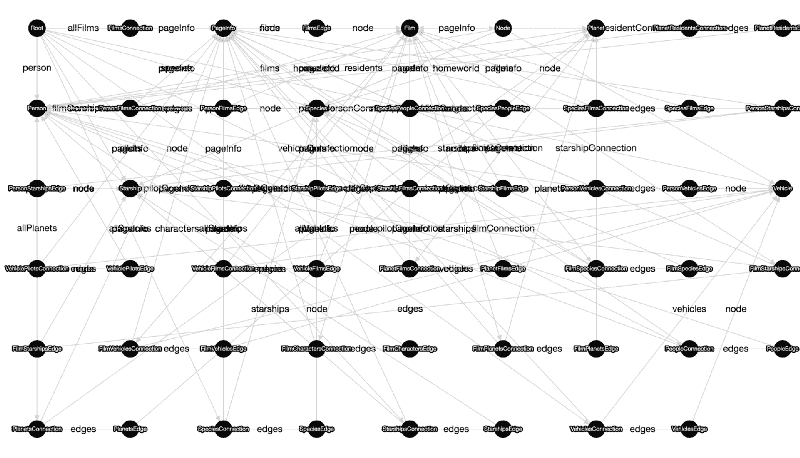
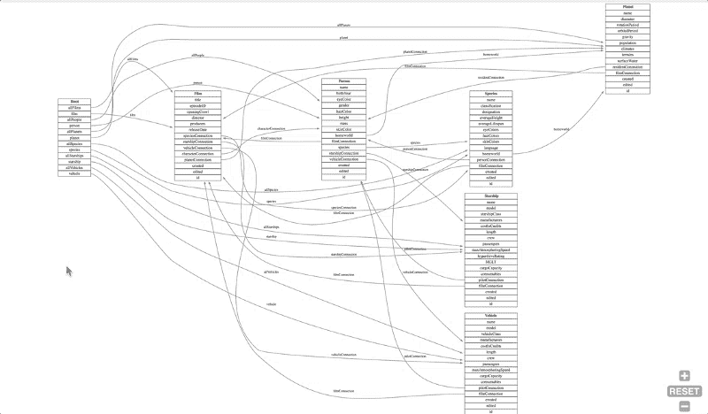
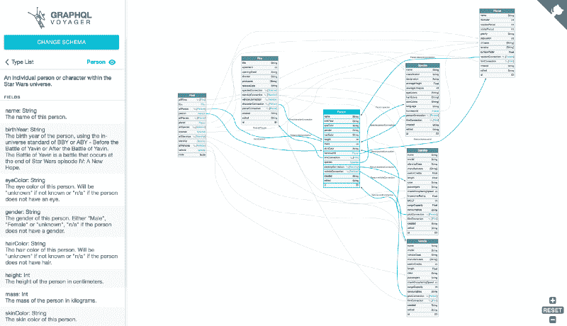
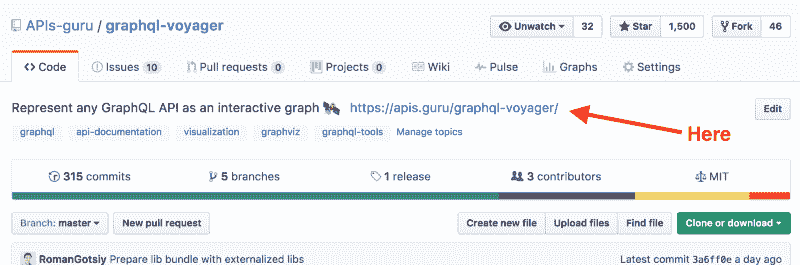

# 我们如何通过将久经考验的技术与全新的用户界面相结合来获得 1500 颗 GitHub 星

> 原文：<https://www.freecodecamp.org/news/how-we-got-1-500-github-stars-by-mixing-time-tested-technology-with-a-fresh-ui-b310551cba22/>

由罗马热西

# 我们如何通过将久经考验的技术与全新的用户界面相结合来获得 1500 颗 GitHub 星

Photo credit: [www.k3projektwheels.com](http://www.k3projektwheels.com/)

最近，我们发布了一个名为 [GraphQL Voyager](https://github.com/APIs-guru/graphql-voyager) 的开源工具。令人惊讶的是，它登上了黑客新闻和 GitHub 趋势的第一页，并在头几天获得了 1000+颗星。截至目前，它已经拥有超过 1600 颗[恒星](https://github.com/APIs-guru/graphql-voyager/stargazers)。

人们喜欢光滑的用户界面、交互功能和动画。我们使用了 TypeScript、React、Redux、webpack 甚至 PostCSS，但这是**而不是** **又一篇关于它们的文章**。让我们看看引擎盖下…

### 我们的背景故事

这都是几个月前开始的。我和我的朋友(我们称自己为 APIs.guru)正在寻找一个关于 T2 graph QL(一种由脸书开发的 API 查询语言)项目的想法。经过一番研究后，一个有趣的工具吸引了我们的目光— [GraphQL 可视化工具](http://nathanrandal.com/graphql-visualizer/)。

Output from GraphQL Visualizer

我们想补充一点:

*   颜色(黑白看起来太无聊)
*   平移和缩放
*   交互式功能，如选择节点和边

但是在查看了源代码之后，我们发现了这个工具中的一个致命缺陷:它使用了 T2 Graphviz T3，这是一个用普通 C 语言编写的几十年前的工具，使用 T4 em scripten T5 编译成不可读的 JavaScript。

Even worse than usual Uglify.js output

我们怎么能用 2000 年的东西呢？看在上帝的份上，我们是潮人！ReactJS、D3、webpack、TypeScript、PostCSS——这就是我们的工作！不是用老式 C 写的工具？。

经过一点研究，我们找到了最适合这项任务的库— [Cytoscape.js](http://js.cytoscape.org/) 。它是用可爱的 JavaScript 编写的，甚至支持在图形上运行类似 CSS 的选择器。多么伟大的结果！

经过一周的密集编码，结果并不令人满意。自己看:

Visualised graph using Cytoscape.js

这还没有在图表上显示所有的细节！真是一团糟！

虽然代码更干净，但最终结果比原始工具差得多。完全不能用。

看起来 cytoscape.js 不可能有不穿过节点的边。我们试了工具箱里的所有东西。我们谷歌了一下。我们询问了 StackOverflow。我们甚至打扰了一些我们认识的 SVG 大师。零成功:(

作为最后的手段，我甚至试图破解 cytoscape.js 来产生一个可读的结果。更多的研究让我放弃了:显然，可视化图形**是**火箭科学(即使你有应用数学硕士学位)。

我们被打败了…

然后我们恍然大悟。如果我们从 Graphviz(它只是普通的 SVG)获取输出，并在其中加入一些 CSS 和 JS，会怎么样？

这就成功了，✨

好多了！而不到一天的编码？。

添加一点颜色，一个标志，加载动画，一些更有用的功能，我们在这里:

The final result

是的，我们写了几百行难看的 DOM 操作。是的，我们把这些乱七八糟的东西包装成一个不纯洁的东西？反应/还原组件。是的，Graphviz 代码太大了，我们把它分成了一个单独的 2MB 文件。但这很有效，没人在乎。GitHub 上的 1600 颗星证实了这一点。

**更新:**自 time 文章提交以来，该项目已被该领域的公司(如 Graphcool、Neo4j)采用，并在 GraphQL Europe 上进行了专题报道，因此不仅有 1600 位明星证实了这一点:)

### 经验教训

> "如果说我看得更远一点，那是因为我站在巨人的肩膀上。"—伊萨克·牛顿

不要根据代码的年龄来判断它。尤其是如果它是由科技巨头写的，比如 T2 T 实验室(Unix、C 和 C++语言诞生的地方)的 T0。

不幸的是，我们受到了认知偏见的影响:旧代码是坏代码。但事实可能恰恰相反。旧代码经过了数百个不同项目中成千上万用户的考验。大多数关键的错误已经被修复，文档是完整的，在 StackOverflow 和 Quora 上有大量的问题和答案。

我们生活在 2017 年，2000 年的用户界面肯定是不可接受的。但是图表和它们背后的数学并没有太大的变化。

同样的思路可以应用到许多其他领域。所以应该给旧代码一个机会，特别是因为你总是可以把它包装成一个现代外观的 UI。

这就是为什么我们看到了[网络组装](http://webassembly.org/)的巨大潜力。它将允许将经过时间验证的算法实现与现代用户界面相融合。我们渴望看到人们用它来建造令人敬畏的东西。

### “Emm..你答应过告诉我如何得到许多星星

哎呀…好吧。你抓到我了。我想让标题足够吸引人。

下面是我们在开源项目中使用的最重要的技巧和诀窍的清单:

*   尝试使用你的技术名称作为项目名称的一部分(例如 graphql-something、react-something 等)。)这样你的项目在这些技术的 GitHub 搜索结果中会有更好的排名。
*   你的自述应该吸引人们的眼球。我们在自述文件的顶部添加了一个动画 gif，这样人们可以立即理解我们的项目是关于什么的。如果是控制台 app——用控制台加个 gif(这里有个牛逼的[牛逼的例子](https://github.com/graphcool/graphql-up))。
*   更多的附加功能:添加徽章，添加好看的标志，添加表情符号？？
*   如果可能的话，创建一个演示，并在存储库的描述字段中添加一个链接。

*   再次，**设置一个 demo** ！不要忘记添加从演示到 GitHub 的链接(我们使用 [GitHub 角](http://tholman.com/github-corners/))。
*   发布到 HackerNews/Reddit/etc 之前。，通过将其发布到不太受欢迎的资源或与朋友分享，获得初始数量的星星(5-10 颗)。人们不太可能在零星级的项目上点击“星级”。
*   尝试在第一天获得 30-40 颗星。这样，你就有可能在 GitHub 趋势网站上出现你的语言，这是另一个流量来源。
*   **做点有用的东西**。

另外还有几篇关于如何推广开源项目的文章:[这里](https://blog.cwrichardkim.com/how-to-get-hundreds-of-stars-on-your-github-project-345b065e20a2#.iudi1mx0q)，这里[这里](https://medium.com/@zenorocha/how-did-clipboard-js-get-5000-stars-in-a-few-days-2b2248ba7bd8#.wvvstia5n)，这里[这里](https://medium.com/developer-relations/how-talks-affect-an-open-source-project-e4dd1db81a6d#.ecb0kqb1p)。

这是所有的乡亲。如果你曾经把旧代码包装成新的闪亮的用户界面？请在下面的评论中讲述你的故事。