# 我们如何在短短 48 小时内在 GitHub 上获得两年回购趋势

> 原文：<https://www.freecodecamp.org/news/how-we-got-a-2-year-old-repo-trending-on-github-in-just-48-hours-12151039d78b/>

Github 让数百万开发者能够轻松宣传他们的项目，从而吸引用户和合作者。但是这些开发人员经常发现他们花费了数百个小时构建一个项目，只是为了把它推到 GitHub 上，仅仅获得一两个星。

我在为我工作的非营利组织 [Hack4Impact](http://hack4impact.org) 建立一个项目时，发现自己处于这种情况。这是一个为社区组织制作[技术项目](http://hack4impact.org/projects)的学生团体。

我们一起构建了**瓶底**、**和**，作为我们所有产品的样板代码。它包含了 flask web 应用程序的一些基本要素:SQLAlchemy、Redis 队列和用户认证(以及其他一些特性)。

你可以在这里查看我们的回购协议。

A demo of the admin backend on flask-base

flask-base 的最大优点是它的“即插即用”你不需要做太多的设置就可以在你的机器上获得一个可运行的版本(在 Heroku 等主机服务上运行它是非常容易的)。另外，与许多其他样板应用程序相比，它相当简单，因此有很大的定制空间。

Flask-base 已经开发了两年，它已经帮助我们为我们承担的大约 90%的技术项目形成了样板。这个项目使得为像 [Kiva](http://hack4impact.org/projects/kiva) 、 [OSET](http://hack4impact.org/projects/oset) 、[青少年法律中心](http://hack4impact.org/projects/m4a-jlc-sp2)和 [Givology](http://hack4impact.org/projects/givology) 这样的组织创造产品成为可能。

Flask-base 使我们能够帮助美国各地的社区组织实现他们努力争取的社会影响。但是，尽管我们努力在各种渠道宣传我们的代码，flask-base 仍然不为所有人所知，除了少数从事这项工作的人。

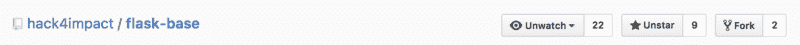

The old days

我们失败的努力让我们感到沮丧，因为我们觉得其他开发人员和小型组织可以使用 flask-base 来进行类似的有影响力的项目。但是我们就是不知道如何把产品推出去。结果，我们开始质疑一个开源媒体的公平性，这个媒体本该把伟大的想法吹到最高层。

How open sourcing a project feels. ([source](http://gifrific.com/wp-content/uploads/2012/04/gob-letter-throw.gif))

但是后来我们发现我们的方法有什么问题。我们从*用户*的角度仔细观察了开源是如何工作的。我们注意到了修复和改进项目的关键领域，这样我们就可以在现实世界中使用它。

然后，我们迎来了我们的时刻。我将我们的项目发布到了 [/r/Python](http://reddit.com/r/python) subreddit，它得到了一点点的关注。我们决定采用它。在 48 小时内，我们的知识库从 9 颗星增加到 200 多颗星。它一直在增长。

突然，我们收到了对这个项目感兴趣的人的评论和建议。太不可思议了。

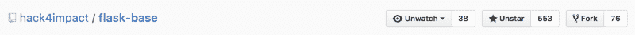

the old days += 544 stars, 74 forks, and 16 watches

这篇文章是关于我们是如何把 flask-base 发展到今天这个地步的。如果你有一个有影响力的项目要分享，你可以实施我们的建议，(希望)在开源世界中得到关注，并充分利用它。

### 它始于研究

我们开始看成功的例子。GitHub 上流行的存储库有一些共同的特性:

*   一个自述文件，带有产品的图片/gif
*   证明文件
*   静态代码分析
*   投稿说明
*   定义明确的设置部分
*   *一个标志(完全可选)*

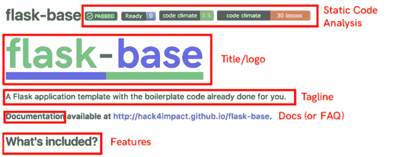

Breakdown of the first few lines of a README

一些值得一看的 Github 回购示例:

*   [React-Router](https://github.com/ReactTraining/react-router) : 19k+星，4.5k+叉。React Router 除了对管理单页 web 应用有用之外，还是少数几个拥有如何使用该框架的专门教程的资源库之一。它还有一个全面的设置指南以及用户可能遇到的错误参考。
*   [Webpack](https://github.com/webpack/webpack) : 23.5k+星，2.7k+叉。Webpack 可以说是现代前端 web 开发的最佳工具之一，因为它的可靠性和覆盖许多不同浏览器版本的能力。README 用几十个徽章和示例用例以及文档链接证明了这一点。Webpack 还强调了社区在维护项目中的作用(特别是通过专门的发起人和支持者部分)

那么举一个 Github 回购的坏例子如何:

*   [abhisuri97/leARn](https://github.com/abhisuri97/leARn) :是的……我把我自己的一个回购叫出来作为一个不好的例子。这个回购是为了我做的一个黑客马拉松项目，它赢得了 PennApps XIII VR/AR，并获得了前 10 名。这是我唯一一次用 Unity 开发，因此大量的文件是无关的，不需要提交。虽然对这个项目做了很好的解释，但它没有解释如何让它在某人的系统上工作或者有什么特性。

在浏览了几十个存储库并对热门趋势进行了几天的监控后，我们发现了所有流行存储库都提出的一个重要想法:**如果我是一名开发人员，正在查看你的回购协议，给我一个使用你的项目的理由，并使它尽可能简单。**

### 注意力抓取装置

[Image source](https://media.licdn.com/mpr/mpr/p/5/005/08b/07a/348caff.jpg)

#### 演讲术和自述:

当我在高中参加演讲比赛时，我参加了一个叫做原创演讲的活动。你写了 10 分钟的演讲并在法官面前表演。我的每一次演讲都是从一个 2 分钟长的 *A.G.D.* (注意力抓取装置)开始的。通常，这是一个故事，然后是演讲的主题，以及我将要阐述的观点的预览。

嗯… **READMEs 是你项目的总设计师！**

当你的访问者查看你的存储库时，阅读材料是他们首先会看到的。因此，您应该确保您的自述文件包含有关您的项目的基本信息。

但是什么是至关重要的呢？你如何抓住访问者的注意力？

当有人在看你的项目时，他们想知道:

*   这是什么
*   代码有多好
*   有多少支持可用
*   包括什么
*   它看起来像什么
*   以及他们应该如何着手建立它。

让我们逐一回答这些问题。

#### 这是什么？

A huge logo will quickly address what the repository is

对于大多数存储库来说，这是一个相当简单的问题，但是很多人都做错了。你的项目是数百万中的一个。你只有很少的时间来给人留下印象。

在推特上描述你的项目(大约 140 个字符)。省略细节没关系。这就是特写部分的作用。一个徽标也有助于这一点，因为它将把你的项目名称与自述文件的黑白文本区分开来(也表明你在制作一个徽标上付出了努力)。

#### 代码有多好？

这个问题可能是 90%的存储库都没有解决的问题。虽然“好”代码的定义是主观的，但人们在一些方面是一致的。

*   这是久经考验的
*   它通过了样式检查(ESLint 等。)
*   它可以在当前状态下编译(相对来说没有问题)
*   它通过某种形式的静态分析(通过代码环境之类的服务)

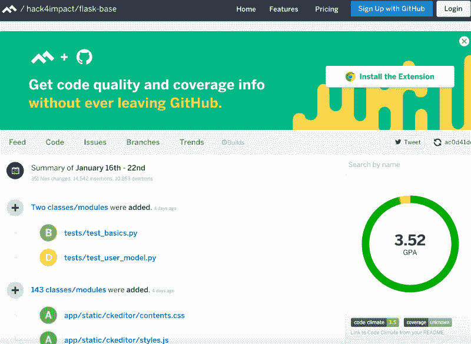

Code Climate’s dashboard gives you a GPA for code quality

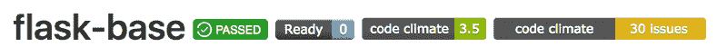

The Github badges on flask-base

在决定使用你的项目之前，没有一个开发人员会一行一行地查看你的代码来判断它是否好。因此“徽章”出现在项目的第一行。这些徽章的伟大之处在于，它们非常容易设置，让你的项目更加可信，访问者根本不用看你的代码。

#### 有多少支持？

支持有两种形式:对问题的支持和对学习如何使用项目的支持。

对问题的支持可以通过 FAQ 解决。但是对于新项目，人们不知道旧代码的深处可能隐藏着什么错误(因此可能没有 FAQ 的内容)。展示这种支持的唯一方式是在问题出现时处理它们，并快速解决它们。

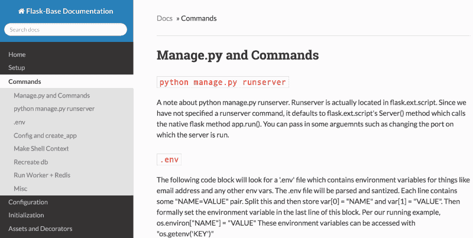

flask-base documentation generated with mkdocs. [View our docs](http://hack4impact.github.io/flask-base).

第二种支持可以通过文档来解决。这项任务对于开发人员来说是一个巨大的痛点，但是对于你的项目的受欢迎程度来说是至关重要的。

使用 [mkdocs](http://www.mkdocs.org/) 很容易创建文档，您可以从 mkdocs CLI 生成一个 gh-pages 站点，然后您可以在 Github 上免费托管它。

好的文档会给你的用户如何使用程序的例子，并解释困难的部分。它还应该给出一个如何启动项目的详细指南(如果是一个 web 应用程序)。

#### 包括什么？

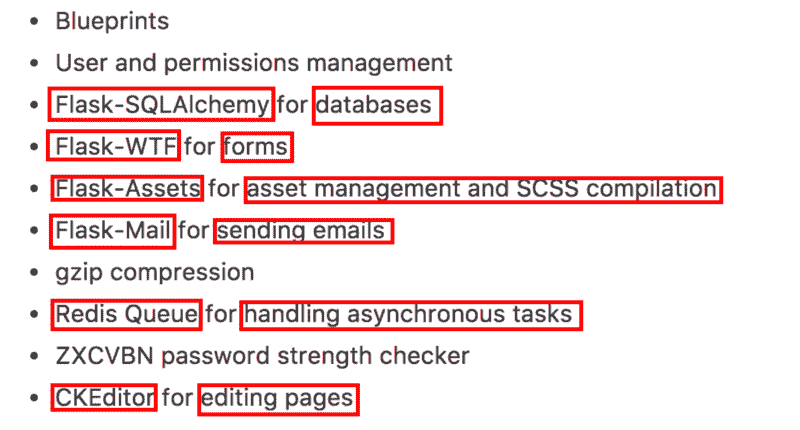

X for Y

功能列表不应该是详尽的，但是应该列出应用程序的核心功能，并且是可访问的(和可演示的)。该列表最多应包含 10 个特征，并且特征 y 的格式为“(已用)X”

#### 它看起来像什么？

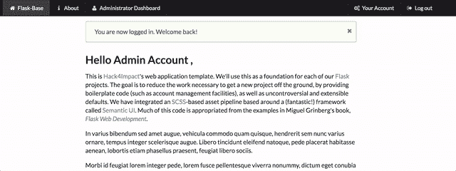

Demoing the admin page editing feature of flask-base

如果一张图片胜过千言万语，那么一个. gif 文件就是一百万个。向**展示**你的应用程序是如何工作的——即使这意味着显示命令行输出。这条信息让开发人员在查看你的项目时，对 a)它应该是什么样子，以及 b)它是否符合他们的需求有一个概念。

永远不要低估一幅好的图片会在多大程度上说服开发者使用你的项目。

#### 我如何设置它？

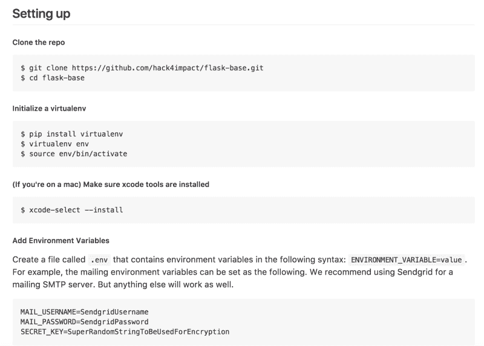

Our setup instructions

在开发过程中，您很有可能在一台安装了所有东西的计算机上进行项目。**但是您必须提供一种方法，让用户在 3-4 个步骤中设置并运行您的。如果这意味着创建一个 MakeFile，那么就去做吧。也一定要提到你使用过的任何“全球”工具，像*巴别塔-cli* 和*巴别塔-核心。***

根据一般经验，如果您必须安装它，很可能其他人也必须这样做。还要确保将所有的脚本压缩到一个文件中(对于 python 来说是 *requirements.txt* ，对于 node/javascript 来说是 *package.json* )。简而言之，有人应该能够在不到 5 分钟的时间内让你的项目运行起来。

### 走向趋势:

所以一个很好的吸引注意力的设备(又名 README)将帮助你留住你的访客。但是，你如何在第一时间让访问者访问你的项目呢？

您可以使用 3 个主要插座:

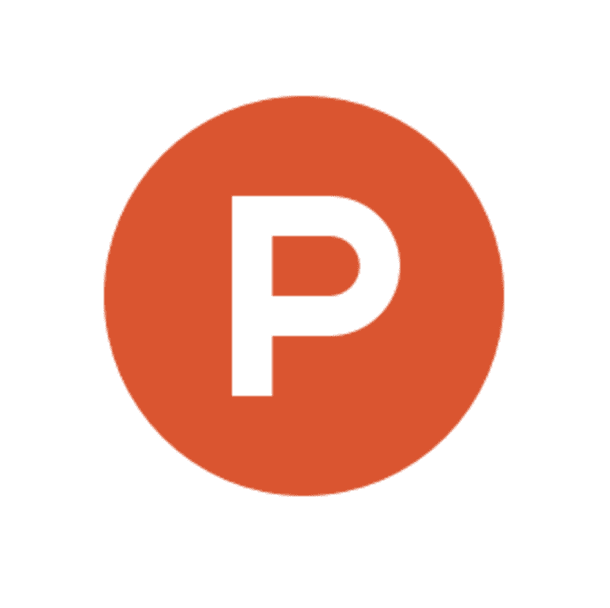

Hacker News, Product Hunt, Reddit (pictures sourced from their respective press kits)

**黑客新闻/产品搜索:**两者都提供了将项目展示给参与其中的开发人员社区的好方法(并且你可以获得媒体的报道)。但问题是，让你的帖子登上任何一个网站的顶端都需要大量的计划，而且有些用户从一开始就愿意帮助推广你的帖子。

Reddit: 到目前为止，用一些明星建立知识库的最好方法。**但是你需要找到合适的社区**。对于基于 flask 社区来说，这个社区是 [/r/Python](http://reddit.com/r/python) ，在这里我们不费吹灰之力就登上了当天的榜首。

关键是进入一个会关心你的项目(并且会使用它)的社区。但是你应该小心不要在非常普通的子编辑区发帖，比如/r/Programming，那里有很多竞争的帖子，会淹没你自己的帖子。

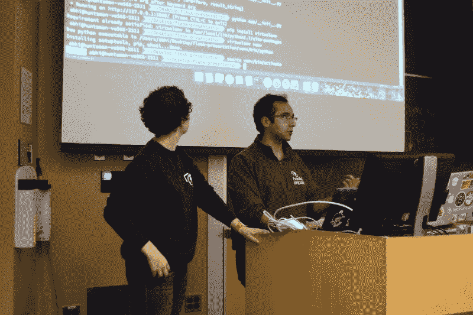

[Veronica Wharton](https://www.freecodecamp.org/news/how-we-got-a-2-year-old-repo-trending-on-github-in-just-48-hours-12151039d78b/undefined) and I teaching a Flask workshop at PennApps XV

研讨会:这也是一个“秘密”，但研讨会是让你的知识库中有一打左右的明星的好方法。举办一个关于你如何创建你的项目的研讨会，它有什么作用，最重要的是*，展示如何使用它(用一个例子)。*

*我们在 PennApps XV 通过教授一个关于如何用 Flask 制作 web 应用程序的研讨会做到了这一点。大约有 40 人参加，我们展示了 flask-base 作为他们可以在黑客马拉松中使用的 flask 应用程序的例子。我们的研讨会结束五分钟后，我们检查了存储库，发现**已经获得了 17 颗星和 8 个叉**。那种感觉太神奇了:)*

### *监控状态*

*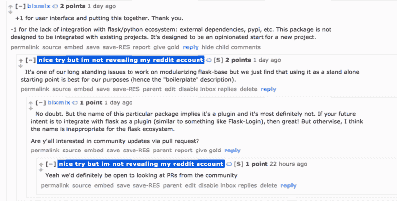

Addressing comments on improvement. Be nice, justify your opinions, and welcome input from others.* 

*不可避免地会有人在你发布后指出一个错误/不一致性。一定要针对这些人，回复所有的评论，并考虑所有的反馈。与你的观众保持互动是确保观众对你的项目感兴趣的关键。*

*一旦你在短时间内(1-2 小时)获得 30-40 颗星的初始增长，那么你的项目将有很大的机会成为热门。(当然，我不能谈论 GitHub 的趋势算法如何工作的细节)*

*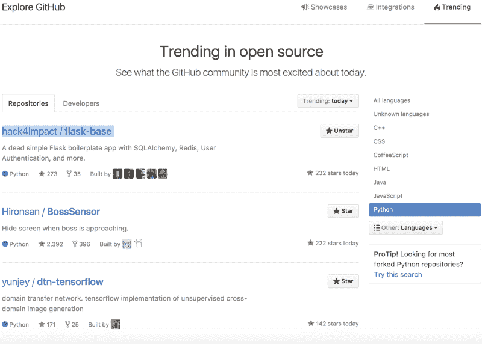

Flask-base top trending for Python repos on Github after 24 hours* 

### *我们的一些成就*

*Flask-base 达到了 python 库的**每日热门趋势**，本周的**整体热门趋势**和**热门/r/Python** 。*

*Hack4Impact 成为**第四大热门 python 开发者**和**第五大热门整体开发者**。*

*此外，到目前为止，我们已经有了 80 多个克隆人和 40 多个 T2。*

*作为一名计算机科学本科生，看到人们正在使用我帮助编写的代码令人惊讶。*

*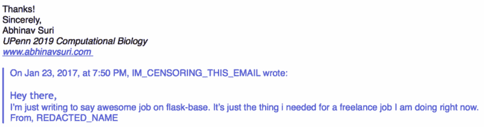

A thank you letter I received.* *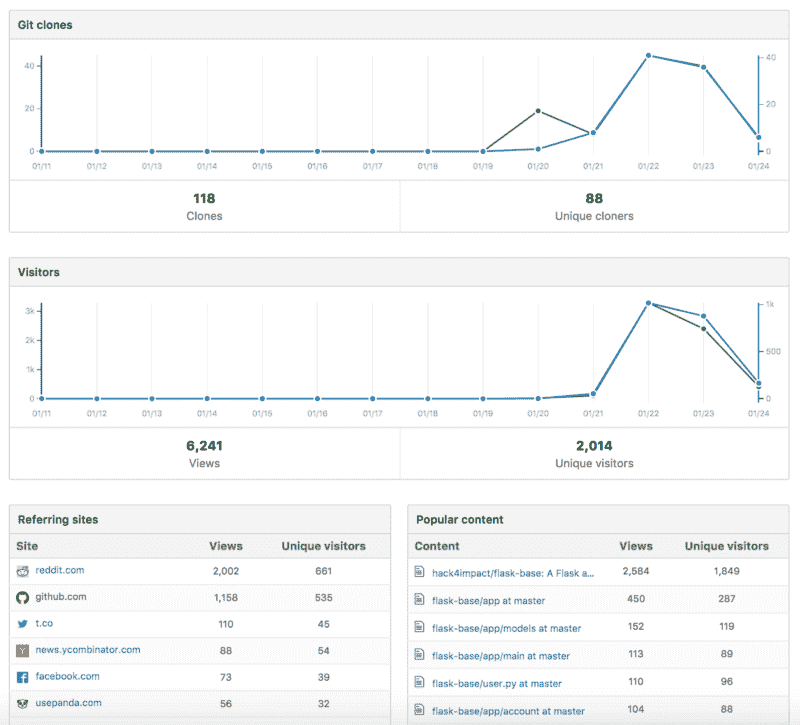

Our analytics on GitHub. Reddit was really helpful.* 

*如果你没有达到成为热门的目标，不要担心。只是冲洗和重复。有时候你会走运，有时候不会。*

*如果你努力创建你认为其他人会觉得有用的开源代码，你就是在为开源世界做贡献。您将充分利用开源所提供的一切。*

### *承认*

*非常感谢 [Alex Piatski](https://www.freecodecamp.org/news/how-we-got-a-2-year-old-repo-trending-on-github-in-just-48-hours-12151039d78b/undefined) 、 [Veronica Wharton](https://www.freecodecamp.org/news/how-we-got-a-2-year-old-repo-trending-on-github-in-just-48-hours-12151039d78b/undefined) 、 [Emmett Neyman](https://www.freecodecamp.org/news/how-we-got-a-2-year-old-repo-trending-on-github-in-just-48-hours-12151039d78b/undefined) 、Stephanie Shi 和 [Ben Sandler](https://www.freecodecamp.org/news/how-we-got-a-2-year-old-repo-trending-on-github-in-just-48-hours-12151039d78b/undefined) 对本文的投入。感谢 flask-base 的开发者( [Ben Sandler](https://www.freecodecamp.org/news/how-we-got-a-2-year-old-repo-trending-on-github-in-just-48-hours-12151039d78b/undefined) 、 [Yoni Nachmany](https://www.freecodecamp.org/news/how-we-got-a-2-year-old-repo-trending-on-github-in-just-48-hours-12151039d78b/undefined) 、 [Max McCarthy](https://www.freecodecamp.org/news/how-we-got-a-2-year-old-repo-trending-on-github-in-just-48-hours-12151039d78b/undefined) 、 [Veronica Wharton](https://www.freecodecamp.org/news/how-we-got-a-2-year-old-repo-trending-on-github-in-just-48-hours-12151039d78b/undefined) 、Alex Harelick、Nancy Wong 和 [Annie Meng](https://www.freecodecamp.org/news/how-we-got-a-2-year-old-repo-trending-on-github-in-just-48-hours-12151039d78b/undefined) )让这个项目变得非常棒。*

*最后，感谢 [Hack4Impact](https://www.freecodecamp.org/news/how-we-got-a-2-year-old-repo-trending-on-github-in-just-48-hours-12151039d78b/undefined) 让我成为这样一个有社会影响力的社区的一员。*

*如果你想了解更多关于瓶底， [**访问回购**](http://github.com/hack4impact/flask-base) **。***

*如果你想查看一些用 flask-base 制作的项目， [**访问 Hack4impact 的** **项目页面**](http://hack4impact.org/projects) 。*

*如果你想了解更多关于 Hack4Impact(又名创建 flask-base 的组织)， [**访问我们的网站**](http://hack4impact.org) 。*

*如果你想了解我更多，请访问我的 [**个人网站**](http://abhinavsuri.com) ，我的 [**Github**](http://github.com/abhisuri97) ，或者发邮件到[**suria@seas.upenn.edu**](mailto:suria@seas.upenn.edu)。*