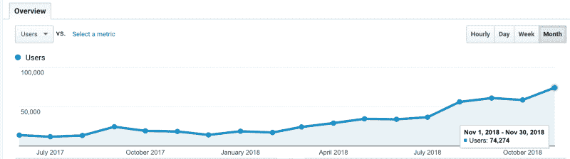
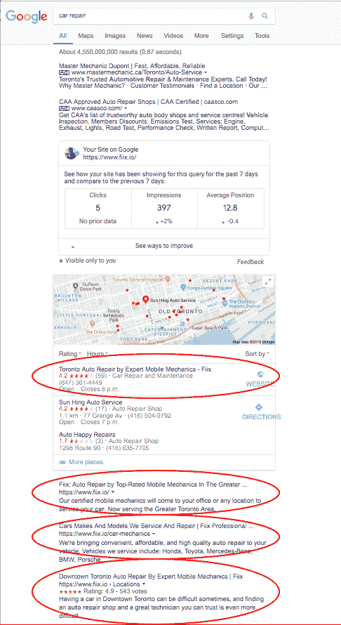
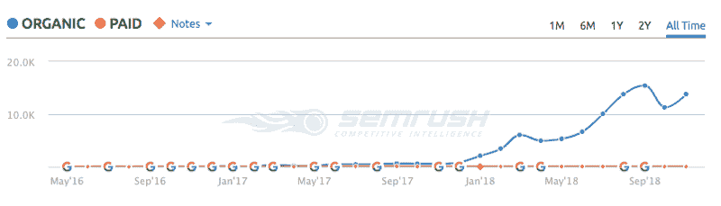
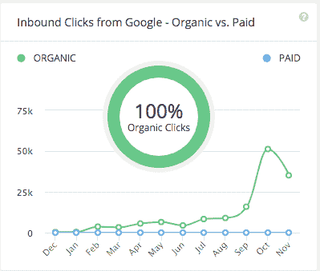
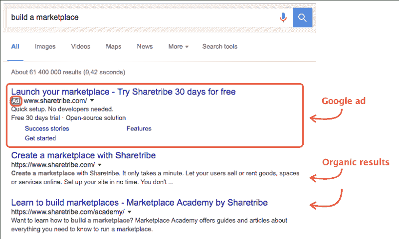
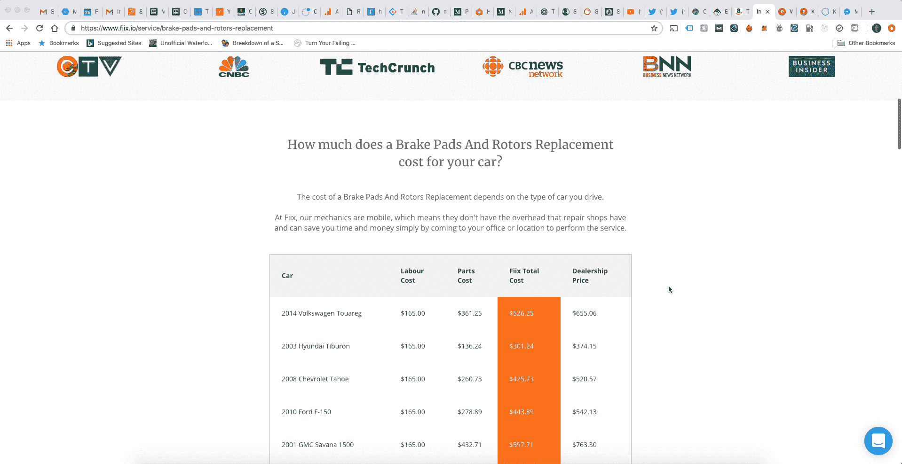
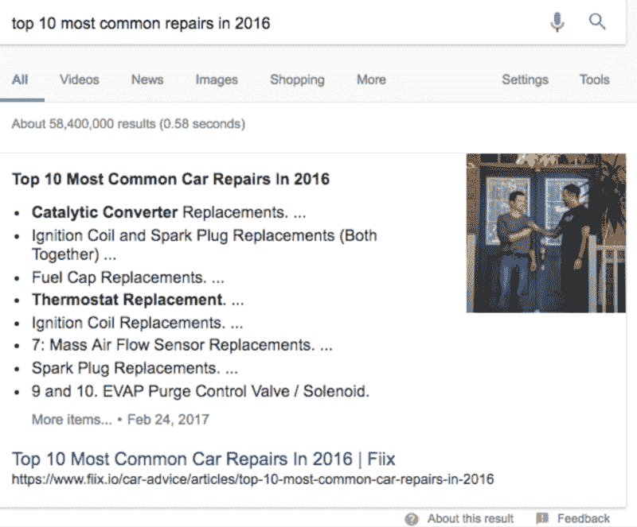
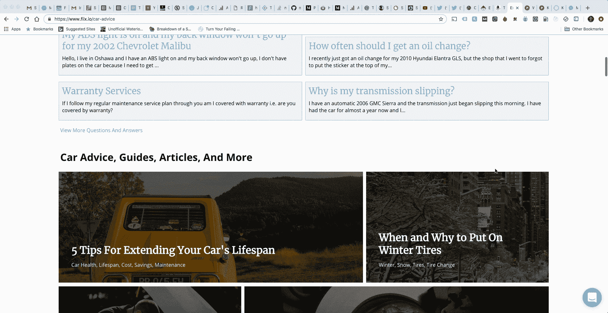

# 我们如何发展我们的搜索引擎优化，每月为我们的网站带来 70K+访问者

> 原文：<https://www.freecodecamp.org/news/how-we-grew-our-seo-to-bring-our-site-70k-visitors-a-month-73e650a05c28/>

在 [Fiix (www.fiix.io)](http://www.fiix.io) ，SEO 对我们来说是一个很大的获客渠道。我们每月从它那里获得超过 70，000 的独立访问者，并且这些访问者中的一部分转化为实际的付费客户。

在这篇文章中，我将向你展示我们是如何构建 SEO 的。

如果您有任何问题，请随时通过 [Twitter](https://twitter.com/ZainManji) 给我发消息？

Fiix — Google Analytics

### 什么是 SEO？

SEO(搜索引擎优化)是通过非付费的方式，在搜索引擎结果中增长有机可见性的过程。简单来说，这是一个过程，旨在让你的网站在谷歌(或其他搜索引擎)特定搜索查询中显示为第一结果，而无需为此支付广告费用。

SEMRush (www.fiix.io)

SpyFu (www.fiix.io)

#### Google 在评估网页的时候最在意什么？

相关性和权威性。

人们去谷歌提问并得到答案。谷歌的首要任务是尽可能快速、准确、可靠地回答用户的问题。如果有人访问谷歌，却找不到他们想要的答案，谷歌认为这是一次糟糕的体验。因此，谷歌对他们首先显示哪些网站非常挑剔。

### 为什么 SEO 很重要？

SEO 是为数不多的真正有规模的获取渠道。如果做得正确，它会给你的网站带来巨大的免费流量，然后你可以将这些流量转化为用户/顾客。发展 SEO 的唯一成本就是工程机会成本。

今天一些最好的公司严重依赖 SEO 来发展和保持他们的用户群:Pinterest，Amazon，Yelp，Trivago，GrubHub，Expedia 等等。

### 我们如何决定建立我们的搜索引擎优化？

更具体地说， [Fiix](http://www.fiix.io) 派遣专业的、有执照的机械师到人们的家里、办公室或其他地方修理他们的汽车。我们的目标客户是任何拥有汽车并需要汽车维修的人。因此，当考虑个人在遇到汽车问题时的决策过程时，他们会采取以下主要措施之一:

(1)向自己身边的汽车专家寻求帮助(如父母、朋友等)。

(2)去离他们最近的维修店。

(3)去谷歌上寻找他们遇到的问题的答案。

当我们问自己解决第三个问题的最佳方法是什么时，我们发现 SEO 是最明确的解决方案？。

### 我们的 SEO 目标是什么？

我们的目标是吸引我们的目标客户访问我们的网站，购买将在他们家中进行的汽车维修服务。当车主在谷歌上搜索任何与他们的汽车有关的话题时，我们希望成为用户输入查询后首先显示的网站，并成为用户可以依赖来找到答案的地方。

### 好的，酷…那么我们从什么开始呢？

#### 1.首先利用谷歌广告词(SEM)和谷歌关键词规划

SEM(搜索引擎营销)就是通过**付费**的方式在搜索引擎结果中获得知名度的过程。例如，如果你付钱给谷歌为你开展广告活动，他们可以在谷歌搜索后将你放在搜索结果顶部的广告部分。

SEM 非常适合短期/即时结果，SEO 非常适合一致的长期结果。尽管我们知道 SEO 将是我们获取客户的一个重要渠道，但我们也知道我们不能指望它能立即带来第二天的结果。谷歌需要一段时间来索引你的网页，谷歌需要一段时间来分析和评估你的网站是否受欢迎和值得信赖，你需要一段时间来看到有机的流量从那里建立起来。

了解到这一点，我们的 SEM 目标不仅是创造有利可图的成功广告活动，而且还要确定哪些关键词/查询为我们带来了最高的投资回报率，并为我们赢得了目标客户。

**我们将在 SEM 活动中跟踪的指标是:**

(1) **印象**:对于给定的查询，有多少人看到了我们的广告。
*这将告诉我们目标关键词/查询是否被高度搜索。*

(2) **CTR(点击率)**:总点击数/总展示数。
*这将告诉我们，我们的广告文案对用户有多大的吸引力。高点击率是一个非常好的迹象，会影响我们如何为我们的有机网页构建元数据和内容，当涉及到为关键词开发 SEO 的时候。*

(3) **CPC(每次点击成本)**:每次有人点击我们给定查询的广告时，我们必须支付的总金额。
*这有助于告诉我们这个查询是否是一个有竞争力的查询，以及我们的广告是否有一个好的质量分数。*

(4) **转化率**:我们广告的点击(互动)次数/转化次数。
*这将告诉我们哪些关键词/查询产生了付费客户。*

**注意**:要获得这些信息，你不必进行 SEM 活动。你可以使用[谷歌关键词规划器](https://adwords.google.com/ko/KeywordPlanner/Home)来计算一些一般的统计数据。我们做 SEM 是因为我们想创造有利可图的 Adwords 活动。

经过几次实验，我们能够看到我们的目标客户正在搜索哪些关键词，以及他们是否正在转化为付费客户。由此，我们现在知道了在开发 SEO 时需要关注和瞄准哪些关键词。

**我们从 SEM 中发现了什么:**

从我们的 SEM 工作中，我们找出了用户正在搜索的关键词和查询，这对我们很有用。由此我们知道，我们必须在我们的网站上创建针对这些关键词的页面和内容，因为这些是我们的客户在谷歌上搜索的内容。

#### 2.利用数据动态创建网页，而不是手动创建网页。

在创建网页时，我们能做的最耗时的事情就是手动输入我们想要在你的网站上显示的所有内容。它没有真正的可伸缩性，很烦人，很耗时，并且可以通过适当的编程轻松实现自动化。

在我们的数据库中，有大量与我们的服务相关的各种类型的信息。因此，我们所做的是用这些数据动态创建成千上万的页面，并形成特定于每个数据类别的内容。

所有这些页面都是通过我们为每个页面创建的模板以及根据给定的 URL 和查询参数用我们数据库中的内容填充模板而动态生成的。

这使得我们能够找到我们想要的每一个长尾关键词/查询。

我们想到创建这个引擎来开发我们网站上的页面，是受到了[陈楚翔(安德森·霍洛维茨律师事务所的合伙人)和 Reforge 的启发，他们在课上讲述了如何在你的产品中开发增长循环](https://www.reforge.com/blog/growth-loops) **(强烈推荐你去看看)**。

#### 3.现在我们有了关键词和内容，我们如何优化搜索引擎优化呢？

我们的整个网站都有内容和页面是一回事，但如果它的结构和呈现方式不便于 Googlebot 抓取，那么我们将很难在 Google 上显示。

等等，Googlebot 是什么？

Googlebot 是谷歌的网页抓取机器人(也称为“蜘蛛”)。爬行是 Googlebot 发现要添加到 Google 索引中的新页面和更新页面的过程。

当 Googlebot 抓取我们的网站时，我们的主要目标是确保 Googlebot 能够尽可能容易地提取和解释所有相关信息。

那么，我们要改进和优化什么呢？

**页面因素。这些因素是由您或您页面上的代码控制的。**

*   在每个网页中正确使用 HTML 元素和结构(例如 h1、h2、h3、标题、meta 等)
*   每个网页都是独一无二的。与网站上的其他页面相比，每个页面的内容需要至少有 70%的独特性，并且几乎不包含任何重复的内容。
*   每个网页的可发现性。网页上显示的内容应该是文本，而不是图像、JavaScript 或 CSS。尽管 Googlebot 是智能的，但它解析文本要容易得多。
*   贯穿每个网页的新鲜感。每个页面上的内容应该定期更新，以向谷歌显示该网站正在积极维护和保持相关性。
*   在 HTML 结构的重要位置放置目标关键字。例如，将重要的关键字放在第一个

    # 标签、标题标签和其他元数据位置。

*   整个页面的内容多样化(图像、列表、视频、文本等)。它向 Googlebot 展示了页面内容丰富。
*   在网页上呈现内容时，服务器端呈现，而不是客户端呈现。我们不希望我们的内容在页面加载后被动态加载，因为浏览器一收到来自服务器的 HTML 响应，Googlebot 就会抓取页面。

Google structured snippet

*   尽可能使用谷歌结构化代码片段，这样谷歌机器人可以更容易地解析它，也能够在搜索结果中更好地展示内容，比如左边的图片。
*   利用整个网页的内部链接，使谷歌机器人可以继续抓取网站，以便在可以传递搜索引擎优化汁到网站的其他页面。

**用户体验(UX)** :

*   确保网页具有移动响应能力。
*   确保网页快速加载。

**离页因素。这些都是你无法直接控制的因素。**

*   **反向链接。链接到你网页的外部链接的数量和质量是一个** **非常重要的因素。这有助于谷歌了解网站的权威性。如果有很多高权威的域名链接到我们的网站，这就向谷歌表明我们的网站也必须是权威的。**
*   链接的锚文本。理想情况下，锚文本应该与它所链接的页面的目标关键字保持一致。
*   来自搜索引擎的指标。高跳出率告诉谷歌，用户带着一个问题去我们的网站，很可能没有得到问题的答案。高点击率告诉谷歌，用户对我们的网站很感兴趣，想从中学习。

**微优化**

*   确保文件名中包含目标关键字。
*   确保网站的层次结构和网站地图结构良好，这样 SEO 汁可以很好地流动，并首先流向我们的最高投资回报率的页面。
*   没有必要链接到其他网站，并保持尽可能多的搜索引擎优化果汁在我们的网站上。
*   通过交互式应用、在线聊天会话(例如[对讲机](http://intercom.com)等)增加用户的页面会话时间。
*   使用 [Hotjar](https://www.hotjar.com/) 或 [FullStory](https://www.fullstory.com/) 查看用户如何与我们的网页互动，以及他们是否感到困惑。
*   A/B 测试元数据(标题、描述)以提高点击率。我们在内部做到了这一点，也使用了 RankScience。

### 你如何衡量 SEO？你怎么知道它在改善？

有很多网站会自动衡量搜索引擎优化的效果。然而，他们的准确性是不确定的。这些网站包括:SpyFu、SEMRush、Ahrefs、Moz 等等。

我们个人使用[谷歌分析](https://analytics.google.com/analytics/web/)和[谷歌搜索控制台](https://search.google.com/search-console/about)来衡量我们的大部分工作，因为我们可以在一个聚合视图中并在一个精确的关键字级别上获得关于流量、点击率、排名等的精确数字。

在这一点上，做好这一切让我们比竞争对手更胜一筹。

### 但是我们怎样才能超越基础呢？

在阅读了凯西·温特斯和陈楚翔的一些演讲后，我们努力做了两件事。

**(1)通过“用户生成内容”发展我们的 SEO**

**(2)创建自定义内容，手动**

用户生成的内容是一个重要的增长循环，可以极大地促进 SEO。通过允许用户在我们的网站上创建高质量的内容，我们可以处理更多的长尾关键词，继续为其他用户的问题提供答案，并鼓励越来越多的内容被制作出来。

我们的做法是开发一个“机械师堆栈溢出”，用户可以问任何与汽车相关的问题，其他用户和工作人员可以回答任何问题。

我们决定手动创建自定义内容，因为我们知道用户会搜索一些只需要手动创作的内容。

### 我们还需要做什么？

1.  整个网站有更多用户生成的内容
2.  整合更多谷歌的技术，让网站的 UX 更好，比如谷歌的加速移动页面([https://www.ampproject.org/](https://www.ampproject.org/))
3.  权威领域的更自然、更有机的反向链接(例如，媒体文章、博客、影响者等)

### 就是这样！

有了这一切，我们建立了我们网站的基础，让谷歌和时间接手烘烤我们的搜索引擎优化。现在，我们每个月有超过 70，000 的访问者。即使我们已经做到了这一点，我们仍然有很多事情要做，使我们的搜索引擎优化更好。

如果你有任何问题，随时通过 Twitter 给我发消息:[www.twitter.com/ZainManji](https://twitter.com/ZainManji)？

请与任何你认为可能从中发现价值的人分享？

最后，也可以随时订阅我的免费时事通讯，我会定期发布类似这样的文章:[https://zainmanji.substack.com](https://zainmanji.substack.com)？

### 荣誉？？？

感谢下面的人，他们帮助我们了解更多关于 SEO 的知识，并帮助我们发展。

**Alstom 的品味**
推特:网页。[Twitter . com/古斯塔夫](https://twitter.com/gustaf)

**陈楚翔**
网站:[www.andrewchen.co/](https://andrewchen.co/)推特:[www.twitter.com/andrewchen](https://twitter.com/andrewchen)

**凯西·温特斯**
网站:[www.caseyaccidental.com/](https://caseyaccidental.com/)
推特:[www.twitter.com/onecaseman](https://twitter.com/onecaseman)

**朱利安·夏皮罗**
网站:[www.julian.com](http://www.julian.com)推特:[www.twitter.com/Julian](https://twitter.com/Julian)

**RankScience**
网站:[https://www.rankscience.com/](https://www.rankscience.com/)