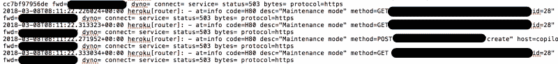
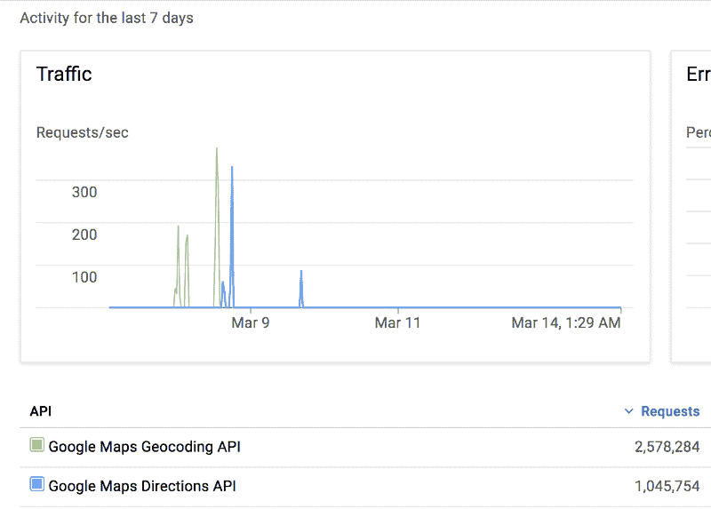

# 如何保护您的应用程序免受拒绝服务攻击

> 原文：<https://www.freecodecamp.org/news/how-we-handled-a-denial-of-service-attack-a-simple-security-lesson-8cdd542d4def/>

作者阿卡什·桑特

我写这篇文章不是为了描述如何使用某些技术，而是为了提供对我们所学到的教训的见解，同时减轻对我们构建的基于 web 的服务的拒绝服务(DoS)攻击。

我们将从一些背景知识开始。

在过去的一年里，我和我的朋友们认为城市间的交通需要一次重大的升级。

Facebook - University of Waterloo Carpooling Group

University of Waterloo - Davis Center

我们开始注意到这里有些不对劲。我们都是忙碌的学生，排这么长的队等公共交通工具不值得我们浪费时间。城市间的交通缺乏可靠性、效率和简单性。我们决定继续前进，这需要改变。

### **介绍[泳池](http://coming-soon.poolapp.io) - #MadeWithLove**

在过去的几个月里，我和一个由四名软件工程师组成的团队一直在为 Android 和 iOS 开发一个简单、快速、易用的拼车应用程序。

我记得我们第一次见面讨论这个项目想法的那一天。我们的笔记写满了在执行如此大规模的想法时我们将面临的挑战。与用户的可靠性、司机和乘客之间的信任以及行程安排问题相关的挑战。

目前，脸书滑铁卢拼车和共乘团体的会员数量约为 40，000 人。我们知道我们必须构建快速且可扩展的服务。我们开始我们的第一个原型作为一个 Android 应用程序，这导致了一个移植反应原生使其跨平台。

2018 年 3 月 7 日，我们宣布正式发布 1.0 版本。

两小时内，40 多名用户注册，14 多名司机提供服务。一切都在按计划进行。然而，没有不速之客的聚会就不算是真正的聚会了，不是吗？

#### **拒绝服务攻击**

拒绝服务(DoS)攻击旨在用虚假请求淹没受害者服务器，从而阻止它们为合法用户服务。

在我们发布三个小时后，我们收到了一封来自用户的支持邮件，邮件中说，“附近的 trips 只是继续显示加载符号”。得知有人关心我们，给我们发了一封支持邮件，我感到有点兴奋，但在我决定看一下服务器日志后，我的兴奋没有持续多久。我不敢相信我所看到的。

服务器被每秒 600 个请求的洪流淹没了。我们受到攻击，并立即知道这不是合法的流量。

我的第一反应是将服务器置于维护模式，希望攻击者会离开。但是当我们将服务器从维护模式恢复后，攻击又开始了。在这一点上，我们意识到我们的应用程序获得了比我们想象的更多的关注，我完全不知道从哪里开始实施修复。

### **SOS 项目-保护我们的服务**

所有核心团队成员都收到了警报，我们聚集在一起集思广益，以减轻攻击。我们使用了许多不同的方法，我将在下面描述。

#### **限速**

当攻击继续时，我知道我们需要通过对我们的 API 实施某种速率限制来减缓它们。

速率限制实质上是限制特定来源(在我们的例子中是互联网)对给定 IP 的请求数量(每分钟)。在应用速率限制后，服务器将只接受特定数量的请求。

速率限制算法必须很快，以便它不仅将所有传入的请求排队，而且尽可能快地拒绝所有攻击者的请求。

这是一个开始，但绝对不足以永远阻止攻击者。

#### **终点特定限速**

其次，由于速率限制，让服务器泛洪并导致请求排队对于攻击者来说是不可行的。所以攻击者稍微改变了他们的策略。相反，他们现在瞄准服务器上的 POST 端点，以便向服务器发布虚假数据。这意味着他们可以每分钟创建 N 次旅行(基于前面的限速步骤)。

在几个小时内，服务器有数百个由攻击者创建的虚拟行程。这要求用更严格的限制来限制 POST 端点的速率。将我们的 POST 端点限制在每小时两个请求左右就达到了目的。即使攻击者现在创建了虚拟行程，我们也有足够的时间来捕捉它们并清理我们的数据存储。

#### 祝你下次好运！

在接下来的几个小时的监控中，攻击者再次尝试。然而，没有造成损害，该应用程序在整个攻击过程中成功运行。所以限速策略成功了！现在是时候集中精力找出是谁了。

监控和跟踪我们的服务器日志使我们能够检索攻击来源的 IP 地址。

Server logs during the attacks

出于隐私原因，请求路径和攻击者的转发 IP 地址已被编辑。日志是在维护模式下记录的。如果您更仔细地检查日志，您会注意到请求中的`id`字段。这代表用户在我们的服务上创建的假帐户，以便能够访问该应用程序。

Pool 使用脸书身份验证，这意味着攻击者创建了一个假的脸书帐户来注册 Pool。使用本地`id`(记录在日志中)，我们能够找到用户的脸书`id`并发布帐户禁令。

我们的团队然后使用[https://www.whois.com/whois/](https://www.whois.com/whois/)在这个 IP 地址上执行域名查找。

随着深入调查，我们注意到这些请求来自 Amazon Web Services 上的一个`EC2`实例。此时，我们意识到我们可以直接向 AWS 报告 IP 地址，但是走捷径有什么意思呢？

#### **还没有结束……**

遵循这些措施，在帐户禁令生效之前，攻击者决定使用谷歌云平台 API 密钥(以前暴露在客户端)来使用所有谷歌 API 配额。据估计，在不到一个小时的时间里，有 400 万个请求访问了服务器。

但这只是需要一个简单的修复。

1.  我们首先通过向 API 密钥添加应用级限制来阻止攻击者窃取 Google API 配额的企图。也就是说，只有来自应用程序的请求才能通过。
2.  我们通过在服务器端移动 Google API 调用，从而在服务器上隐藏 API 键，添加了一个更永久的修复。将密钥隐藏在服务器上的环境变量后面通常是一种安全的做法。

Pool - Google Cloud Platform Requests (March 8–9)

#### 如果你想打败黑客，你必须像黑客一样思考！

如果我是使用`EC2`实例向服务器发送大量请求的攻击者，我会检查 HTTP 请求错误代码，以了解服务何时关闭以节省资源。速率限制提交一个错误代码 429 -太多的请求，而一个成功的连接请求将返回一个 200 - OK。

我可以在服务器端对此进行配置，返回 200 - OK，而不是速率限制“太多请求”错误代码。这防止了攻击者的脚本知道它们何时受到速率限制并不断耗尽它们的资源。

在监控服务器日志时，我们注意到来自攻击者的请求通过速率限制被服务器拒绝。

### **结论**

在与攻击战斗了 30 个小时之后，我们的服务终于无法被这个攻击者的 DOS 攻击所攻破。他们做了许多尝试，最后才放弃。在攻击的每一步，都采取了一个小而简单的措施来减轻拒绝服务攻击。这些简单的策略被证明是非常有效的。

说到底，简单和坚持走了很长的路，失败只是成功的垫脚石。