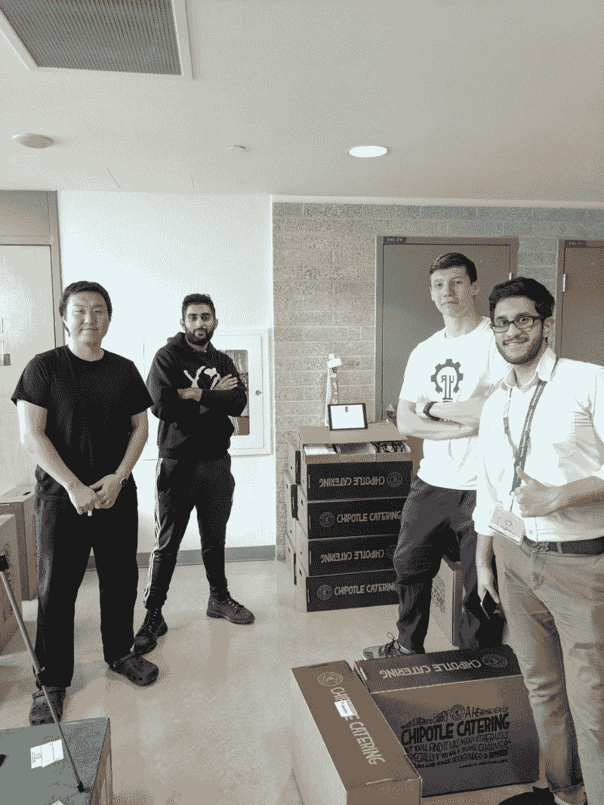
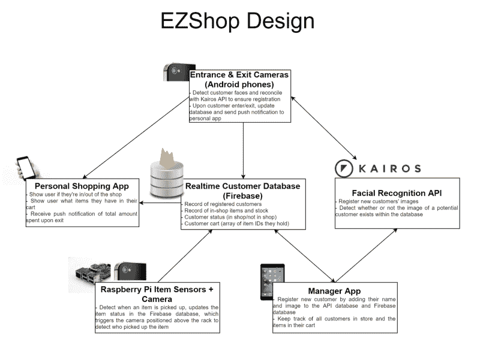
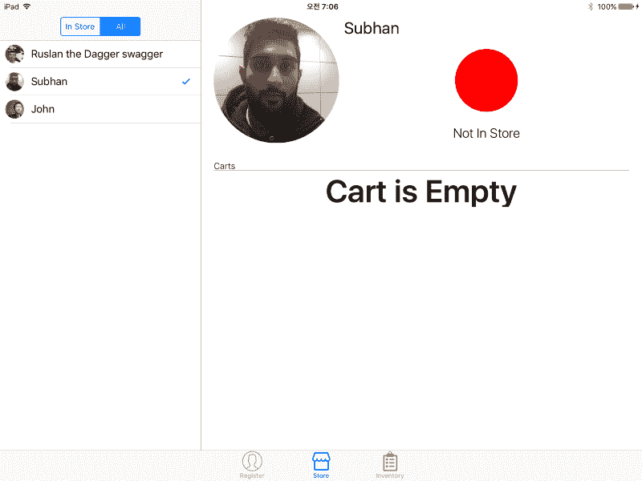
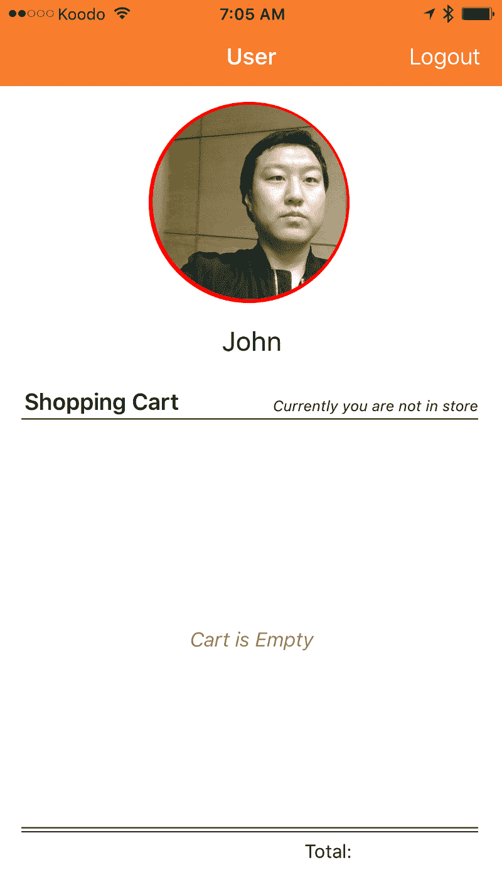
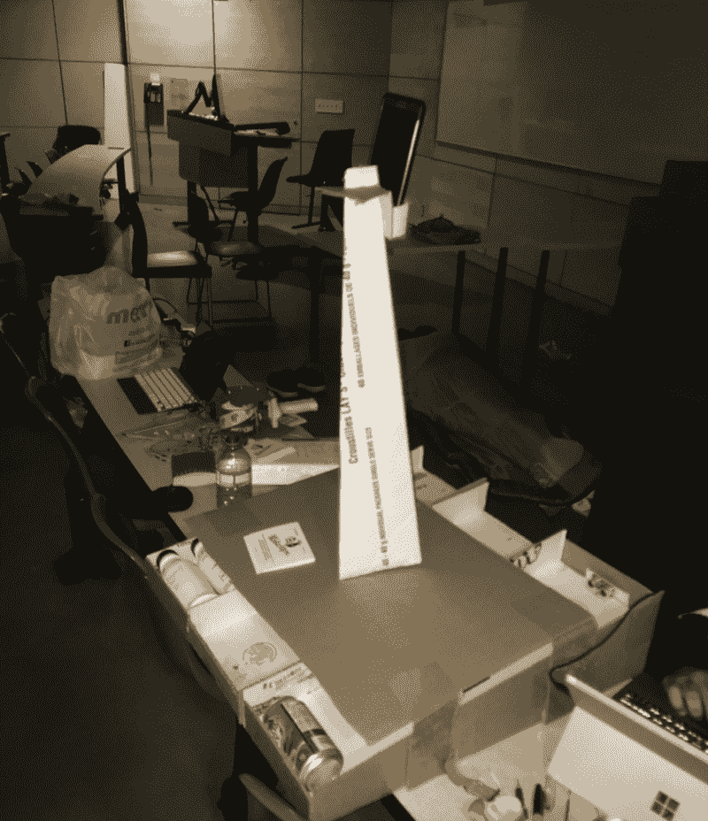
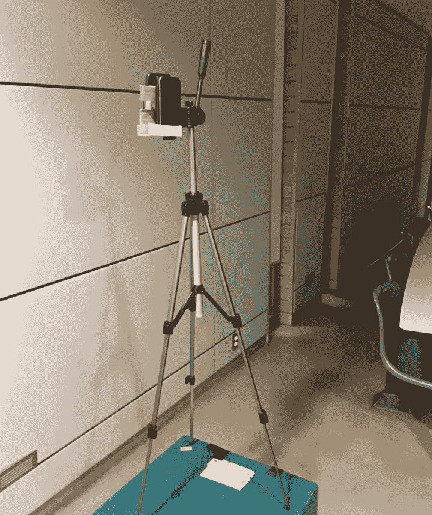
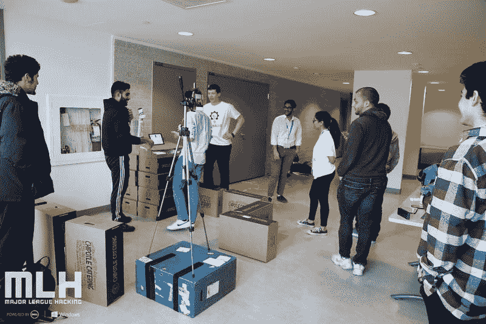

# 我们如何在 36 小时内重现亚马逊围棋

> 原文：<https://www.freecodecamp.org/news/how-we-recreated-amazon-go-in-36-hours-e32a4101d5f0/>

Subhan Nadeem

# 我们如何在 36 小时内重现亚马逊围棋



[John Choi](https://ca.linkedin.com/in/jungchoi), me, our project apparatus, [Ruslan Nikolaev](https://www.google.ca/url?sa=t&rct=j&q=&esrc=s&source=web&cd=1&cad=rja&uact=8&ved=0ahUKEwjpztXpxanYAhUD5oMKHVLqCQwQFggnMAA&url=https%3A%2F%2Fca.linkedin.com%2Fin%2Fnikolaevra&usg=AOvVaw0Xrmjq-LTwqkYu_5X5KexW), and [Soheil Hamidi](https://www.google.ca/url?sa=t&rct=j&q=&esrc=s&source=web&cd=4&cad=rja&uact=8&ved=0ahUKEwimjODxxanYAhVQyYMKHSjvCToQFggwMAM&url=https%3A%2F%2Fca.linkedin.com%2Fin%2Fsoheil-hamidi&usg=AOvVaw3VbTSHhVb0AEr45JYkig9K) at our demo!

我和我的同事想创造一些东西，让人们在我们最近的黑客马拉松上“哇”的一声。

因为模仿是最真诚的奉承形式，而物联网工作起来非常有趣，所以我们决定创建自己版本的 Amazon Go。

在我解释它是如何制作的之前，这里是我们制作的 3 分钟演示！

我们有四个人。 [Ruslan](https://www.freecodecamp.org/news/how-we-recreated-amazon-go-in-36-hours-e32a4101d5f0/undefined) ，一位拥有 Python 工作经验的优秀全栈开发人员。约翰，一个了不起的 iOS 开发者。Soheil，另一位拥有 Raspberry Pi 经验的优秀全栈开发人员。最后，还有我，在一个 Android 开发者实习的末尾。

我很快意识到这个项目有很多活动的部分。Amazon Go 基于实时接近传感器和客户及其购物车的实时数据库工作。

我们还想更进一步，让进/出体验无缝衔接。我们想让人们无需敲击手机就能进出商店。

为了作为面向消费者的产品吸引用户，我们的应用程序需要一个精心制作的用户界面，就像真正的 Amazon Go 一样。

在黑客马拉松的前一天，我整理了一份伪设计文档，概述了我们需要在 36 小时的期限内做什么。我整合了我们团队的力量和手头的设备。下面可以看到匆忙组装的完整设计文档。

我们的亚马逊 Go 版本 EZShop 有六个主要组件。



A quick diagram I whipped up visualizing the components of this project

### 凯罗斯面部识别 API

[Kairos 面部识别 API](https://www.kairos.com/) 对我们来说是一个基本组件。它抽象出识别和存储独特面孔的能力。它有两个我们使用的 API:`/enroll`和`/verify`。

`/enroll`被描述为:

> 拍摄照片，在照片中查找面孔，并将面孔存储到您创建的图库中。

我们将所有新客户登记到一个单独的“EZShop”画廊中。将返回一个唯一的`face_id`属性，并与客户的注册名称一起存储在我们的实时数据库中。

当我们想要验证潜在客户的图像时，我们会将它发布到`/verify`端点。这将返回匹配概率最高的`face_id`。

在现实世界的实现中，使用 TensorFlow 本地实现的面部识别管道而不是网络 API 可能是一个更好的主意。但是考虑到我们的时间限制，API 为我们提供了很好的服务。

### **实时火灾数据库**

Firebase 数据库是我们谜题的另一个基本部分。所有其他组件都与它实时交互。Firebase 允许根据数据库中的任何数据创建定制的更改监听器。这一特性，加上简单的设置过程，使它成为一个不用动脑筋就能使用的工具。

这个模式非常简单。数据库存储了一组项目和一组用户。下面是我们数据库的 JSON 框架示例:

```
{  "items": [    {      "item_id": 1,      "item_name": "Soylent",      "item_stock": 1,      "price": 10    }  ],  "users": [    {      "face_id": 1,      "name": "Subhan Nadeem",      "in_store": false,      "cart": [        1      ]    }  ]}
```

注册 Kairos API 后，新用户将被添加到我们的数据库中的用户阵列。在进入或退出时，客户的布尔`in_store`属性将被更新，这将反映在经理和个人应用程序 ui 中。

顾客拿起一件商品会导致商品库存的更新。在识别出哪个顾客拿了什么物品后，物品的 ID 将被添加到顾客的`cart`数组中。

我曾计划使用一个云托管的节点/Flask 服务器，将所有活动从一个设备路由到另一个设备，但是团队认为让每个人直接在 Firebase 数据库上工作要高效得多(尽管更黑客)。

### 经理和个人客户应用

作为 iOS 奇才，John 在黑客马拉松的前 12 个小时就完成了这些应用程序！他非常擅长设计用户友好且易于使用的应用程序。

#### **经理 App**



这个 iPad 应用程序在我们的 Kairos API 和 Firebase 数据库中注册了新客户。它还显示了商店中的所有顾客和商店商品的库存。直接与 Firebase 数据库交互并观察对其所做的更改(例如，当客户的`in_store`属性从`true`更改为`false`时)的能力使这一过程相对轻松。该应用程序是我们演示中面向客户的绝佳补充。

#### 个人购物应用



客户注册后，我们会将安装了该应用程序的手机交给客户。他们将登录他们的脸(凯罗斯将识别和认证)。他们购物车的任何更新都会立即显示在手机上。在离开商店时，顾客还会在手机上收到一条推送通知，告知他们消费的总金额。

### 物品架、传感器和照相机

索黑尔和鲁斯兰不知疲倦地工作了几个小时，以完善项目货架设备和底层 Pi Python 脚本的设计。



The item rack apparatus. Three items positioned in rows, a tower for the security camera, and ultrasonic sensors positioned at the rear

有三件物品成排摆放。在两排的末端，连接了超声波接近传感器。我们只有两个超声波传感器，所以第三排的物品下面有一个光传感器，这不是无缝工作。超声波传感器连接到 Raspberry Pi，它通过简单的 Python 脚本处理与下一个最近物体(最近的物品或货架末端)的距离读数。光线传感器检测到“暗”或“亮”状态(如果项目在它上面，则为暗，否则为亮)。

当一件物品被举起时，传感器的读数会改变，并触发数据库中该物品库存的更新。位于塔顶的摄像头(Android 手机)将检测到这一变化，并试图识别正在拿起商品的顾客。该商品将立即被添加到该客户的购物车中。

### 入口和出口摄像头

我选择使用 Android 手机作为我们的面部识别摄像头，因为我对 Android 有相对的专业知识，并且在拍摄图像和处理图像时，手机提供了简单的耦合。

手机安装在相机三脚架的两侧，一边在商店的入口处，另一边在商店的出口处。



A camera tripod, two phones, and lots of tape

谷歌有一个非常有用的 [Face API](https://developers.google.com/vision/) ，它实现了一个检测人脸和其他相关有用属性的原生管道。我使用这个 API 来处理面部识别的繁重工作。

特别是，API 提供了检测到的人脸与摄像机的近似距离。一旦顾客的脸在近距离内，我会拍摄顾客的快照，对照 Kairos API 进行验证，以确保顾客存在于我们的数据库中，然后用顾客的店内状态更新 Firebase 数据库。

我还在识别客户时添加了个性化的文本到语音的问候。这真的让所有使用它的人惊叹不已。

这个实现的结果可以在这里[看到](https://www.youtube.com/watch?v=XgtPey1TSIE):

一旦顾客离开商店，Android 应用程序的退出检测状态负责从数据库中检索顾客挑选的商品，计算顾客花费的总金额，然后通过 Firebase Cloud Messaging 向顾客的个人应用程序发送推送通知。

在这 36 个小时中，我们睡了大约 6 个小时。我们所有的时间都被限制在多伦多市中心的一间教室里。我们必须克服无数令人沮丧的错误和实现障碍。在我们的演示中有一些你可能已经注意到的错误，比如摄像机不能在同一个镜头中识别几个人。

我们还希望实现其他功能，如检测客户将商品放回货架并添加更多种类的商品。

我们的项目最终赢得了黑客马拉松的第一名。我们设置了一个互动摊位一个小时(标题图片中可以看到的 Chipotle 盒子城堡)，有超过 100 人走过我们的商店。人们会用照片注册，登录购物应用，走进商店，拿起一件商品，走出去，并立即收到他们的账单。没有收银员，没有排队，没有收据，非常愉快的用户体验。



Walking a customer through our shop

我为我们的团队发挥每个人的优势，在几个小时内创建了一个组装良好的全栈物联网项目感到自豪。这对每个人来说都是一种令人难以置信的回报，我希望在未来的职业生涯中也能复制这种感觉。

我希望这能让您对大型、快速原型化的 hacky hackathon 项目(如 EZShop)的幕后情况有所了解。

如果你对像这样更深入、更有信息的文章感兴趣，请在 [Twitter](https://twitter.com/SubhanNadeem19) 和 [Medium](https://medium.com/@subhan_nadeem) 上关注我！我总是乐于与其他软件开发人员交流并向他们学习。

这个项目是开源的，可以在 Github [这里](https://github.com/subhan-nadeem/EZShop)找到。请注意，黑客马拉松代码并不漂亮！