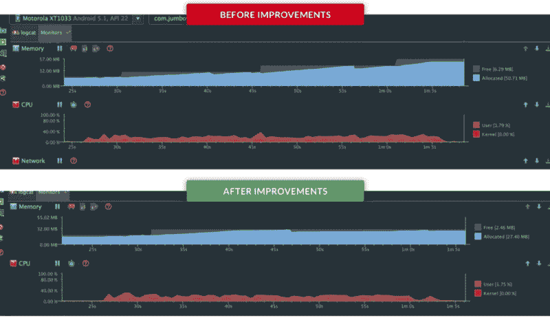
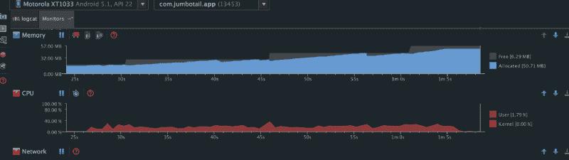
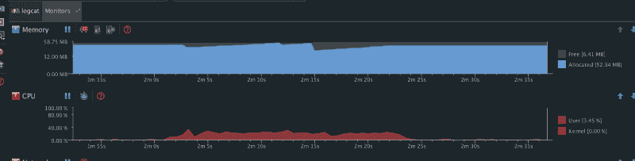
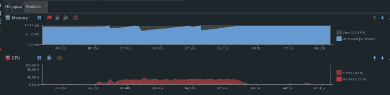
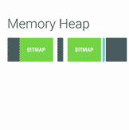
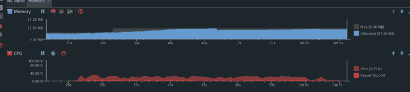
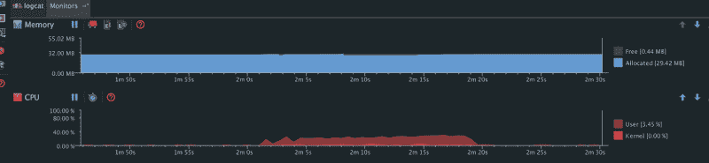

# 我们如何将 Android 应用的内存占用减少 50%

> 原文：<https://www.freecodecamp.org/news/how-we-reduced-memory-footprint-by-50-in-our-android-app-49efa5c93ad8/>

作者 Rohit Arya

# 我们如何将 Android 应用的内存占用减少 50%



Memory footprint improvements

像任何其他专注于发展势头的初创公司一样，我们一开始并没有花太多时间来打造一款高效的产品。我们发布了我们的 Android 应用程序，它运行得“很好”

随着我们向客户提供的产品越来越多，我们的应用程序变得越来越庞大——有大量的图像——我们开始发现性能问题。我们的应用在低端设备上变得缓慢和停滞。电池消耗也增加了。

为了调试这个问题，我们使用了 Android Studio 提供的内存监控工具。当我们滚动浏览一长串产品图片时，我们观察到的情况如下:



The Jumbotail Android app’s memory usage over time

为了更好地解释这些图表:

*   分配的内存突然减少是由于垃圾收集(GC)事件。
*   当 Android 杀死其他应用程序的进程(在后台)以分配更多内存给前台应用程序时，空闲内存的大小会增加。
*   当我们滚动产品列表时，CPU 使用率增加了。

仅仅是打开产品列表页面，这款应用就消耗了 15 兆内存。如果我们一直滚动到产品列表页面的底部，这个应用程序消耗了 50 兆的内存，有很多 GC 事件。

在浏览其他产品列表时，我们观察到了类似的模式。以下是图表:



Pic 2: Memory usage over time



Pic 3: Memory usage over time

我们再次观察到这种模式。此时，Android 已经分配了最大内存(用于位图)——它可以通过在后台杀死其他应用程序的进程来分配给我们的应用程序——净内存分配已经达到 57mb，同时还有几个 GC 事件。

这些图表来自 Android 运行时。在内存管理和垃圾收集方面，Dalvik 的表现更差。

在 Android 中，位图代表最大的连续内存块。它们占据了堆，这导致了大量的争用，以便在我们滚动时找到空闲空间来分配新的位图。这将导致更多的 GC 事件，因此它可以释放内存来提供必要的空间。由于列表中加载了如此多的图像，这些 GC 事件降低了我们应用程序的性能。



GC 事件导致应用程序冻结，直到它完成。这些事件中有几个无关紧要，但是太多的这些事件会导致较低的帧速率。运行垃圾收集器还会占用更多的 CPU，从而消耗电池。

此外，一个应用程序的内存使用率越高，当它在后台运行时，系统就越有可能决定杀死它。

我们必须先解决这个问题，然后才能继续进行产品开发。为此，我们转向了位图的对象池概念，正如 Colt 在本视频中所建议的:

因此，这个想法不是创建一个全新的位图，而是使用一个现有的内存块将位图加载到:

```
mBitmapOptions.inBitmap = mCurrentBitmap;//using the mCurrentBitmap to load the new bitmapmCurrentBitmap = BitmapFactory.decodeFile(fileName, mBitmapOptions);
```

然后当你滚动浏览一长串图像时，没有必要将所有的图像加载到单独的内存分配中。您可以分配最大数量的可见位图，然后重用它们的内存——从而避免那些可怕的 GC 事件。

以下是显示改进的结果:



Pic 4: Memory usage over time (improved)

在做了更改后，我们再次滚动了相同的产品列表。我们观察到，在最初已经分配了 15 兆内存的情况下，当我们滚动到页面底部时，总共只分配了 27 兆内存(并且只有很少的 GC 事件)。



Pic 5: Memory usage over time (improved)

我们又滚动了几个产品列表，观察到**没有额外的内存分配**(位图池魔术)，因此没有重大的 GC 事件。

最终，我们成功地将位图内存占用减少了近 50%。

我们需要注意这样一个事实，Android 对于重用位图有一些限制，这与现有位图的物理大小有关:

1.  在 SDK 版本 11 到 18 中，我们加载的位图和我们重用的位图的大小必须完全相同。我们通过在 18 版之前的所有 SDK 版本的列表中使用 ImageView 的精确大小解决了这个问题。
2.  在比 19 更新的 SDK 版本中，我们想要使用的现有位图的尺寸可能大于或等于新输入位图的尺寸。

我们也尝试使用相同的像素格式来重用位图。因此，要加载一个图像作为一个`RGB_565`位图，我们使用`RGB_565`位图分配。

好消息是，你不必独自完成所有这些。已经有一些令人惊叹的库，如 [Glide](https://github.com/bumptech/glide) 和 [Fresco](https://github.com/facebook/fresco) ，它们具有重用位图内存的内置功能。你所要做的就是确保你的位图可以被重用。(记住位图尺寸和`Bitmap.Config`是有限制的。)如果你不想使用这些，你可以把一个[位图池](https://github.com/amitshekhariitbhu/GlideBitmapPool)插入到你现有的图像加载器中。使用这些库还可以通过预先缩放位图等方式帮助你节省宝贵的内存。

除此之外，我们还开始在低内存设备上使用每像素仅占用 16 位的`RGB_565`格式，相比之下`ARGB_8888`每像素占用 32 位。这进一步减少了我们的内存占用。

你可以做很多很棒的事情来提高你的应用程序的性能。会一直贴下去。让我们构建更好的应用程序。

如果你喜欢读这篇文章，如果你用❤图标推荐它并与你的同事和朋友分享，这将意味着很多。谢谢！

还有，我们来连线一下[脸书](https://www.facebook.com/aryarohit07)、[推特](https://twitter.com/arya_rohit07)、 [Linkedin](https://in.linkedin.com/in/aryarohit07) 和 [Github](https://github.com/aryarohit07/) 。