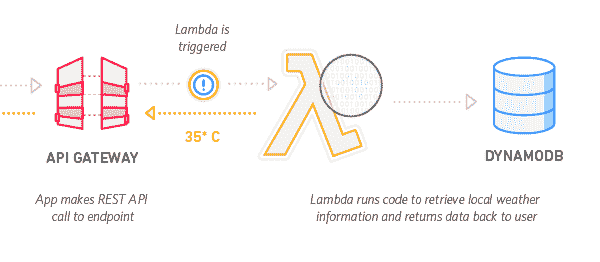
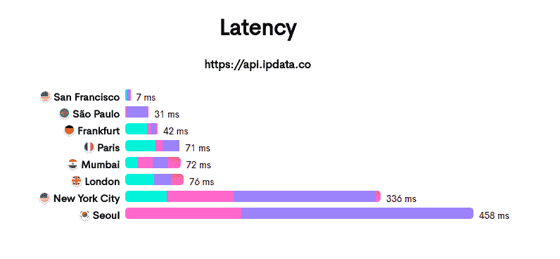
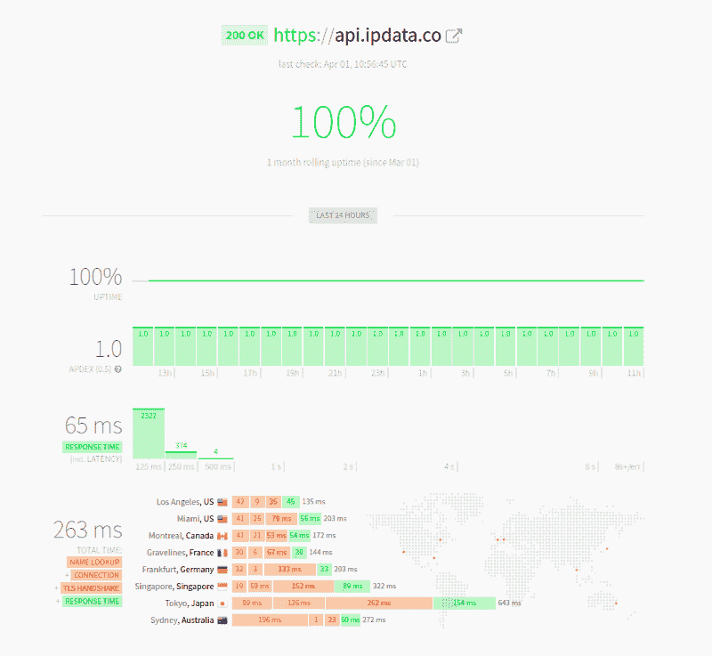

# 我们如何以每月 150 美元的价格为来自 10 个可扩展全球端点的 2500 万个 API 调用提供服务

> 原文：<https://www.freecodecamp.org/news/how-we-serve-25m-api-calls-from-10-scalable-global-endpoints-for-150-a-month-911002703280/>

乔纳森·科斯盖

# **我们如何以每月 150 美元的价格为来自 10 个可扩展全球端点的 2500 万次 API 调用提供服务**


我在去年的黑色星期五醒来，收到大量用户发来的电子邮件，报告来自 IP data API 的 503 个错误。

我们的用户通常在他们网站上的每个页面请求上调用我们的 API 来地理定位他们的用户和本地化他们的内容。所以这个特别的失败在今年最大的销售日直接影响了我们用户的网站。

那天我只失去了一个用户，但我差点失去更多。

这一系列事件及其令人费解的本质——CPU、内存和 I/O 都没有达到极限。考虑到我们的中断，以及对我们的扩展能力(如果有的话)的担忧，是对我们重新思考现有基础架构的一个重大警醒。

## 我们当时的技术水平


*   Japronto Python 框架
*   雷迪斯
*   AWS EC2 节点
*   AWS 弹性负载平衡器
*   Route53 基于延迟的路由

我已经对几个新的、有前途的 Python 微框架进行了测试。

在 aiohttp、sanic 和 japronto 之间进行选择之后，我使用[https://github . com/samuelcolvin/aiohttp-vs-sanic-vs-Japronto](https://github.com/samuelcolvin/aiohttp-vs-sanic-vs-japronto)对这三个平台进行了基准测试，发现它具有最高的吞吐量，于是我选择了 [Japronto](https://medium.freecodecamp.org/million-requests-per-second-with-python-95c137af319) 。

该 API 在 ELB 负载平衡器之后的 3 个区域中的 3 个 EC2 节点上运行，使用基于 Route53 延迟的路由将请求路由到离用户最近的区域，以确保低延迟。

## 选择新的技术组合



An Example Weather API using our current stack

大约在这个时候，我开始认真考虑将 API Gateway 与 AWS Lambda 结合使用，因为他们:

1.  有利的定价 API Gateway 大约每百万美元 3.50 美元，AWS Lambda 大约每百万美元 0.20 美元。
2.  无限的规模和高吞吐量 API Gateway 的帐户限制是每秒 10，000 个请求或每天大约 8.64 亿个调用。通过打开支持请求可以取消的限制。

这也使得在众多 AWS 地区部署终端，为全球所有用户提供低延迟变得经济可行。

## 设计基于多区域 API 网关的 API

要实现这一点，需要解决许多架构上的挑战。

1.  每个区域中的每个 Lambda 函数都需要能够在同一区域的数据库中查找使用数据，以最大限度地减少延迟
2.  我需要找出一种方法来确定每个 IP 地址、Referer 和 API 键调用 API 的次数。
3.  一种同步所有地区使用数据的方法。例如，如果 Route53 向我们的悉尼端点发送了 10，000 个请求，然后决定向我们的首尔端点发送下一个 50，000 个请求(取决于在那个时间点哪个端点具有最少的网络延迟)。每个 lambda 函数都需要知道用户总共发出了 60，000 个请求，才能正确处理速率限制。
4.  授权- API 网关提供使用计划和 API 密钥生成，并允许您将 API 密钥链接到使用计划。还有一个额外的好处，那就是你不会因为用户超过限额的请求而被收费。然而，我不能使用这一点，因为它对我来说很重要，提供一个没有注册，没有信用卡免费层。

通过大量的工作，我能够用创造性的方法解决这些问题。

## 本地访问使用数据(对于每个 Lambda 函数)

显而易见的解决方案是使用 DynamoDB，它规模大、速度快、成本低，而且每月前 2 亿个请求是免费的。

DynamoDB 还提供了 1 - 2 毫秒的持续低读取延迟。


而这可以用 [DynamoDB 加速器](https://aws.amazon.com/dynamodb/dax/) (DAX)加速到微秒范围。

> DAX 将性能提升到一个新的水平，响应时间以微秒计，并为读取密集型工作负载提供每秒数百万次的请求。

## 收集所有标识符的使用数据

下一个挑战是如何实时统计每个 IP 地址、Referer 或 API 键的请求数量。

最简单、最直接的方法是在每次调用时更新 DynamoDB 表中的计数。

然而，这将在每次调用我们的 API 时引入数据库写入，从而潜在地引入显著的延迟。

我找到了一个简单而优雅的解决方案:

1.  首先，打印一个日志(一个 JSON 对象),其中包含每个请求的所有请求标识符。即 IP 地址、引用地址和 API 密钥(如果存在)。真的只是；

```
print(event)
```

1.  在每个区域的每个 Lambda 函数的 Cloudwatch 日志流中添加一个 [Cloudwatch 订阅过滤器](https://docs.aws.amazon.com/AmazonCloudWatch/latest/logs/Subscriptions.html)并将所有日志推送到一个 Kinesis 流中。这将允许我在一个中心位置处理来自每个区域的日志事件。我选择 Kinesis 而不是 SQS(亚马逊的简单队列服务)，因为它能够回放事件。消费者一阅读，SQS 就删除该事件。我希望能够从节点故障和数据丢失中恢复。
2.  从 Kinesis 流中读取并使用使用数据更新本地 DynamoDB 实例
3.  使用 [DynamoDB 跨区域复制库](https://github.com/awslabs/dynamodb-cross-region-library)将所有更改从我的本地 DynamoDB 实例实时传输到所有区域的所有表中。

## 认证请求

我通过在注册时将密钥复制到每个区域来处理这个问题，这样无论用户点击哪个端点，他们点击的 Lambda 函数都可以在一毫秒内通过检查同一区域内的本地 DynamoDB 表来验证他们的密钥。它还存储用户的计划配额，并可以在一次读取中验证密钥，如果存在，则获取计划配额以比较使用情况，并确定是接受还是拒绝请求。

## 情况如何

如今，我们每月提供 2500 万次 API 调用，每天约 100 万次。

其中大多数在 30 毫秒内完成，提供了业界最快的基于 SSL 的 IP 地理位置查找。

#### [超平 io](https://hyperping.io/)



### [我们的状态页面](https://status.ipdata.co)



延迟几乎是开发人员不愿使用第三方 API 进行 GeoIP 查找的最大原因。

然而，我们的低延迟和冗余的全球基础设施正在慢慢吸引大型企业使用我们的服务。

## 费用


A breakdown of our costs

## 课程

1.  CloudWatch 的成本高得惊人，而且不是日志存储。我们只存储 24 小时的 CloudWatch 日志。警报、指标和 CloudWatch 请求真的可以累加。
2.  在 API Gateway 上，您收到的请求越多，延迟就越低，因为冷启动次数越少，因此我看到在我们最繁忙的地区(法兰克福)延迟低至 17 毫秒，在我们不太繁忙的地区(如悉尼)延迟低至 40 毫秒。
3.  DynamoDB 速度快，花费比你想象的要少(也可能不是)。看一看[https://segment.com/blog/the-million-dollar-eng-problem/](https://segment.com/blog/the-million-dollar-eng-problem/)。我最初以为我会按照我所调配的读容量单元(rcu)和写容量单元(wcu)的数量收费。但是，似乎只按使用计费，因此，如果您提供 1000 个 rcu 和 1000 个 wcu，但只使用 5 个 rcu 和 wcu，您将只为您的使用付费。DynamoDB 定价的这一方面一开始让我有点难以理解。
4.  增加你的 Lambda RAM 可以使你的执行时间减半，并使响应时间更加一致(同时使你的成本加倍！)
5.  Kinesis 已被证明在高吞吐量下非常可靠。几乎实时地转发我们所有的日志事件进行处理。
6.  本地 DynamoDB 只受您的系统资源的限制，这使得它非常适合运行表扫描或查询(例如在生成报告时)，否则在 AWS 的 DynamoDB 上执行这些操作会很昂贵。请记住，本地 DynamoDB 实际上只是围绕 SQLite 的 Dynamo 包装。？对于我们的用例来说，它很有用，也很方便，但对您来说可能不是这样。

## 笔记

*   AWS 去年在 Re:invent 上宣布了 DynamoDB 全局表，它将所有表中的所有写操作跨区域相互同步。我们目前没有转移到这一点，因为它只在 5 个地区可用。
*   Amazon 还在 Amazon API Gateway 中引入了`REQUEST`类型的定制授权器。这可能允许您通过 IP 地址以及任何标头、查询或路径参数来限制速率。

在[highscalability.com](http://highscalability.com)博客上阅读更多现实生活中的建筑。

#### **更新:**

查看我们对 8 个最佳 IP 地理定位 API 的详细分析。