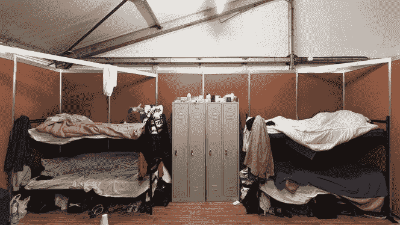
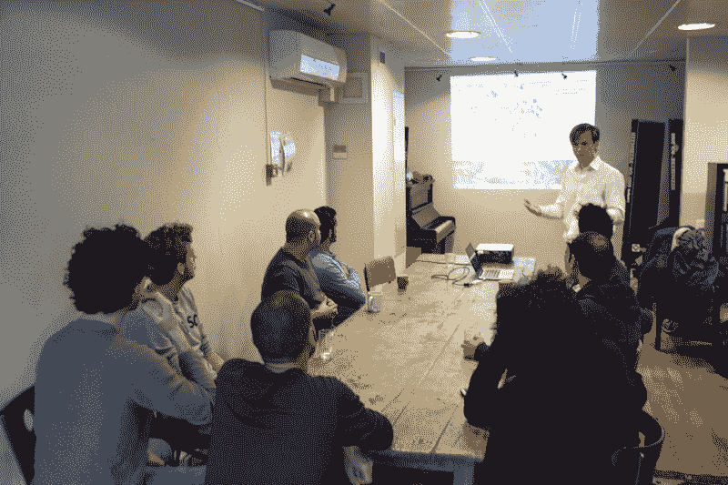
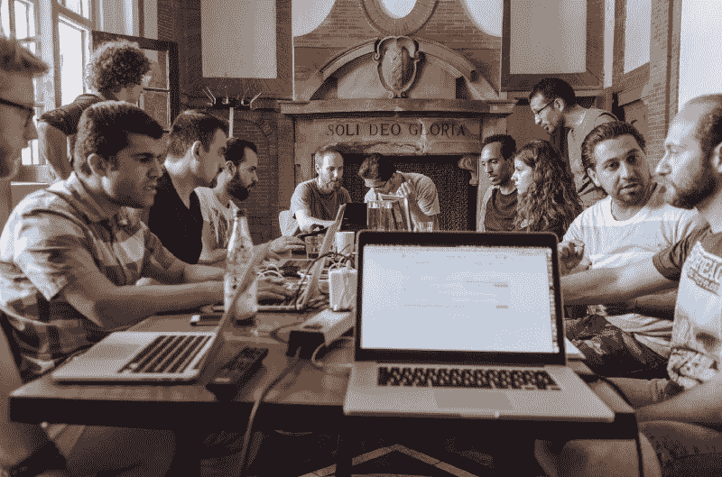
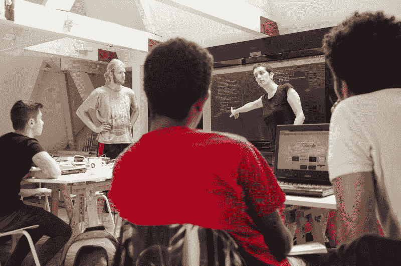
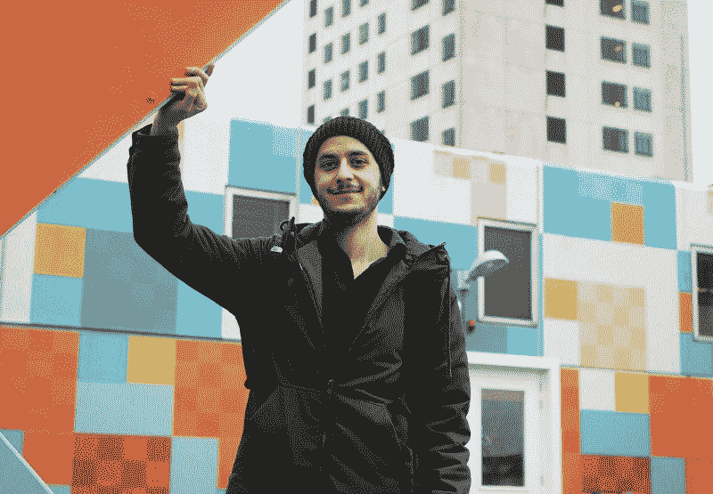

# 我们如何教几十个难民编码，然后帮助他们找到开发人员的工作

> 原文：<https://www.freecodecamp.org/news/how-we-taught-dozens-of-refugees-to-code-then-helped-them-get-developer-jobs-fd37036c13b0/>

作者 Gijs Corstens

# 我们如何教几十个难民编码，然后帮助他们找到开发人员的工作

A typical room in a refugee camp in the Netherlands. Living with 8 people in one room with cardboard walls.

2015 年和 2016 年，超过 200 万人逃离祖国，前往欧洲寻求庇护。欧洲根本没有准备好接纳这些人，荷兰也不例外。

当大批人开始申请庇护时，他们不得不在难民营中等待长达 18 个月的庇护决定。在这段等待的时间里，他们基本上无事可做。他们经常被安置在一个不知名的营地里。所以他们不得不消磨时间。很多时间。

我认为这是一个巨大的机会浪费，因为一般来说，难民必须采取很多步骤才能成为社会的一部分。他们必须学习语言。他们还必须为就业市场做好准备。

过去几代在荷兰的难民经常从事远低于他们潜力的工作。许多人(45%)最终接受了福利救济。出现这种情况有各种原因，但主要是因为他们缺乏一个专业的网络，因此，没有多少真正的就业机会。

事实并不美好。

结果，我的同胞中很大一部分人开始反移民，极右翼政党成为民调中最大的政党。

在我看来，移民本身既不是积极的也不是消极的。这是关于你作为一个社会如何努力使移民工作。

是时候做出努力了。

我们看到的机会如下:为什么不在难民们在难民营等待的时候教他们开发网站呢？这样，一旦他们获得庇护，他们将拥有急需的技能，他们可以转身用这些技能去找工作。

通过这种方式，荷兰获得了我们公司急需的开发人员，难民也能够养活自己和家人。这是一个双赢的结果。

所以我们开始了。我们创立了我们的“难民编码学校” [HackYourFuture](http://hackyourfuture.net/) 。我们从全国各地的难民营中挑选了五名积极性很高的难民，邀请他们每周日去阿姆斯特丹上课。我们找到了一些志愿者老师，用[免费代码营](http://freecodecamp.com)作为我们的课程。

我们还没有计划好一切，但我们想尽快开始，看看这个想法是否有潜力。

Our first class ever. Here I’m trying to motivate the students.

从我们的第一堂课开始，我们就知道我们在做一些特别的事情。

事实证明，学生们的积极性非常高，他们在很短的时间内就在技能上取得了巨大的进步。

尽管他们生活在难民营原始而混乱的环境中——并且在过去的一年里经历了可怕的事情——他们有毅力在我们非常紧张的项目中做得很好。

教这些人是鼓舞人心的，也是真正值得的，因为学生们在听我们谈论编程的每一个词。

作为老师，我们也发现教授你热爱并擅长的东西是多么有趣。所以我们决定建立另一个班级。然后又是一个。然后又是一个。

Our fourth class during our weekly session.

六个月后，我们的第一批学生毕业了。我们利用我们的网络帮助他们在不同的公司找到实习和工作。

虽然我们班的一些学生退学了，但是那些留下来的学生已经极大地改善了他们的生活。他们中的许多人不再认为自己是难民，而开始将自己视为开发者。

从那时起，我们已经成长了不少。自 2016 年 1 月以来，我们的项目已经接收了 100 多名学生。他们中大约有一半仍在我们这里学习，我们的 28 名校友已经在全国各地的公司找到了工作或实习机会。我们还在丹麦哥本哈根和英国伦敦(后更名为 CodeYourFuture)启动了 [HackYourFuture。](https://www.facebook.com/hackyourfuturecopenhagen/)

与此同时，我们的志愿教师队伍已经发展到大约 40 人，他们来自世界各地，包括难民自己。

对于我们的老师来说，教学已经变成了利他主义的混合体，做你喜欢的事情，并遇到许多志同道合的开发者。但是我们教书的最重要的原因是我们关心我们的学生。

One of our classes working on Angular.js

以我们的学生 Sarea 为例。自 2015 年 10 月以来，他一直在各个难民营，逃离饱受战争蹂躏的叙利亚。他被迫抛下一切:工作、家庭，甚至妻子。

Our student Sarea, who built an app that helps people find organizations that support people below the poverty line.

当 Sarea 开始我们的课程时，他的英语很差，但他仍然通过令人难以置信的努力来跟上课程。完成我们的项目后，他设法在 De Bijenkorf 找到了一份前端开发人员的实习工作。

在业余时间，Sarea 开发了一个 web 应用程序,让阿姆斯特丹的穷人能够在与贫困相关的支持组织的迷宫中导航。他的应用程序对许多人的日常生活很有帮助，并最终出现在[两家主要](https://www.nrc.nl/nieuws/2017/02/24/vluchteling-helpt-arme-amsterdammer-6967963-a1547351) [报纸](http://www.parool.nl/amsterdam/app-helpt-amsterdammer-door-wirwar-van-armoederegelingen~a4481502/)上。现在每个月都有成千上万的人使用他的应用。

看着一个人从一个需要帮助的位置成长到一个同样的人正在帮助其他需要帮助的人的位置，是我有过的最有价值的经历之一。

我相信教别人编程是你能给的最有价值的礼物之一，因为你能让别人帮助自己，独立于他人。

说到底，大多数难民只是想重获独立。他们的生活在政府和陌生人手中已经太久了。

管理这所学校并不容易。我们还有很多东西要学。但是和我们的学生一起工作是绝对的荣誉。我对他们的未来寄予厚望。他们确实是我们的老师把大部分星期天的时间花在教学上的原因。

如果你有兴趣帮助其他人学习如何编码，请随意使用我们开发的开源课程。它是许多不同编码资源的集合，结合了我们自己的材料和练习。