# 我们如何更新入职体验并获得更多用户

> 原文：<https://www.freecodecamp.org/news/how-we-updated-our-onboarding-experience-and-got-more-users-b0cd353677d6/>

威廉·伍德黑德

# 我们如何更新入职体验并获得更多用户

#### 我们用来提高转化率 60%的方法

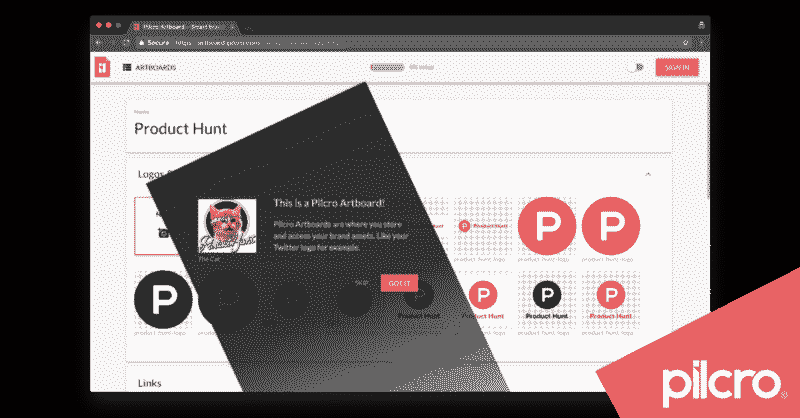

Pilcro Artboard — User Onboarding

作为一名产品设计师和开发人员，我花了很多时间思考成功的用户入门体验的要素。这是一个艰难的过程，对良好的转化至关重要，但往往被忽视。

在这篇文章中，我将描述我们所经历的过程(在开发我们的[品牌管理软件](https://www.pilcro.com)时)，以便您可以将我们学到的经验应用到您自己的用户入职流程中。

为什么要听我的？我们最近在推出用户入职流程后，我们的整体登录转化率增长了 60%，这是我们在产品搜索上的[产品发布](https://www.pilcro.com/blog/pilcro-is-on-product-hunt)的一部分。以下是 [Jonathan Price](https://www.linkedin.com/in/jvprice) 在发布会当天的发言:

> “以产品搜寻为主题的登录页面非常出色——可能是我见过的最完美的产品搜寻发布。伟大的作品。”

### 那么什么是用户入职？

这是 trychameleon 的一个定义:

> “用户入门是主动引导用户在你的产品中发现新价值的系统。”

所以这一切都是为了向你的用户传达有价值的特性。

但是这些用户是谁呢？他们是第一次使用吗？他们是重新使用你的产品的新用户吗？

而“价值”是什么意思？用户可能看重的功能？你可能重视的用户行为？登录或订阅？

很明显，用户入职不是一项简单的 UX 任务。

我们有多种用户类型和多种我们认为用户会觉得有价值的特性。我们如何理解这一切？我们如何有效地传达产品的价值？那么，我们向用户展示功能实际上是想达到什么目的呢？

### 第一步—审核您的用户旅程

这似乎是显而易见的，但第一步是弄清楚新用户和现有用户如何通过你的应用。每个人都有一个旅程，还是有多条不同的道路？

我们在大会[的帮助下完成了这一步](https://generalassemb.ly/?ref=pilcro) UX 的学生利用用户测试来了解新用户第一次使用我们的应用的体验。该流程还帮助我们将用户分为三种不同的用户类型:

*   前 20 秒
*   第一次会议
*   第一个月

在这个过程的最后，我们对用户如何使用我们的应用程序有了更好的理解。但是我们仍然不知道我们想要向他们传达什么样的价值，或者最终目标是什么。

### 介绍神奇时刻

在我们对用户入职的困惑中，我们看到了这个视频。它讲述了脸书如何设计他们的用户旅程，让用户到达“神奇的时刻”。

神奇的时刻是当用户突然明白你的产品真正的核心价值是什么。是用户“得到”的那一刻。对脸书来说，是当你看到你一个朋友的照片时。

对我们 Pilcro 来说，我们意识到我们的神奇时刻是用户第一次复制品牌资产。这是他们真正理解为什么他们应该使用 Pilcro 的时候。

考虑到这个神奇的时刻，我们设计了这张桌子来帮助整理我们的思绪。

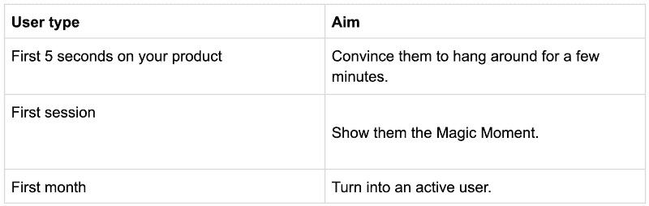

然后，我们试图将这些相同的目标映射到实现它们的可能策略上。

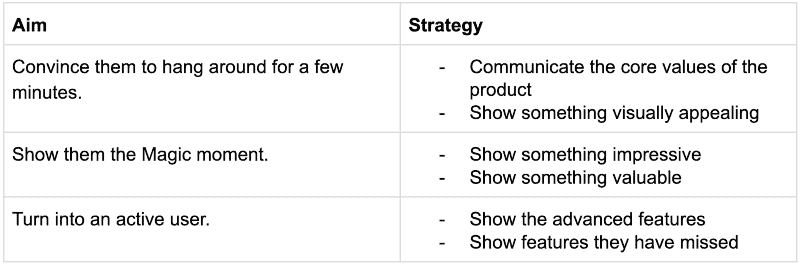

在这一点上，我们有一些实现目标的策略。是时候看看我们可以使用哪些可视化的 Onboarding 组件了——我们可以从用户 Onboarding locker 中拿出哪些工具和技巧来实现这一切。

### 用户入职选项

在所有的分析之后，用户入职仍然归结于编写一些向用户传达价值的 UI 组件。那么这些 UI 组件是什么呢？应用开发者和 UX 设计师有哪些选择？

当然，用户入门组件有无限多的选项，但这里有一个我们最喜欢的简明列表，包含来自其他应用程序的用户入门示例图片。

#### 模型

占据整个屏幕，迫使用户停下脚步，向他们展示一些有用的东西。

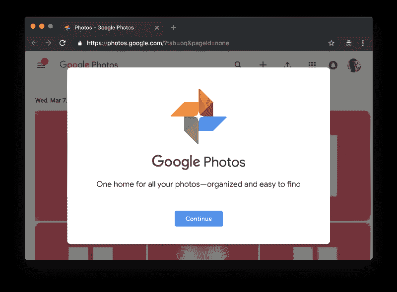

The Google Photos Welcome Modal

#### 上下文弹出窗口

用户何时何地需要信息。工具提示是最常见的例子:

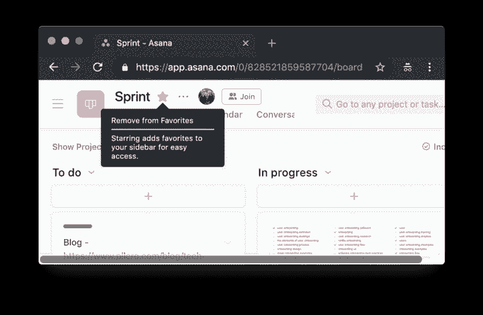

Asana Tooltip

#### 真空

在应用程序的用户界面中使用空列表和网格来显示有用的提示和行动号召。

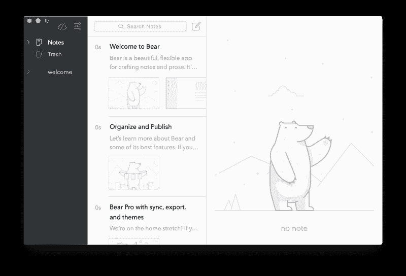

Bear app — smart empty space

#### 进度指示器

显示用户表现的指示器。这可以持续到用户使用你的产品的整个生命周期，并且可以游戏化。

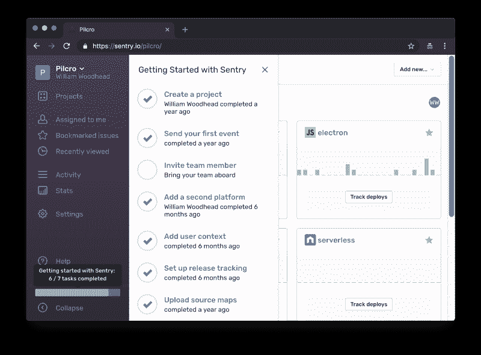

Sentry setup progress indicator

考虑到这些选项，我们绘制了此表，以找出哪些用户入职选项最适合哪些用户类型以及原因。绿色方块最适合，而红色方块不适合。

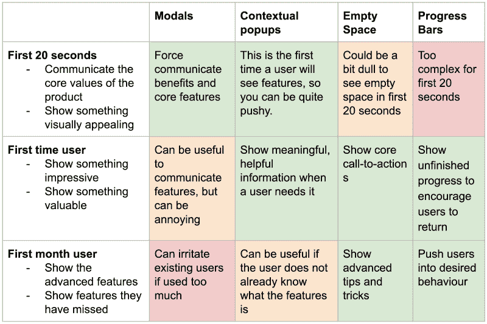

此时，我们已经准备好了拼图的所有部分。

1.  我们已经确定了不同的用户类型。
2.  我们已经确定了用于我们的用户类型的策略。
3.  我们已经确定了实现这些策略的 UI 组件。

是时候把所有的东西放在一起了。

### 那么我们实际上做了什么？

#### 用户利益模型

*   仅在第一次就诊时
*   传达应用程序的一些核心用户优势。
*   **目的** —让用户留下来。

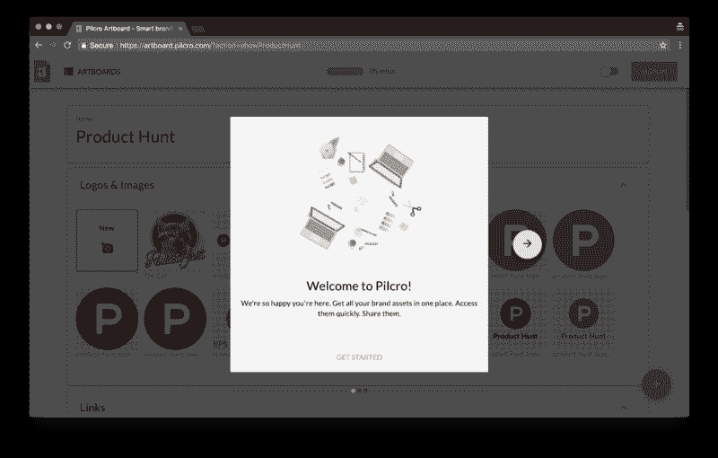

User benefits slideshow

#### 上下文弹出窗口

*   让用户很快熟悉界面
*   向他们展示最重要的功能和按钮。
*   产品搜索主题为产品搜索的访问者提供一些视觉上的一致性。
*   **目的** —让用户享受神奇时刻

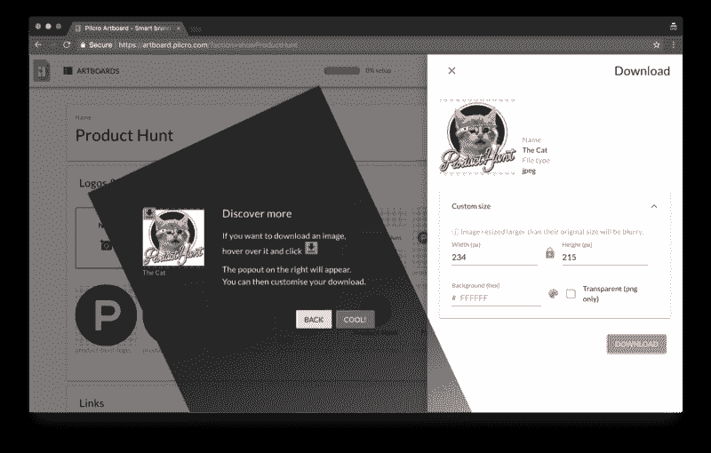

Contextual popups — the swoosh

#### 巧妙利用闲置空间

*   在没有内容的地方显示行动号召
*   **目的** —永远不要把用户留在流程之外

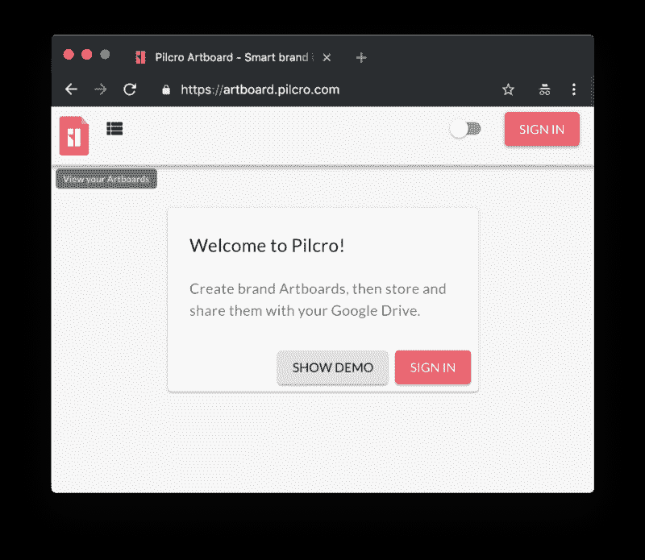

Pilcro’s empty space call to actions

#### 进度指示器

*   向用户显示他们的“超级用户”程度的百分比栏。
*   **目的** —推动用户按照我们希望的方式行事。

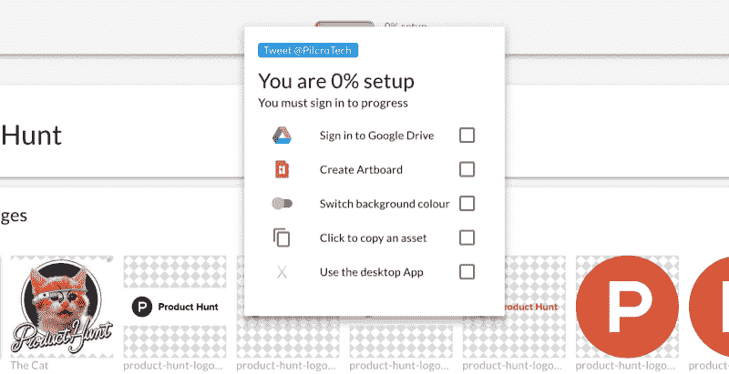

Progress indicator in %

### 数字不会说谎

我们如何知道用户入门设计有效？这是统计数据。

在部署新用户入职后的一周内，我们从网站到产品的转化增加了一倍多。

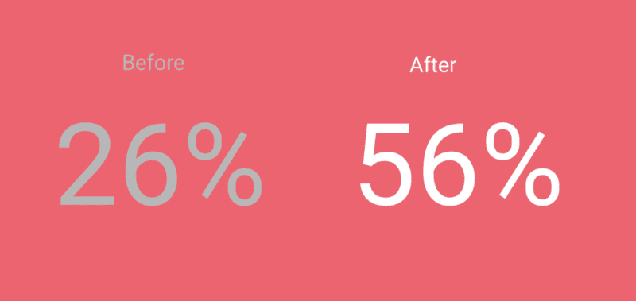

Conversions to the product

我们的整体转化率增长了 60%。

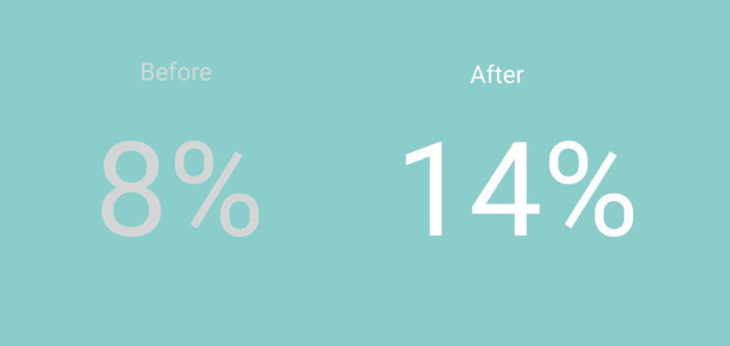

诚然，发布有助于这些统计数据，因为我们的产品周围有更多的嗡嗡声。但新用户的加入无疑对发布的成功起到了至关重要的作用。

### 事后反思—为什么用户入职如此困难？

*   产品拥有者离产品太近。产品所有者怎么可能知道第一次体验他们的产品是什么感觉？
*   不同的用户在产品的不同部分发现价值。所以引导他们找到价值，并不是所有用户都共享的线性旅程。不同的用户可能有不同的神奇时刻。
*   不同的用户会有不同的行为，并以不同的方式浏览你的产品。有些用户喜欢在着手开发新产品时被人牵着手，有些用户则喜欢一头扎进去到处玩。你如何打造满足所有不同用户入职需求的 UX 体验？
*   不同的用户对你的产品有不同的认识。那么，你如何知道该给某人多少信息呢？
*   打造良好的用户入门体验背后的技术通常非常复杂，因为它需要向您的应用程序添加一个全新的视觉层。

用户入门是一个复杂的挑战，因为你必须处理不同用户、功能、目标和行为的矩阵。然而，如果你以正确的方式接近它，你可以让你的应用程序真正为你的新用户发光。祝你好运！

### 亲自体验一下

点击[此链接](https://artboard.pilcro.com/)查看我们的用户入职信息。让我们知道你的想法！

Pilcro 为 G-Suite 提供免费的品牌管理软件。