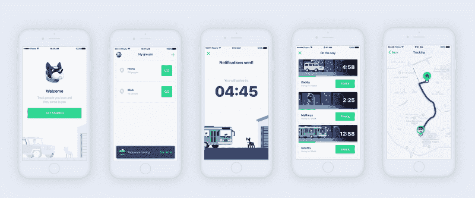
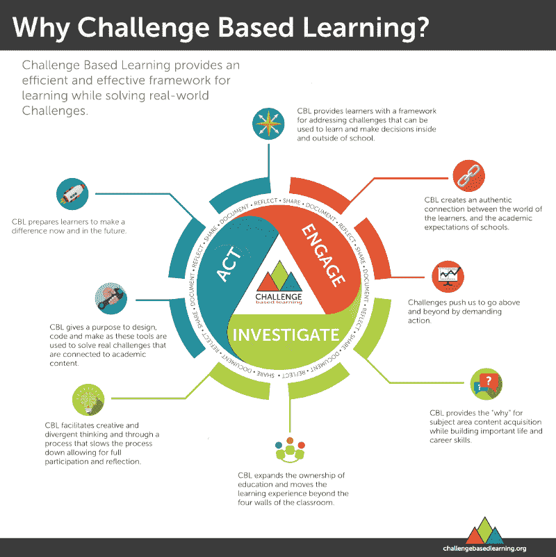
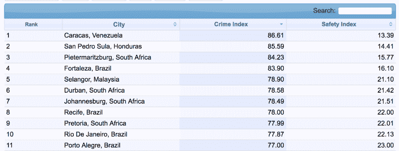

# 我们如何使用苹果的学习框架来创建我们的第一个应用程序

> 原文：<https://www.freecodecamp.org/news/how-we-used-apples-learning-framework-to-create-our-first-app-91e255b55f03/>

约纳塔·科雷亚

# **我们如何使用苹果的学习框架创建我们的第一款应用**

Link for the app: [https://goo.gl/CUK8oz](https://goo.gl/CUK8oz)

经过一个月的工作，我和我的团队完成了我们的 tracker iOS 应用程序 Echo 的第一个版本。我们建造它是因为基于挑战的学习(CBL)方法创造了一个挑战，这是一次很棒的经历。

我们的应用程序允许用户与他们爱的人分享他们的位置，并让这些人在回家时实时跟踪他们的位置。这样，每个人都可以作为监护人，总是知道发生了什么，并在必要时采取行动。这是一个简单的想法，旨在帮助我们社区的人们。

我想分享什么是 CBL，以及它如何帮助我们构思、制作原型、发布或解决方案，这样其他人也可以使用这种技术来创建令人敬畏的项目。

### CBL 是什么？

> “基于挑战的学习(CBL)为解决现实世界的挑战提供了一个高效的学习框架。 *该框架由教育、媒体、技术、娱乐、休闲、工作场所和社会领域的创新实践提供信息— [数字承诺](http://cbl.digitalpromise.org/about/)*

今天的学生必须在以内容为中心的课堂中解决问题，但这些问题通常缺乏真实世界的背景。当学生看不到他们所学的东西和现实世界之间的联系时，他们很难感到投入。这就是 CBL 的用武之地。

CBL 是一个学习框架，帮助学生通过解决现实世界的问题和生成解决方案来帮助他们的社区。你学到的知识是你永远不会忘记的，CBL 让你在学习的过程中享受乐趣。最重要的是，它能吸引学生。

该框架来自苹果公司创建的一个教育项目，已经在世界各地进行了测试。它提供了同时学习和解决问题的更好的方法。

它是灵活的、可定制的和可扩展的。你可以用它来学习几乎任何东西，并提高你的项目实际上符合真实的人的真实需求的机会。

### 它如何使过程变得更容易？

对我们来说，CBL 是一个坚实的基础，我们的团队可以有一些想法，发展它，并在必要时抛弃它。在我们看来，这是最好的学习方式，也是参与和联系你正在研究的主题的最好方式。

学习和创造东西可能非常困难。基于挑战的学习通过提供必要的工具来引导你完成从原始想法到最终产品的步骤，从而使学习变得更加容易。

### 它是如何工作的？

该框架有 3 个阶段:参与、调查和行动。每个阶段都为下一个阶段奠定了基础。在这个过程的最后，你将从一个宏大的意识形态的想法变成一个最终的有用的解决方案。

### 参与:

第一阶段是最重要的阶段。这是你集思广益的地方，从一个叫做大想法的抽象概念到一个可行的挑战。这个阶段由 3 个步骤组成:**大想法、基本问题**和**挑战**

你必须定义你将与哪个**大创意**一起工作。它必须是一个广泛的概念，可以通过多种方式进行探索。对你和更大的社区有意义的每一个话题都可以是一个伟大的想法。一些例子是:关系、健康、安全、编程、学习和政治。重要的是选择一个你和你的团队关心的话题，你能与之相关并感觉你能做些什么。你越喜欢你的大创意，就越容易学习、享受乐趣，并创造出有用且有意义的解决方案。

我们选择了家庭安全。因为我们的家乡现在是世界上第 11 个最危险的城市，这是一个非常能引起我们共鸣的话题。

[Source](https://www.numbeo.com/crime/in/Porto-Alegre)

选择好你的大想法后，通过使用**基本问题**过程，把它分解成一个可行的挑战。大创意必须产生关于该领域问题和需求的各种各样的问题。

你和你的团队必须开始就这个问题提问并做笔记。从这些问题中，你将选择一个对小组意义重大的问题。这将是你的**基本问题。**

本质问题必须是你的生活和大想法之间的联系。这个问题需要具有挑衅性，并且必须鼓励研究来回答它。

一些基本问题及其主要观点的例子如下:

*   安全:人们到达或离开家的感觉如何？(用于 Echo)
*   **健康:**什么是健康的生活方式？
*   **经济:**高中或大学毕业对经济有何影响？
*   **气候变化:**我使用化石燃料对我的星球有什么影响？

下一步是通过挑战小组创造全球问题的本地解决方案，将基本问题转化为行动号召。结果是你将面临挑战。你必须知道你所学到的将是你所选择的挑战的结果，而不是相反。关注引导你选择挑战的过程是很重要的。

挑战有两个方面是很重要的:离家近，但有更大的意义。例如，我们的挑战是:*为每个人创造一个更安全的家庭环境*。正如您所看到的，这一挑战离我们很近，并且具有全球吸引力。这样你就有了个人意义和更大的目标感。

> “如果挑战过于宽泛或模糊，学生将会不知所措。如果范围太窄，他们将无法充分体验自我指导，而自我指导是开发基于挑战的学习所培养的技能所必需的。”— [数字承诺](http://cbl.digitalpromise.org/about/)

挑战的一些例子是:

*   气候变化:减少你的家族化石消耗。
*   **健康:**帮助你的朋友养成更健康的习惯。
*   **冲突:**提高你所在学校的容忍度。

接洽阶段以创建令人信服且可行的挑战陈述结束。

### 调查:

> “学习者计划并参与一个旅程，为解决方案打下基础，并满足学术要求。”— [数字承诺](http://cbl.digitalpromise.org/about/)

在调查阶段，我们会问问题、做研究并记录一切。这有助于我们更好地理解问题，并澄清我们对我们试图解决的挑战的想法。

这个阶段分为:

*   开发**引导性问题**
*   确定**活动和资源**来回答这些问题
*   和**研究分析**

如果挑战与某个特定领域相关(在我们的例子中是创建一个 iOS 应用程序)，那么在这个阶段，您必须协调这些利益，并尝试找到一种方法，利用您所从事领域的适用知识来创建解决方案。

**引导性问题:**

一旦你的小组确定了挑战，你必须提出问题，包括小组需要学习的一切，以制定应对挑战的解决方案。团队的每一个需求和每一个疑问都必须作为引导性问题写下来。这个想法是找到你必须知道什么来解决挑战所定义的问题。与水相关的挑战的一些引导性问题示例如下:

*   我们如何使用水？
*   我们用了多少水？
*   水是怎么浪费的？
*   浪费了多少水？

你的问题列表越大越好。永远不要认为某事是理所当然的。像“*水从哪里来”这样明显而基本的问题*通常是产生最佳想法的人。

头脑风暴你所知道的关于你的挑战和你仍然需要发现的一切。这是启动你的引导性问题的好方法。

**活动&资源:**

你必须研究你的引导性问题，并决定使用哪种资源或活动来回答这个问题。找到指导活动的一个好方法是创建一个三列矩阵，第一列是指导问题，第二列是相关活动/资源。完成活动后，将结果放在第三栏。

指导资源的例子包括:在线内容和课程、数据库、教科书和社交网络。

**指导活动**的例子包括:模拟、实验、项目、习题集、研究和游戏。

**分析:**

一旦你有了结果，就该分析积累的数据并确定主题了。当我们建造 Echo 的时候，这个阶段让我们意识到一些有趣的事情:人们害怕在进出他们的家时受到攻击。这就是我们需要解决的问题，我们必须创造一种解决方案，让人们可以更安全地进出他们的家，让他们的朋友知道他们要去哪里，何时到达。

### 行动:

> *“在 Act 阶段，基于证据的解决方案由真实的受众开发和实施，并对结果进行评估。学习者将有所作为的愿望与对内容掌握的展示结合在一起。”— [数字承诺](http://cbl.digitalpromise.org/about/)*

一旦完成调查阶段，您将有一个坚实的基础来开始开发您的解决方案概念。从现在开始，你必须尽你所能创造出最好的解决方案来帮助解决你所选择的挑战。这个阶段有 3 个部分。**解决**、**实施**和**评估**。

**解决方案**部分是您分析调查阶段生成的数据，以找到单一解决方案来绘制草图和制作原型。不要害怕考虑很多解决方案，扔掉很多。重要的是找到符合挑战需要和团队兴趣的东西。

确定您的解决方案后，您必须实施它。这个阶段随着项目的不同而不同，但是你所要做的就是将你定义的解决方案变成现实。

现在你有了可行的解决方案，下一步是**通过定义一些关键点来评估**结果，并回顾过程，反思什么可行，什么不可行。

### 不断学习

这里我给了你 CBL 的概要。但如果你想更深入地研究(这是我推荐的)，这里有一些我用作参考的链接:

*   [CBL 白皮书](http://cbl.digitalpromise.org/wp-content/uploads/sites/7/2016/12/CBL_Paper_2008.pdf)
*   [苹果课堂指南](http://cbl.digitalpromise.org/2016/08/30/challenge-based-learning-guide/)
*   [官网](http://cbl.digitalpromise.org)

### 感谢你的阅读

感谢您的宝贵时间！请随时联系我或我的任何队友。

*   开发者:[约纳塔·科雷亚](https://www.linkedin.com/in/jonata-correa-669183126/)，[古伊列梅·吉罗托](https://www.linkedin.com/in/guilherme-girotto-b90496133/)，[维克多·梅洛](https://www.linkedin.com/in/vsmelo/)
*   设计师:[【布鲁诺·干部】](https://www.linkedin.com/in/brunosartoriquadros/)、[【mathesos viana】](https://www.linkedin.com/in/matheus-fetzner-viana-02a822b3/)
*   链接下载回声:[https://goo.gl/CUK8oz](https://goo.gl/CUK8oz)