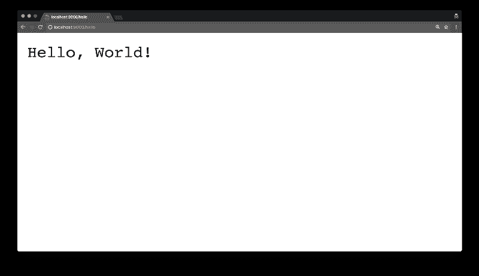

# 如何用 Scala 和 Akka HTTP 构建 Hello World API

> 原文：<https://www.freecodecamp.org/news/how-you-can-build-a-hello-world-api-with-scala-and-akka-http-55e2ff67d70d/>

米格尔·洛佩兹

# 如何用 Scala 和 Akka HTTP 构建 Hello World API

#### *没错，还是个东西。*


Photo by [Blake Connally](https://unsplash.com/photos/B3l0g6HLxr8?utm_source=unsplash&utm_medium=referral&utm_content=creditCopyText) on [Unsplash](https://unsplash.com/search/photos/code?utm_source=unsplash&utm_medium=referral&utm_content=creditCopyText)

Akka 是一个流行的基于 actor 的工具包，用于在 JVM 中构建并发和分布式应用程序。这些应用大多使用 Scala 或 Java。

它有几个模块可以帮助构建这样的应用程序，Akka HTTP 就是其中之一。

Akka HTTP 有客户端和服务器端的工具。在本教程中，我们将重点讨论服务器。

你应该熟悉 Scala，你应该已经安装了 SBT 和 IntelliJ。如果不是这样，请检查[正式文档](https://docs.scala-lang.org/getting-started-intellij-track/getting-started-with-scala-in-intellij.html)。

事不宜迟，让我们使用 Scala 和 Akka HTTP 构建一个 hello world API！

### 项目设置

随意克隆[回购](https://github.com/Codemunity/akkahttp-quickstart)，确保你使用的是分支`2.1-review-project`。

如果没有，我们将使用 sbt `1.1.6`和 Scala `2.12.6`。检查您的`build.properties`和`build.sbt`文件，确保那里的版本与这些匹配。

让我们从添加所需的依赖项开始。因为 Akka HTTP 依赖于 actors 和流，所以我们也需要添加那些库。

在您的`build.sbt`文件末尾添加以下代码片段:

```
libraryDependencies ++= Seq(  "com.typesafe.akka" %% "akka-actor" % "2.5.13",  "com.typesafe.akka" %% "akka-stream" % "2.5.13",  "com.typesafe.akka" %% "akka-http" % "10.1.3",)
```

如果系统提示您启用自动导入，请启用。否则你可以打开一个终端并`cd`进入你项目的根目录。然后运行`sbt update`来获取依赖项。

自动导入将确保在每次更新某些文件时更新您的项目，包括`build.sbt`文件。

### 实例化依赖关系

让我们在“src/main/scala”下创建一个名为`Server`的 Scala 对象。我们将从实例化使用 Akka HTTP 创建服务器所需的依赖项开始。

首先，对象将扩展`App`特征:

```
object Server extends App {}
```

这将允许我们的`Server`对象可运行。

我们将需要一个主机和一个端口来绑定服务器，所以让我们现在添加它们:

```
val host = "0.0.0.0"val port = 9000
```

因为 Akka HTTP 使用 Akka actors 和底层流，所以我们还需要提供它们的依赖关系:

```
implicit val system: ActorSystem = ActorSystem("helloworld")implicit val executor: ExecutionContext = system.dispatcherimplicit val materializer: ActorMaterializer = ActorMaterializer()
```

即使你不需要知道他们做什么来开始开发 Akka HTTP 应用程序，知道他们是做什么的总是好的。

一个`ActorSystem`用来管理演员。它用于创建和查找它们。同一系统中的参与者通常共享相同的配置。

`ExecutionContext`负责执行`Future`。它知道应该在哪里以及如何执行它们，例如在线程池中。

最后，一个`ActorMaterializer`负责运行流。

完成后，我们就可以创建我们的 hello 路由了！

### 创建路线

为了创建我们的路由，我们将使用 Akka HTTP 的路由 DSL。它基于所谓的指令的“层”。总体而言，请随意浏览他们的[官方文件](https://doc.akka.io/docs/akka-http/current/routing-dsl/overview.html)。

在依赖项下添加路由:

```
def route = path("hello") {  get {    complete("Hello, World!")  }}
```

我们有第一层，在这里我们尝试将传入请求的路径匹配为“/hello”。如果不匹配，它将被拒绝。

如果匹配，它将尝试匹配内部的“[指令](https://doc.akka.io/docs/akka-http/current/routing-dsl/directives/index.html)”。在我们的例子中，我们匹配 GET 请求。我们用“Hello，World”消息完成请求/响应循环。

### 启动服务器

创建好路由后，我们需要做的就是启动服务器:

```
Http().bindAndHandle(route, host, port)
```

我们使用 Akka HTTP `Http`对象将路由绑定到给定的主机和端口。

要运行我们的`Server`对象，你可以右击它并点击*运行‘服务器’*。

给它几秒钟时间编译，然后进入浏览器。导航到`http://localhost:9000/hello`，你会看到我们的“你好，世界！”消息。



很酷，不是吗？

### 记录

在结束本教程之前，我们将为我们的服务器添加基本的日志记录。

您可能已经注意到，当我们运行我们的`Server`对象时，没有任何反馈。我们不知道它是成功还是失败。

我们只能假设它工作了，因为应用程序没有崩溃。

让我们给它添加一些日志。

如果你从`Http`对象研究`bindAndHandle`函数，它返回一个`ServerBinding`的未来。我们可以将一些日志钩入未来的`onComplete`功能。

让我们这样做:

```
val bindingFuture = Http().bindAndHandle(route, host, port)bindingFuture.onComplete {  case Success(serverBinding) =&gt; println(s"listening to ${serverBinding.localAddress}")  case Failure(error) => println(s"error: ${error.getMessage}")}
```

再次运行`Server`，这一次您应该会看到:

```
listening to /0:0:0:0:0:0:0:0:9000
```

### 包扎

虽然使用 Scala 和 Akka HTTP 不是开发 API 的最快方法，但它允许您集成其他 Akka 模块，如 actors、streams、clusters 等，从而更容易开发有弹性和可伸缩的系统。

话虽如此，但最好记住，使用 Scala 和/或 Akka 开发应用程序并不一定意味着它将具有弹性和可伸缩性。您仍然需要执行工作来完成它，但是这比使用其他技术要容易得多。

如果你喜欢 Akka HTTP，我们有一个免费的课程，可以帮助你快速开始使用它开发 API。您将为 Todo 应用程序构建一个 API，一步一步地解释。看看吧！？？

[**Akka HTTP 快速入门**](http://link.codemunity.io/hw-akka-http-quickstart-course)
[*在这个免费课程中学习如何用 Akka HTTP 创建 web 应用程序和 API！*link . codecommunity . io](http://link.codemunity.io/hw-akka-http-quickstart-course)