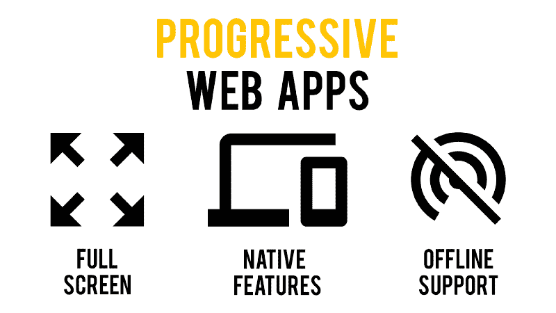

# 如何开发像本地移动应用一样的渐进式网络应用

> 原文：<https://www.freecodecamp.org/news/how-you-can-develop-progressive-web-apps-that-feel-native-5110fbbcbf4b/>

由 samuele dassatti

# 如何开发像本地移动应用一样的渐进式网络应用

我目前正在开发一个渐进式 Web 应用程序，它也将作为我下一个服务的原生应用程序。

众所周知，**pwa 是可以在浏览器或独立窗口中运行的应用，可以利用操作系统固有的特性**，例如推送通知和离线工作能力。