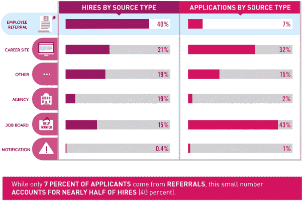
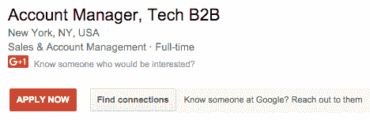
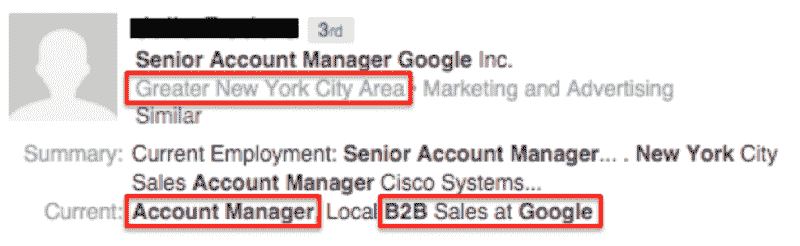
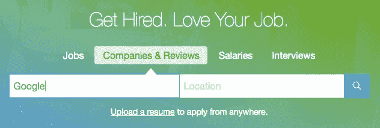
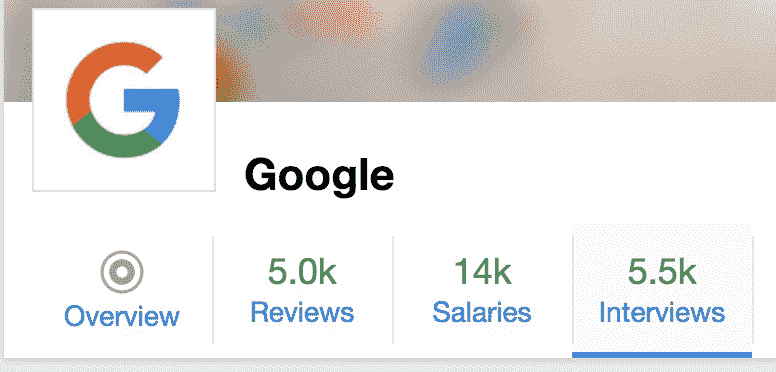
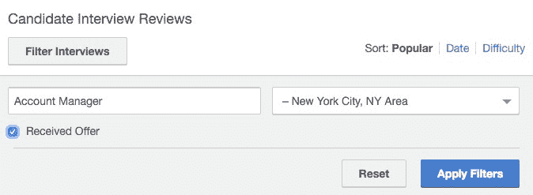
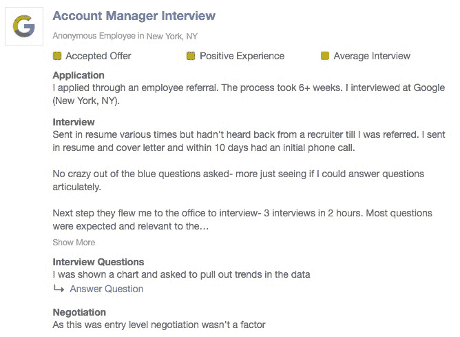

# 如何在没有人脉的情况下获得一份 6 位数的科技工作——这些建议让我获得了谷歌和其他科技巨头的工作邀请

> 原文：<https://www.freecodecamp.org/news/how-you-can-land-a-6-figure-job-in-tech-with-no-connections-6eed0de26ea4/>

大学毕业后不久，我开始追逐许多人想要但很少有人得到的东西:一份他们热爱的工作。

我毕业时获得了生物学学位，并在医学领域找到了一份工作。我花了大约两个星期才意识到我绝对讨厌它。

我一周工作 6 天，凌晨 3:30 起床，以便 5:30 赶到医院。我几乎一无所有，很快就积累了 1 万美元的信用卡债务。我知道我应该得到更多，但我不知道如何得到。

我看到我毕业班的学生住在纽约或旧金山，拿着六位数的薪水，去异国旅行。我经常想知道他们发现了什么我没有发现的东西。他们的秘密是什么？

我花了接下来的 12 个月寻找答案。在这篇文章中，我将分享我一路走来学到的一切。

首先，我将带你了解一下你可以用来在你梦想的公司获得工作面试的确切流程，即使你在那里一个人都不认识——你甚至不需要在网上申请。

接下来，我将教你如何通过面试，获得工作机会，拿到你应得的薪水。

我个人就是用这些策略在谷歌、优步和 Twitter 等公司获得面试和工作机会的。这些也是我的学生在谷歌、微软、Slack、德勤、普华永道、美国运通、ESPN 等公司获得面试和工作机会的相同策略。

### 推荐是获得工作的最有效方式

LinkedIn 最近一项关于人才趋势的调查显示，三分之一的人正在积极寻找新工作。截至 2017 年 1 月，美国[就业人口为 1.23 亿](https://www.statista.com/statistics/192361/unadjusted-monthly-number-of-full-time-employees-in-the-us/)。这意味着，在任何时候，都有 4100 万人在找工作。

平均而言，一家知名公司的[空缺职位会收到大约 250 份简历](https://www.eremedia.com/ere/why-you-cant-get-a-job-recruiting-explained-by-the-numbers/)。这些简历中有 75%来自某种在线门户网站(比如该公司的在线申请，或者像 Indeed.com 这样的职业聚合网站)。

一旦提交，这些申请将由申请人跟踪软件筛选，扫描关键词。在这个过程的最后，大约有 5 份简历被送到招聘人员的手中。最多也就是 2%。

此外，*华尔街日报*发表了一篇文章，称 [80%的工作都没有在网上发布](https://www.wsj.com/articles/SB10001424127887323869604578368733437346820)。

也就是说 75%的求职者都在争夺 20%的机会！

哎呀。

当被雇佣时，推荐是获得面试和工作机会的最有效的方法。以下是来自最近求职调查的一些数据:

*   40%的招聘来自推荐，第二大渠道是职业网站，占 21%(几乎是一半)
*   推荐人平均在 3 周内被录用，而其他申请人需要 7 周
*   平均而言，被推荐的人比冷漠的申请人获得更多报酬

*40% of hires come from referrals (courtesy of Jobvite.com)*

最后，超过 50%的六位数工作是通过推荐来完成的。

这个故事的寓意？如果我们想被理想的工作录用，我们需要找到另一种方法从内部人士那里获得推荐。

问题是，我们很多人都没有朋友或家人在谷歌这样的公司工作。

### 第一部分:当你在公司一个人都不认识的时候，如何获得面试机会

### 了解你的角色(并找到它)

第一步是对你要找的具体职位有一个明确的想法，如果可能的话，包括公司和头衔。

接下来，您需要确保该角色是可用的。今天，让我们假设你想成为谷歌技术 B2B 垂直领域的客户经理。看起来纽约有个空缺:

### 找到潜在的影响者

接下来，你要找到一个不仅了解这个职位，而且有可能影响招聘的人。是时候启动 LinkedIn 了。

在搜索栏中，输入公司名称+我在上面突出显示的所有信息(职位、垂直/行业、首选城市)。然而，在你点击“搜索”之前，我们需要记住，你正在寻找一个能够影响招聘过程的人。

考虑到这一点，我通常会使用比我要找的职位高一级的头衔。

如果你不熟悉企业中的头衔层级结构，这里有一个快速指南(如果你已经熟悉头衔的结构，可以跳过这一部分):

### **附注:标题为**的公司组织结构简要指南

每个公司都有一个等级制度，从最高的首席执行官/创始人一直到初级员工。在研究公司时，尤其是在这些公司中与人交谈时，了解某些头衔在食物链中的位置会有所帮助。这样你就能确保你和正确的人交谈。

以下是几乎适合所有公司的职位列表，从最上面开始:

*   **C- Level (CEO、CTO、CFO、首席运营官等。)**
*   **副总裁**
*   **导演**
*   **高级经理**
*   **经理**
*   **协调员**(入门级)

#### *员工、高管和高级管理人员*

在许多公司，上述头衔有某种变化，允许在该级别内进行更大的细分。最常见的形式是助理、主管和高级。下面是这些的含义:

这个头衔通常是给那些由于某种原因而处于两个职位之间的人(可能两个职位之间通常有 4 年的差距，而他们已经工作了 2 年)。一个有助理头衔的人通常比有原头衔的人低一级。例如，助理客户经理很可能比客户经理低一级。

**高级:**这个头衔是员工中更有经验的一个。头衔中有“高级”的人通常比原来的头衔高一级。例如，高级客户经理比客户经理高一级。

**高管:**这个头衔通常是给非常资深的人，或者副总裁级别左右的人。最常见的两种情况是销售主管/客户主管(高级销售人员的同义词)或比副总裁高两级、比高级副总裁高一级的执行副总裁。这应该是你所需要的所有信息，你可以根据人们在你所研究的公司中的地位做出明智的决定。

现在你已经熟悉了公司的结构，让我们回到寻找能帮你得到这份工作的有影响力的人。

由于我们正在寻找一个*客户经理*的角色，下一步将是*高级客户经理*，所以你在 LinkedIn 上的搜索应该是这样的:

我们的第一个结果？在谷歌从事 B2B 工作的高级客户经理:

### 获取联系信息

现在我们要联系并安排一次会面。最好亲自去做，但是如果你的理想工作在另一个州或国家，通过电话也可以。

为了与我们的影响者取得联系，我们需要他们的联系信息。这里有 3 个策略，你可以用来找到几乎任何人的公司电子邮件地址:

#### ***领英***

这是显而易见的，但它是一个很大的时间节省，绝对值得花 10 秒钟来检查。

在这个人的个人资料上，就在他们照片的正下方，可以有一个标记为“联系信息”的按钮(我说“可以”是因为人们可以选择删除它)。有时候，人们会把他们的电子邮件地址列在那里——瞧！

如果没有，让我们继续前进…

#### ***反向查找***

前往 [Voila Norbert](http://voilanorbert.com/) ，输入您要搜索的人的名字和姓氏，以及他们公司的网站。例如，如果我们试图查找 Larry Page 的电子邮件，我们的表单将如下所示:

一旦它发出了他们的电子邮件，你可以使用[邮件测试器](http://mailtester.com/)来确认。

#### ***匹配格式***

如果这不起作用，你可以尝试找到公司里其他人的电子邮件，并使用该格式逆向工程你的目标电子邮件地址。

例如，再次使用拉里·佩奇，如果我知道我的好友约翰·史密斯的电子邮件是 google.com 的约翰·史密斯的，那么我可以假设拉里的电子邮件是 google.com 的**拉里的。**

获得公司电子邮件地址的最简单方法是联系销售或媒体部门的人，因为这两个部门通常都有入站销售线索表，而另一端的人随时准备抓住这些线索。

我们还可以在这里使用 LinkedIn 方法，并锁定销售人员。

销售人员几乎总是把他们的公司邮箱列在他们的 LinkedIn 上，因为这对他们来说是免费的。如果有人正在寻找他们的产品，然后在 LinkedIn 上找到了，嘣——他们就轻松地获得了潜在客户。

一旦你有了格式，你就可以使用 [MailTester](http://mailtester.com/) 来确认你的目标电子邮件地址。

### 研究，研究，研究

现在你已经有了潜在的影响者，是时候做一些研究了，这样你就可以有效地接触并建立这种关系。

从常见的嫌疑人开始——LinkedIn、脸书、Twitter、Instagram 等。寻找共同的兴趣点。老实说，大多数人都比我更擅长网上调查，所以我还是回到正题上来。

我要说的一点是，不要吝啬。你事先对这个人了解得越多，从他们那里获得推荐的机会就越大。

有些人对我说，“奥斯汀，这是不是有点不可思议？我觉得我好像在跟踪这个人。”我完全明白了。然而，这些信息对于快速建立稳固的关系并获得推荐至关重要。

此外，根据我的经验，人们倾向于期望你已经对他们做了一些研究。关键是要明白什么是可以突然提出的，什么不是。

人们不介意你查看他们的 LinkedIn，但是如果你提到你在脸书上看到的周六酒吧爬行的照片，他们可能会有点奇怪。

我的一般经验是:如果它存在于 LinkedIn 上，就应该提出来。如果你在别的地方找到它(推特，脸书，等等)。)使用不同的方法。例如，如果我看到我的影响者是一个滑雪狂热者，我可能会提出我在几周前进行了一次滑雪旅行。

### 发送电子邮件

既然你已经有了你的潜在影响者和他们的联系方式，是时候伸出手了。这不仅是这个过程中最可怕的部分之一，也是最关键的部分。

为了帮助你度过这个难关，我附上了我用来联系别人的电子邮件脚本。在这种情况下，我联系了在谷歌工作的蒂姆:

**主题:**快速提问

你好，蒂姆，

我叫奥斯汀，目前在 Cultivated Culture 工作。我在 LinkedIn 上浏览，看到了你的信息——我希望你不介意我突然联系你。

我看到你在谷歌的技术 B2B 垂直领域有丰富的经验，我很想了解更多关于这个领域的信息。我很乐意有机会回答您的一些问题，以及利用您对行业的了解提出的任何建议。

我知道你的时间非常宝贵，所以请不要觉得需要深入回答。如果你有 5 分钟时间聊天，我会非常感激。

*最佳，*

*奥斯汀*

上面的邮件有几个要点:

*   称呼你要发邮件的人的名字
*   陈述你是谁，并使之有个性
*   包括一些奉承，把这个人定位为“专家”

关于这个话题,《快速公司》做了一项研究，他们给《财富》&500 强公司的 1000 名高管发了电子邮件。他们发现主题行“快速提问”占了全部回复的 66.7%。我看到了类似的结果。

也就是说，这个脚本只是一个框架。你很可能需要调整你的电子邮件来适应这种情况。

到那个时候，我推荐看看萨姆·帕尔关于如何像老板一样发邮件的令人难以置信的指南(萨姆已经开始通过发邮件的方式与杰夫·贝索斯和布莱恩·李(又名杰西卡·阿尔芭的诚实的联合创始人)交谈)。这也是我用来帮助制作电子邮件模板的指南。

最后，你要确保在正确的时间发送邮件。看看这个在[发送电子邮件的最佳时间](https://venngage.com/blog/best-time-to-send-an-email/)的 Venngage 的明细。

现在点击发送！

### 为你的会议做准备

为了准备，我们必须知道我们在准备什么。会议的目标是将你的影响者定位为专家，让他们觉得自己很特别，并建立关系。

你**不应该**和**不会**提及任何关于他们公司的招聘事宜。人们天生喜欢帮助别人，如果你遵循上面的步骤，他们会自然而然地提出来。

你需要准备一份问题清单，让他们对自己和公司敞开心扉。我喜欢问他们几个软球，让事情升温，然后问他们几个问题，保证他们会记住。

下面是我过去成功使用的一个快速设置(我发现最后一个似乎很有效):

1.  我看到你在*【以前的公司】*工作。你最后是如何从*【第一行业】*到对*【现公司】*产生兴趣的？
2.  你会在新闻中听到很多关于*【当前公司】*的消息，但我更想知道你为什么喜欢在那里工作。你最喜欢哪一部分？
3.  你在*【当前公司】*工作中学到的完全出乎意料的一课是什么？

### “百万美元”问题

不管你选择什么样的问题，有一个问题你一定要问:

“你的团队现在面临的最大挑战是什么？”

深入挖掘，让他们说得具体点。这些信息对于帮助你从这个人那里获得推荐，以及获得更进一步的工作机会是至关重要的。

### 你的家庭作业:增加价值(以大的方式)

好的，你会见了你的影响者，事情进展顺利，*和*你确定了团队面临的一个主要痛点。现在我们要把注意力放在最后一块。

接下来的一周，你将会研究影响者的问题。然后你要想出一个解决方案，并起草一份如何解决这个问题的提案。您的提案应包括:

*   问题总结(说明你理解他们的痛苦)
*   如何解决这个问题的一步一步的框架
*   简要概述您的技能如何将您定位为实施该解决方案的资产

事实上，这个过程应该有一个自己的帖子，但这应该给你一个好主意，你需要做什么。如果你是那种喜欢具体例子的人，那就看看 [Raghav Haran](https://www.freecodecamp.org/news/how-you-can-land-a-6-figure-job-in-tech-with-no-connections-6eed0de26ea4/undefined) 为 Airbnb 做的这个游击可用性测试。

一旦你有了所有这些信息，把它们合并成一个 Word 文档，然后去 [Upwork](http://upwork.com/) ，雇佣一个平面设计师来让你的提案看起来很棒。如果你以前从未雇佣过 Upwork，[戴夫·内沃格](http://blog.hubstaff.com/how-to-hire-on-upwork/)为你提供了一份如何正确使用 Upwork 的绝佳指南。

### 跟进你的建议

现在，我们将向我们的影响者提出建议。以下是我使用的模板:

嗨[影响者]，

再次感谢您上周抽出时间与我聊天。

我花了很多时间思考你关于[团队最大的挑战]所说的话。事实上，我创建了一个简短的框架，应该可以帮助您解决这个问题。请查收附件。

如果你有时间，我想更详细地谈谈这件事。

如果您有任何问题，请告诉我，我期待听到您的想法！

*最佳，*

*奥斯汀*

非常重要的是，你**不要**在你的任何电子邮件或提议中提到空缺职位。耐心等待他们的回应。当他们回复你时，他们不仅会提出这个职位空缺，还会问你是否感兴趣。

友好地接受并冷静地对待。你被录取了。

### 第二部分:如何轻松通过面试

快进一下——我们的影响者将我们的简历传递给了人力资源部，他们已经伸手设置了一个电话屏幕。一旦我们过了那一关，我们就会去面试团队，然后得到这份工作。

**开发人员注意:**下面的建议不包括技术面试，这是开发人员/软件角色通常需要的。然而，下面的建议将有助于创造更多的时间来准备技术面试，最大限度地减少面试过程中其他部分所需的准备工作。如果你申请的是开发角色，我建议你读读 [*破解编码面试*](https://www.amazon.com/gp/product/0984782850) 作者[盖尔·拉克曼·麦克道尔](https://www.freecodecamp.org/news/how-you-can-land-a-6-figure-job-in-tech-with-no-connections-6eed0de26ea4/undefined)。

### [插入公司名称]面试模板

面试可能会令人生畏，尤其是在谷歌、亚马逊或优步这样的公司。我相信你已经读过关于他们问人们疯狂问题的恐怖故事，比如“快——一辆校车能装多少高尔夫球”，或者“曼哈顿有多少个加油站？”

事实是，这些公司中的大多数已经不再问这些问题了。他们仔细研究了这些数字，发现答案与员工的高绩效没有关联(我知道这很令人震惊)。事实上，谷歌自己的人力运营高级副总裁称之为“完全浪费时间”

这些公司后来又恢复了标准的面试风格，这对我们来说很好，因为这让我们更容易识别模式。我们基本上可以“猜测”考试中会有什么问题，并准备好让面试官大吃一惊的答案(我发誓，这比在大学时好得多)。

下面是我用来准备每一个的过程。

### 抓住基本要点:每次面试都会遇到的问题

根据著名职业专家 Penelope Trunk ，[的说法，成为更好的面试官最简单的方法之一就是为最明显的问题做准备](http://blog.penelopetrunk.com/2007/04/02/five-ways-to-do-better-in-phone-interview/)。你可能会说“好吧，废话”，但你会惊讶地发现，有多少人试图为每个可能的问题准备答案，把自己搞得太累了。

你参加的 99%的面试都会遵循完全相同的模板。如果你能掌握这种格式，你的自信将会飙升，你将会为你遇到的任何情况做好准备。

**通用工作面试格式:**

1.  说说你自己(你的经历，你为什么对这个角色感兴趣等等。)
2.  一系列行为问题，我们很快会深入探讨
3.  你有什么问题要问我(面试官)？

让我们逐个解决。

### 说说你自己吧

这是你的第一印象。更重要的是，这是面试中你唯一能完全控制的部分。不要把你的简历像购物清单一样一口气背下来。

为了抓住这个部分，你需要编造一个有趣的故事——你的故事。你希望它简明扼要(大约 2-3 分钟)，你需要考虑你想要传达什么。我建议:

*   选择 2-3 个主题来构建你的故事(对我来说，这些主题是*坚持*、*敏捷*和*成功】*
*   尽可能包括量化指标
*   解决你为什么想离开目前职位的问题(不管怎样，他们都会问你这个问题，早点解决表明你知道这是他们关心的问题，有助于让他们放松)

为了帮助你开始，这里是我的故事的样子。给你一些背景，我是一名生物学专业的学生，我想在数字营销领域找到一份工作:

像大多数人一样，我从小就想成为一名医生。我去了[大学]主修生物学，并计划去医学院学习。不久之后，我觉得医学预科不适合我。我想进入数字营销领域，我想去纽约。我把目光放在这个目标上，并制定了一个能让我实现这个目标的计划。

*2013 年，我获得了生物学学位，并在医疗器械销售部门找到了一份工作，从早上 5:30 到晚上 12:30，我在手术室负责外科手术。然后，每天我都会回到家学习数字营销，直到晚上 8 点。为了获得相关经验，我获得了谷歌分析& AdWords 的认证，并创建了自己的咨询公司，专注于利用搜索引擎营销为私人高尔夫社区创造商机。我们能够将房屋销售额平均提高 20%，同时将每条线索的成本降低约 10%。有了新的证书，我开始在纽约找工作。*

最终，我得到了目前公司的一个职位(纽约的一家促销分析公司)。在我任职期间，我的业务增长了 467%，领导创建了一个致力于在互联网上营销公司的内部团队，并帮助完成了公司历史上第二大交易。

然而，自从我上任以来，公司已经重组了几次。在过去的一年里，我有过 3 个不同的经理，以及 3 个不同职责的职位。我在寻找更稳定的工作，而[我面试的公司]是我进入这个行业以来一直想去的地方。有这个机会我真的很兴奋。

**专业提示**:你是*在讲故事*。不要害怕添油加醋。我不是说你应该撒谎或编造故事，但你想推销自己，你可以打赌你的竞争对手不怕夸大他们的凭据。

### 行为问题

接下来是一系列可怕的行为问题。这些测试旨在梳理你的思维过程和你成为“团队成员”的能力这是我们受过教育的“猜测”将派上用场的部分。

行为部分分为两部分，我称之为*标准问题*和*公司特定问题*。先说前者。

#### ***标准题***

在你参加的每一次面试中，你都会被问到这些问题中的一个，如果不是全部的话:

1.  你为什么想为我们工作？
2.  告诉我你展现领导力的一次经历
3.  告诉我一次你不得不作为一个团队工作的经历
4.  告诉我一次你不得不与一个或多个难相处的人一起工作的经历
5.  告诉我你失败的一次经历
6.  告诉我你克服障碍的一次经历
7.  告诉我你成功的一次经历

如果你能回答这 6 个问题，你就能在没有其他准备的情况下应付 10 次面试中的 9 次，完全没问题。遵循我在上面的*自我介绍*部分提到的规则:

*   编造一个简洁的故事
*   确保包括说明你成功的量化指标
*   预测和解决异议

#### ***公司具体问题***

这些问题位于上面列出的 7 个问题和“为什么人孔盖是圆的？”不过不要担心，我们也可以预见到这些。

前往[玻璃门](http://www.glassdoor.com/)。如果你从未听说过 GlassDoor，它对任何求职者来说都是一个很好的资源，包括几乎世界上任何公司的薪水、评论和面试信息。

首先，你要搜索你申请的职位。为了与我们的主题保持一致，我们将在公司和评论下搜索“Google ”:

接下来，我们将点击“采访”选项卡:

然后向下滚动，点击“过滤采访”，这将带来一些高级设置。在这里，我们将输入我们想要的职位名称(本例中是客户经理)和地点(纽约)。我们还将选择“收到的报价”，因为没有收到报价的人往往会有轻微的、*咳咳*偏见:

这将调出每个面试并收到该职位录用通知的人的评论列表。一般的评论确实很有帮助，但是我们想把重点放在一个叫做*面试问题*的部分。我通常会梳理其中的 10-15 个问题，并将所有面试问题添加到一个 Word doc 中，这样我就可以在以后回答它们了:

现在你要准备第二组问题了。

### 你有什么问题要问我？

最后，一旦他们问完你的问题，你的面试官会问你是否有问题要问他们。这是面试中最关键的部分。

为什么？因为太多人忽视了。我发现，如果你能问一些稍微有点出格的问题，这比会议的任何其他部分都更能打动面试官。

每次面试后，我都会寻求反馈。毫无疑问，面试官对我提出的问题给予了积极的评价。对你来说，好消息是我在每一个问题上都问了同样的问题。他们在这里:

*   你最喜欢在这里工作的哪一部分？
*   你现在面临的最大挑战是什么？
*   比方说，一年后，你回顾这次招聘。那个人做了什么在各个层面都超出了预期？
*   问一个时事(比如——我看到*【竞争对手 X】*出了这个产品。你认为这对你的业务有什么影响？)
*   你在[公司]工作期间学到的最意想不到的一课是什么？
*   告诉我更多关于你的事情，你在工作之外喜欢做什么？

这些问题之所以有效，是因为它们基于行为心理学的特定原则。他们打破了障碍，有助于在你的面试官心中建立积极的联想。如果你对细节感兴趣，你可以[在这里](https://cultivatedculture.com/5-questions-to-ask-in-an-interview/)了解更多。

### 说谢谢

当我们谈到这个话题时，一定要给你面试过的每一个人发一封感谢信。还包括每个人的个人风格(你从上一个问题中获得的东西)。

我交谈过的许多人都说:“但是我没有他们的电子邮件。”自讨苦吃！每次面试结束时，**总是**要一张名片或者在你的笔记本上记下对方的电子邮件。

如果你忘记了，试着使用我上面概述的技术来查找人们的电子邮件，你应该没问题。

### 第 3 部分—跟进&如果他们说不，该怎么办

这是我在求职者身上看到的最常见的错误之一。我理解当一切都完全不在你掌控之中时，坐在那里等待是多么令人紧张。

在整个面试过程中，我不得不了解的最棘手的事情之一是，虽然这对你来说很重要，但它实际上只是招聘经理日程表上的另一个议程项目。

他们会给你回电的，如果没有呢？你不会想为一个没有礼貌地回复与他们做生意的人的人工作。

### 我什么时候可以给他们发送提醒？

经验法则是一个商业周。如果你在周二面试，等到下周二再给他们发邮件(正如 J.T .安东内尔所说的那样，[永远不要在周一发短信](http://www.careerealism.com/email-unanswered-follow-up/))。当你这样做时，不要推或生硬。保持简短和甜蜜:

*嗨【面试官】，*

我希望你度过了愉快的一周！

我想尽快跟进，看看在申请过程中还有什么我能帮忙的。如果有，请告诉我。

*最佳，*

*奥斯汀*

就是这样。如果再过 3-4 天他们还没有回应，你就有了答案，是时候继续前进了。

### 如果他们拒绝会怎么样？

呃。最坏的情况。不过，先别下来，我们还没完呢。

我很难接受“不”这个答案。当我在谷歌面试时，最初的筛选人员告诉我，她不打算让我通过，因为她“认为我不合格，不想浪费团队的时间。”

我不开心。所以我给她发了这个:

*嗨【招聘人员】，*

再次感谢你今天下午抽出时间发言。非常感谢您的反馈，我想补充最后一点:

*我完全理解您对我的[技能]体验的担忧。你说得对，我在[前一家公司]没有太多这方面的经验。也就是说，这并不是因为没有能力产生结果，而是因为缺乏这样做的机会。*

虽然我的书面经验可能不符合职位描述的最初期望，但我确实有两个对我有利的品质:我是一个非常高效的学习者，并且能非常有效地将所学转化为实践。第二，我比你一般的个体要顽强得多。我的职业生涯依赖于这两种品质。

*我离开大学时没有任何数字经验，也没有生物学学位——我所有的数字知识都是通过自学获得的。我花了 8 个月时间推销自己，却没有书面经验来支持。当我终于有机会在商业环境中应用我的知识时，我在公司历史上第二大交易中发挥了关键作用。我有信心在这个职位上取得同样的成功。为了在[公司]取得成功，我拥有学习所需的必要资源，并准备尽一切努力实现这一目标。*

*我明白【公司】的面试过程极具挑战性，只有顶尖人才最终会拿到录取通知书。我也相信我值得一试那封信。[公司]以雇用擅长无形资产的人以及学习新事物并将其应用于现有知识的能力而闻名。那是我的强项。*

*我不是在要求报价。我只是想找个机会和招聘经理谈谈，来证明我对这个职位的需求。我相信你会找到这个职位的最佳人选，我只是想有机会成为那个人。如果你给我这个机会，我的下一组答案不会让你失望。*

*再次感谢您的持续关注。*
*最好，*

*奥斯汀*

这可能有点咄咄逼人…

好吧，这很有攻击性。但是一个小时后她给我回了信，把我推进了下一轮！任务完成。

这个故事的寓意是，如果你得到一个“不”，不要放弃。试着找出你被拒绝的原因，然后给招聘经理发一封说明这些事项的短信(随意复制我的)。

### 采取行动

这就是了。详尽的，一步一步的指导你获得面试，然后从你梦想的公司得到一份工作。你还在等什么？出去开始研究吧！

*如果您喜欢，请点击？所以其他人会在这里看到它。*

### 想要更多关于如何找到理想工作的建议吗？

点击这里注册我的免费简讯，开始从 0 到 100 的职业生涯。

更多类似的职业建议，请查看我的博客[cultured Culture](https://cultivatedculture.com)。